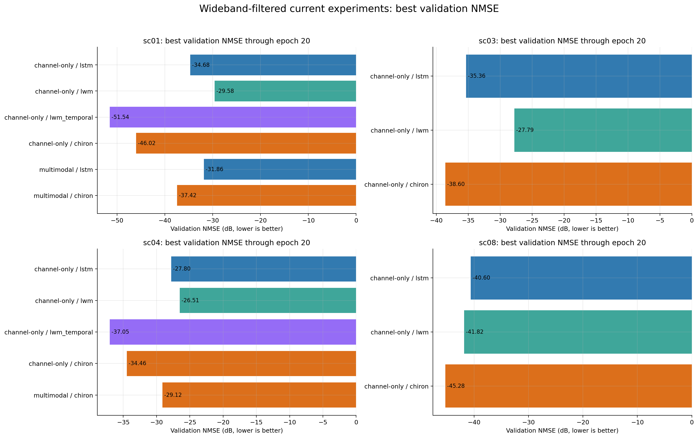
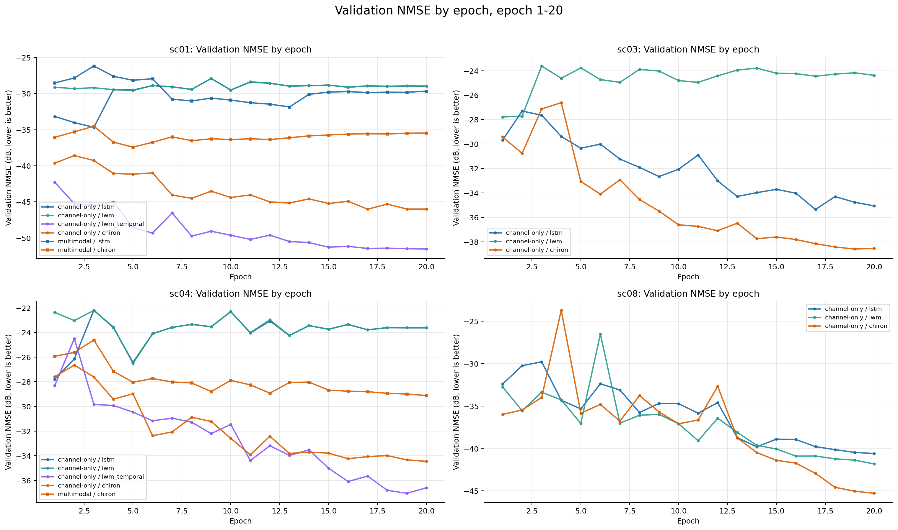
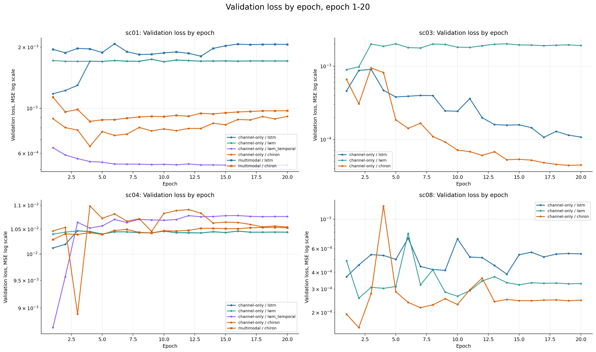
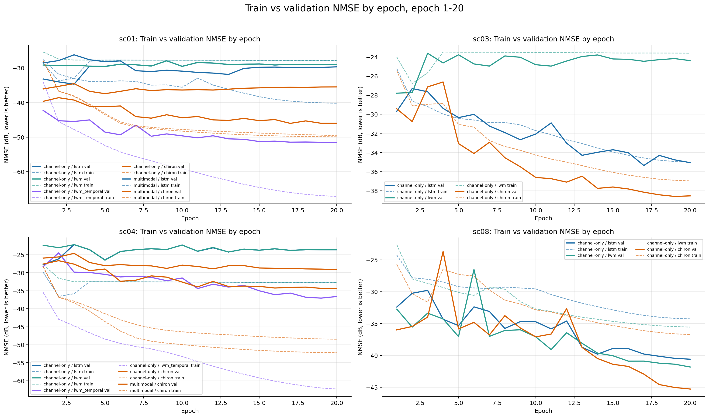
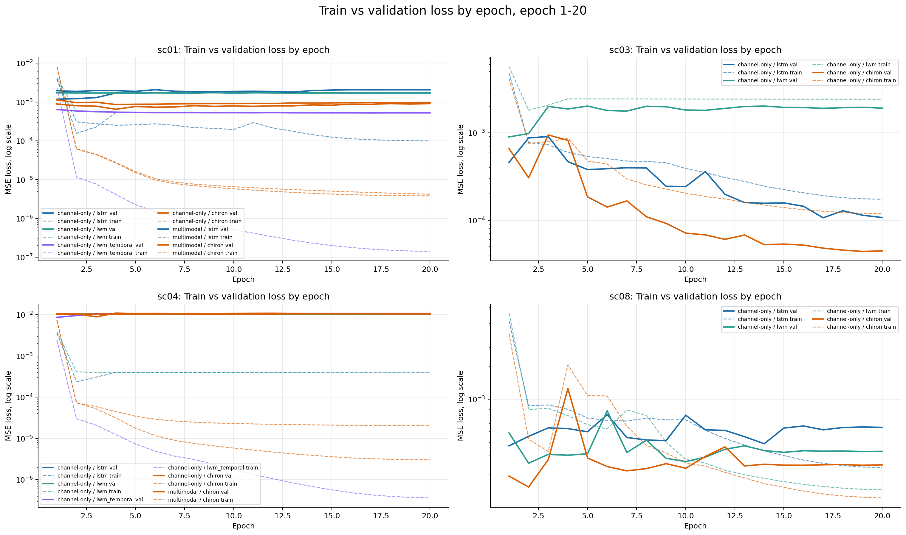
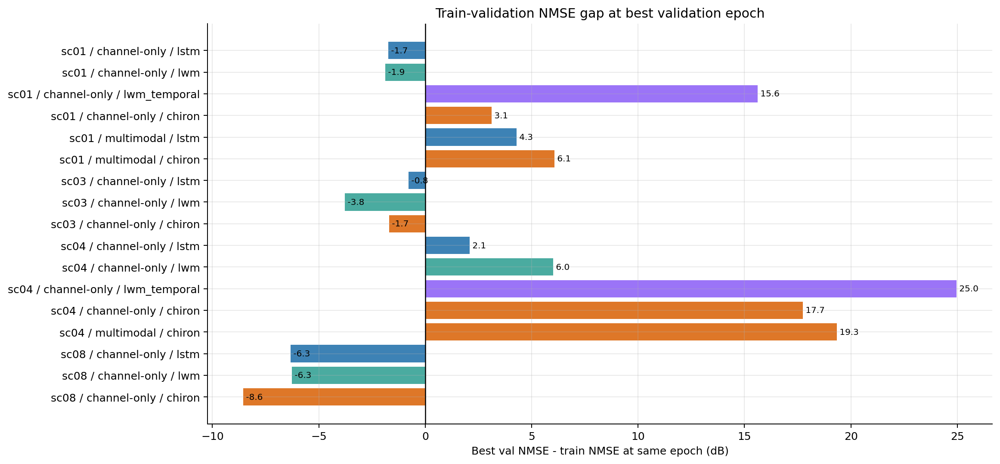

# Experiment Results

This document records the current 16-to-4 channel prediction results for the
`wireless-dataset`.

Updated: 2026-06-23 KST

## Result Scope

The results below combine two sources:

- Channel-only baselines and exported plots: the consolidated visualization
  pipeline
  `multimodal_code_index/run_multimodal_16to4/outputs/figures/all_experiments_overview/all_experiments_overview.ipynb`
- Multimodal comparison: the uniform multimodal sweep
  `multimodal4_sc01030408_lr1e3_noamp_20260606_124953_*` (2026-06-06), which uses
  one identical configuration (split, seed, batch size, 20 epochs, lr 1e-3, AMP
  off, RGB 8 frames) across every cell.

Source histories:

```text
multimodal_code_index/run_multimodal_16to4/outputs/checkpoints/*_history.json
multimodal_code_index/run_multimodal_16to4/outputs/checkpoints/*_summary.json
```

Exported GitHub figures and compact summary (channel-only snapshot, prior to the
2026-06-06 multimodal sweep):

```text
docs/images/results/wideband_all_*.png
docs/images/results/wideband_all_summary_epoch20.csv
```

## Wideband Filter

The LSTM/LWM rows in this page use only the current wideband-time embedding.
The filter is checked from checkpoint weight shape:

```text
current LSTM/LWM wideband input: Na * Nsc * 2 = 16 * 64 * 2 = 2048
legacy per-subcarrier input:    Na * 2       = 16 * 2      = 32
```

Included runs:

- `lstm` and `lwm`: only checkpoints with input dimension `2048`
- `lwm_temporal` and `chiron`: patch-time models, included normally

Excluded runs:

- `8` legacy LSTM/LWM histories with input dimension `32`

All plots and tables below use this filtered run set with a common
`epoch <= 20` comparison window.

## Metric Notes

Lower NMSE is better. Because NMSE is reported in dB, more negative values are
better.

`train_loss` and `val_loss` are plain MSE values on normalized real/imag channel
tensors:

```text
MSE = mean((pred - target)^2)
```

The logged NMSE is target-power-normalized and then converted to dB:

```text
NMSE(dB) = 10 * log10(mean_b(||pred_b - target_b||^2 / (||target_b||^2 + eps)) + eps)
```

For final model comparison, use validation NMSE as the primary metric.

## Visual Results

Note: the exported PNG figures below were generated from the prior wideband
snapshot. They do not yet include the 2026-06-06 uniform multimodal sweep or the
`sc08` `lwm_temporal` channel-only run. The tables in this document are the
current source of truth.

### Best Validation NMSE



### Validation NMSE by Epoch



### Validation Loss by Epoch



### Train and Validation NMSE by Epoch



### Train and Validation Loss by Epoch



### Train-Validation Gap



## Best Result by Scenario

| Scenario | Best mode | Best model | Best epoch | Best validation NMSE |
|---|---|---|---:|---:|
| `sc01` | `channel_only` | `lwm_temporal` | 20 | `-51.540 dB` |
| `sc03` | `channel_only` | `chiron` | 19 | `-38.598 dB` |
| `sc04` | `channel_only` | `lwm_temporal` | 19 | `-37.048 dB` |
| `sc08` | `channel_only` | `lwm_temporal` | 9 | `-49.435 dB` |

In every scenario the best result is `channel_only`. No multimodal cell beats the
best channel-only cell in the same scenario.

## Channel-Only Compact Table

Best validation NMSE per model, computed through epoch 20 (`sc08` `lwm_temporal`
best at epoch 9). `wideband_time` means the LSTM/LWM checkpoint input dimension
is `2048`.

| Scenario | Model | Embedding | Best epoch | Best val NMSE |
|---|---|---|---:|---:|
| `sc01` | `lstm` | `wideband_time` | 3 | `-34.676 dB` |
| `sc01` | `lwm` | `wideband_time` | 5 | `-29.577 dB` |
| `sc01` | `chiron` | `patch_time` | 17 | `-46.018 dB` |
| `sc01` | `lwm_temporal` | `patch_time` | 20 | `-51.540 dB` |
| `sc03` | `lstm` | `wideband_time` | 17 | `-35.359 dB` |
| `sc03` | `lwm` | `wideband_time` | 1 | `-27.792 dB` |
| `sc03` | `chiron` | `patch_time` | 19 | `-38.598 dB` |
| `sc04` | `lstm` | `wideband_time` | 1 | `-27.798 dB` |
| `sc04` | `lwm` | `wideband_time` | 5 | `-26.509 dB` |
| `sc04` | `chiron` | `patch_time` | 20 | `-34.458 dB` |
| `sc04` | `lwm_temporal` | `patch_time` | 19 | `-37.048 dB` |
| `sc08` | `lstm` | `wideband_time` | 20 | `-40.600 dB` |
| `sc08` | `lwm` | `wideband_time` | 20 | `-41.823 dB` |
| `sc08` | `chiron` | `patch_time` | 20 | `-45.283 dB` |
| `sc08` | `lwm_temporal` | `patch_time` | 9 | `-49.435 dB` |

Note: `sc08` `lwm_temporal` exists as a `best.pt` checkpoint only (no history
JSON), from run `channel_only_temporal_chiron_noamp_20260603_162358`. It is not
in the exported figures, so the prior best-by-scenario row for `sc08` (chiron,
`-45.283 dB`) is now superseded.

## Multimodal Results (Uniform Sweep, 2026-06-06)

Run prefix: `multimodal4_sc01030408_lr1e3_noamp_20260606_124953`. All cells share
the same split, seed, batch size, 20 epochs, lr 1e-3, AMP off, RGB 8 frames.
`lwm_temporal` was not included in this sweep.

| Scenario | Model | Best epoch | Best val NMSE |
|---|---|---:|---:|
| `sc01` | `lstm` | 11 | `-30.128 dB` |
| `sc01` | `lwm` | 20 | `-35.230 dB` |
| `sc01` | `chiron` | 1 | `-33.004 dB` |
| `sc03` | `lstm` | 1 | `-27.824 dB` |
| `sc03` | `lwm` | 11 | `-25.038 dB` |
| `sc03` | `chiron` | 19 | `-37.308 dB` |
| `sc04` | `lstm` | 3 | `-24.761 dB` |
| `sc04` | `lwm` | 5 | `-26.551 dB` |
| `sc04` | `chiron` | 4 | `-24.331 dB` |
| `sc08` | `lstm` | 20 | `-46.235 dB` |
| `sc08` | `lwm` | 2 | `-32.132 dB` |
| `sc08` | `chiron` | 1 | `-34.673 dB` |

Several cells peak at epoch 1-2 and then degrade (`sc01`/`sc08` chiron, `sc03`
lstm, `sc08` lwm), which points to optimization instability rather than useful
early convergence.

## Channel-Only vs Multimodal

Same-model comparison for `lstm`, `lwm`, `chiron`. `delta` = multimodal NMSE
minus channel-only NMSE. Because NMSE is negative-better, `delta < 0` means
multimodal is better, `delta > 0` means multimodal is worse.

| Scenario | Model | Channel-only | Multimodal | Delta |
|---|---|---:|---:|---:|
| `sc01` | `lstm` | `-34.676` | `-30.128` | `+4.55` |
| `sc01` | `lwm` | `-29.577` | `-35.230` | `-5.65` |
| `sc01` | `chiron` | `-46.018` | `-33.004` | `+13.01` |
| `sc03` | `lstm` | `-35.359` | `-27.824` | `+7.54` |
| `sc03` | `lwm` | `-27.792` | `-25.038` | `+2.75` |
| `sc03` | `chiron` | `-38.598` | `-37.308` | `+1.29` |
| `sc04` | `lstm` | `-27.798` | `-24.761` | `+3.04` |
| `sc04` | `lwm` | `-26.509` | `-26.551` | `-0.04` |
| `sc04` | `chiron` | `-34.458` | `-24.331` | `+10.13` |
| `sc08` | `lstm` | `-40.600` | `-46.235` | `-5.64` |
| `sc08` | `lwm` | `-41.823` | `-32.132` | `+9.69` |
| `sc08` | `chiron` | `-45.283` | `-34.673` | `+10.61` |

Only two cells improve with multimodal: `sc01` `lwm` (`-5.65 dB`) and `sc08`
`lstm` (`-5.64 dB`). `chiron` degrades by 10 dB or more in every scenario. The
image dependency of the `sc08` `lstm` gain is examined below.

## Image-Dependency Diagnosis (2026-06-10)

Script: `multimodal_code_index/run_multimodal_16to4/diagnose_image_dependency.py`
(CPU eval). The only clear multimodal gain (`sc08` `lstm`) was tested against
modified image inputs:

- real image, all-zero (black) image, and pixel-shuffled image all give the same
  NMSE (`-45.63 dB`).
- removing the image token (`no_image_token` / blank) degrades it to `-41.66 dB`.

So the gain is not vision-aided. It comes from a regularization/structure effect
of the image branch, not from image content. Contributing factors:

- image information is near zero: mean pixel difference across the 8-frame window
  is `0.2-0.3 / 255`, and the UE spans under one pixel at typical range.
- prediction horizon is `P = 4 x 0.5 ms = 2 ms`, too short for vision to help.
- the LSTM/LWM `PerTimeModalityFusion` (`models/fusion_blocks.py`) has no channel
  residual, so channel information passes through an attention bottleneck;
  chiron's cross-modal gate closes and the model effectively ignores the image.

## Coverage and Missing Runs

| Scenario | Mode | Available models |
|---|---|---|
| `sc01` | `channel_only` | `lstm`, `lwm`, `chiron`, `lwm_temporal` |
| `sc01` | `multimodal` | `lstm`, `lwm`, `chiron` |
| `sc03` | `channel_only` | `lstm`, `lwm`, `chiron` |
| `sc03` | `multimodal` | `lstm`, `lwm`, `chiron` |
| `sc04` | `channel_only` | `lstm`, `lwm`, `chiron`, `lwm_temporal` |
| `sc04` | `multimodal` | `lstm`, `lwm`, `chiron` |
| `sc08` | `channel_only` | `lstm`, `lwm`, `chiron`, `lwm_temporal` |
| `sc08` | `multimodal` | `lstm`, `lwm`, `chiron` |

The `lstm`, `lwm`, and `chiron` models are complete for both modes across all
four scenarios (24 runs). Not yet present:

- `sc03` channel-only `lwm_temporal`
- `sc01` / `sc03` / `sc04` / `sc08` multimodal `lwm_temporal`

`lwm_temporal` is deprioritized because it trains about 6x slower than chiron
(2026-06-05 decision).

Caveat: the multimodal cells share one uniform 2026-06-06 configuration, but the
channel-only cells come from several earlier runs with mixed settings (amp/noamp,
different dates). For a strict paper-grade comparison, rerun the channel-only
cells under the same uniform configuration.

## Interpretation

- The old per-subcarrier LSTM/LWM results are intentionally excluded here.
- Channel-only prediction is strong: `lwm_temporal` wins `sc01`/`sc04`/`sc08`,
  `chiron` wins `sc03`, with best NMSE in the `-38` to `-51 dB` range.
- The current multimodal design does not beat the best channel-only result in any
  scenario. Only two same-model cells improve, and the 2026-06-10 diagnosis shows
  even those gains are independent of image content.
- To make multimodal useful, add a channel residual to fusion, use a pretrained
  image encoder, extend the prediction horizon (`P >> 4`), or widen the image
  stride.
