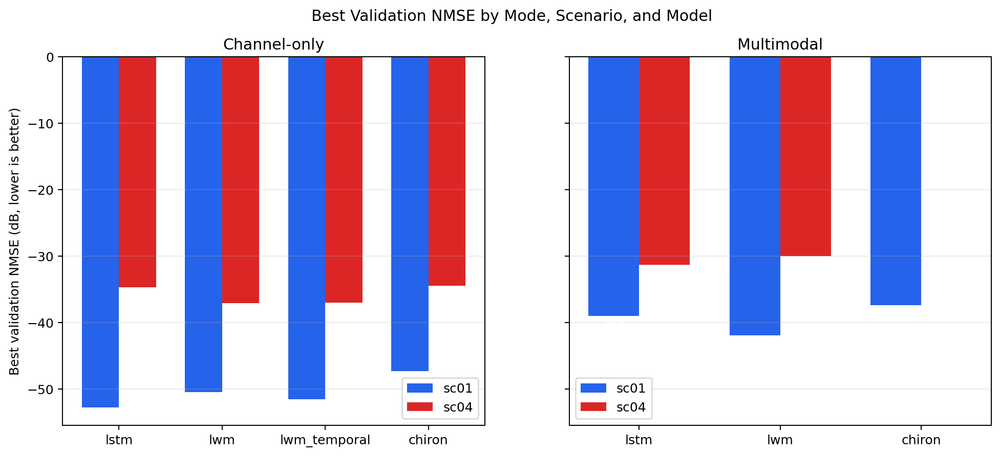
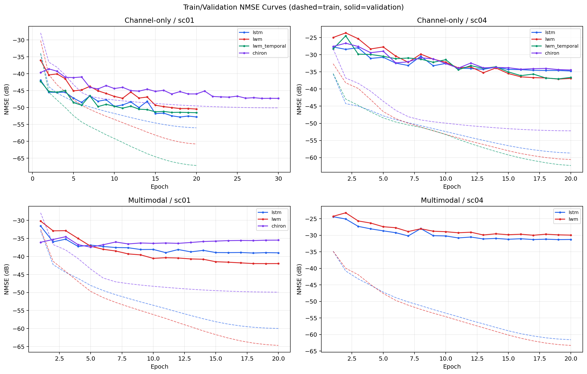
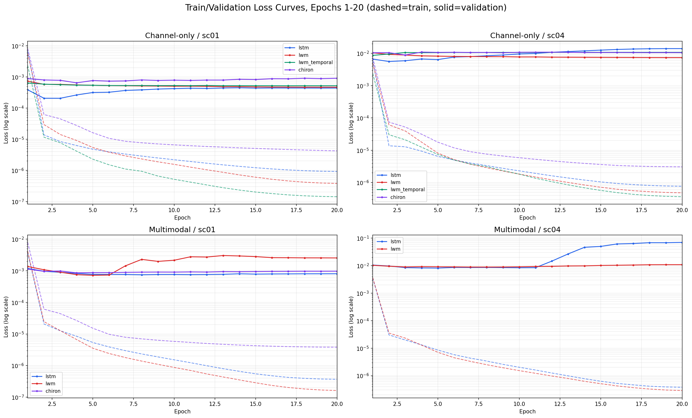
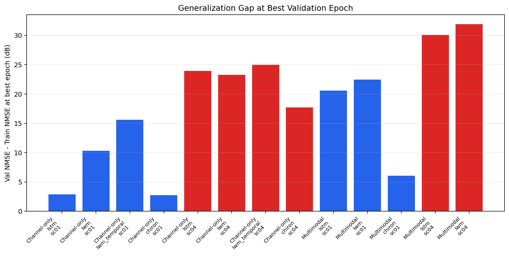
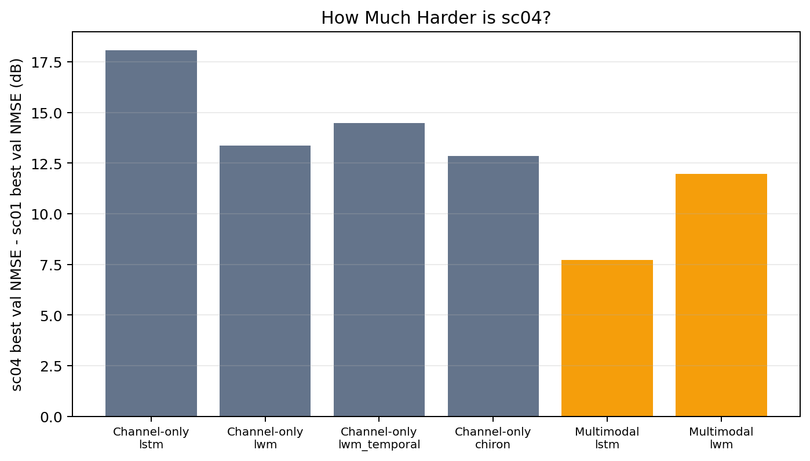

# Experiment Results

This document records the current 16-to-4 channel prediction results for
`wireless-dataset` scenarios `sc01` and `sc04`.

Source histories:

```text
multimodal_code_index/run_multimodal_16to4/outputs/checkpoints/*_history.json
```

Visualization notebook:

```text
multimodal_code_index/run_multimodal_16to4/outputs/figures/sc01_sc04_results_overview/sc01_sc04_channel_multimodal_results_overview.ipynb
```

Exported figures used below:

```text
docs/images/results/
```

## Metric Notes

Lower NMSE is better. Because NMSE is reported in dB, more negative values are
better.

`train_loss` and `val_loss` are plain MSE values on normalized real/imag channel
tensors:

```text
MSE = mean((pred - target)^2)
```

The logged NMSE is target-power-normalized and then converted to dB:

```text
NMSE(dB) = 10 * log10(mean_b(||pred_b - target_b||^2 / (||target_b||^2 + eps)) + eps)
```

Therefore MSE-loss curves and NMSE(dB) curves are not expected to have identical
shapes. MSE measures absolute error, while NMSE(dB) measures relative channel
prediction error. For final model comparison, use validation NMSE as the primary
metric.

## Visual Results

### Best Validation NMSE



### Train and Validation NMSE Curves



### Train and Validation Loss Curves (Epochs 1-20)



### Train-Validation Generalization Gap



### Scenario Difficulty



## Best Validation Results

| Scenario | Best channel-only | Best multimodal | Difference |
|---|---:|---:|---:|
| `sc01` | `-52.821 dB` (`lstm`) | `-41.988 dB` (`lwm`) | channel-only better by `10.833 dB` |
| `sc04` | `-37.110 dB` (`lwm`) | `-31.324 dB` (`lstm`) | channel-only better by `5.786 dB` |

## Full Run Table

Values are taken at the epoch with the best validation NMSE for each run.

| Scenario | Mode | Model | Epochs | Best epoch | Train loss @ best | Val loss @ best | Train NMSE @ best | Val NMSE @ best | Gap |
|---|---|---|---:|---:|---:|---:|---:|---:|---:|
| `sc01` | `channel_only` | `chiron` | 30 | 28 | 3.67046e-06 | 0.000957829 | -50.073 dB | -47.319 dB | 2.754 dB |
| `sc01` | `channel_only` | `lstm` | 20 | 18 | 9.75685e-07 | 0.000441021 | -55.690 dB | -52.821 dB | 2.869 dB |
| `sc01` | `channel_only` | `lwm` | 20 | 20 | 3.79937e-07 | 0.000469986 | -60.804 dB | -50.464 dB | 10.340 dB |
| `sc01` | `channel_only` | `lwm_temporal` | 20 | 20 | 1.41988e-07 | 0.000525138 | -67.161 dB | -51.540 dB | 15.621 dB |
| `sc01` | `multimodal` | `chiron` | 20 | 5 | 1.52184e-05 | 0.000877269 | -43.501 dB | -37.423 dB | 6.078 dB |
| `sc01` | `multimodal` | `lstm` | 20 | 18 | 3.93204e-07 | 0.000804471 | -59.643 dB | -39.053 dB | 20.590 dB |
| `sc01` | `multimodal` | `lwm` | 20 | 19 | 1.68498e-07 | 0.00256661 | -64.450 dB | -41.988 dB | 22.462 dB |
| `sc04` | `channel_only` | `chiron` | 20 | 20 | 3.04858e-06 | 0.0105413 | -52.190 dB | -34.458 dB | 17.733 dB |
| `sc04` | `channel_only` | `lstm` | 20 | 20 | 7.62995e-07 | 0.0140695 | -58.671 dB | -34.743 dB | 23.928 dB |
| `sc04` | `channel_only` | `lwm` | 20 | 19 | 4.9169e-07 | 0.00741553 | -60.359 dB | -37.110 dB | 23.248 dB |
| `sc04` | `channel_only` | `lwm_temporal` | 20 | 19 | 3.73105e-07 | 0.0107607 | -62.019 dB | -37.048 dB | 24.971 dB |
| `sc04` | `multimodal` | `lstm` | 20 | 19 | 3.89892e-07 | 0.0680276 | -61.386 dB | -31.324 dB | 30.061 dB |
| `sc04` | `multimodal` | `lwm` | 20 | 17 | 3.6688e-07 | 0.0105112 | -61.946 dB | -30.006 dB | 31.940 dB |

## Train vs Validation Interpretation

The current histories show that multimodal models often fit the training set
better than their channel-only counterparts, but validate worse.

Representative examples:

| Scenario | Model | Channel-only best train NMSE | Multimodal best train NMSE | Channel-only best val NMSE | Multimodal best val NMSE |
|---|---|---:|---:|---:|---:|
| `sc01` | `lstm` | `-56.018 dB` | `-59.984 dB` | `-52.821 dB` | `-39.053 dB` |
| `sc01` | `lwm` | `-60.804 dB` | `-64.683 dB` | `-50.464 dB` | `-41.988 dB` |
| `sc04` | `lstm` | `-58.671 dB` | `-61.589 dB` | `-34.743 dB` | `-31.324 dB` |
| `sc04` | `lwm` | `-60.563 dB` | `-63.314 dB` | `-37.110 dB` | `-30.006 dB` |

Interpretation:

- The multimodal branch increases fitting capacity, so training NMSE can improve.
- Validation NMSE gets worse, so the RGB branch does not currently improve
  generalization.
- The current result should be reported as overfitting or negative transfer from
  the visual branch, not as a successful multimodal gain.

## Missing Runs

The current result set does not include these completed history files:

- `sc04` multimodal `chiron`
- `sc04` multimodal `lwm_temporal`
- `sc01` multimodal `lwm_temporal`
