# Simulation Settings

This document describes how the synthetic wireless dataset is generated. The
current source of truth is `collect_final.py`; older dataset roots remain in the
repository for comparison, but the default runtime profile is now
`fr1_3p5ghz`.

## Source Files

| File | Role |
|---|---|
| `collect_final.py` | Full CARLA -> Blender -> Sionna pipeline |
| `run_collect_final.sh` | Launch helper for full collection |
| `collect_1ms.py` | 1 ms sensor re-render helper |
| `export_carla_geometry.py` | Static CARLA geometry export |
| `blender_to_sionna.py` | Blender material conversion and Sionna scene export |
| `channel_sim.py`, `channel_sim_sionna.py` | Channel generation utilities |

## Pipeline

```text
Phase 1: CARLA
  - Start one CARLA worker per configured GPU/port.
  - Load Town10HD_Opt.
  - Spawn traffic and select a UE vehicle.
  - Save UE state, all-vehicle state, RGB, LiDAR, and Radar.
  - Export static scene geometry.

Phase 2: Blender
  - Convert exported geometry.
  - Assign radio-relevant materials.
  - Export a Sionna-compatible scene.

Phase 3: Sionna
  - Load the scene.
  - Add/update dynamic vehicle scatterers.
  - Ray-trace each simulation step.
  - Save CIR, OFDM channel, and angle-delay matrices.
```

## Runtime Defaults

The defaults below are taken from `collect_final.py`.

| Setting | Value |
|---|---|
| Map | `Town10HD_Opt` |
| Scenarios | `sc01` to `sc08` |
| Simulation steps | `400000` per scenario |
| Simulation interval | `0.0005 s` |
| Scenario duration | `200 s` |
| Sensor save interval | every `2` simulation steps = `1 ms` |
| Ray-trace interval | every `1` simulation step = `0.5 ms` |
| Vehicles spawned by current final pipeline | `20` |
| BS antennas | `16` |
| UE antennas | `1` |
| Max ray depth | `5` |
| Max saved paths | top `25` by received power |
| Ray samples per source | `1e6` |
| Scattering coefficient | `0.3` |

`collect_1ms.py` has its own default vehicle count of `40`; do not assume that
helper and `collect_final.py` use the same traffic count.

## Radio Profiles

`collect_final.py` selects the radio profile from `CW_RADIO_PROFILE`. If the
environment variable is not set, it uses `fr1_3p5ghz`.

| Profile | Dataset root | Carrier | Bandwidth | Subcarriers | Notes |
|---|---:|---:|---:|---:|---|
| `fr1_3p5ghz` | `wireless-dataset/` | `3.5 GHz` | `50 MHz` | `512` | Current default |
| `fr2_28ghz` | `dataset_final/` | `28 GHz` | `50 MHz` | `512` | Legacy mmWave reference |
| `lowband_700mhz` | `dataset_lowband_700mhz/` | `700 MHz` | `10 MHz` | `512` | Low-band profile |

The code also writes the legacy-compatible `channels/` alias when
`save_channel_alias` is enabled for the profile.

Example:

```bash
CW_RADIO_PROFILE=fr1_3p5ghz python collect_final.py
CW_RADIO_PROFILE=fr2_28ghz python collect_final.py
```

## Scenario Table

| ID | Description | BS position `(x, y, z)` | Camera pitch/yaw | Seed |
|---|---|---:|---:|---:|
| `sc01` | E-W street, BS on building wall east | `(5, 38, 7)` | `-15 / 180` | `42` |
| `sc02` | E-W street, BS on building wall west | `(-75, 38, 7)` | `-15 / 180` | `101` |
| `sc03` | N-S road, BS on building corner east | `(112, 35, 7)` | `-15 / -90` | `202` |
| `sc04` | SW junction, BS on building facade | `(-50, -30, 7)` | `-18 / 45` | `303` |
| `sc05` | NW coastal, BS on building wall | `(-85, 35, 7)` | `-15 / 135` | `404` |
| `sc06` | Center junction, BS on sidewalk pole | `(-43, 8, 6)` | `-15 / 90` | `505` |
| `sc07` | Southern boulevard, BS on building wall | `(5, -50, 7)` | `-15 / 0` | `606` |
| `sc08` | E-W street, elevated rooftop BS | `(5, 38, 12)` | `-22 / 180` | `707` |

## Full City Structure and Trajectory Overview

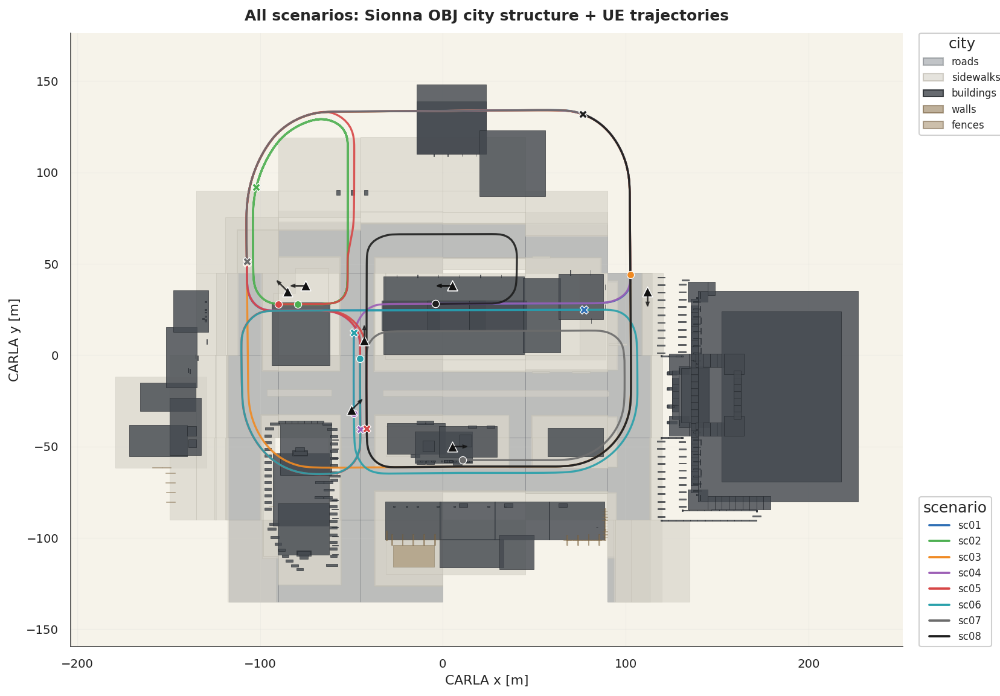


The first figure shows the combined Sionna OBJ city structure and UE trajectories
for `sc01` to `sc08`. The second figure is the scenario-level city-structure
trajectory view for `SC='sc01'`. These figures were generated by
`wireless_dataset_validation/05_environment_trajectory.ipynb`:

```python
import importlib
import analysis_utils as _au

_au = importlib.reload(_au)
SC = globals().get('SC', 'sc01')

show(_au.mpl_all_scenario_city_structure_map(max_points=700))
show(_au.mpl_scenario_city_structure_trajectory(
    SC, max_points=2000, extent_mode='scenario', structure_background='all'
))
```

## Scenario Descriptions

This section summarizes the role of each scenario in the dataset. The scenarios
share the same CARLA map, radio profile, traffic count, and sensor settings, but
change the BS pose, camera view, UE vehicle type, and route seed. The images
below are representative BS-view RGB frames and can be replaced later with
curated figures if needed.

Common environment:

- Map: `Town10HD_Opt`
- Radio profile: `fr1_3p5ghz`, `3.5 GHz`, `50 MHz`, `512` raw subcarriers
- Antennas: `16` BS antennas and `1` UE antenna
- Traffic: `20` spawned vehicles
- Duration: `400000` simulation steps, or `200 s` at `0.5 ms` per step
- Stored modalities: OFDM channel, CIR, angle-delay, RGB, LiDAR, Radar,
  UE position/velocity, and surrounding vehicle states

### Scenario Summary

The scenarios differ mainly in BS placement, camera direction, UE vehicle type,
and route seed. They do not represent different radio bands or different channel
formats.

| Scenario | Main features | Research use |
|---|---|---|
| `sc01` | East-west street with the BS near an eastern building wall | Baseline V2I scenario for observing typical channel variation around the BS |
| `sc02` | East-west street with the BS shifted to the western building side | Similar road family to `sc01`, but with different BS-UE distance and angle conditions |
| `sc03` | North-south road with the BS near an eastern building corner | Larger mobility area and stronger BS-UE distance/viewpoint changes |
| `sc04` | South-west junction with the BS on a building facade | More complex junction setting with rapidly changing LoS/NLoS, reflections, and blockage patterns |
| `sc05` | North-west road segment with a building-wall BS | Additional road region for checking generalization across geometry and BS placement |
| `sc06` | Central junction with a lower sidewalk-pole-style BS | Urban junction viewpoint where nearby traffic and road geometry affect short-horizon prediction |
| `sc07` | Southern boulevard with the BS on a building wall | Wide-area mobility case with larger distance variation, similar in spirit to `sc03` |
| `sc08` | East-west street variant with an elevated `12 m` BS | Height-variation case for comparing against the `sc01` road family |

### `sc01` - East-West Street Baseline

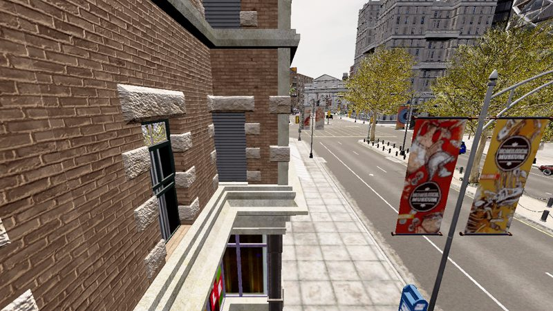

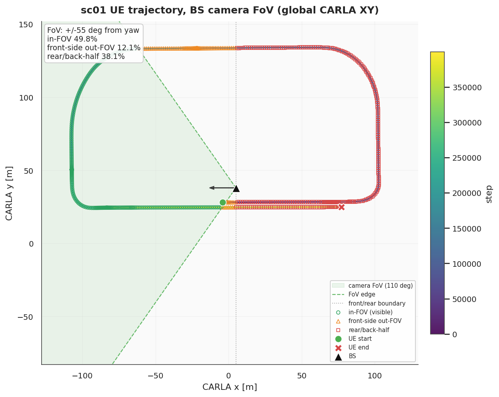

- Main features: east-west street with the BS mounted on an eastern building
  wall.
- Data/environment: BS position `(5, 38, 7)`, camera pitch/yaw `-15 / 180`,
  seed `42`, UE vehicle `vehicle.chevrolet.impala`.
- Usage: baseline scenario for single-scenario channel prediction and
  channel-only versus multimodal comparisons.

### `sc02` - West-Side BS on East-West Street

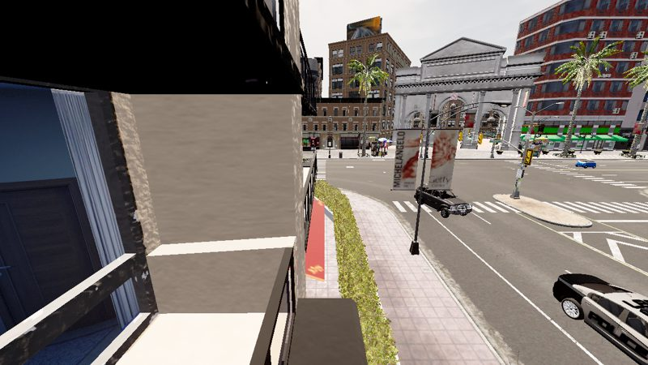

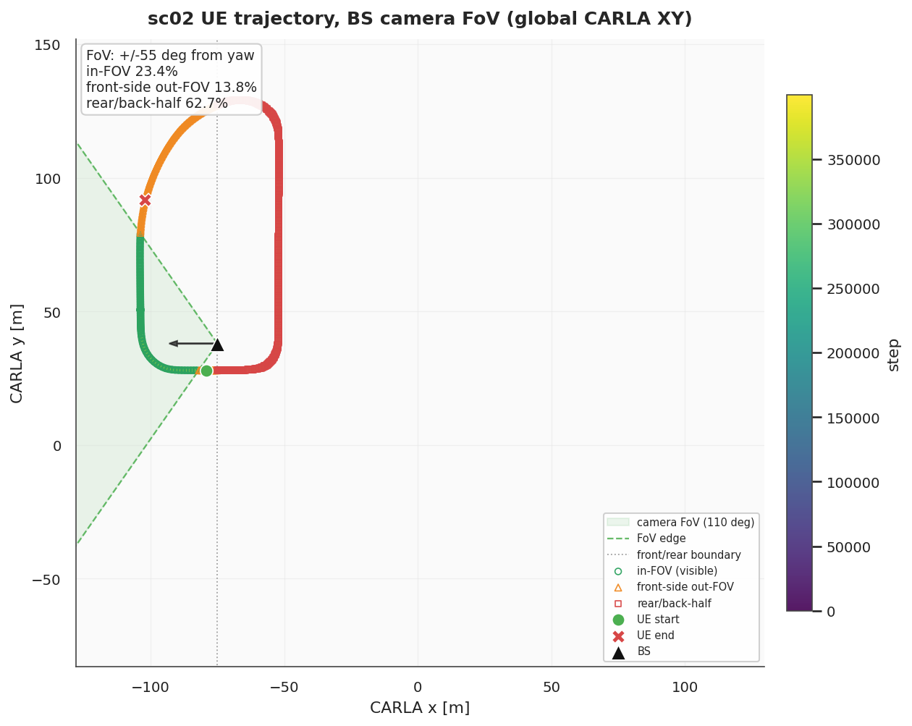

- Main features: east-west street layout with the BS shifted to the western
  side of the map.
- Data/environment: BS position `(-75, 38, 7)`, camera pitch/yaw `-15 / 180`,
  seed `101`, UE vehicle `vehicle.dodge.charger_2020`.
- Usage: tests whether models trained on one BS placement remain effective when
  the same road family is observed from a different BS location.

### `sc03` - North-South Road and Corner BS

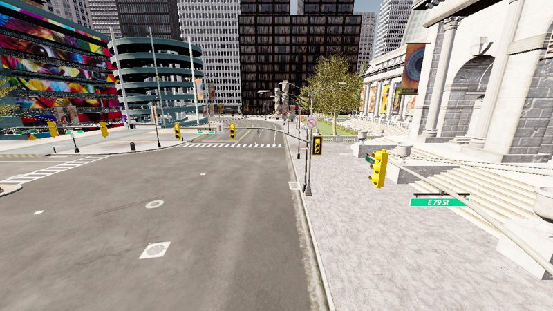

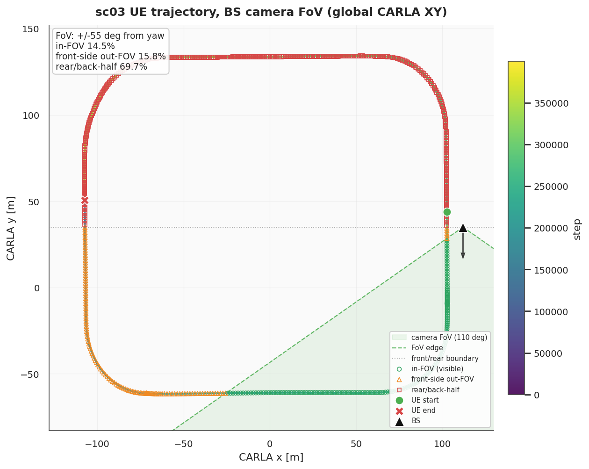

- Main features: north-south road geometry with the BS placed near an eastern
  building corner.
- Data/environment: BS position `(112, 35, 7)`, camera pitch/yaw `-15 / -90`,
  seed `202`, UE vehicle `vehicle.audi.tt`.
- Usage: emphasizes larger BS-UE distance variation and stronger viewpoint
  changes than the east-west baseline.

### `sc04` - South-West Junction

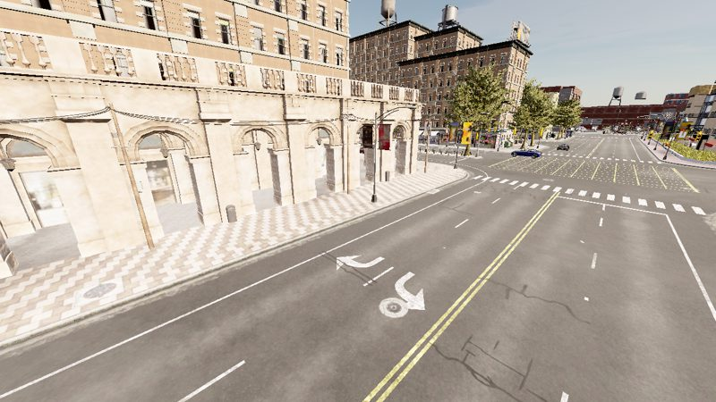

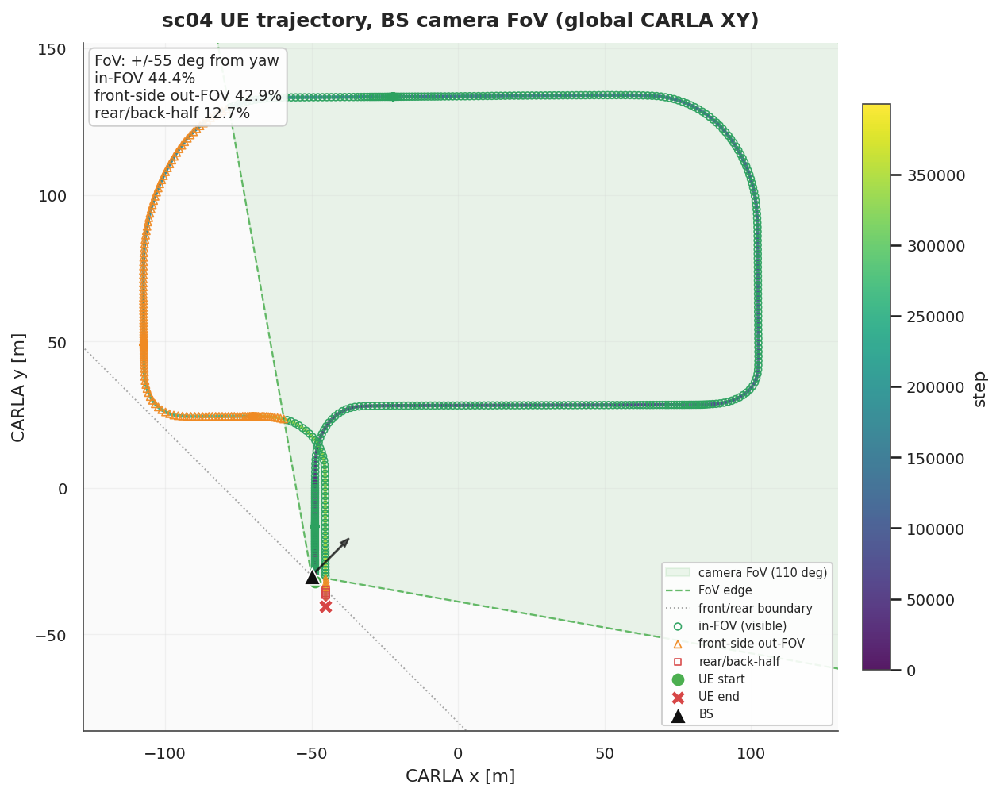

- Main features: junction scene with the BS mounted on a south-west building
  facade.
- Data/environment: BS position `(-50, -30, 7)`, camera pitch/yaw `-18 / 45`,
  seed `303`, UE vehicle `vehicle.mini.cooper_s_2021`.
- Usage: evaluates prediction in a more complex intersection setting where
  geometry, reflections, and potential blockage patterns vary rapidly.

### `sc05` - North-West Road Segment

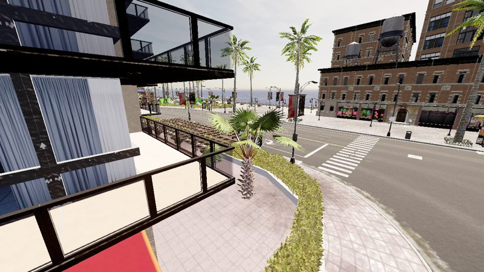

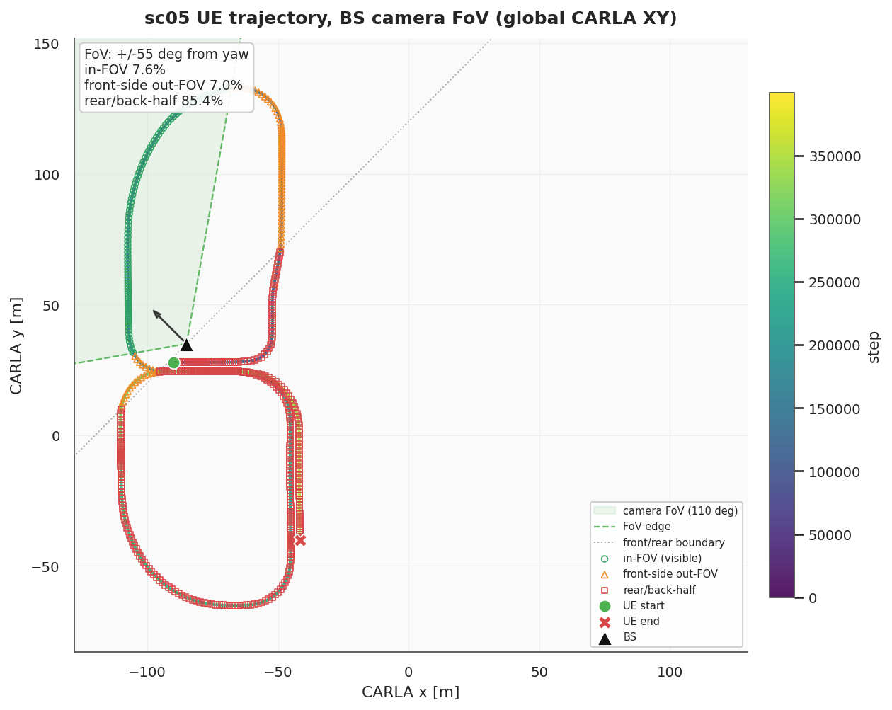

- Main features: north-west road segment with an oblique BS camera view.
- Data/environment: BS position `(-85, 35, 7)`, camera pitch/yaw `-15 / 135`,
  seed `404`, UE vehicle `vehicle.nissan.patrol`.
- Usage: adds a different road region and vehicle trajectory distribution for
  scenario diversity and generalization checks.

### `sc06` - Center Junction and Sidewalk-Pole BS

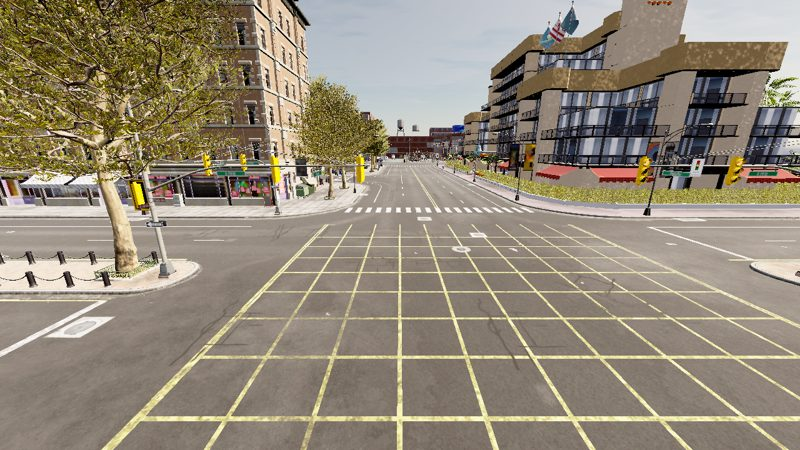

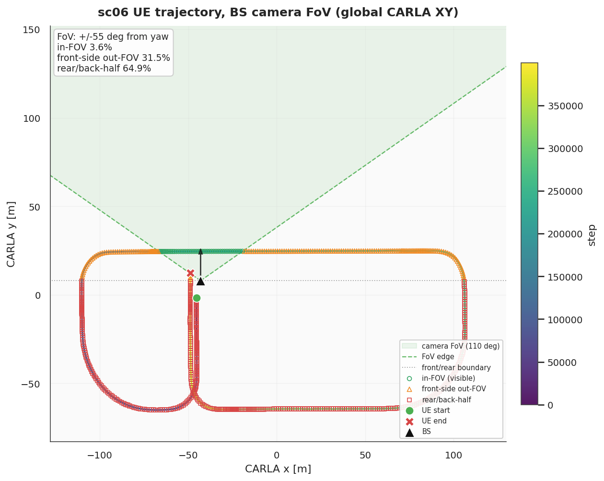

- Main features: central junction with the BS placed lower than most building
  wall deployments.
- Data/environment: BS position `(-43, 8, 6)`, camera pitch/yaw `-15 / 90`,
  seed `505`, UE vehicle `vehicle.volkswagen.t2`.
- Usage: captures a central urban viewpoint where nearby traffic and junction
  geometry can affect short-horizon channel prediction.

### `sc07` - Southern Boulevard

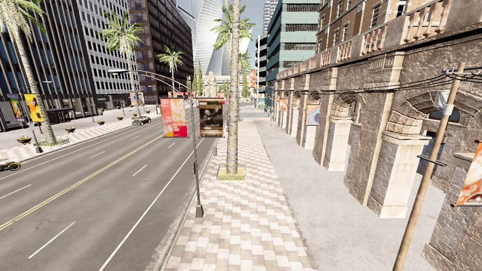

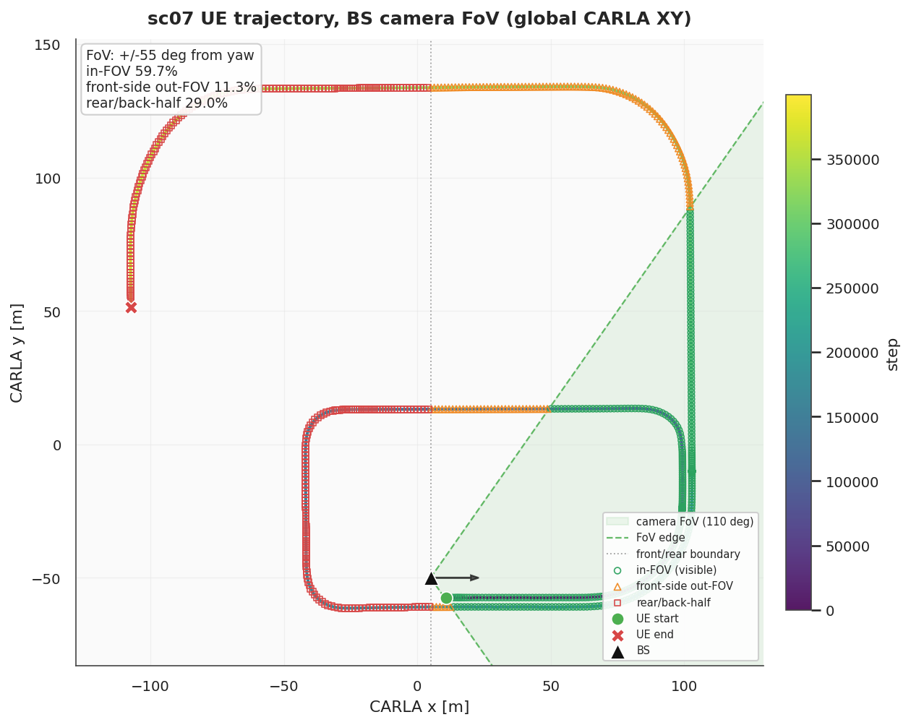

- Main features: southern boulevard environment with the BS viewing toward the
  north.
- Data/environment: BS position `(5, -50, 7)`, camera pitch/yaw `-15 / 0`,
  seed `606`, UE vehicle `vehicle.tesla.cybertruck`.
- Usage: provides another wide-area mobility case for testing robustness across
  route seeds and BS-UE geometry.

### `sc08` - Elevated BS Variant

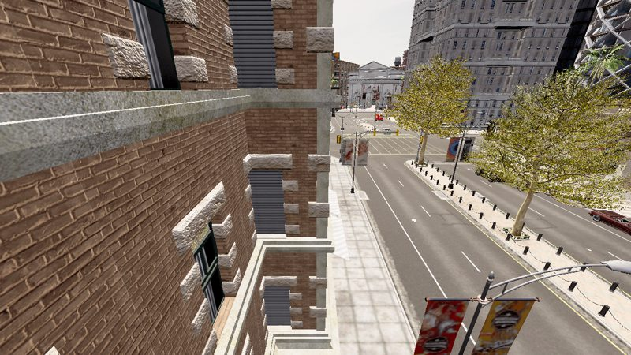

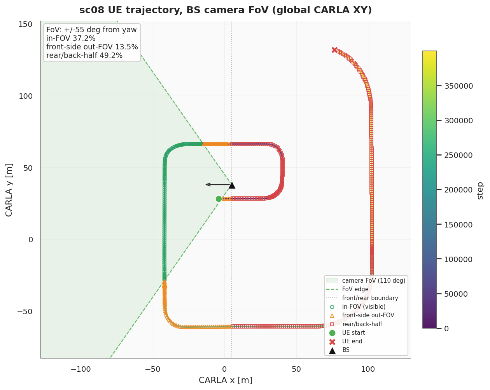

- Main features: east-west street variant using an elevated BS at the same
  horizontal location as `sc01`.
- Data/environment: BS position `(5, 38, 12)`, camera pitch/yaw `-22 / 180`,
  seed `707`, UE vehicle `vehicle.dodge.charger_2020`.
- Usage: isolates the effect of BS height and camera pitch on channel
  prediction while keeping the road family close to the baseline setup.

## Sensors

All active sensors are mounted from the BS viewpoint.

| Sensor | Main settings | Save interval |
|---|---|---|
| RGB camera | `1280 x 720`, FOV `110 deg` | `1 ms` in current final pipeline |
| LiDAR | 32 channels, 100 m range, 100k points/s, 10 Hz rotation | `1 ms` |
| Radar | 60 deg horizontal FOV, 10 deg vertical FOV, 100 m range, 1500 points/s | `1 ms` |

The current 16-to-4 training runner uses channel history and RGB image frames.
LiDAR and Radar are collected but are not passed by the active runner.

## Channel Generation

For each ray-trace frame, Sionna saves:

| Output | Directory | Shape |
|---|---|---|
| CIR path gains/delays | `cir/` | `a: (16, P_path)`, `tau: (P_path,)` |
| OFDM channel | `ofdm/` | `(16, 512)` complex |
| Legacy channel alias | `channels/` | `(16, 512)` complex |
| Angle-delay matrix | `angle_delay/` | `(32, 32)` complex |

`P_path` is capped at `25` after sorting paths by received power.

The OFDM frequency grid is centered around the carrier:

```text
freq[k] = (k - NUM_SC / 2) * (BANDWIDTH / NUM_SC)
```

## Coordinate Convention

CARLA and Sionna use different coordinate conventions. The active conversion in
`collect_final.py` maps CARLA `(x, y, z)` to Sionna `(x, -y, z)`. The UE height
is fixed to `1.5 m` for Sionna receiver placement.

## Known Limitations

- Vehicle scatterers are simplified mesh boxes, not detailed car geometry.
- The active 16-to-4 runner does not consume LiDAR or Radar even though the
  dataset includes them.
- Results from `wireless-dataset/` and `dataset_final/` should be reported as
  separate dataset/profile settings.
