# multimodal_v1_mm_chiron — 멀티모달 채널 예측 v1 (`mm:chiron`) 스냅샷

**목적**: 융합 구조를 새로 설계하기 전에, 2026-09-07 ~ 09-17 에 실험한 멀티모달 채널 예측 모델 `mm:chiron` 의 코드·문서·프로브를 **그대로 보존**한다.
이 폴더의 파일은 수정하지 않는다. 새 설계는 별도 폴더(예: `multimodal_v2_*`)에 만든다.

- 스냅샷 일자: 2026-09-18 (코드 최종 수정 9/7 19:56 이후 무수정 → 아래 run 전부가 이 코드로 학습됨)
- 원본 위치: `/mnt/ssd_7t_2/carla-wireless-dataset/mmw_reproduction/channel_pred_feasibility/` (cp/, scripts/→probe/, *.md) 및 `mmw_reproduction/` (precompute_*), `multimodal_code_index/models/chiron_channel.py`
- 원본은 git 미추적 상태였으므로 이 스냅샷이 유일한 버전 기록이다.
- 태스크: 채널 예측 K=16 → H=4 (Δt 10 ms), 64 안테나 × 64 부반송파, RX 행 표본, 논문 [B] arXiv:2603.15093 데이터셋(RSU 센서)

## 구조 한 줄 요약

```
X [B,16,64,64,2] → chiron 백본 몸통 (patch 4×32 → ChironBlock ×6 → final_norm) → 채널 토큰 [B,512,256]
                                                                                      ↓ query
센서 (cam/lidar/radar/pos, 프레임별 인코더) → + modal_emb → 프레임 내 cat → + frame_emb → 센서 토큰 [B,16·n_tot,256] → key/value
                                                                                      ↓
                                   GatedXAttnBlock ×3 (x + σ(gate)⊙attn → SwiGLU FFN, gate·out_proj·w3 = 0 초기화 → 초기 항등)
                                                                                      ↓
                                   ChannelPredictionHead (학습 질의 4 → 512 토큰 cross-attn → MLP 256→1024→1024→8192) → Ŷ [B,4,64,64,2]
```

## 구조 도식 (코드 기준 · 실측 shape · B = 배치)

분해 순서는 2026-09-18 미팅 자료(`9월 18일 미팅_v2.pptx` 2~10장)와 같다. 모든 shape·파라미터 수는 `probe/13_probe_multimodal_cp.json` 과 CPU 프로브로 확인한 값이다.
실선 박스 = 학습 파라미터 있음, 점선 박스 = 동결 사전학습 또는 파라미터 없는 전처리.

### 0. 전체 흐름

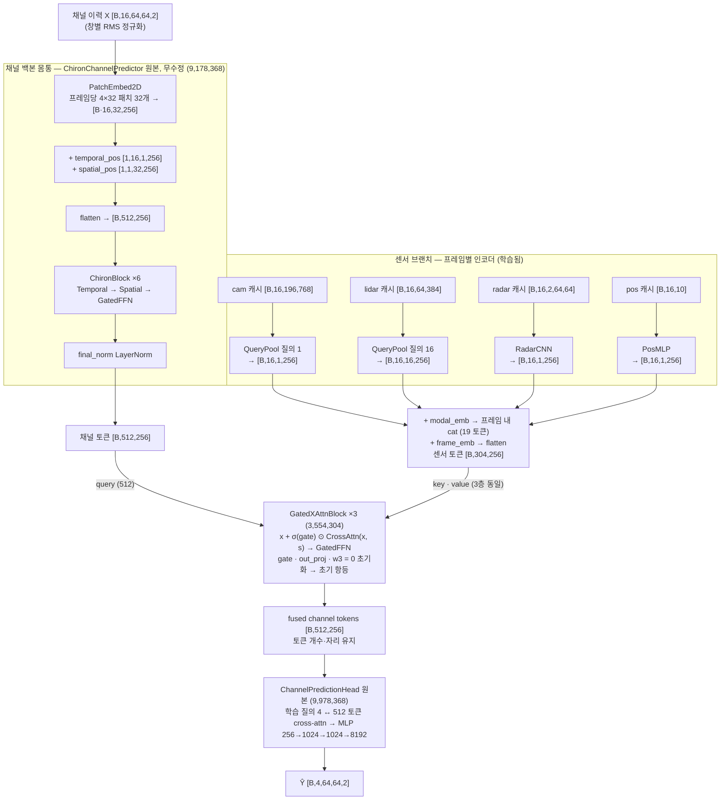

### 1. 채널 백본 (`backbone/chiron_channel.py`)

#### 1.1 PatchEmbed2D — 프레임 1개 → 패치 토큰 32개

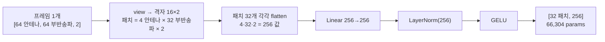

16 프레임을 배치로 붙여 `[B·16,64,64,2] → [B·16,32,256]` 으로 한 번에 처리한다.

#### 1.2 위치 임베딩 → 512 토큰 시퀀스

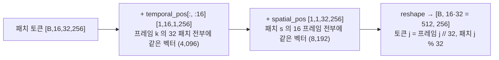

#### 1.3 ChironBlock ×6 — 블록 하나의 순서

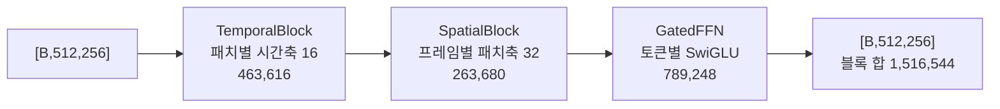

6층 합 9,099,264 + PatchEmbed 66,304 + 위치 12,288 + final_norm 512 = 백본 몸통 9,178,368.

#### 1.4 TemporalBlock — 게이트 conv(국소) + self-attention(전역), 잔차 2회

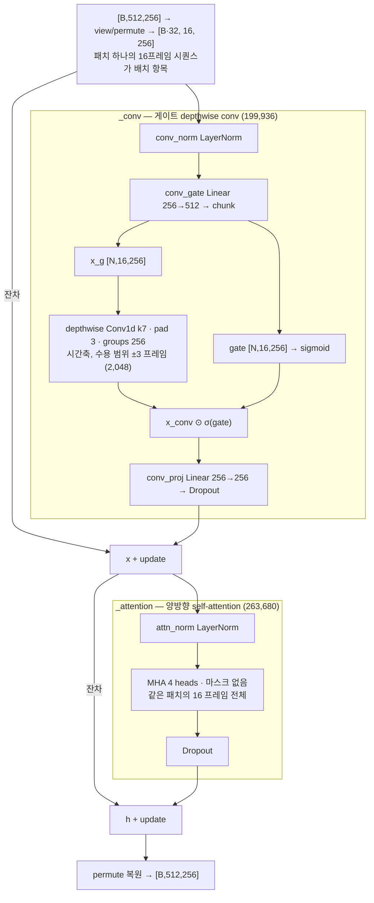

프레임 5 하나만 교란했을 때 영향 범위(eval 실측): conv = 프레임 2~8, attention = 16 프레임 전부, GatedFFN = 프레임 5 만.

#### 1.5 SpatialBlock — 프레임 안 32 패치 간 self-attention, 잔차 1회

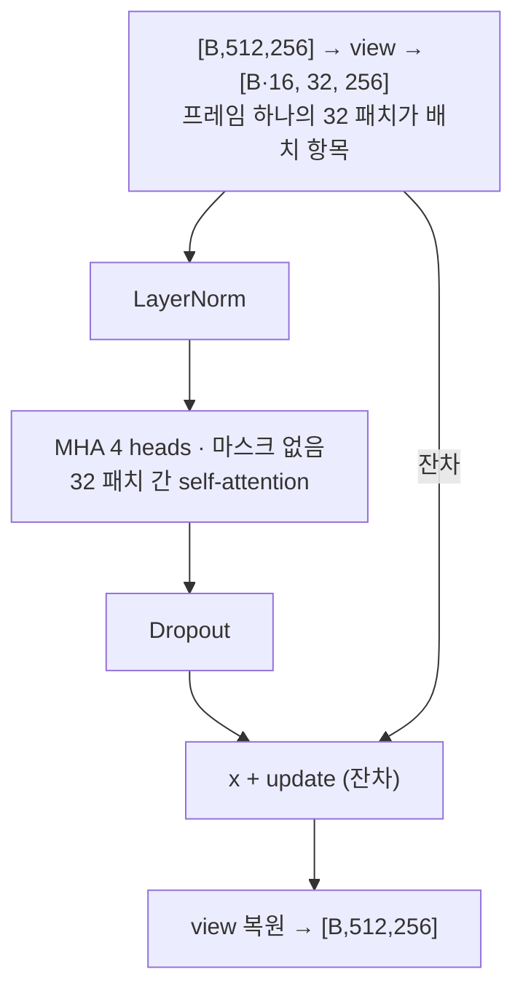

#### 1.6 GatedFFN — SwiGLU, 토큰별, 잔차 1회 (백본 6개 + 융합 블록 3개가 같은 클래스)

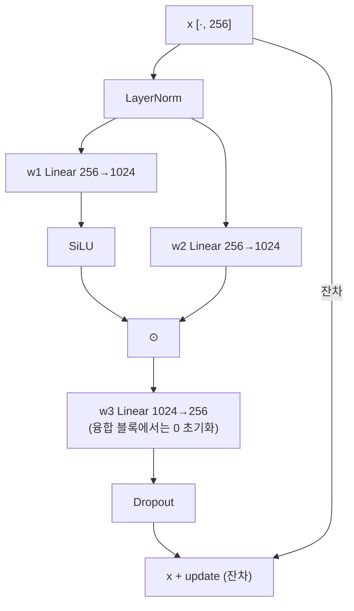

### 2. 센서 브랜치 (`cp/cp_multimodal.py` + `sensor_frontends/` + `cp/cp_sensor_data.py`)

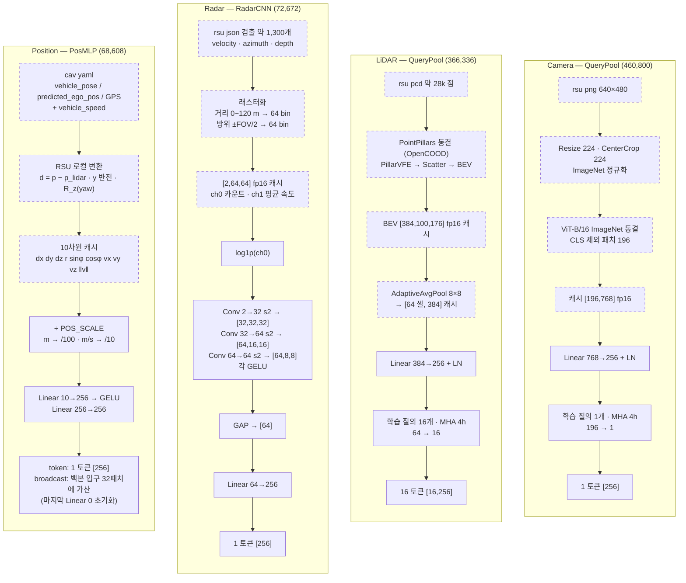

### 3. 센서 토큰 조립 — `encode_sensors`

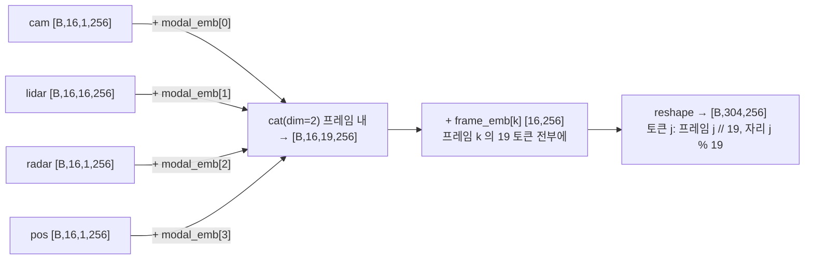

modal_emb [4,256] + frame_emb [16,256] = 5,120. 없는 모달은 cat 에서 빠지므로 n_tot 은 구성마다 1·17·18·19 로 달라지고, 융합 블록은 kv 길이에 무관하므로 그대로 동작한다.

### 4. GatedXAttnBlock — 융합 블록 1개 (1,184,768; ×3)

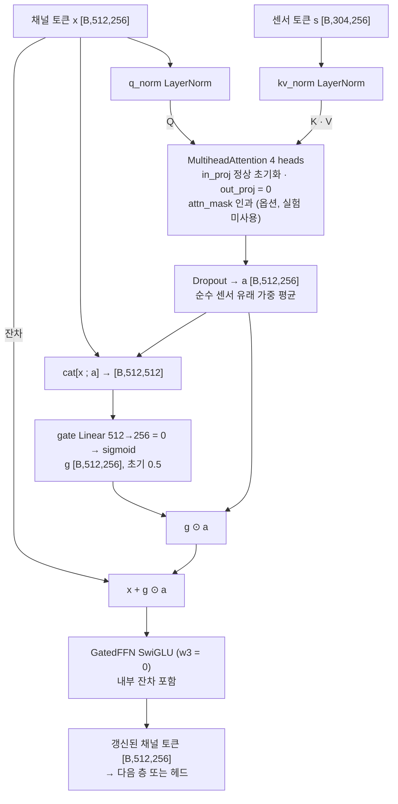

0 초기화 3곳(out_proj → a = 0, gate → g = 0.5, w3 → FFN 증분 0)으로 학습 시작 시 블록 = 항등, 즉 mm:chiron 출력 = 채널 전용 chiron 출력(실측 max|diff| 0). 센서 토큰은 3층 내내 갱신되지 않는다.

### 5. ChannelPredictionHead — 원본 헤드, 지평 4개 동시 출력 (9,978,368)

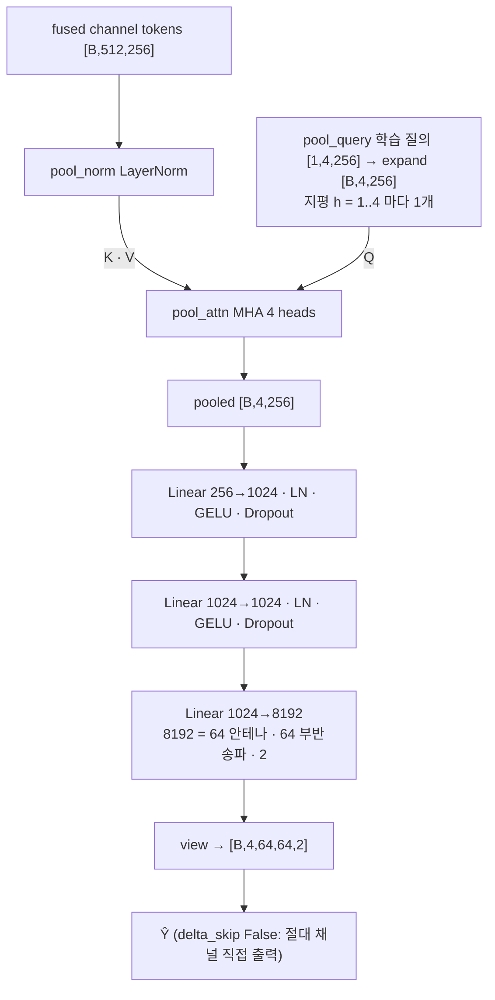

4개 질의가 같은 MLP 를 공유하므로 지평 차이는 질의 벡터에서만 나온다.

### 6. 파라미터 분해 (전체 4모달 구성, 실측)

| 부분 | 파라미터 | 비고 |
|---|---|---|
| 백본 몸통 | 9,178,368 | PatchEmbed 66,304 + 위치 12,288 + ChironBlock 6 × 1,516,544 + final_norm 512 |
| 헤드 | 9,978,368 | 채널 전용 chiron 과 동일 |
| 융합 3층 | 3,554,304 | 층당 attn 263,168 + gate 131,328 + ffn 789,248 + norm 1,024 |
| 센서 인코더 | 968,416 | cam 460,800 + lidar 366,336 + radar 72,672 + pos 68,608 |
| 임베딩 | 5,120 | modal_emb 1,024 + frame_emb 4,096 |
| **합계** | **23,684,576** | 채널 전용 chiron 19,156,736 대비 +4,527,840 (융합이 증분의 78 %) |

### 7. 설계 근거가 문서화되지 않은 항목 (2026-09-18 미팅 지적)

- 패치 4×32 로 자르고 시간을 배치로 붙인 근거, flatten 후 Linear 라 2D 패치의 의미
- TemporalBlock 의 게이트 dw-conv 를 attention 앞에 둔 근거(게이트 제거 절제 없음)
- 헤드 구조(표준 디코더의 masked self-attention · FFN 과의 대조)
- 융합에서 채널 = Q · 센서 = K/V 로 둔 근거, 토큰 축 cat 후 256 차원으로 통일한 의도
- 센서 간 상호작용 없음(센서끼리는 cat 뿐)

이 항목들은 AI 제안 구조이며, v2 설계에서 표준 Transformer 와 대조해 역할·장점을 먼저 정리해야 한다.

## 파일 색인

### 모델 (아키텍처 설명은 이 두 파일이면 충분)

| 파일 | 역할 | 주요 클래스·줄 |
|---|---|---|
| `cp/cp_multimodal.py` | **멀티모달 본체.** 센서 인코더 4종 + 게이트 cross-attention 융합 + 조립 | `QueryPool` 30 (cam 질의 1 / lidar 질의 16), `RadarCNN` 41, `PosMLP` 53, `GatedXAttnBlock` 61, `MMChiron` 77 (`encode_channel` 104, `encode_sensors` 114, `forward` 132), `build_mm_model` 166 |
| `backbone/chiron_channel.py` | **백본 원본(무수정).** `multimodal_code_index/models/chiron_channel.py` 와 동일(md5 `53560a5b…`) | `PatchEmbed2D` 48, `TemporalBlock` 93, `SpatialBlock` 179, `GatedFFN` 221, `ChironBlock` 243, `ChannelPredictionHead` 285, `ChironChannelPredictor` 367 (`encode_tokens` 479) |

### 데이터·학습·평가

| 파일 | 역할 |
|---|---|
| `cp/cp_sensor_data.py` | 센서 캐시 생성(`build_lidar_pool` 126, `radar_raster` 149, `build_pos` 180)과 로더(`RSUSensorStore` 211, `PosStore` 257, `MMWindowSet` 269). 위치 변환 `rsu_local` 56, 10차원 특징 `pos_features` 68 |
| `cp/cp_data.py` | 채널 창 K=16→H=4, RX 행 표본, 창별 RMS 정규화, NMSE(raw·align) 정의. T1(시간 기준) 분할이 9/14 에 추가된 버전. B1·seed 0 run 은 그 전 버전 `cp/cp_data.py.bak_preT1_20260914` 로 학습됨 |
| `cp/cp_models.py` | 모델 레지스트리. `--model mm:chiron` → `build_mm_model` 분기(92~93행) |
| `cp/cp_repo_models.py` | `repo:chiron` 등 저장소 모델 래퍼(`RepoWrap`, `m.` 접두) |
| `cp/train_cp.py` | 학습 진입점. mm 전용 인자 `--sensors --pos_source --pos_mode --fuse_layers --causal_mask --backbone_init` (26~31행). 손실 = 4지평 합산 NMSE(83행) |
| `cp/eval_sensor_ablation_cp.py` | 센서 절제 평가(real / zero / shuffle / foreign / sensor_only / hist_shuffle), 학습 없이 best.pt 재평가 |

### 센서 앞단 (오프라인 전처리, 동결 사전학습 가중치)

| 파일 | 역할 |
|---|---|
| `sensor_frontends/precompute_patch_rsu.py` | RSU png → torchvision ViT-B/16 `IMAGENET1K_V1`(동결) → 패치 토큰 [196,768] 캐시 |
| `sensor_frontends/precompute_pointpillar_rsu.py` | RSU pcd → 동결 PointPillars → BEV [384,100,176] 캐시 |
| `sensor_frontends/pointpillars_opencood.py` | `PointPillarsFrozen` 정의. OpenCOOD 모델 zoo "Naive Late" `net_epoch30.pth` (md5 `eed40b69…`), 검출 헤드 제거 |

radar(래스터화)·pos(좌표 변환)는 사전학습 앞단이 없고 `cp_sensor_data.py` 안의 규칙이 전부다.

### 문서

| 파일 | 내용 |
|---|---|
| `docs/MULTIMODAL_CP_ARCHITECTURE.md` | 구현·실측 문서. §1 텐서 흐름(hook 실측 shape, 층별 파라미터, Mermaid), §2 구성별 비용, §4 미확인·가정 |
| `docs/FORMULAS.md` | 수식 모음. §8 센서 특징, §9 게이트 cross-attention |
| `docs/EXPERIMENT_PLAN_MULTIMODAL_20260907.md` | 실험 계획(절제 프로토콜·판정 규칙) |
| `docs/REPORT_MULTIMODAL_CP_FINAL_20260917.md` | 최종 결과 리포트(B1·seed 0·T1 분할). 본문 중 지도·사진 링크는 원본 저장소 상대 경로라 여기서는 열리지 않음 |

### 실험 기록

| 파일 | 내용 |
|---|---|
| `run_records/` | 최근 run 33개(mm B1 20 · T1 mm 7 · 채널 전용 chiron 기준선 6)의 `config.json`·`result.json`·`metrics.csv`·`sensor_ablation.json`·`train.log`. 결과 요약표는 `run_records/README.md`. 가중치(best.pt)는 제외 |

### 프로브

| 파일 | 내용 |
|---|---|
| `probe/13_probe_multimodal_cp.py` | forward hook 프로브: 구성 8종 shape·파라미터, 초기 항등 검증(max\|diff\| 0), 인과 마스크 검증, 로더·학습 비용 |
| `probe/13_probe_multimodal_cp.json` / `.log` | 위 프로브 실행 결과 |

## 실제 실험에서 쓴 설정 (27 run 공통)

`--model mm:chiron --fuse_layers 3 --lr 3e-4 --batch 64 --K_hist 16 --H_pred 4 --epochs 40 --patience 5`, `--causal_mask` 미사용, `--backbone_init` 없음(백본까지 scratch), pos 실험 중 `*_bc` 만 `--pos_mode broadcast`.
백본 하이퍼파라미터는 코드에서 D 256 · L 6 · heads 4 · patch 4×32 로 고정(트레이너 `--D/--L/--heads` 무시).

파라미터(전체 4모달): 23,684,576 = 백본 9,178,368 + 헤드 9,978,368 + 융합 3×1,184,768 + 인코더(cam 460,800 · lidar 366,336 · radar 72,672 · pos 68,608) + 임베딩 5,120. 채널 전용 chiron 19,156,736.

## 이 프로젝트에서 정한 설계값 (논문 [B]에 없음 — 발표 시 그렇게 표시)

- 융합 방향·방식: 채널 토큰 = query, 센서 토큰 = key/value, 게이트 잔차, 0 초기화, late fusion(백본 몸통 뒤·헤드 앞). 논문 [B]는 early fusion + 학습 질의가 [빔, LiDAR, 카메라] 3벡터를 요약(식 20~21)
- 토큰 수: cam 1 / lidar 16 / radar 1 / pos 1. lidar 16 은 예전 자체수집용 `PointNetEncoder` 기본값을 계승한 것이며 토큰 수 절제는 미실행
- LiDAR 8×8 평균 풀링, radar 64×64 래스터(거리 120 m, FOV 110°)·log1p·Conv 3층, pos 10차원·`POS_SCALE=[100,100,100,100,1,1,10,10,10,10]`, pos broadcast 모드
- 논문 [B]를 따른 것: cam ViT-B/16 패치(III-A3), lidar 동결 PointPillars(III-A2)

## 결과 요지 (자세한 수치는 `docs/REPORT_MULTIMODAL_CP_FINAL_20260917.md`)

- B1 분할 10 run · seed 0 10 run · T1(시간 기준) 분할 7 run 모두 종료.
- 센서 절제(zero / shuffle / foreign) 가 real 과 pooled 0.1 dB 이내 → cam·lidar·radar·pos 내용 의존 0.
- 어텐션 질량은 토큰 수 편향으로 lidar 에 45~71 % 쏠렸으나 예측에 반영되지 않음.

## 포함하지 않은 것

- 캐시(`derived/`, `derived_cp/sensor_cache/`), 체크포인트(`outputs_cp/*/best.pt`, run 당 94.5 MB), 원본 센서 데이터, PointPillars 체크포인트 파일.
- `cp/cp_lwm11.py`, `cp/third_party/` (채널 전용 LWM 모델용, `cp_models.py` 에서 지연 import 라 이 폴더만으로 `mm:chiron` 은 import 가능).

## 이 폴더만으로 모델을 띄우는 법

```python
import sys; sys.path[:0] = ["multimodal_v1_mm_chiron/cp", "multimodal_v1_mm_chiron"]   # backbone/ 를 models/ 로 보이게 하려면 아래 한 줄
import types, importlib; models = types.ModuleType("models"); sys.modules["models"] = models
models.chiron_channel = importlib.import_module("backbone.chiron_channel"); sys.modules["models.chiron_channel"] = models.chiron_channel
from cp_multimodal import MMChiron
m = MMChiron(K=16, H=4, Nt=64, Ksc=64, sensors="cam,lidar,radar,pos")
```
(원본 환경에서는 `CP_REPO` 환경변수가 `multimodal_code_index` 를 가리키므로 위 우회가 필요 없다.)
