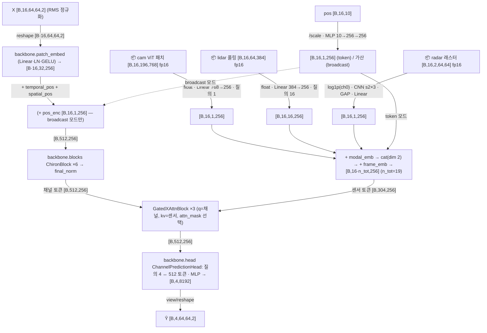
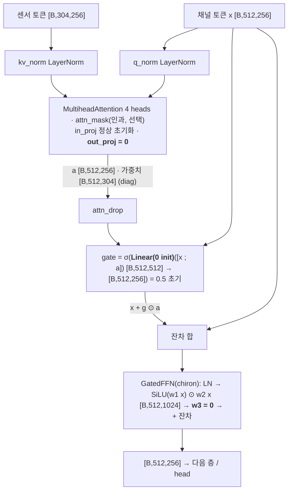

# MULTIMODAL_CP_ARCHITECTURE.md — 채널 예측용 실험 멀티모달 모델 `mm:chiron` (chiron 백본 + RSU 센서 게이트 융합) 구현·실측

- 작성 2026-09-07. 형식은 `MODEL_ARCHITECTURES.md` §2.11 과 동일(요약 9항목 → mermaid → 단계표 → yaml). 설계 근거는 `MULTIMODAL_ARCHITECTURES.md` §5.1 안 (a)(센서 토큰 + 게이트 cross-attention)과 §5.2 안 (b)-(i)(위치 브로드캐스트 가산), 실험 계획은 `EXPERIMENT_PLAN_MULTIMODAL_20260907.md` M0-4·M1·M2. **학습 실험은 launch 하지 않았다**(스모크 1 epoch × 64창 1회만). 태스크 = K=16→H=4, Δ=10 ms, 64×64 채널, RX 행 표본, B1 분할(`cp/cp_data.py`).
- 표기 규칙(문장·항목마다): **[실측 hook]** = `scripts/13_probe_multimodal_cp.py` 가 forward hook·타이머로 기록한 값(`13_probe_multimodal_cp.json` 191 KB / `.log`; 2026-09-07 GPU 0 단독, torch 2.6.0+cu124, 실제 센서 캐시 입력). **[실측]** = 그 외 실제 실행 로그(캐시 생성 로그, 스모크 result.json, 커버리지). **[코드 기반]** = 실행 hook 밖의 reshape·cat·mask 등 코드를 읽어 적은 것. **[가정]** = 근거 없이 정한 설계 상수·해석. **[문서 인용]** = 다른 문서 수치. **확인 불가 – 이유**.
- 기존 파일 수정은 두 곳뿐: `cp/cp_models.py::build_model` 에 `mm:` 분기 3줄, `cp/train_cp.py` 에 mm 전용 인자 7개·`IS_MM` 분기(로더 교체, `get_batch`/`fwd` 헬퍼, kw 전달, param_groups 로그). 기본값에서는 기존 동작과 동일 — 수정 전/후 `--model transformer --max_train_windows 8 --epochs 1 --batch 4` 스모크의 val 지표 10개 키·train_loss(1.3484187256544828)·n_params(39,928,320) 가 **비트 단위 동일** [실측: `outputs_cp_smoke/smoke_tf_before` vs `smoke_tf_after2`]. 유일한 차이는 config/result.json 의 `args` 에 새 인자 7개가 기본값으로 기록되는 것. `multimodal_code_index/`·`mmw_repro/`·`outputs_cp/` 무수정.

---

## 0. 근거·범위

### 0.1 코드 위치

| 역할 | 파일 | 주요 클래스·함수 | 비고 |
|---|---|---|---|
| 모델 | `cp/cp_multimodal.py`(신규) | `MMChiron`, `GatedXAttnBlock`, `QueryPool`(cam·lidar 인코더), `RadarCNN`, `PosMLP`, `build_mm_model` | 백본 = `multimodal_code_index/models/chiron_channel.py::ChironChannelPredictor` 무수정 인스턴스, `GatedFFN` 재사용 |
| 센서 로더·캐시 | `cp/cp_sensor_data.py`(신규) | `MMWindowSet(WindowSet)`, `RSUSensorStore`(프레임 LRU), `PosStore`, `build_lidar_pool`, `build_radar`, `build_pos`, `coverage_report`, `rsu_local`·`pos_features`(위치 변환) | CLI `--build_lidar_pool/--build_radar/--build_pos/--coverage` |
| 레지스트리 | `cp/cp_models.py::build_model` | `name.startswith("mm:")` → `build_mm_model` | 3줄 추가 |
| 트레이너 | `cp/train_cp.py` | 인자 `--sensors --pos_source --pos_mode --fuse_layers --causal_mask --sensor_cache_root --backbone_init`, `IS_MM` 분기 | 배치 5번째 반환값 `sensors` dict, `fwd()` 가 `model(X, sens)` |
| 프로브 | `scripts/13_probe_multimodal_cp.py`(신규) → `.json/.log` | (1) 8구성 hook, (2) 인과 마스크 검증, (3) 로더 실측, (4) B=32 학습 step, (5) 커버리지·위치 점검 | GPU 0, 피크 7,354.6 MB [실측 hook] |
| 캐시 | `derived_cp/sensor_cache/{lidar_pool8,radar_raster64,pos}` + `coverage.json`, `build_*.log`, `coverage.log` | §0.3 | 총 1.06 GiB [실측] |
| 스모크 출력 | `outputs_cp_smoke/smoke_mm_chiron/`(result.json·best.pt·metrics.csv·train.log), `smoke_tf_before/`·`smoke_tf_after/`·`smoke_tf_after2/` | §5 | `outputs_cp/` 무수정 |

### 0.2 프로브 실행 결과 요약(B=2, eval, B1 train 창 0 = Town03_5wayroad/cav_1 start 0, RX 행 0·1, 실제 센서 캐시) [실측 hook]

| 구성(`--sensors`, `--pos_mode`) | 학습 파라미터 | 센서 인코더 | 융합 | 센서 토큰 수(16 프레임) | 출력 | hook 모듈 수 | fwd(s)¹ | 피크 MB | 게이트 초기 평균(3층) | max\|출력 − 채널 전용 chiron\|² |
|---|---|---|---|---|---|---|---|---|---|---|
| cam | 23,176,960 | 460,800 | 3,554,304 | 16 | [2,4,64,64,2] | 80 | 0.101 | 198 | 0.5/0.5/0.5 | **0.0** |
| lidar | 23,082,496 | 366,336 | 3,554,304 | 256 | [2,4,64,64,2] | 80 | 0.008 | 200 | 0.5/0.5/0.5 | **0.0** |
| radar | 22,788,832 | 72,672 | 3,554,304 | 16 | [2,4,64,64,2] | 85 | 0.098 | 196 | 0.5/0.5/0.5 | **0.0** |
| cam+lidar | 23,543,296 | 827,136 | 3,554,304 | 272 | [2,4,64,64,2] | 84 | 0.008 | 202 | 0.5/0.5/0.5 | **0.0** |
| cam+lidar+radar | 23,615,968 | 899,808 | 3,554,304 | 288 | [2,4,64,64,2] | 93 | 0.008 | 203 | 0.5/0.5/0.5 | **0.0** |
| pos (token) | 22,784,768 | 68,608 | 3,554,304 | 16 | [2,4,64,64,2] | 81 | 0.007 | 196 | 0.5/0.5/0.5 | **0.0** |
| pos (broadcast) | 19,230,464 | 68,608 | 0 | 0 | [2,4,64,64,2] | 45 | 0.005 | 183 | (융합 없음) | **0.0** |
| cam+lidar+radar+pos | 23,684,576 | 968,416 | 3,554,304 | 304 | [2,4,64,64,2] | 98 | 0.009 | 203 | 0.5/0.5/0.5 | **0.0** |

- 공통: 백본(헤드 제외) 9,178,368 + 헤드 9,978,368 = 19,156,736 = S1 `repo:chiron` 과 동일 [실측 hook; `MODEL_ARCHITECTURES.md` §2.7 값과 일치]. 모달·프레임 임베딩 5,120(4×256 + 16×256).
- ¹ 첫 호출(cam·radar 는 커널 준비 포함) — 참고값. ² 같은 백본 가중치를 `ChironChannelPredictor` 에 복사해 비교. 센서 텐서를 전부 0 으로 바꿔도 초기 출력 차이 0.0 [실측 hook `max_abs_diff_sensor_zero_init`].
- **S1 가중치 초기화 검증** [실측 hook `s1_init_check`]: `--backbone_init outputs_cp/s1_chiron_lr3e-4/best.pt`(best ep 8) 로 만든 전체 구성 모델과 같은 ckpt 를 로드한 `repo:chiron` 의 출력 max|diff| **0.0**, B=2 창의 NMSE −14.85/−14.51/−13.22/−12.05 dB 동일 → "학습 시작 시 채널 전용과 동일 함수" 가 scratch·S1-init 양쪽에서 성립.
- 실패한 구성: 없음(8/8).

### 0.3 캐시·데이터 파이프라인 [실측 + 코드 기반]

| 모달 | 원천 | 캐시(경로·포맷) | 프레임당 | 총 용량 | 커버리지(채널 53,800 프레임) | 정의·주의 |
|---|---|---|---|---|---|---|
| cam | RSU camera0 png → ViT-B/16 패치([B] 재현 캐시, `precompute_patch_rsu.py --resize 224`) | `derived/feat_patch_rsu224/<town>/<scen>/rsu.npy` [Nf,1,196,768] fp16 memmap + `rsu_frames.npy` (기존, 무수정) | 301,056 B | 4.9 GB [문서 인용 `EXPERIMENT_PLAN_MULTIMODAL` §1] | 누락 0 (RSU 프레임 17,200 = 16 시나리오 × 800~1,300) | fp16 그대로 적재, 모델 입구 `QueryPool.forward` 에서 `.float()` |
| lidar | `derived/feat_pp_rsu/…/rsu.npy` [Nf,384,100,176] fp16(동결 PointPillars X_L, every=1, z_shift −2.1, y 반전 배열 프레임) | `derived_cp/sensor_cache/lidar_pool8/<town>/<scen>/rsu.npy` [Nf,64,384] fp16 + `frames.npy` + `meta.json` (신규, `--build_lidar_pool`) | 49,152 B | 806 MB(845,497,965 B) | 누락 0 | `AdaptiveAvgPool2d((8,8))` → permute → 셀 = row·8+col(row = y 배열 프레임, col = x) [코드 기반]. 100/8·176/8 비정수라 torch adaptive bin(경계 셀 폭 12~13 / 22) [코드 기반]. 생성 593 s, 216.5 GB 순차 읽기(GPU 0, batch 32) [실측 `build_lidar_pool.log`] |
| radar | `rsu_1/<frame>.json` 검출 리스트 `{velocity, azimuth(rad), altitude, depth(m)}` 1.4~2.0k점 | `derived_cp/sensor_cache/radar_raster64/<town>/<scen>/rsu.npy` [Nf,2,64,64] fp16 + `frames.npy` + `meta.json` (신규, `--build_radar`) | 16,384 B | 269 MB(281,888,343 B) | 누락 0 | **래스터 정의**: 행 = 거리 bin ⌊depth/120·64⌋ (0~120 m, 지시값), 열 = 방위 bin ⌊(az + FOV/2)/FOV·64⌋, **FOV = 110°(`config.yaml` `sensor.other.radar` `horizontal_fov: '110'` 에서 읽음, 가정 아님; 실측 az 범위 ±54.9°)**; ch0 = 점유 카운트, ch1 = 셀 평균 velocity(m/s, 빈 셀 0); 범위 밖(depth ≥ 120 m 등) 검출은 버림 — 시나리오별 0.06~0.84 %(config `range: '100'` 이지만 depth 최대 136 m 관측) [실측 meta]. 모델 입구에서 ch0 만 log1p [코드 기반 `RadarCNN.forward`]. 방위 부호는 CARLA 규약 그대로(배열 프레임 y 반전 미적용) [가정]. 생성 133 s [실측] |
| pos | CAV yaml `predicted_ego_pos.location` / `vehicle_pose.location`(= `true_ego_pos`) / `GPS.location` + `vehicle_speed.speed`, RSU yaml `lidar_pose`(location·yaw) | `derived_cp/sensor_cache/pos/pos_features.npz` (신규, `--build_pos`): `feat_{predicted,true,gps}` [53800,10] fp32(전역 프레임 순서 = index 순서), 원시 xyz 4종, `phi_true`, `rsu_info`(시나리오별 포즈), `missing` | 40 B | 9.3 MB | yaml 누락 0, NaN 행 0 (3 소스 모두) | **변환식**(`REPRO_V2_PREREQUISITES.md` §5.3 규약을 옮김 [문서 인용]): d = p − p_lidar(CARLA); (x, −y, z); p′ = R_z(+yaw_lidar,CARLA)·d (= R_z(−az), az = −yaw_lidar); 속도 v′ 는 회전만. 특징 = [x′, y′, z′, r=‖p′‖, sin φ, cos φ, v′x, v′y, v′z, ‖v‖], φ = atan2(y′, x′). **자체 점검** [실측 `coverage.json pos_check`]: true_ego_pos 의 φ vs `derived/aod` 지배 경로 AoD(53,800 프레임) median \|Δ\| **0.003°**, p90 0.064°, 2° 이내 99.76 %, 최대 39.1°(최악 궤적 Town03_roundabout/cav_3 p90 31.5° — NLOS 구간에서 지배 경로가 반사파인 경우로 해석 [가정]). 원점 = `lidar_pose`(z 4.0 / 12.0 / 12.2 m 등 시나리오별 상이) [가정: §5.3 은 xy 만 검증]. 속도는 3 소스 공통으로 시뮬레이터 참값 `vehicle_speed` [가정] |

- 채널 index ↔ 캐시 매핑 [코드 기반 `cp_sensor_data.py::RSUSensorStore`, `MMWindowSet.window_sensors`]: 창 (s, ti) → `idx["frame_num"][s:s+16]`(이력 16프레임만; 미래 4프레임 미사용) → `trajs[ti]` 의 (town, scen) → 캐시 `frames.npy` 역색인 → 행. 시나리오명 → 센서 폴더는 `sensor_dir()`(접두 일치, 16/16 시나리오가 정확히 1개 대응 [실측]). RSU 프레임은 시나리오당 1벌이라 같은 프레임이 CAV 3~4 궤적에 공유된다(`MULTIMODAL_ARCHITECTURES.md` §5.0-2 [문서 인용]).
- 시간 정렬: 센서·채널 프레임 번호 1:1(`REPORT_STEP3_MULTIMODAL.md` §3-0 [문서 인용]) → delta_t·오프셋 없음, 프레임 인덱스 k 그대로.
- 프로브 창 0 의 실제 값 [실측 hook `data`]: cam mean 0.0035 / std 0.68 / |max| 5.58, lidar mean 0.025 / std 0.080 / |max| 1.08, radar mean 0.17 / std 0.89 / |max| 25(카운트 채널), pos 첫 행 [1.81, −22.09, −4.13, 22.55, −0.997, 0.082, 0.52, 0.53, 0.06, 0.75](predicted; φ ≈ −85.3°, 이 프레임 AoD −87.6°·true φ −87.5°), 레이더 프레임 0 래스터 카운트 합 1,358(검출 1,367 중 9 드롭).

### 0.4 로더 실측(`MMWindowSet`, B=32, 4 모달 전부) [실측 hook `loader`]

| 항목 | 값 | 비고 |
|---|---|---|
| 창 1개 센서 메모리 | **5,866,112 B(5.6 MiB)** = cam 4,816,896 + lidar 786,432 + radar 262,144 + pos 640 | 창 = 16 프레임 |
| 프레임 1개(3 모달) | 366,592 B | cam 301,056 + lidar 49,152 + radar 16,384 |
| RSU 프레임 전량 RAM 상주 시 | 17,200 × 366,592 = **6,305,382,400 B(5.9 GiB)** | 프레임 LRU 기본 무제한(`frame_cache=0`) → 첫 epoch 중 전량 적재. 호스트 RAM 125 GB(가용 89 GB, 2026-09-07 `free -g`) |
| 콜드 배치(디스크에서 32창 × 16프레임) | **0.98 s**(1차 실행, OS 페이지캐시 없음 — 로그는 2차 실행으로 덮어씀) / 0.227 s(2차 실행, 페이지캐시 있음) | 디스크 읽기 187,695,104 B(188 MB) |
| 웜 배치(같은 배치 반복 = 창 LRU 전부 적중) | **0.041 s** | 스택 + H2D 만 |
| **정상 상태**(프레임은 RAM, 창 LRU 미적중 = 학습 중 무작위 배치의 실제 경로) | **0.052 s ± 0.002**(채널 부분 0.0024 s, 추가 디스크 0 B) | 궤적 0~2 프레임 1,096개를 40배치로 워밍업 후 20배치 평균 |
| 캐시 채워지는 동안 무작위 배치 20개 | 1차 0.54 s 평균(2.5 GB 읽음) / 2차 0.13 s(2.7 GB, 페이지캐시) | 배치마다 새 프레임 ≈ 380개 |
| 창 LRU(기본 256창 ≈ 1.5 GB) 적중률 | 36 / 2,626(1.4 %) | 무작위 표본에서는 창 재사용이 드묾 → 실효 캐시는 프레임 LRU(적중 33,507 / 41,440 = 81 %, 7,933 프레임 적재 시점) |
| 채널 전용 배치(`WindowSet.batch`) | 0.003~0.004 s(페이지캐시 있음) / 0.11 s(1차 실행, 콜드 memmap) | 비교용 |

- 함의: 동기 로더(`--workers 0`)라 정상 상태에서도 배치당 ≈ 52 ms 가 학습 step(§2, 전체 구성 101 ms)에 더해진다 → epoch 당 +21,561 × 0.052 ≈ **+0.31 h**. 첫 epoch 은 디스크 콜드 구간(≈ 6 GB, 실측 1차 0.54 s/배치 × 최초 수십~수백 배치)이 추가된다. 프리페치 워커는 미구현(확인 불가 – 구현 범위 밖).

---

## 1. 텐서 흐름 — `cp/cp_multimodal.py::MMChiron`

> **수식** (2026-09-08 추가, 코드 정의 그대로; 전체 모음 `FORMULAS.md` §8·9)

**§8 센서 특징 — `cp/cp_sensor_data.py`**

위치(CAV yaml → RSU 로컬, `REPRO_V2_PREREQUISITES` §5.3 규약, z 축 미검증):
$$\mathbf p'=R_z(-\psi_{rsu})\,(\mathbf p-\mathbf p_{rsu}),\qquad \mathbf f=\big[\,dx,\,dy,\,dz,\;r=\|\mathbf p'\|,\;\sin\varphi,\;\cos\varphi,\;v_x,\,v_y,\,v_z,\;\|\mathbf v\|\,\big],\quad \varphi=\operatorname{atan2}(y',x')$$
모델 입구에서 고정 상수로 나눔 `POS_SCALE=[100,100,100,100,1,1,10,10,10,10]` (m→/100, m/s→/10). $\varphi$ 는 빔각과 같은 기준(AoD 대비 median 0.003°).

레이더 래스터(프레임당 검출 $\{v_i,\text{az}_i,\text{depth}_i\}$):
$$\text{bin}_r=\left\lfloor \frac{\text{depth}_i}{120\ \text{m}}\cdot64\right\rfloor,\quad \text{bin}_{az}=\left\lfloor\frac{\text{az}_i+\text{FOV}/2}{\text{FOV}}\cdot64\right\rfloor\ (\text{FOV}=110^\circ),\qquad C_0[\text{bin}]=\#\{i\},\ C_1[\text{bin}]=\operatorname{mean}_i v_i$$
모델 입구에서 $C_0\leftarrow\log(1+C_0)$. 카메라 = ViT 패치 캐시 $[196,768]$, LiDAR = PointPillars BEV $[384,100,176]$ → adaptive avg-pool $8\times8$ → $[64,384]$.

**§9 게이트 cross-attention 융합 — `cp/cp_multimodal.py::GatedXAttnBlock`**

채널 토큰 $\mathbf x\in\mathbb R^{512\times256}$, 센서 토큰 $\mathbf s\in\mathbb R^{n_s\times256}$:
$$\mathbf q=\text{LN}(\mathbf x),\ \mathbf k=\text{LN}(\mathbf s),\qquad \mathbf a=\text{MHA}(\mathbf q,\mathbf k,\mathbf k),\qquad \mathbf g=\sigma\!\big(W_g[\mathbf x;\mathbf a]+\mathbf b_g\big),\qquad \mathbf y=\text{FFN}_{\text{SwiGLU}}(\mathbf x+\mathbf g\odot\mathbf a)$$
초기화: $W_g,\mathbf b_g$, MHA out-proj, FFN $w_3$ 를 0 → $\mathbf a=0,\ \mathbf g=\sigma(0)=0.5,\ \mathbf y=\mathbf x$ (학습 시작점 = 채널 전용 chiron, 실측 max|diff| 0). 3층 반복 후 기존 `ChannelPredictionHead`(학습 질의 4개 ↔ 512 토큰 cross-attention → MLP). pos broadcast 모드는 대신 $\text{tokens}[b,\kappa,:,:]\mathrel{+}=\text{MLP}(\mathbf f_\kappa)$ 를 백본 입구에서 가산.


1. **요약/계열** [코드 기반]: S1 chiron(`ChironChannelPredictor`, D 256 · L 6 · heads 4 · patch 4×32 · 512 토큰)을 그대로 인스턴스화하고 `encode_tokens()` 와 같은 순서로 서브모듈을 호출해 **헤드 직전 토큰 [B,512,256]** 을 꺼낸 뒤, RSU 센서(카메라 ViT 패치·LiDAR 풀링·레이더 래스터·CAV 위치)를 프레임별 토큰으로 인코딩해 **게이트 cross-attention 블록 × 3**(q = 채널, kv = 센서)으로 주입하고, 같은 `backbone.head`(`ChannelPredictionHead`, §1.5 `MODEL_ARCHITECTURES.md`)에 넣는다. **parallel(P=4 질의 one-shot) · token-based(2D 패치 × 시간) · late fusion(백본 뒤·헤드 앞)**. 융합 블록의 gate Linear·attn.out_proj·FFN w3 를 0 으로 초기화해 **학습 시작 시 채널 전용 chiron 과 정확히 같은 함수**(§0.2 max|diff| 0.0). `pos_mode=broadcast` 는 위치 인코딩을 백본 앞에서 프레임별 32 패치에 가산(추가 파라미터 68,608 + 임베딩, 융합 없음).
2. **입력** [실측 hook `data`]: `X [B,16,64,64,2]` fp32(창별 RMS 정규화, §1.2 `MODEL_ARCHITECTURES.md`) + `sensors` dict(선택): `cam [B,16,196,768]` fp16 · `lidar [B,16,64,384]` fp16 · `radar [B,16,2,64,64]` fp16 · `pos [B,16,10]` fp32. 없는 키는 건너뜀(`sensors=None` 이면 채널 전용 경로). 출력 `[B,4,64,64,2]`(`reshape` 로 보장, `RepoWrap` 과 동일 [코드 기반]).
3. **전처리·시간 정렬** [코드 기반]: 센서는 프레임 k(0..15) 그대로(§0.3). cam/lidar/radar 는 `.float()` 만, radar ch0 는 log1p, pos 는 고정 상수 나눔 `POS_SCALE = [100,100,100,100,1,1,10,10,10,10]`(m → /100, m/s → /10) [가정]. 창별 RMS 는 채널만.
4. **센서 인코더(프레임별, 배치 B·K=32 로 평탄화)** [실측 hook, 전체 구성]:
   - cam `QueryPool(768→256, n_q 1)`: proj `[32,196,768]→[32,196,256]` → LN → 학습 질의 1개 MHA(4 heads) q `[32,1,256]`, kv `[32,196,256]` → `[32,1,256]`(가중치 `[32,1,196]`) → `[B,16,1,256]`. 460,800 = proj 196,864 + norm 512 + query 256 + attn 263,168.
   - lidar `QueryPool(384→256, n_q 16)`: proj `[32,64,384]→[32,64,256]` → LN → 질의 16개 MHA q `[32,16,256]`, kv `[32,64,256]` → `[32,16,256]`(가중치 `[32,16,64]`) → `[B,16,16,256]`. 366,336 = 98,560 + 512 + 4,096 + 263,168.
   - radar `RadarCNN`: `[32,2,64,64]` → Conv2d(2→32, k3 s2) GELU `[32,32,32,32]` → Conv2d(32→64) `[32,64,16,16]` → Conv2d(64→64) `[32,64,8,8]` → GAP `[32,64]` → Linear 64→256 `[32,256]` → `[B,16,1,256]`. 72,672 = 608 + 18,496 + 36,928 + 16,640. 정규화층 없음(BatchNorm 은 배치 의존이라 배제 [가정]).
   - pos `PosMLP`: `[B,16,10]` / scale → Linear 10→256 → GELU → Linear 256→256 `[B,16,256]` → `[B,16,1,256]`. 68,608 = 2,816 + 65,792. broadcast 모드에서는 마지막 Linear 0 초기화(항등 시작).
   - 모달 임베딩 `modal_emb [4,256]`(모달별 가산) → 프레임 축으로 cat `[B,16,n_tot,256]`(n_tot = 1+16+1+1 = 19) + 프레임 임베딩 `frame_emb [16,256]` → reshape **`[B,16·19=304,256]`**(프레임-major: 토큰 j → 프레임 j // n_tot) [코드 기반 `encode_sensors`]. 존재하는 모달만 cat 하므로 n_tot 은 구성마다 다름(§0.2 열 "센서 토큰 수").
5. **백본(채널)** [실측 hook]: `backbone.patch_embed` `[B·16=32,64,64,2]→[32,32,256]` → `+ temporal_pos[:, :16] + spatial_pos`(+ broadcast 모드면 `+ pos_enc[B,16,1,256]`) → `[B,512,256]` → `ChironBlock ×6`(temporal dw-conv `[64,256,16]`, temporal MHA `[64,16,256]`, spatial MHA `[32,32,256]`, GatedFFN `[2,512,256]`; 상세 `MODEL_ARCHITECTURES.md` §2.7) → `final_norm` `[2,512,256]`. `ChironChannelPredictor.encode_tokens` L479–501 과 같은 호출 순서(`encode_channel`, 가산 1줄만 추가) [코드 기반].
6. **융합(위치·방식)** [실측 hook `fusion.0~2`]: late(백본 뒤·헤드 앞) · 토큰 수준 게이트 cross-attention. `GatedXAttnBlock`: q_norm(LN) `[2,512,256]`, kv_norm(LN) `[2,304,256]` → MHA(4 heads, dropout 0.1, `attn_mask` 선택) → `[2,512,256]`(가중치 `[2,512,304]`, diag 시 저장) → attn_drop → gate = σ(Linear(cat[x, a]) `[2,512,512]→[2,512,256]`) → x ← x + g ⊙ a → `GatedFFN`(chiron SwiGLU: LN → w1/w2 `[2,512,256]→[2,512,1024]` → w3 → `[2,512,256]` + 잔차) → 다음 층. **0 초기화**: gate.weight/bias(→ g ≡ 0.5), attn.out_proj.weight/bias(→ a ≡ 0), ffn.w3.weight/bias(→ FFN ≡ 0) ⇒ 블록 = 항등 [코드 기반; 실측 §0.2]. 파라미터/층 1,184,768 = attn 263,168 + gate 131,328 + ffn 789,248 + norm 1,024(`fusion_blocks.py::GatedCrossModalFusion` 과 동일 크기, `attn_mask` 지원·0 초기화·진단 저장만 다름). `causal_mask`: `[512, 16·n_tot]` bool, True = 차단, 항목 (i, j) = (j // n_tot) > (i // 32) — 채널 프레임 k 가 센서 프레임 ≤ k 만 봄; 차단 비율 0.469 [실측 hook]. **검증** [실측 hook `causal_mask_check`]: out_proj 를 무작위로 채운 사본에서 센서 프레임 15 만 교란 → 채널 프레임 0..14 토큰 변화 정확히 0, 프레임 15 만 변화(0.0233); 센서 프레임 0 교란 → 16 프레임 전부 변화(0.276 → 0.023 단조 감소).
7. **헤드/출력** [실측 hook]: `backbone.head`: pool_norm `[2,512,256]` → pool_attn q `[2,4,256]`(학습 질의 4), kv `[2,512,256]` → `[2,4,256]`(가중치 `[2,4,512]`) → MLP 256→1024→1024→8192 `[2,4,8192]` → view `[2,4,64,64,2]`(delta_skip False, 잔차 없음 — S1 chiron 과 동일). 9,978,368.
8. **학습·모드** [코드 기반 `train_cp.py`]: 손실·옵티마이저·스케줄·조기종료는 §1.3 `MODEL_ARCHITECTURES.md` 와 동일(4지평 합산 NMSE, AdamW wd 1e-4, warmup 1 ep + cosine, clip 1.0, patience 5, AMP 없음). mm 인자: `--sensors cam,lidar,radar,pos`(부분집합 가능) · `--pos_source predicted|true|gps` · `--pos_mode token|broadcast` · `--fuse_layers 3` · `--causal_mask` · `--backbone_init <S1 best.pt>`(RepoWrap 접두 `m.` 제거 후 strict 로드) · `--sensor_cache_root`. **백본 하이퍼파라미터는 S1 값(D 256, L 6, heads 4)으로 고정 — `--D/--L/--heads` 는 mm:chiron 에서 무시**(트레이너 기본 `--D 512` 가 그대로 들어가 64.7 M 모델이 만들어지는 것을 스모크에서 확인하고 고정; config.json 의 `D: 512` 는 기록값일 뿐) [실측]. 게이트 기울기 순서 [실측 hook `grad_wakeup`, B=32 lr 3e-4]: step 0 에서 센서 인코더·gate 기울기 0, `fusion.0.attn.out_proj` 만 0.079 → step 1 부터 인코더(cam 9.8e-4, lidar 4.2e-3, radar 3.6e-5, pos 5.8e-4)·gate(1.0e-3) 에 기울기 도달 → 12 step 뒤 게이트 평균 0.490~0.494(0.5 에서 이동). 즉 0 초기화는 학습을 막지 않고 1 step 지연시킬 뿐.
9. **파라미터** [실측 hook]: 전체 구성 **23,684,576** = 백본 9,178,368 + 헤드 9,978,368 + 융합 3 × 1,184,768 = 3,554,304 + 인코더 968,416(cam 460,800 + lidar 366,336 + radar 72,672 + pos 68,608) + 임베딩 5,120. 채널 전용 chiron 19,156,736 대비 **증분 4,527,840(23.6 %)**, 그중 융합이 78 %. pos(broadcast) 19,230,464(증분 73,728). `count_params`(requires_grad 합) 와 `param_groups()` 합 일치.



융합 블록 내부(`GatedXAttnBlock`, 층 1개; 0 초기화 = 진하게 표시):



| 단계 | 연산 | 입력 shape | 출력 shape | 주요 하이퍼파라미터 | 근거 |
|---|---|---|---|---|---|
| 1 | reshape + `backbone.patch_embed` | [B,16,64,64,2] → [32,64,64,2] | [32,32,256] | patch 4×32, S 32 | 실측 hook |
| 2 | + temporal_pos + spatial_pos (+ pos_enc, broadcast) → reshape | [B,16,32,256] | [B,512,256] | 학습 임베딩 | 코드 기반 |
| 3 | `backbone.blocks` ×6 → `final_norm` | [B,512,256] | [B,512,256] | temporal conv [64,256,16] · temporal MHA [64,16,256] · spatial MHA [32,32,256] · SwiGLU 1024 | 실측 hook(블록 0) |
| 4a | `enc.cam.proj` → norm → attn(질의 1) | [32,196,768] | [32,196,256] → [32,1,256] → [B,16,1,256] | 4 heads, 가중치 [32,1,196] | 실측 hook |
| 4b | `enc.lidar.proj` → norm → attn(질의 16) | [32,64,384] | [32,64,256] → [32,16,256] → [B,16,16,256] | 4 heads, 가중치 [32,16,64] | 실측 hook |
| 4c | `enc.radar.cnn`(Conv s2 ×3) → GAP → `out` | [32,2,64,64] | [32,32,32,32] → [32,64,16,16] → [32,64,8,8] → [32,64] → [32,256] → [B,16,1,256] | k3 s2 p1, GELU | 실측 hook |
| 4d | `enc.pos.mlp` | [B,16,10] | [B,16,256] → [B,16,1,256] | 10→256→256 GELU | 실측 hook |
| 5 | + modal_emb → cat → + frame_emb → reshape | [B,16,{1,16,1,1},256] | [B,16,19,256] → [B,304,256] | n_tot 19(전체 구성) | 코드 기반 |
| 6 | `fusion.k.q_norm` / `kv_norm` | [B,512,256] / [B,304,256] | 동일 | LN | 실측 hook |
| 7 | `fusion.k.attn` | q [B,512,256], kv [B,304,256] | [B,512,256], 가중치 [B,512,304] | 4 heads, attn_mask [512,304] 선택 | 실측 hook |
| 8 | `fusion.k.gate` σ(Linear) · x + g⊙a | [B,512,512] | [B,512,256] | 0 초기화(g=0.5) | 실측 hook |
| 9 | `fusion.k.ffn` w1/w2 → w3 | [B,512,256] | [B,512,1024] → [B,512,256] | SwiGLU, w3 0 초기화 | 실측 hook |
| 10 | (7~9) × 3층 | [B,512,256] | [B,512,256] | fuse_layers 3 | 실측 hook |
| 11 | `backbone.head.pool_norm` → `pool_attn` | q [B,4,256], kv [B,512,256] | [B,4,256], 가중치 [B,4,512] | 4 heads | 실측 hook |
| 12 | `backbone.head.mlp` → view | [B,4,256] | [B,4,1024] → [B,4,8192] → [B,4,64,64,2] | delta_skip False | 실측 hook |

```yaml
model: mm:chiron
file: cp/cp_multimodal.py::MMChiron (backbone = multimodal_code_index/models/chiron_channel.py::ChironChannelPredictor, 무수정)
family: {prediction: parallel_query_head, tokenization: patch2d_4x32_x_time, fusion: late_gated_cross_attention_x3_zero_init, sensors: rsu_only_frame_aligned_1to1}
params_total: {full: 23684576, cam: 23176960, lidar: 23082496, radar: 22788832, cam_lidar: 23543296, cam_lidar_radar: 23615968, pos_token: 22784768, pos_broadcast: 19230464, channel_only_chiron: 19156736}
breakdown_full: {backbone_no_head: 9178368, head: 9978368, fusion_3_layers: 3554304, enc_cam: 460800, enc_lidar: 366336, enc_radar: 72672, enc_pos: 68608, embeddings: 5120}
config: {D: 256, L: 6, heads: 4, patch: [4, 32], channel_tokens: 512, fuse_layers: 3, fuse_heads: 4, dropout: 0.1, lidar_tokens: 16, n_tok_per_frame_full: 19, sensor_tokens_full: 304, causal_mask: optional, pos_mode: token|broadcast, pos_source: predicted|true|gps, backbone_init: optional_S1_ckpt}
zero_init: [fusion.k.gate (g=0.5), fusion.k.attn.out_proj, fusion.k.ffn.w3, enc.pos.mlp[-1] (broadcast only)]
inputs: {X: "[B,16,64,64,2] fp32 RMS-norm", cam: "[B,16,196,768] fp16 (derived/feat_patch_rsu224)", lidar: "[B,16,64,384] fp16 (derived_cp/sensor_cache/lidar_pool8)", radar: "[B,16,2,64,64] fp16 (derived_cp/sensor_cache/radar_raster64)", pos: "[B,16,10] fp32 (derived_cp/sensor_cache/pos/pos_features.npz)"}
stages:
  - {name: patch_embed_pos, type: backbone_submodules, in_shape: "[B,16,64,64,2]", out_shape: "[B,512,256]", params: 78592}
  - {name: blocks_final_norm, type: chiron_block_x6, in_shape: "[B,512,256]", out_shape: "[B,512,256]", params: 9099776}
  - {name: enc_cam, type: linear_ln_query1_mha, in_shape: "[B,16,196,768]", out_shape: "[B,16,1,256]", params: 460800}
  - {name: enc_lidar, type: linear_ln_query16_mha, in_shape: "[B,16,64,384]", out_shape: "[B,16,16,256]", params: 366336}
  - {name: enc_radar, type: cnn_s2x3_gap_linear, in_shape: "[B,16,2,64,64]", out_shape: "[B,16,1,256]", params: 72672}
  - {name: enc_pos, type: mlp_10_256_256, in_shape: "[B,16,10]", out_shape: "[B,16,1,256]", params: 68608}
  - {name: sensor_tokens, type: modal_emb_cat_frame_emb_reshape, in_shape: "[B,16,19,256]", out_shape: "[B,304,256]", params: 5120}
  - {name: fusion, type: gated_xattn_prenorm_swiglu_zero_init, in_shape: "[B,512,256] + [B,304,256]", out_shape: "[B,512,256]", params: 3554304, repeat: 3}
  - {name: head, type: query_cross_attn_mlp (shared ChannelPredictionHead), in_shape: "[B,512,256]", out_shape: "[B,4,64,64,2]", params: 9978368}
```

**수식(forward)** — [코드 기반]

배치 축 생략. 채널 토큰 $Z=\operatorname{LN}_{final}(u^{(6)})\in\mathbb{R}^{512\times256}$ 은 `MODEL_ARCHITECTURES.md` §2.7 식 (1)~(6) 과 동일(broadcast 모드에서는 식 (1) 의 $u^{(0)}_{t,s}$ 에 $e^{pos}_t$ 를 더함). 센서 프레임 $t=1..16$, 모달 $m\in\{cam, lidar, radar, pos\}$:

1. 프레임별 인코딩:
$$e^{cam}_t=\mathrm{MHA}_4\big(q_c;\ \operatorname{LN}(W_cC_t+b_c)\big)\in\mathbb{R}^{1\times256},\quad C_t\in\mathbb{R}^{196\times768};\qquad e^{lid}_t=\mathrm{MHA}_4\big(Q_l;\ \operatorname{LN}(W_lL_t+b_l)\big)\in\mathbb{R}^{16\times256},\quad L_t\in\mathbb{R}^{64\times384}$$
$$e^{rad}_t=W_o\,\mathrm{GAP}\big(\mathrm{CNN}([\log(1+R_{t,0});\,R_{t,1}])\big)+b_o\in\mathbb{R}^{256},\qquad e^{pos}_t=W_2\,\mathrm{GELU}(W_1(p_t\oslash s)+b_1)+b_2\in\mathbb{R}^{256}$$
2. 센서 토큰열($n_{tot}=\sum_m n_m$, $\mu_m$ 모달 임베딩, $\tau_t$ 프레임 임베딩):
$$S=\Big[\ \big[e^{m}_{t,i}+\mu_m+\tau_t\big]_{m,\,i=1..n_m}\ \Big]_{t=1..16}\in\mathbb{R}^{(16\,n_{tot})\times256}$$
3. 게이트 cross-attention 블록 $\ell=1..3$($M$ = 인과 마스크, 선택):
$$A=\mathrm{MHA}_4\big(\operatorname{LN}_q(Z);\ \operatorname{LN}_{kv}(S);\ M\big),\qquad g=\sigma\big(W_g[Z;A]+b_g\big),\qquad Z'=Z+g\odot A,\qquad Z\leftarrow Z'+W_3\big(\mathrm{SiLU}(W_1\operatorname{LN}(Z'))\odot W_2\operatorname{LN}(Z')\big)$$
초기화 $W_g=b_g=0\Rightarrow g\equiv\tfrac12$; $W^{O}_{MHA}=0\Rightarrow A\equiv0$; $W_3=0\Rightarrow$ FFN$\equiv0$ ⇒ $Z\leftarrow Z$(항등).
4. 헤드는 §1.5 `MODEL_ARCHITECTURES.md`: $\hat Y_p=\operatorname{unvec}\big(\mathrm{MLP}(\mathrm{MHA}_4(q;\operatorname{LN}_{pool}(Z))_p)\big)$, 잔차 없음.

근거: `cp/cp_multimodal.py::QueryPool.forward` L35–38, `RadarCNN.forward` L48–50, `PosMLP.forward` L58, `GatedXAttnBlock.__init__` L63–68(0 초기화 L67)·`forward` L69–74, `MMChiron.encode_channel` L104–111, `encode_sensors` L114–123, `_mask` L125–130, `forward` L132–141.

---

## 2. 구성별 파라미터·비용(B=32 학습 step = fwd+bwd+AdamW, 워밍업 2 + 측정 10, lr 3e-4, clip 1.0, 실제 센서 배치) [실측 hook `train_cost`]

| 구성 | 파라미터 | 증분 vs chiron | step(ms) | eval fwd(ms) | 학습 피크 MB | epoch 추정¹(h) | + 로더² → epoch(h) | 12 step 뒤 게이트 평균 |
|---|---|---|---|---|---|---|---|---|
| chiron 채널 전용(`repo:chiron`) | 19,156,736 | — | **63 ± 0** | 18 | 4,738 | 0.38 | 0.40 | — |
| cam | 23,176,960 | +4,020,224 | 90 | 27 | 6,817 | 0.55 | 0.86 | 0.490/0.491/0.490 |
| lidar | 23,082,496 | +3,925,760 | 91 ± 15 | 25 | 6,418 | 0.56 | 0.87 | 0.494/0.493/0.492 |
| radar | 22,788,832 | +3,632,096 | 82 | 24 | 6,336 | 0.50 | 0.81 | 0.495/0.494/0.494 |
| cam+lidar | 23,543,296 | +4,386,560 | 98 | 29 | 7,125 | 0.60 | 0.91 | 0.493/0.493/0.492 |
| cam+lidar+radar | 23,615,968 | +4,459,232 | 104 ± 10 | 30 | 7,346 | 0.63 | 0.94 | 0.492/0.492/0.491 |
| pos (token) | 22,784,768 | +3,628,032 | 79 | 23 | 6,121 | 0.48 | 0.79 | 0.492/0.492/0.491 |
| pos (broadcast) | 19,230,464 | +73,728 | 63 | 18 | 4,740 | 0.38 | 0.69 | — |
| cam+lidar+radar+pos | 23,684,576 | +4,527,840 | **101 ± 0** | 30 | **7,353** | 0.61 | 0.92 | 0.493/0.492/0.492 |
| 〃 + `--causal_mask` | 23,684,576 | +4,527,840 | 101 | 30 | 7,355 | 0.61 | 0.92 | 0.493/0.492/0.492 |

- ¹ epoch 추정 = step × 21,561(= ⌈689,936/32⌉) + eval fwd × 1,220(= ⌈39,024/32⌉), 로더 제외. ² 정상 상태 센서 로더 0.052 s/배치(§0.4) × 21,561 = 0.31 h 를 더한 값(pos(broadcast)·chiron 에도 같은 4모달 로더 값을 더했으므로 상한; pos 만 쓰면 로더는 채널 전용 수준 ≈ 0.003 s → +0.02 h). 첫 epoch 은 디스크 콜드(≈ 6 GB) 추가.
- 표준편차 0 은 10 step 편차 < 0.5 ms. lidar 91 ± 15 · cam+lidar+radar 104 ± 10 은 한 step 의 지연(측정 잡음)이며 재실행(1차 프로브)에서는 86 · 100 ms 였음 [실측: 1차 로그, 덮어씀].
- 비교: 전체 구성의 step 은 채널 전용의 1.6배, 메모리 1.55배. 센서 토큰 304개에 대한 cross-attention 3층 자체보다 **cam 입력 [32,16,196,768] fp16→fp32 변환·Linear(768→256)** 이 큼(cam 단독 +27 ms vs radar +19 ms, pos +16 ms) [실측 hook 차이에서 추정 — [추정]]. 계획서(`EXPERIMENT_PLAN_MULTIMODAL_20260907.md` §3 M2 "run당 약 7.5 h [추측]")의 근거로: S1 chiron 은 batch 64 로 5.6 h/run(ep 8 best, patience 5 → 약 13 epoch [문서 인용 `EXPERIMENT_LOG_CHANNEL_PRED.md`]) 이었고, 본 실측(batch 32)으로는 전체 구성 0.92 h/epoch → 13 epoch ≈ 12 h, 채널 전용 0.40 h/epoch → 5.2 h(S1 실측과 부합) [추정].
- 프로브 전체 피크 GPU 메모리 **7,354.6 MB**(전체 구성 B=32 학습 step). 스모크(B=8) 피크 2,113.6 MB [실측 `metrics.csv gpu_mem_mb`].

---

## 3. 절제 프로토콜(`MULTIMODAL_ARCHITECTURES.md` §5.3 표 6)에서 쓸 진단 훅 [코드 기반 + 실측 hook]

| 훅 | 위치 | 반환 | 초기값(실측) | 해석 |
|---|---|---|---|---|
| `model.gate_means()` | `GatedXAttnBlock.last_gate_mean`(직전 forward, 층별 g 의 토큰·채널 평균) | `[g_1, g_2, g_3]` | 0.5/0.5/0.5(σ(0)); 12 step 뒤 0.490~0.494 | g→0 이면 채널 토큰이 그대로 통과(센서 무시) — REPORT_BSCAM "암묵 게이트 닫힘" 의 채널 예측판. **주의**: g 는 항등성의 지표가 아님 — 초기 항등은 out_proj·w3 의 0 에서 오므로, "센서를 쓰는지" 는 g 와 함께 `‖g⊙A‖/‖Z‖` 도 봐야 함 [가정] |
| `model.attention_mass()` | `forward(..., diag=True)` 시 각 층의 평균 어텐션 `[B,512,K·n_tot]` 를 프레임-major 토큰 구획별로 합산 | 층별 `{cam, lidar, radar, pos}` 질량(합 1) | 전체 구성 초기: lidar 0.84/0.78/0.84, cam 0.067/0.069/0.060, radar 0.045/0.087/0.049, pos 0.045/0.069/0.053 | **초기 질량은 토큰 수에 비례**(lidar 16/19 = 0.842, 나머지 1/19 = 0.053) — 모달 비교는 토큰당 질량(질량 / n_m)으로 정규화해야 함. 프레임별 질량(최근 프레임 편중 여부)은 `last_attn.view(B,512,K,n_tot)` 로 재집계 가능 [코드 기반] |
| `GatedXAttnBlock.last_attn` | 층별 `[B,512,K·n_tot]`(diag=True 일 때만 저장, 평균 head) | 텐서 | — | 채널 패치(안테나 블록 i, 부반송파 반쪽 j) × 센서 프레임·토큰 맵 → [B] 논문 Fig 10 식 어텐션 맵 대응물 |
| `model.param_groups()` | 파라미터 분해 | dict | §1-9 | 절제 run 간 파라미터 동등성 확인 |
| 센서 절제 입력(zero/shuffle/foreign) | 로더 밖에서 `sensors` dict 를 바꿔 넣으면 됨(모델은 dict 만 봄) | — | zero 초기 max|diff| 0.0(§0.2) | `eval_sensor_ablation_cp.py` 는 **미구현**(계획서 §6 산출물, 확인 불가 – 본 작업 범위 밖) |
| `--causal_mask` | attn_mask | — | 검증 §1-6 | 동시각 vs 인과 vs 무마스크 비교용 |
| `MMWindowSet.stat_line()` | 로더 통계(창/프레임 적중, 디스크 바이트, 센서 조립 시간) | dict | §0.4 | I/O 병목 진단 |

---

## 4. 미확인·가정

1. **좌표 변환** — `REPRO_V2_PREREQUISITES.md` §5.3 규약을 그대로 옮겼고 본 문서에서 **독립 재검증은 하지 않았다**. 다만 §0.3 의 자체 점검(true 위치의 φ vs `derived/aod` AoD, 53,800 프레임 median 0.003°, 99.76 % 가 2° 이내)은 xy 평면·방위각에 한해 규약이 이 index 의 위치에서도 성립함을 보인다. z 원점(`lidar_pose` z)·부호는 미검증 [가정]. 최대 오차 39° 구간(Town03_roundabout/cav_3 p90 31.5°)의 원인(NLOS 반사 지배 경로)은 **확인 불가 – LOS 라벨 미대조**.
2. **레이더 FOV** — `config.yaml` 의 `horizontal_fov: '110'` 을 읽어 사용(±60° 가정 불필요). 거리 상한 120 m 는 지시값이며 config `range: '100'` 및 관측 최대 136 m 와 다름 → 0.06~0.84 % 검출 드롭 [실측]. 방위 부호를 배열 프레임(y 반전)에 맞춰야 하는지는 미확인 [가정: CARLA 부호 그대로]. `altitude` 미사용.
3. **캐시 누락 프레임** — 4 모달 모두 53,800/53,800 커버(누락 0, RSU 17,200 프레임) [실측 `coverage.json`]. 누락 시 로더는 0 텐서 + `missing_rows` 카운트로 처리하되 유효 마스크는 모델에 전달하지 않음 [코드 기반].
4. **위치 소스의 속도** — predicted/gps 소스에도 시뮬레이터 참 속도 `vehicle_speed` 를 쓴다(낙관적) [가정]. 유한차분 속도는 미구현.
5. **LiDAR 풀링** — 8×8 adaptive 평균은 셀 폭이 12~13 / 22 셀로 불균일하며, BGAM 류의 빔 정렬 마스킹은 없다 [코드 기반]. PointPillars 캐시의 z_shift −2.1·y 반전 등 상류 가정은 `precompute_pointpillar_rsu.py` 의 것 [문서 인용].
6. **cam 캐시** — [B] 재현용 ViT-B/16 패치(ImageNet 사전학습, 224 리사이즈)로 카메라 1대·프레임당 196×768. 이 인코더가 채널 예측에 적합한지는 미검증(선행 결과는 빔 예측에서 기여 0 [문서 인용 `MULTIMODAL_ARCHITECTURES.md` §4.1]).
7. **입력 스케일 상수** `POS_SCALE`(100 m, 10 m/s)·radar log1p·BatchNorm 배제는 설계 상수 [가정].
8. **로더 성능** — 동기(`--workers 0`) 로더의 정상 상태 52 ms/배치는 단일 측정 조건(궤적 0~2, 프레임 1,096개 RAM)이며, 17,200 프레임 전량(5.9 GiB) 적재 후의 값과 RAM 압박(메모리 `feedback_host_memory_lidar_loader`: 호스트 메모리 포화 시 3배 저속) 하의 값은 미측정. 1차 프로브의 디스크 콜드 값(0.98 s, 0.54 s)은 로그가 2차 실행으로 덮어써져 본 문서에만 남아 있다.
9. **학습 성능** — 어느 구성도 학습 run 이 없다(스모크 1 epoch × 64창은 파이프라인 검증용, §5 값은 성능이 아님). 게이트·어텐션 진단값은 초기 상태와 12 step 뒤 값뿐.
10. **`--D/--L/--heads` 무시** — mm:chiron 은 S1 chiron 값을 고정한다(§1-8). config.json 에 기록되는 `D: 512` 는 트레이너 기본값이며 모델과 무관.
11. **eval_sensor_ablation_cp.py·프리페치 워커·시드 반복** — 미구현/미실행(확인 불가 – 본 작업 범위 밖·launch 금지).

---

## 5. 재현 명령

```bash
cd /mnt/ssd_7t_2/carla-wireless-dataset/mmw_reproduction/channel_pred_feasibility
PY=/home/dlghdbs200/anaconda3/envs/hoyun_312/bin/python
# (1) 캐시 생성 — derived_cp/sensor_cache/ (총 1.06 GiB; lidar 593 s(216.5 GB 읽기, GPU 0), radar 133 s, pos 131 s [실측 build_*.log])
CUDA_VISIBLE_DEVICES=0 $PY cp/cp_sensor_data.py --build_lidar_pool --device cuda:0 --log derived_cp/sensor_cache/build_lidar_pool.log
$PY cp/cp_sensor_data.py --build_radar --log derived_cp/sensor_cache/build_radar.log
$PY cp/cp_sensor_data.py --build_pos   --log derived_cp/sensor_cache/build_pos.log
$PY cp/cp_sensor_data.py --coverage    --log derived_cp/sensor_cache/coverage.log     # coverage.json(커버리지 표 + 위치 변환 점검)
# (2) 프로브 — 약 8분, 피크 GPU 7,355 MB(B=32 학습 step), 출력 scripts/13_probe_multimodal_cp.{json,log}
CUDA_VISIBLE_DEVICES=0 $PY scripts/13_probe_multimodal_cp.py --device cuda:0
# (3) 스모크(학습 실험 아님): 64창 × 16행 = 1,024 표본, 1 epoch, B=8, val 전체 39,024 → outputs_cp_smoke/smoke_mm_chiron/{result.json,best.pt,metrics.csv,train.log}
CUDA_VISIBLE_DEVICES=0 $PY cp/train_cp.py --model mm:chiron --sensors cam,lidar,radar,pos --max_train_windows 64 --epochs 1 --batch 8 \
  --out_root /mnt/ssd_7t_2/carla-wireless-dataset/mmw_reproduction/outputs_cp_smoke --run_id smoke_mm_chiron --device cuda:0
# (4) 기존 모델 무회귀 스모크(수정 전 smoke_tf_before 와 비교)
CUDA_VISIBLE_DEVICES=0 $PY cp/train_cp.py --model transformer --max_train_windows 8 --epochs 1 --batch 4 \
  --out_root /mnt/ssd_7t_2/carla-wireless-dataset/mmw_reproduction/outputs_cp_smoke --run_id smoke_tf_after2 --device cuda:0
# (5) 실제 실험 launch 예(계획 승인 후에만; 본 문서는 실행하지 않음): S1 레시피 + 센서
#   --model mm:chiron --sensors pos --pos_mode broadcast --pos_source true --lr 3e-4 --batch 64 --seed 42 --run_id m1a_pos_bcast_true
#   --model mm:chiron --sensors cam,lidar,radar --causal_mask --backbone_init outputs_cp/s1_chiron_lr3e-4/best.pt --lr 3e-4 --batch 32 --run_id m2_full_s1init
```

- 스모크 결과 [실측 `outputs_cp_smoke/smoke_mm_chiron/result.json`]: n_params 23,684,576, best_epoch 1, train loss 0.83912, val pooled dB **+0.714/+0.715/+0.705/+0.700**(10/20/30/40 ms), median +0.729/+0.728/+0.723/+0.725, ρ 0.019, copy-last pooled −4.451/−1.942/−1.598/−1.163, n 39,024, epoch 348.7 s(학습 128 step + val 4,878 배치 B=8, 센서 콜드 로딩 포함), GPU 2,113.6 MB, best.pt 94.8 MB. 64창 1 epoch 이라 성능 의미 없음(파이프라인 end-to-end 확인 목적; 정규화 공간에서 +0.7 dB 는 "채널 규모 학습 전" 값).
- GPU 사용: GPU 0 만(`CUDA_VISIBLE_DEVICES=0`), AMP 없음. 작업 전후 `nvidia-smi` 로 GPU 0·1 이 비어 있음을 확인(GPU 2·3 은 타 사용자 프로세스 21.9 GB, 미사용).
