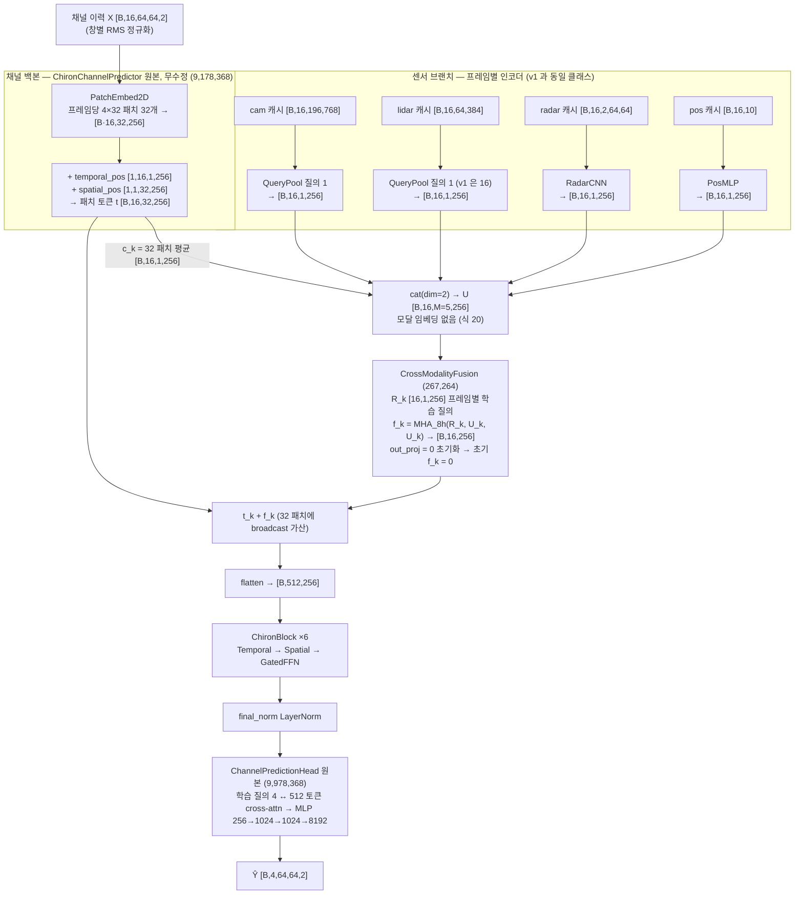
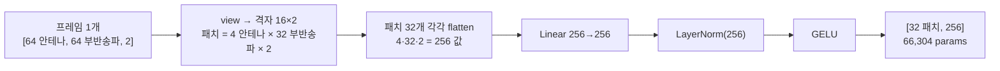
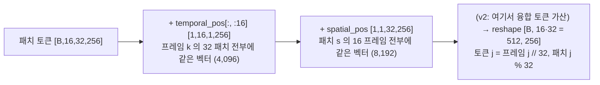
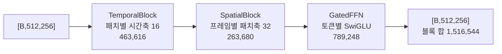
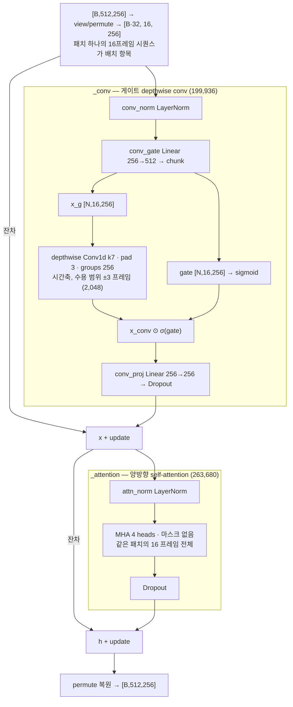
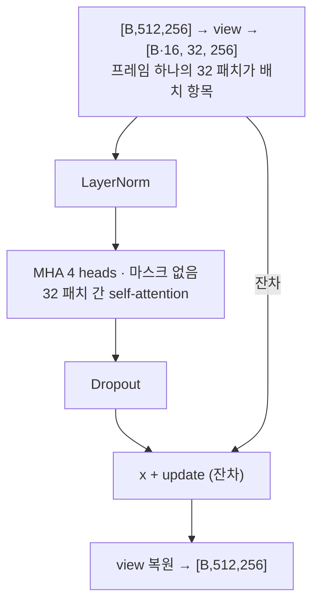
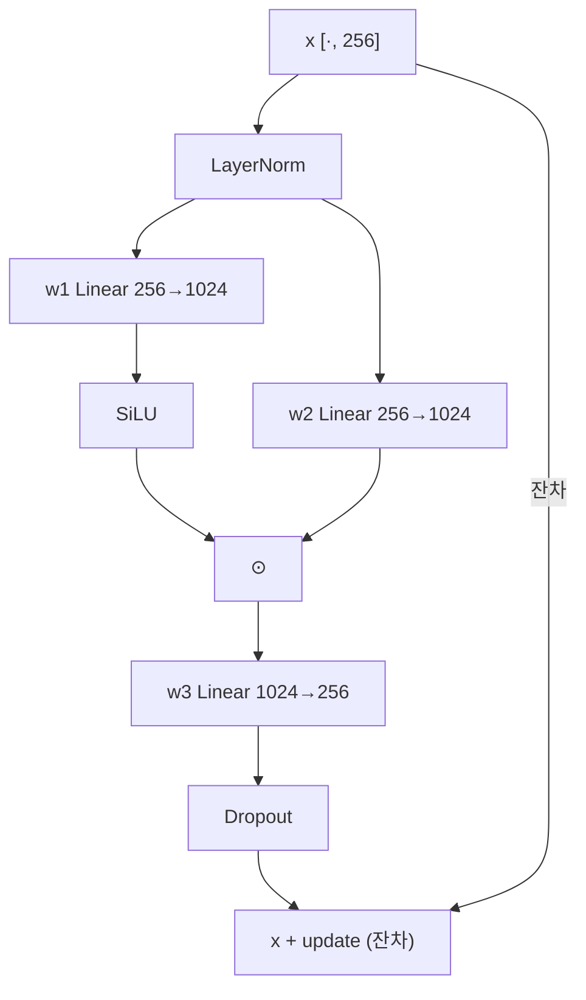
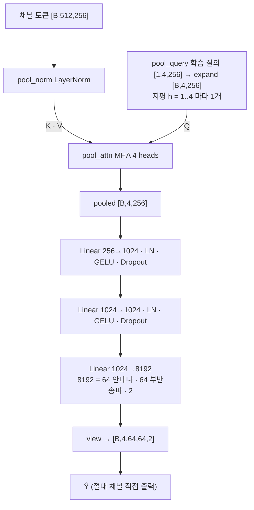
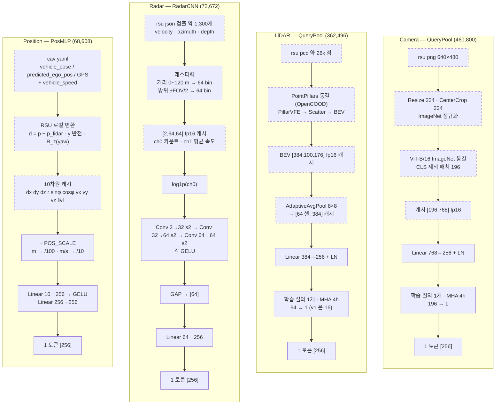
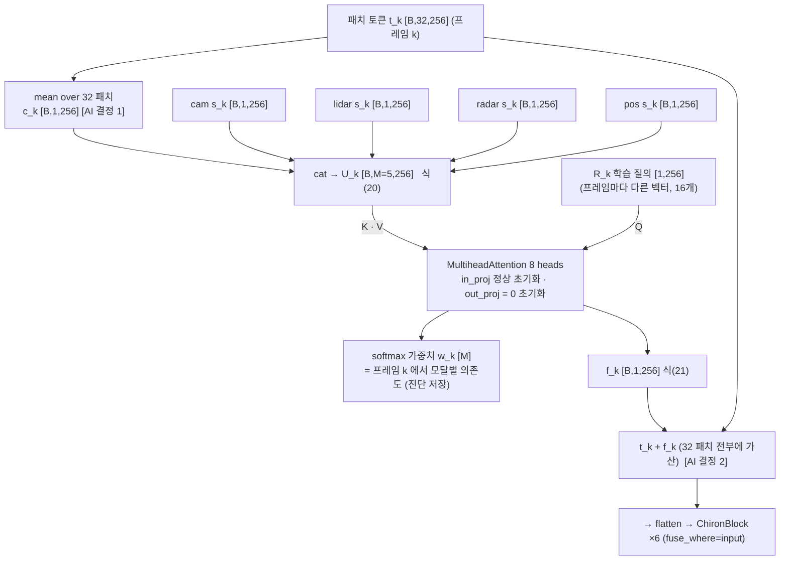

# multimodal_v2_xattn — 멀티모달 채널 예측 v2 `mm2:chiron` (논문 [B] 식(20)(21) cross-modality attention 융합)

**목적**: 이 폴더 하나만으로 (1) chiron 채널 예측 모델의 전체 구조와 하위 블록, (2) 그 위에 센서를 붙인 멀티모달 모델을 이해하고 실행할 수 있게 한다. 백본·로더·센서 앞단은 원본 파일을 **복사**해 넣었고(원본 무수정), 융합만 새 파일 `cp/cp_multimodal_v2.py` 다. git push 단위로 쓰기 위해 외부 경로 의존 없이 닫혀 있다(데이터 캐시 경로만 환경변수).

- 작성 2026-09-20. 상태: **코드·프로브·스모크만 완료, 학습 실험 0 run** (launch 는 계획서 승인 후).
- 배경: 2026-09-18 미팅 지적 "센서끼리는 concat 뿐이라 퓨전이 없다" → 할 일 2번 "논문 [B] 의 퓨전을 그대로 가져와 먼저 실행" (`../MEETING_FEEDBACK.md`).
- v1(`mm:chiron`) 과의 차이는 **융합 방식 하나**. v1 전체 기록은 GitHub `multimodal_v1_mm_chiron/` (사본 `docs/README_v1_mm_chiron_snapshot.md`).
- 태스크: 과거 16 프레임(160 ms) → 미래 4 프레임(10·20·30·40 ms), 64 안테나 × 64 부반송파, RX 행 표본, 논문 [B] arXiv:2603.15093 데이터셋(RSU 센서 cam·lidar·radar, 차량 위치).
- 표기: **[근거]** 파일·실행으로 확인, **[AI 결정]** 논문에 없어 이 프로젝트에서 정한 값(발표 시 그렇게 표시).

## 0. 구조 한 줄 요약

```
X [B,16,64,64,2] → PatchEmbed2D (프레임당 4×32 패치 32개) + 위치 임베딩 → 패치 토큰 t [B,16,32,256]
                                                                        │
센서 (프레임별 인코더, v1 과 동일) → cam 1 · lidar 1 · radar 1 · pos 1 토큰 [B,16,1,256] 각각
                                                                        ↓
   프레임 k 마다  U_k = [ c_k = mean(t_k, 32패치) ; s_k^cam ; s_k^lidar ; s_k^radar ; s_k^pos ]  ∈ R^{M×256}        ← 식(20)
                 f_k = MHA( R_k , U_k , U_k )   (R_k = 프레임별 학습 질의, 8 heads, 잔차·LN 없음)  ∈ R^{1×256}       ← 식(21)
                 t_k ← t_k + f_k  (32 패치 전부에 가산)
                                                                        ↓
   flatten [B,512,256] → ChironBlock ×6 (Temporal → Spatial → GatedFFN) → final_norm → ChannelPredictionHead → Ŷ [B,4,64,64,2]
```

`--fuse_where output` 이면 융합을 chiron 블록 뒤(헤드 직전)에서 한다(v1 의 융합 위치). 기본은 `input`(시퀀스 모델 앞 = 논문 [B] 위치).

## 1. 전체 흐름 도식 (코드 기준 · 실측 shape · B = 배치)

실선 = 학습 파라미터 있음, 점선 = 동결 사전학습 또는 파라미터 없는 전처리. shape·파라미터는 `probe/probe_v2_shapes.json` (CPU, B=2) 실측.



## 2. 채널 백본 하위 구조 (`models/chiron_channel.py`, 원본 무수정)

### 2.1 PatchEmbed2D — 프레임 1개 → 패치 토큰 32개



16 프레임을 배치로 붙여 `[B·16,64,64,2] → [B·16,32,256]` 으로 한 번에 처리한다.

### 2.2 위치 임베딩 → 512 토큰 시퀀스



### 2.3 ChironBlock ×6 — 블록 하나의 순서



6층 합 9,099,264 + PatchEmbed 66,304 + 위치 12,288 + final_norm 512 = 백본 몸통 9,178,368.

### 2.4 TemporalBlock — 게이트 conv(국소) + self-attention(전역), 잔차 2회



### 2.5 SpatialBlock — 프레임 안 32 패치 간 self-attention, 잔차 1회



### 2.6 GatedFFN — SwiGLU, 토큰별, 잔차 1회



### 2.7 ChannelPredictionHead — 지평 4개 동시 출력 (9,978,368)



백본 하이퍼파라미터(D 256 · L 6 · heads 4 · patch 4×32 · conv k7)는 저장소 기본값이며 S1 채널 전용 run `s1_chiron_lr3e-4` 와 같다. 9/18 미팅에서 지적된 "패치·게이트 conv·헤드의 근거" 는 이 폴더에서 다루지 않는다(할 일 3번 블록 ablation, 별도).

## 3. 센서 브랜치 (`cp/cp_multimodal.py` 의 인코더 클래스 + `sensor_frontends/` + `cp/cp_sensor_data.py`) — v1 과 동일



카메라·LiDAR 의 "학습 질의 1개로 N 개 패치/셀을 벡터 하나로 요약" 은 논문 [B] 식(14)~(17)(LiDAR 요약)과 같은 형태다. v1 과 다른 점은 LiDAR 질의 수 16 → 1 뿐([AI 결정 4]).

## 4. 융합 v2 — 논문 [B] 식(20)(21) 형태 (`cp/cp_multimodal_v2.py::CrossModalityFusion`)

### 4.1 논문·재현 코드와의 대응

| | 논문 [B] §III-B (빔 예측) | 재현 코드 `mmw_repro/models_faithful.py` | 이 폴더 `mm2:chiron` (채널 예측) |
|---|---|---|---|
| 스텝 | P = 40 (빔 이력) | `hist` = 40 | K = 16 (채널 이력 프레임) |
| 모달 토큰 | U'_B(빔 1D conv) · U'_L(LiDAR 요약) · U'_C(RGB 요약), 각 1×d_m | `be`, `lt`, `rt` [B,P,256] | c_k(채널 32 패치 평균) · cam · lidar · radar · pos, 각 1×256 |
| 식(20) | U = Concat(존재 모달) ∈ R^{P×M×d_m} | `mods = stack(toks, 2)` [B·P, M, 256] (`paper_concat`) | `U = cat(parts, 2)` [B,16,M,256] |
| 식(21) | B = CrossAttention(R, U, U), R ∈ R^{P×1×d_m} 스텝별 학습 질의 | `fuse_q` [1,P,1,256] randn·0.02, `nn.MultiheadAttention(256, 8)` | `query` [1,16,1,256] randn·0.02, `nn.MultiheadAttention(256, 8)` |
| 잔차·LN | 없음 | 없음 | 없음 |
| 융합 결과의 행선지 | Z = 재프로그래밍 → GPT-2 입력(빔 토큰을 **치환**) | 동일 | 프레임 k 의 패치 토큰 32개에 **가산** ([AI 결정 2]) |

### 4.2 융합 블록 도식



수식(프레임 k, 모달 m ∈ {channel, cam, lidar, radar, pos}):

$$U_k=\big[\,c_k;\ s_k^{\text{cam}};\ s_k^{\text{lidar}};\ s_k^{\text{radar}};\ s_k^{\text{pos}}\,\big]\in\mathbb R^{M\times 256},\qquad c_k=\tfrac{1}{32}\sum_{s=1}^{32} t_{k,s}$$
$$f_k=\text{MHA}_{8}(R_k,\ U_k,\ U_k)=W_o\,\big\|_{h}\ \text{softmax}\!\Big(\tfrac{(R_kW_q^h)(U_kW_k^h)^\top}{\sqrt{32}}\Big)\,U_kW_v^h,\qquad t_{k,s}\leftarrow t_{k,s}+f_k\ \ \forall s$$

softmax 는 모달 M 개 위에서 취해지므로 가중치 합이 1 이고, "프레임 k 에서 어느 모달을 얼마나 믿는가" 로 바로 읽힌다. v1 의 게이트 융합(채널 512 토큰이 센서 토큰 304 개를 attend)에서는 센서끼리 상호작용이 없었고 어텐션 질량이 토큰 수에 비례해 해석이 어려웠다.

### 4.3 v1 → v2 변경점 요약

| 항목 | v1 `mm:chiron` (2026-09-07) | v2 `mm2:chiron` (2026-09-20) |
|---|---|---|
| 융합 입력 | 채널 토큰 512개 = Q, 센서 토큰(프레임 내 cat 19개 × 16 프레임 = 304) = K/V | 프레임별 모달 토큰 U_k (채널 요약 1 + 센서 최대 4) |
| 융합 연산 | pre-norm cross-attn + σ(gate) ⊙ + SwiGLU FFN, ×3 층 (3,554,304) | 식(21) 단일 MHA, 잔차·LN·FFN 없음, ×1 (267,264) |
| 센서 간 상호작용 | 없음(concat 뿐) | 같은 softmax 안에서 경쟁(합 1) |
| 모달·프레임 임베딩 | modal_emb + frame_emb (5,120) | 없음(프레임 정보는 R_k 가 담음) |
| LiDAR 토큰 | 16 | 1 |
| 융합 위치 | 백본 뒤·헤드 앞 | 패치 임베딩 직후·블록 앞(기본) / 헤드 앞(`--fuse_where output`) |
| 초기 항등 | gate·out_proj·w3 0 초기화 | out_proj 0 초기화(`--no_fuse_zero_init` 로 해제) |
| 파라미터(4모달) | 23,684,576 | 20,388,576 |
| pos broadcast 모드 | 있음 | 없음(pos 는 U 의 한 모달) |

### 4.4 표준 Transformer 와의 대조 (9/18 미팅 요구: "AI 제안 구조는 표준과 대조해 역할·장점을 먼저")

- 식(21) 은 표준 디코더의 cross-attention 서브층에서 **질의를 입력 토큰이 아니라 학습 파라미터로 둔 것**이다(Perceiver 의 latent query, DETR 의 object query 와 같은 형태). 질의가 학습 파라미터이므로 출력 하나(f_k)는 M 개 모달 토큰의 볼록 결합이고, 역할은 "모달 선택·가중 평균" 이다.
- 표준 블록에 있는 잔차·LayerNorm·FFN 이 없다. 논문 [B] 와 그 재현 코드가 그렇게 돼 있어 그대로 두었다. 장점은 해석 가능성(가중치 = 모달 의존도)과 파라미터 절약, 단점은 표현력이 볼록 결합으로 제한된다는 것과 아래 §7 의 학습 위험이다.
- v1 과 달리 채널 토큰 자체를 갱신하지 않고 요약 벡터 하나를 만들어 가산하므로, 융합이 채널 백본의 내부 표현을 직접 바꾸지 않는다.

## 5. [AI 결정] 목록 — 논문 [B] 에 없어 이 프로젝트에서 정한 것

| # | 결정 | 이유 | 대안·확인 방법 |
|---|---|---|---|
| 1 | 채널 토큰 c_k = 프레임 k 패치 32개의 평균 | [B] 는 모달마다 스텝당 벡터 1개(빔은 1D conv 출력). chiron 프레임 표현은 32 토큰이라 요약이 필요 | 학습 질의 풀링(카메라와 같은 QueryPool) — 파라미터 증가. `--fuse_no_channel_token` 으로 채널 토큰을 빼고 센서끼리만 attend 하는 변형(9/18 미팅 제안 A)도 가능 |
| 2 | f_k 를 32 패치에 broadcast 가산 | [B] 는 융합 결과가 LLM 입력을 치환. chiron 에서 치환하면 안테나×부반송파 공간 구조가 사라짐. 가산은 v1 pos broadcast 와 같은 방식 | 프레임당 토큰 1개를 추가(S=33)하는 방식 — chiron 블록의 S 가정·spatial_pos 수정 필요해 원본 무수정 원칙과 충돌 |
| 3 | 융합 위치 기본 = 패치 임베딩 직후(블록 앞) | [B] 는 시퀀스 모델(GPT-2) 앞에서 융합. chiron 의 시퀀스 모델은 ChironBlock ×6 | `--fuse_where output` = v1 위치(헤드 앞). 두 위치를 같은 run 표에서 비교 |
| 4 | LiDAR 토큰 1개 | [B] 식(17) 은 LiDAR 를 u_L 벡터 하나로 요약. 프로브에서 16 토큰이면 초기 어텐션 0.94 가 LiDAR 에 쏠림(토큰 수 편향) | 생성자 `lidar_tokens` 로 프로브 대조 가능(CLI 없음) |
| 5 | 융합 out_proj 0 초기화 | 학습 시작 시 f_k = 0 → 채널 전용 chiron 과 같은 함수. v1·S1 과 같은 출발점에서 센서 증분을 잰다 | `--no_fuse_zero_init` = [B] 원형. 0 초기화는 첫 스텝에 질의·in_proj·센서 인코더 grad 가 0 (프로브 실측) → 두 번째 스텝부터 흐름. §7 참조 |
| 6 | 모달 임베딩 없음·프레임별 질의 | 재현 코드 paper_concat·paper_fuse_query 와 같게 | — |
| 7 | 융합 heads 8 | 재현 코드 fuse_attn 값 | 코드 상수 |

## 6. 파라미터 분해 (전체 4모달, 실측 `probe/probe_v2_shapes.json`)

| 부분 | 파라미터 | 비고 |
|---|---|---|
| 백본 몸통 | 9,178,368 | v1·채널 전용과 동일 |
| 헤드 | 9,978,368 | 동일 |
| 융합 | 267,264 | MHA 263,168 + 질의 R 16×256 = 4,096 (v1 융합 3,554,304 의 7.5 %) |
| 센서 인코더 | 964,576 | cam 460,800 + lidar 362,496 + radar 72,672 + pos 68,608 |
| **합계** | **20,388,576** | 채널 전용 chiron 19,156,736 대비 +1,231,840 (v1 은 +4,527,840) |

구성별: radar 만 19,496,672 · cam 만 19,884,800 · cam+lidar+radar 20,319,968.

## 7. 검증 결과와 알려진 위험

**프로브** (`probe/probe_v2_shapes.py`, CPU, B=2, 구성 8종, 2026-09-20) [근거 `probe/probe_v2_shapes.log`]
- 초기 항등: 0 초기화 구성 전부 채널 전용 chiron 과 출력 차이 max|diff| = 0 (input·output 위치 모두).
- 초기 어텐션: 질의가 randn·0.02 라 모달별 거의 균등(4모달+채널 = 0.20 씩, radar 만 = 0.5/0.5).
- grad: 0 초기화면 첫 스텝에 out_proj 만 grad 를 받고 질의·in_proj·센서 인코더는 0(체인이 out_proj = 0 에서 끊김). `no_zero_init` 이면 전부 흐름.
- LiDAR 16 토큰 대조: 초기 어텐션 lidar 0.94 / channel 0.06 → 토큰 수 편향. 1 토큰이 [B] 형태이자 균등 출발.

**스모크** (`probe/smoke/`, GPU 0, 2026-09-20) [근거 `probe/smoke/smoke_mm2_full_input.stdout`]
- `train_cp.py --model mm2:chiron --sensors cam,lidar,radar,pos --split B1 --max_train_windows 48 --epochs 1 --batch 16`: 로더·학습·검증(val 2,439 창 × 16)·체크포인트 저장까지 exit 0, DONE 생성. 결과 수치(val pooled 0.50 dB)는 창 48개로 1 에폭이라 의미 없음(파이프라인 확인용). 체크포인트는 크기 때문에 삭제.
- `eval_sensor_ablation_cp.py --run smoke_mm2_full_input --max_windows 12 --conditions real,zero,none,shuffle --per_modal`: mm2 분기 동작, diag attention_mass 가 모달 5개 각 0.20 으로 기록됨(`probe/smoke/smoke_mm2_full_input/sensor_ablation.json`).

**알려진 위험 — 같은 융합이 재현 실험에서 보인 현상** [근거 `../../REPRO_V2_EXPERIMENTS_SINCE_20260829.md` §6.4~6.5, `../../MEETING_20260904_SCRIPT.md` 보충 2]
- 논문 [B] 재현(빔 예측)에서 식(21) 어텐션이 학습 후에도 33.4/33.3/33.3 % 균등이었고 질의 노름이 초기값(0.32) 그대로였다. 즉 융합이 "모달 토큰 평균" 으로 굳어 센서 증분이 0 이었다. 원인 후보는 낮은 lr(5e-5)·질의 초기 크기·잔차·LN 부재.
- v2 도 같은 연산이므로 학습 후 `attention_over_modalities()`(절제 스크립트 diag 의 `attention_mass`)로 가중치가 균등에서 벗어났는지, 질의 노름이 변했는지 반드시 확인한다. 균등이면 "[B] 융합 그대로는 안 됨" 이 결과이고, 그다음 단계(LN·잔차 추가 등)는 별도 결정.
- 0 초기화([AI 결정 5])는 첫 스텝 grad 를 out_proj 에만 주므로 질의 학습을 더 늦출 수 있다. `--no_fuse_zero_init` 대조 run 을 계획에 넣는 것을 권한다.

## 8. 파일 색인 (출처 = 어디서 복사했는지)

| 파일 | 상태 | 출처(2026-09-20 복사) | 역할 |
|---|---|---|---|
| `cp/cp_multimodal_v2.py` | **신규** | — | **v2 본체**: `CrossModalityFusion`(식 21), `MMChironX`(백본 호출·센서 토큰·융합·헤드), `build_mm2_model` |
| `cp/cp_multimodal.py` | 사본(무수정) | `../cp/cp_multimodal.py` md5 d93e9e9c | v1 본체. v2 가 센서 인코더 `QueryPool`·`RadarCNN`·`PosMLP` 를 여기서 import. v1 구조 대조용 |
| `models/chiron_channel.py` | 사본(무수정) | `../../../multimodal_code_index/models/chiron_channel.py` md5 53560a5b | 백본 원본: `PatchEmbed2D` 48행, `TemporalBlock` 93, `SpatialBlock` 179, `GatedFFN` 221, `ChironBlock` 243, `ChannelPredictionHead` 285, `ChironChannelPredictor` 367 |
| `models/__init__.py` | 신규(빈 패키지) | — | 이 폴더 단독 실행 시 `models.chiron_channel` 해석 |
| `cp/cp_models.py` | 사본 + **패치 2줄** | `../cp/cp_models.py` | 모델 레지스트리. `mm2:` → `build_mm2_model` 분기 추가 |
| `cp/train_cp.py` | 사본 + **패치** | `../cp/train_cp.py` | 학습 진입점. `IS_MM2`, 인자 `--fuse_where/--no_fuse_zero_init/--fuse_no_channel_token`, 폴더 루트 sys.path |
| `cp/eval_sensor_ablation_cp.py` | 사본 + **패치** | `../cp/eval_sensor_ablation_cp.py` | 센서 절제 평가. `mm2:` 허용, 게이트 진단 생략, attention_mass = 식(21) 가중치 |
| `cp/cp_data.py` | 사본(무수정) | `../cp/cp_data.py` (T1 포함 9/14 판) | 채널 창·RX 행 표본·RMS 정규화·NMSE·분할(B1/A1/T1) |
| `cp/cp_sensor_data.py` | 사본(무수정) | `../cp/cp_sensor_data.py` | 센서 캐시 생성·로더 `MMWindowSet` |
| `cp/cp_repo_models.py` | 사본(무수정) | `../cp/cp_repo_models.py` | `repo:chiron` 채널 전용 기준선 래퍼(같은 백본) |
| `cp/eval_sanity.py` | 사본(무수정) | `../cp/eval_sanity.py` | 채널 전용 run 정직성 검사 |
| `cp/prep_h_memmap.py` | 사본(무수정) | `../cp/prep_h_memmap.py` | 경로 파라미터 → H memmap 합성(식 1) |
| `sensor_frontends/precompute_patch_rsu.py` | 사본(무수정) | `../../precompute_patch_rsu.py` | RSU png → ViT-B/16 동결 → 패치 토큰 캐시 |
| `sensor_frontends/precompute_pointpillar_rsu.py` | 사본(무수정) | `../../precompute_pointpillar_rsu.py` | RSU pcd → PointPillars 동결 → BEV 캐시 |
| `sensor_frontends/pointpillars_opencood.py` | 사본(무수정) | `../../mmw_repro/pointpillars_opencood.py` md5 47b3c958 | `PointPillarsFrozen` |
| `probe/probe_v2_shapes.py` + `.json/.log` | 신규 | — | §7 프로브 |
| `probe/smoke/` | 신규 | — | §7 스모크 run 기록(config·result·metrics·train.log·sensor_ablation.json, best.pt 삭제) |
| `docs/MODEL_ARCHITECTURES.md` | 사본 | `../MODEL_ARCHITECTURES.md` | 채널 전용 10종(+chiron §2) hook 실측·수식 |
| `docs/MULTIMODAL_CP_ARCHITECTURE.md` | 사본 | `../MULTIMODAL_CP_ARCHITECTURE.md` | v1 구현·실측 문서 |
| `docs/MULTIMODAL_ARCHITECTURES.md` | 사본 | `../MULTIMODAL_ARCHITECTURES.md` | 저장소 멀티모달 7종 + [B] 재현 모델 식(21) 실측(§2 항목 8) |
| `docs/FORMULAS.md` | 사본 | `../FORMULAS.md` | 수식 모음(v1 융합 §9) |
| `docs/README_v1_mm_chiron_snapshot.md` | 사본 | GitHub `multimodal_v1_mm_chiron/README.md` | v1 스냅샷 README(11 도식·run 33개 요약) |

## 9. 실행 방법

환경변수(없으면 이 서버의 기본 경로): `CP_DERIVED` = `derived_cp/`(H memmap·index·`sensor_cache/`), `CP_OUT` = 출력 루트, `CP_REPO` = 저장소 `multimodal_code_index`(없어도 `models/` 사본으로 동작).

```bash
cd multimodal_v2_xattn/cp
PY=/home/dlghdbs200/anaconda3/envs/hoyun_312/bin/python
# 프로브(학습 없음, CPU)
$PY ../probe/probe_v2_shapes.py
# 학습 예시(v1·T1 run 과 같은 레시피, 분할만 바꿔 씀)
CUDA_VISIBLE_DEVICES=0 $PY -u train_cp.py --model mm2:chiron --run_id r1_mm2_cam_lidar_radar --sensors cam,lidar,radar \
  --fuse_where input --split B1 --seed 42 --K_hist 16 --H_pred 4 --lr 3e-4 --batch 64 --epochs 40 --patience 5 --device cuda:0
# 대조: --fuse_where output / --no_fuse_zero_init / --fuse_no_channel_token
# 절제 평가(학습 없음)
CUDA_VISIBLE_DEVICES=0 $PY eval_sensor_ablation_cp.py --run r1_mm2_cam_lidar_radar --per_modal
```

실험 launch 는 계획서 승인 후(`../EXPERIMENT_PLAN_RANDTRAJ_20260918.md` 의 R1 분할이 확정되면 그 분할로). GPU 0·1 만, 동시 2 run, AMP 없음, batch 64 통일.

## 10. 상태 (2026-09-20)

- 코드 완료·프로브 통과·스모크(학습 1 에폭·절제) 통과. **학습 실험 0 run.**
- 다음 단계(사용자 결정): R1 분할 승인 → v2 run 목록(채널 전용 chiron 3 시드 / mm2 radar / cam,lidar,radar / cam / lidar / cam,lidar / pos / 대조 `--no_fuse_zero_init`·`--fuse_where output`) 을 계획서에 추가.
