# MODEL_ARCHITECTURES.md — 채널 예측 모델 10종(+Chiron-V2, +LWM v1.1) 전체 파이프라인

- 작성 2026-09-05, **§2.11 LWM v1.1 추가 2026-09-07**(사용자 지시), **§1.0 수식 정의·모델별 forward 수식 추가 2026-09-07**(사용자 지시; 수식은 코드에서 도출, 논문 [B] 채널 모델은 §1.0.0). 대상 = S1 실험(`EXPERIMENT_PLAN_FINAL_20260904.md`)의 모델 10개 + Chiron-V2 + LWM v1.1, 코드 = `cp/`(트레이너·로더·제안 모델) + `../../multimodal_code_index/models/`(저장소 백본).
- 모든 텐서 shape는 **실제 로더로 뽑은 배치(B=2)를 모델에 통과시키며 forward hook으로 기록**한 값이다(`scripts/09_probe_model_shapes.py` → `09_probe_model_shapes.json`/`.log`, 2026-09-05 GPU 0, torch 2.6.0+cu124, mamba_ssm 2.2.4). 문서에서는 배치 축을 `B`로 일반화해 적는다.
- 표기 규칙: 별도 표시 없음 = **[실측 hook]**. **[코드 기반 추정]** = nn.Module 경계 밖 연산(reshape/permute, torch.fft, fused CUDA 커널 내부)이라 hook이 발화하지 않아 코드를 읽어 적은 것. **[논문 기반, 코드 미확인]** = 해당 없음(10개 모두 코드가 존재하며 실행됨; 예외 = §1.0.0의 논문 채널 모델은 원문 수식 인용이라 [논문 기반]으로 표기).

---

## 0. 근거·범위

### 0.1 코드 위치(실제 파일명)

| # | 모델 | build 이름(`train_cp.py --model`) | 클래스 | 파일 |
|---|---|---|---|---|
| 1 | Transformer(제안, C1) | `transformer` | `TransformerPredictor` | `cp/cp_models.py` ※ `cp/models/` 디렉터리는 없음 — 제안 모델은 `cp_models.py` 한 파일 안에 있다 |
| 2 | LSTM | `lstm` | `LSTMPredictor` | `cp/cp_models.py` |
| 3 | ConvLSTM-AE | `convlstm_ae` | `ConvLSTMAE`, `ConvLSTMCell` | `cp/cp_models.py` |
| 4 | AR/선형 | (학습 없음) | `baselines_g0.py` 내 `lin()` | `cp/baselines_g0.py`, 계수 `cp/g0_baselines_B1.json` |
| 5 | LWM | `repo:lwm` | `LWMMultiModalPredictor(mode="channel_only")` | `multimodal_code_index/models/lwm_multimodal.py` (헤드는 `chiron_channel.py`) |
| 6 | LWM-Temporal | `repo:lwm_temporal` | `LWMTemporalMultiModalPredictor(mode="channel_only")` → `_LWMModelCLSInject` | `models/lwm_temporal_multimodal.py`, `models/lwm_temporal.py` |
| 7 | Chiron | `repo:chiron` | `ChironChannelPredictor` | `models/chiron_channel.py` |
| 8 | NOVA | `repo:nova` | `NOVAChannelPredictor` | `models/nova_channel.py` |
| 9 | DelayTCN | `repo:dtcn` | `DelayTCN` | `models/delay_tcn.py` (헤드는 `chiron_channel.py`) |
| 10 | Mamba | `repo:mamba` | `MambaChannelPredictor` | `models/mamba_channel.py` + `mamba_ssm/modules/mamba_simple.py`(패키지) |
| 부록 | Chiron-V2 | `repo:chiron_v2` | `ChironV2` | `models/chiron_v2.py` (S1에 포함된 11번째 run, 사용자 목록 외) |
| 12 | LWM v1.1(사전학습, §2.11) | `lwm11` | `LWM11Predictor` | `cp/cp_lwm11.py`(래퍼·시간 모델·헤드) + `cp/third_party/lwm_v1_1/lwm_model.py`(HF wi-lab/lwm-v1.1 원본, 무수정) + `cp/third_party/lwm_v1_1/models/model.pth`(사전학습 가중치 9.96 MB) |

- 래퍼: `repo:*`는 `cp/cp_repo_models.py::RepoWrap`이 감싸 `forward(X[B,K,Nt,Ksc,2]) → [B,H,Nt,Ksc,2]`로 통일한다. hook 이름의 `m.` 접두어가 래퍼 내부 모델이다.
- 데이터 코드: `cp/prep_h_memmap.py`(경로 파라미터 → H memmap), `cp/cp_data.py`(창·표본·정규화·지표), `cp/train_cp.py`(학습 루프).

### 0.2 프로브 실행 결과 요약(B=2, eval 모드, GPU 0)

| run(큐 이름) | 모델 | 파라미터 | 출력 shape | hook 모듈 수 | fwd(s) | 피크 메모리(MB) |
|---|---|---|---|---|---|---|
| s1_transformer_lr1e-4 | transformer D512 L6 | 39,928,320 | [2,4,64,64,2] | 64 | 0.05 | 165 |
| s1_lstm_lr3e-4 | lstm D512 L2 | 25,207,296 | [2,4,64,64,2] | 9 | 0.01 | 123 |
| s1_convlstm_lr3e-4 | convlstm_ae c32/128 L2 | 3,912,098 | [2,4,64,64,2] | 21 | 0.11 | 47 |
| s1_chiron_lr3e-4 | repo:chiron D256 L6 | 19,156,736 | [2,4,64,64,2] | 141 | 0.03 | 99 |
| s1_nova_lr3e-4 | repo:nova D256 L6 | 15,735,552 | [2,4,64,64,2] | 161 | 0.01 | 133 |
| s1_dtcn_lr3e-4 | repo:dtcn D256 | 17,069,824 | [2,4,64,64,2] | 50 | 0.01 | 81 |
| s1_mamba_lr1e-3 | repo:mamba D128 L4 | 6,118,272 | [2,4,64,64,2] | 36 | 0.00 | 36 |
| s1_lwm_lr3e-4 | repo:lwm D128 L12 | 8,333,440 | [2,4,64,64,2] | 178 | 0.25 | 45 |
| s1_lwmtemporal_lr5e-4 | repo:lwm_temporal D128 L6 patch 8×32 | 1,360,512 | [2,4,64,64,2] | 67 | 0.18 | 253 |
| _failed_oom_s1_lwmtemporal | 위와 같되 patch 4×16(기본값) | 1,384,704 | [2,4,64,64,2] | 67 | 0.97 | 3,662 |
| s1_chironv2_lr3e-4 | repo:chiron_v2 D256 L6 | 19,023,616 | [2,4,64,64,2] | 107 | 0.04 | 84 |
| s1_lwm11_pre_lr1e-4 | lwm11 pretrained, freeze none, t_layers 2 | 2,885,664 | [2,4,64,64,2] | 195 | 0.02 | 83 |
| s1_lwm11_frozen_lr3e-4 | lwm11 pretrained, freeze all (학습 파라미터만 집계) | 415,360 (전체 2,885,664) | [2,4,64,64,2] | 195 | 0.02 | 83 |
| linear_K1/K2/K4 | 최소제곱 계수 | 4 / 8 / 16 | [2,4,64,64,2] | — | — | — |

### 0.3 사용자 지정 공통 조건 vs 코드·데이터 실제 값

| 항목 | 지정 값 | 실제 값 | 근거 |
|---|---|---|---|
| 데이터 | CARLA-Wireless 28 GHz | `mmw_reproduction/sunny/channel_data/v2i/Nt_1_64_Nr_1_16_fc_28GHz` (RSU→CAV, 50 궤적, 53,800 프레임) | `prep_h_memmap.py`, `prep_h_memmap.log` |
| 입력 길이 L | 16 | K_hist = 16 (일치) | `train_cp.py --K_hist 16` |
| 출력 길이 P | 4 | H_pred = 4 (일치) | `--H_pred 4` |
| 프레임 간격 | 0.5 ms | **10 ms**(100 Hz). 지평 = 10/20/30/40 ms. 0.5 ms는 구 자체수집 sc08(3.5 GHz) 격자이며 이 데이터에는 존재하지 않음 | `REPORT_STEP1_CHANNEL_DATA.md` §1.3, `REPORT_STEP2_TIMESERIES.md` §2.1 |
| 채널 텐서 | [B, L, Nt, Nr, K] | **[B, 16, 64, 64, 2] = [B, K_hist, Nt, K_sc, re/im]**. Nr=16은 텐서 축이 아니라 **표본 축**(RX 행 1개 = 표본 1개, 창 1개 → 표본 16개) | `cp_data.py::WindowSet.batch`, 프로브 `X_shape` |
| 부반송파 | (미지정) | K_sc = 64, Δf = 120 kHz, f_k = (k−32)·Δf | `prep_h_memmap.py --K 64 --df 120e3`, index.json |
| 값 형식 | (미지정) | fp16 memmap → 배치 시 fp32; 전역 위상 제거된 상대 채널(데이터셋 규약) | `cp_data.py`, STEP2 §2.4(c) |

---

## 1. 공통 파이프라인 (모든 모델 동일)

### 1.0 수식 정의 (채널 생성 → 전처리 → 학습 → 평가)

> 같은 수식의 한눈 모음(기준선·나이퀴스트·센서·융합·판정 포함)은 `FORMULAS.md` 에 코드 정의 기준으로 정리돼 있다(2026-09-08).

- 목적: §1.1~1.5 표의 각 단계를 수식으로 고정한다. 기호는 §0.3·§1.1~1.5 와 같다: $K_{hist}=16$, $H_{pred}=4$, $N_t=64$, $K_{sc}=64$, $N_r=16$(텐서 축이 아닌 **표본 축**), RX 행 $r\in\{0,\dots,15\}$, 실수 텐서 X [B,16,64,64,2]·Y [B,4,64,64,2] 의 마지막 축 $c\in\{0,1\}$ = (Re, Im), 배치 축 $b=1..B$.
- 표기 규칙(이 절): 별도 표시 없음 = **[코드 기반]**(근거 = 파일::함수/행). **[추정]** = 코드에 없는 수학적 정리·해석 또는 다른 문서에서 가져온 값. 수치는 `cp/*.py`, `cp/prep_h_memmap.log`, `cp/baselines_g0.log`, `cp/g0_baselines_B1.json`, `derived_cp/H_…_K64_index.json` 및 `REPORT_STEP1_CHANNEL_DATA.md`(경로 수 범위·더미 경로·Δt)에서 읽은 값만 적었다.
- 인덱스 규약: 코드는 0-기반이다. 이력 프레임 $t=0..K_{hist}-1$. 지평은 코드 텐서 첨자로는 $0..3$ 이지만 본 절은 §1.3~1.4 처럼 $w=1..4$ (= $10w$ ms) 로 적고, 텐서 첨자가 필요한 곳만 $[w-1]$ 로 환산한다.

#### 1.0.0 논문 [B]의 채널 모델(데이터 원천) — [논문 기반] (arXiv:2603.15093, `../paper_figs/paper.html` alttext에서 추출)

경로 도메인 채널(논문 식 (1), §II; 시간 스텝 $n$, 부반송파 $k$, $\mathbf H\in\mathbb C^{N_r\times N_t}$):

$$
\mathbf H_{n,k}=\sqrt{\frac{N_tN_r}{L_n}}\sum_{l=1}^{L_n}\alpha_{n,l}\,\mathbf a_r(\theta_{n,l})\,\mathbf a_t^{\mathrm H}(\phi_{n,l})\,e^{-j2\pi f_k\tau_{n,l}}
$$

- $L_n$: 시점 $n$의 경로 수, $\alpha_{n,l}$ 복소 이득, $\tau_{n,l}$ 지연, $\theta$=AoA, $\phi$=AoD. ULA steering(논문 식 (2), $d=\lambda/2$, 정규화 계수 없음): $\mathbf a_t(\theta)=[1,e^{j2\pi d\sin\theta/\lambda},\dots,e^{j2\pi(N_t-1)d\sin\theta/\lambda}]^{\mathrm T}$, $\mathbf a_r$ 동일 형태($N_r$).
- 부반송파 기저대역 주파수(논문 §II 인라인): $f_k=\left(k-\tfrac{K+1}{2}\right)\Delta f$ → $k=1..K$이면 $\pm\tfrac{K-1}{2}\Delta f$ 대칭, DC 부반송파 없음.
- 데이터셋 배포 형식(논문 식 (26),(27), §IV-B): 경로별 $\mathbf A_l\in\mathbb C^{N_r\times N_t}$와 $\tau_l$을 저장하고, 사용자가 주파수 영역 채널을 합성한다.

$$
\mathbf H(f_k)=\sum_{l=1}^{L}\mathbf A_l\,e^{-j2\pi f_k\tau_l},\qquad
\mathbf A_l=\sqrt{\frac{N_tN_r}{L}}\,\alpha_l\,\mathbf a_r(\theta^{\mathrm z}_l)\,\mathbf a_t^{\mathrm H}(\phi^{\mathrm z}_l)
$$

- 즉 식 (1)의 스케일·이득·**배열 응답이 모두 $\mathbf A_l$에 포함**돼 있고(논문 명시), 합성 시에는 $e^{-j2\pi f_k\tau_l}$만 곱해 더한다. 배포 npz의 `a[0,0,:,0,:,l,0]` = $\mathbf A_l$, `tau[l]` = $\tau_l$ (`REPORT_STEP1_CHANNEL_DATA.md` §1.2: 같은 프레임의 `tau`·각도는 안테나 설정 6종에서 동일하고 `a`만 달라짐 — STEP1은 1프레임 실측·일반화는 추정으로 명시 → (27)과 부합 **[추정]**).
- Table I(§IV-B) 중 이 데이터에 해당하는 값: 반송파 28 GHz(우리 설정 `Nt_1_64_Nr_1_16_fc_28GHz`), Dipole·수직 편파, ray $10^6$, 반사 최대 1차(LOS+1차 반사만), 프레임 10 ms, $\Delta f$=120 kHz, $K$=1024, TX $1\times64$ ULA, RX $1\times16$ ULA. $K$·$\Delta f$는 "사용자가 합성 시 선택"으로 명시.
- 잡음(논문 식 (3)): $y_{n,k}=\mathbf w^{\mathrm H}\mathbf H_{n,k}\mathbf f\,x_{n,k}+s_{n,k}$, $s_{n,k}\sim\mathcal{CN}(0,\sigma^2)$. SNR 정의식·$\sigma^2$·채널 전력 정규화 식은 논문에 **없음**(채널 예측 파이프라인은 잡음을 넣지 않음, §1.0.1).

**코드(§1.0.1)와 논문의 차이 — 명시 편차**

| 항목 | 논문 [B] | 코드 `prep_h_memmap.py` | 영향 |
|---|---|---|---|
| $f_k$ | $(k-\tfrac{K+1}{2})\Delta f$, DC 없음 | $(k-\tfrac{K}{2})\Delta f$, $k=0..63$ → $-32\Delta f..+31\Delta f$, $k=32$가 DC | 전 부반송파에 공통인 $\tfrac{1}{2}\Delta f$ 주파수 이동 = 경로별 위상 $e^{-j\pi\Delta f\tau_l}$ 차이(전역 위상이 아니므로 $\mathbf H$ 값 자체는 달라짐; 최대 지연 2.93 µs에서 $\pi\Delta f\tau\le1.10$ rad, STEP1 §1.2). 지표 정의·계산 방식은 양쪽 동일하므로 비교 절차에는 영향 없음; 수치 동일성은 미검증 **[추정]** |
| $K$ | 1024(Table I) | 64 | 대역 7.68 MHz(64×120 kHz)만 사용. Δf가 같으므로 인접 부반송파 상관은 불변, 대역 전체(양끝) 상관은 높아짐 **[추정]** |
| 배열 응답 | (27)로 $\mathbf A_l$에 포함 | `a`를 그대로 사용, 재곱 없음 | 논문 (26)과 일치 |
| $\sqrt{N_tN_r/L}\,\alpha_l$ 스케일 | 논문 (27)에 $\mathbf A_l$ 포함으로 명시. 단 배포 npz `a`가 실제로 이 계수를 갖는지(Sionna `Paths.a` 원시 계수 vs 논문식 재정규화)는 데이터·코드로 미검증 | 그대로 사용 | RMS 정규화(§1.0.4)로 절대 스케일은 소거되므로 지표에는 무관 |
| 더미 경로 | 없음 | `tau<0`, `a=0` 패딩 경로 → 합에 0 기여 | 없음 |

논문에 없어서 코드가 자체 결정한 것: 부반송파 인덱스 시작값(0), $K$=64, 실수화(Re/Im), fp16 저장, RX 행을 표본 축으로 쓰는 것(§1.0.3). 논문의 빔 관련 식 (4),(6),(7)은 채널 예측 파이프라인에서 쓰지 않는다.

#### 1.0.1 원천 경로 파라미터 → 주파수 영역 채널 합성 (`cp/prep_h_memmap.py`)

원천: 프레임 1개 = `*_paths.npz` 1개. `a[0,0,:,0,:,:,0]` → $a_t\in\mathbb{C}^{N_r\times N_t\times P_t}$ (complex64), `tau.ravel()` → $\tau_t\in\mathbb{R}^{P_t}$ (float32). Sionna `Paths.a` 축 [batch, rx, rx_ant, tx, tx_ant, path, time] 에서 batch·rx·tx·time 을 0 으로 고정한 것(축 해석 근거 = `REPORT_STEP1_CHANNEL_DATA.md` §1.2). 경로 수 $P_t$ 는 프레임마다 다르다(1~9; STEP1 §1.2의 Nt_1_16 전수 통계이며 τ=−1 더미 경로를 포함한 집계 **[추정: 타문서 값]**). 근거 `prep_h_memmap.py:30`.

부반송파 주파수(기저대역, 0 중심):

$$
f_k=\Big(k-\frac{K_{sc}}{2}\Big)\Delta f,\qquad k=0,\dots,K_{sc}-1,\qquad K_{sc}=64,\ \Delta f=120\ \mathrm{kHz}
$$

→ $f_0=-3.84$ MHz, $f_{32}=0$ (DC 부반송파 포함), $f_{63}=+3.72$ MHz; 격자는 $-32\Delta f..+31\Delta f$ 로 비대칭, 점유 폭 $K_{sc}\Delta f=7.68$ MHz. 근거 `prep_h_memmap.py:11` `FREQ=((np.arange(K)-K/2)*df)`, `index.json` `K=64, df=120000.0`.

채널 합성:

$$
H_t[r,n,k]=\sum_{l=1}^{P_t} a_{t,l}[r,n]\;e^{-j2\pi f_k\tau_{t,l}},\qquad r=0..N_r-1,\ n=0..N_t-1,\ k=0..K_{sc}-1
$$

einsum 대응(`prep_h_memmap.py:31-32`): `ph = exp(-2jπ·outer(FREQ, tau))` → $\Phi_t[k,l]=e^{-j2\pi f_k\tau_{t,l}}$, shape [K_sc, P_t] complex64; `H = einsum("rtp,kp->rtk", A, ph)` → 문자 **r** = RX 행($N_r$=16), **t** = TX 안테나($N_t$=64; 시간 축이 아님), **p** = 경로($P_t$), **k** = 부반송파. 즉 $H_t[r,n,k]=\sum_p A_t[r,n,p]\,\Phi_t[k,p]$, 출력 [16,64,64] complex64.

- 코드는 반송파 위상 $e^{-j2\pi f_c\tau}$ 를 곱하지 않는다($f_k$ 가 0 중심 기저대역; 논문은 $\mathbf A_l$ 을 "$f_c$ 에서의 복소 이득"으로 서술하므로 반송파 위상이 `a` 에 이미 들어 있는지는 미확인). $\tau=0$ 인 경로(대부분 첫 경로 = LOS, STEP1 §1.2)는 지수항이 전 부반송파에서 1 이므로 기여 위상 = $\arg a_{t,l}$ 로 부반송파에 무관.
- $\tau<0$ 더미 경로: 코드에 마스크·필터 없음. 데이터의 $\tau=-1$ s 경로는 $a=0$ 이므로(STEP1 §1.6: Nt_1_16 기준 307 파일, $a=0$ 은 2파일 표본 확인; 본 설정 Nt_1_64 는 τ 동일 추정에 의존 **[추정]**) 합 안에서 $0\cdot e^{(\cdot)}=0$ 으로 자동 소거된다. 근거 `prep_h_memmap.py:2` 주석("τ<0 더미 경로(a=0)는 자동 무시").
- 프레임·궤적 구조: 궤적 $j=0..49$ 는 경로 문자열 정렬 순 `sorted(glob("Town*/*/cav_*"))`, 궤적 내 프레임은 파일명 번호 순(`fnum`, 인접 차 = 1). 전역 프레임 인덱스 $i=s_0(j)+t$, $t=0..N_j-1$, $N_j\in\{800,1000,1100,1200,1300\}$(시나리오별 고정), $\sum_j N_j=53{,}800$. `index.json` 에 `frame_traj`($j$), `frame_pos_in_traj`($t$), `traj_len`($N_j$), `speed`, `pos` 저장. 근거 `prep_h_memmap.py:18-23, 41-44`.
- 프레임 간격 $\Delta t=10$ ms(100 Hz)는 데이터 문서 값(STEP1 §1.3, 본 문서 §0.3) **[추정: 문서 기반]** — 합성·학습 코드는 $\Delta t$ 를 쓰지 않는다(예외: `cp_repo_models.py:45` LWM 생성 인자 `delta_t=0.01`).

#### 1.0.2 실수화·양자화 (`cp/prep_h_memmap.py:27, 33, 46-51`)

$$
M[i,r,n,k,0]=\mathrm{fp16}\big(\Re H_i[r,n,k]\big),\qquad M[i,r,n,k,1]=\mathrm{fp16}\big(\Im H_i[r,n,k]\big)
$$

memmap $M$: shape [53800, 16, 64, 64, 2] float16, layout `[frame, rx, tx, subcarrier, re/im]`, 14.1 GB (`prep_h_memmap.log:1`). Re/Im 분리이며 크기/위상 표현이 아니다.

왕복 검증(무작위 5 프레임, `np.random.default_rng(0)`):

$$
\mathrm{NMSE}^{\mathrm{fp16}}_i=10\log_{10}\frac{\sum_{r,n,k}\big|H_i[r,n,k]-\hat H^{(16)}_i[r,n,k]\big|^2}{\sum_{r,n,k}|H_i[r,n,k]|^2},\qquad \hat H^{(16)}_i=M[i,\cdot,0]_{\mathrm{fp32}}+j\,M[i,\cdot,1]_{\mathrm{fp32}}
$$

로그 값 $[-63.3,\ -72.5,\ -64.8,\ -64.3,\ -70.0]$ dB (`prep_h_memmap.log:29`). 검증 측 $H_i$ 는 complex64 캐스트 없이(complex128) 재합성하므로 이 값은 complex64 반올림 + fp16 반올림을 합친 오차다(`prep_h_memmap.py:48` vs `:31`).

#### 1.0.3 창·표본 정의 (`cp/cp_data.py::make_windows` 19-35행, `WindowSet` 38-57행)

창 길이 $L=K_{hist}+H_{pred}=20$. 궤적 $j$ 안의 창 시작(궤적 내 좌표) $s\in\{0,\sigma,2\sigma,\dots\}$, $s\le N_j-L$; stride $\sigma_{train}=1$(`train_stride=1`), $\sigma_{val}=H_{pred}=4$(`val_stride=None → H_pred`). 창 = 전역 인덱스 쌍 $(s_0(j)+s,\ j)$.

$$
\mathcal W_{train}=\{(s_0(j)+s,\,j):\ j\in J_{train},\ s=0,1,\dots,N_j-20\},\qquad |\mathcal W_{train}|=\sum_{j\in J_{train}}(N_j-19)=43{,}121
$$

$$
\mathcal W_{val}=\{(s_0(j)+s,\,j):\ j\in J_{val},\ s\in\{0,4,8,\dots\},\ s\le N_j-20\},\qquad |\mathcal W_{val}|=\sum_{j\in J_{val}}\Big(\Big\lfloor\tfrac{N_j-20}{4}\Big\rfloor+1\Big)=2{,}439
$$

- B1 분할(`cp_data.py:7` `VAL_SCENES_B1`, `make_windows:24`): $J_{val}=\{j:\ \mathrm{scen}(j)\in\{\text{Town05\_ringroad},\ \text{Town03\_gastation},\ \text{Town10\_crossroad}\}\}$ = 궤적 9개(시나리오당 cav 3, $N_j$ = 1300×3, 800×3, 1200×3), $J_{train}$ = 나머지 13 시나리오 41 궤적. 분할이 궤적 단위이므로 한 궤적의 16 RX 행은 항상 같은 분할에 있다. (시나리오 총 16개, `index.json`.)
- 표본 = (창, RX 행 $r$): `items=[(w,r) for w in windows for r in range(16)]` (`WindowSet.__init__:43`) →

$$
N_{train}=|\mathcal W_{train}|\times N_r=43{,}121\times16=689{,}936,\qquad N_{val}=2{,}439\times16=39{,}024
$$

(수치: `g0_baselines_B1.json` `n_train_windows`, `n_val_windows`, `"n": 39024`; `train_cp.py:45` 로그와 동일.)

- 표본 $b=(s,j,r)$ 의 입력·타깃(fp16 → fp32, `WindowSet.batch:52-54`, `blk=F[s:s+K+H, r]`, `X=blk[:K]`, `Y=blk[K:]`):

$$
X_b[t,n,k,c]=M[\,s+t,\ r,\ n,\ k,\ c\,],\ \ t=0..15;\qquad Y_b[w-1,n,k,c]=M[\,s+K_{hist}+w-1,\ r,\ n,\ k,\ c\,],\ \ w=1..4
$$

마지막 관측 프레임을 $t_0:=s+K_{hist}-1$ 로 두면 $X_b=(H_{t_0-15},\dots,H_{t_0})[r,:,:]$, $Y_b=(H_{t_0+1},\dots,H_{t_0+4})[r,:,:]$, 지평 $w$ ↔ $t_0+w$ (= $10w$ ms 뒤 **[추정: Δt 문서값]**). 입력과 타깃은 같은 RX 행 $r$ 만 쓴다.

#### 1.0.4 RMS 정규화 (`cp/cp_data.py::WindowSet.batch` 55-56행; `--norm rms`, S1 기본)

$$
s_b=\sqrt{\frac{1}{K_{hist}N_tK_{sc}}\sum_{t=0}^{K_{hist}-1}\sum_{n=0}^{N_t-1}\sum_{k=0}^{K_{sc}-1}\Big(X_b[t,n,k,0]^2+X_b[t,n,k,1]^2\Big)}
=\sqrt{\operatorname{mean}_{t,n,k}\big|X_b[t,n,k]\big|^2},\qquad s_b\leftarrow\max(s_b,\,10^{-12})
$$

$$
\tilde X_b=X_b/s_b,\qquad \tilde Y_b=Y_b/s_b
$$

- 코드: `scale = sqrt((X**2).sum(-1).mean(dim=(1,2,3))).clamp_min(1e-12)` — `sum(-1)` = $\Re^2+\Im^2=|\cdot|^2$, `mean(dim=(1,2,3))` = $K_{hist},N_t,K_{sc}$ 평균. **$Y$ 는 $s_b$ 계산에 쓰지 않는다**(미래 정보 차단); 같은 $s_b$ 로 $Y$ 도 나눈다.
- 정규화 후 이력 RMS: $\sqrt{\operatorname{mean}_{t,n,k}|\tilde X_b[t,n,k]|^2}=\sqrt{\operatorname{mean}|X_b|^2}\,/\,s_b=s_b/s_b=1$ (clamp 비활성 시 정확히 1; §1.2 실측 1.000). $\tilde Y_b$ 의 RMS 는 1 이 아니다(§1.2 예시 ≈ 0.91).
- `train_cp.py::apply_norm` 60-64행: `rms` 면 항등(로더가 이미 나눔); `global`/`none` 은 `scale` 을 되곱해 원 스케일로 복원한 뒤 전역 상수 $g$(`F[::97]` 부분표본 RMS, 47행)로 나누거나 그대로 둠 — S1 미사용.

#### 1.0.5 손실 (`cp/train_cp.py::loss_fn` 66-67행)

표본 $b$ 의 4지평 합산 NMSE 와 그 배치 평균:

$$
\ell_b=\frac{\displaystyle\sum_{w=1}^{4}\ \sum_{n,k,c}\Big(\hat Y_b[w-1,n,k,c]-\tilde Y_b[w-1,n,k,c]\Big)^2}{\displaystyle\max\Big(\sum_{w=1}^{4}\ \sum_{n,k,c}\tilde Y_b[w-1,n,k,c]^2,\ 10^{-12}\Big)},\qquad
\mathcal L=\frac1B\sum_{b=1}^{B}\ell_b
$$

코드 1:1 대응: `((pred-Y)**2).sum(dim=(2,3,4))` = $\sum_{n,k,c}$ → [B,4]; `.sum(1)` = $\sum_w$ → [B]; 분모 `(Y**2).sum(dim=(2,3,4)).sum(1).clamp_min(1e-12)`; `.mean()` = $\frac1B\sum_b$. $\sum_c(\cdot)^2=|\cdot|^2$ 이므로 복소 표기로 $\ell_b=\sum_w\|\hat y_{b,w}-\tilde y_{b,w}\|_F^2\big/\sum_w\|\tilde y_{b,w}\|_F^2$ (§1.3 의 $\mathcal L$ 과 동일).

- "비의 합"이 아니라 "합의 비"다: $\ell_b=\sum_w\mathrm{NMSE}_{b,w}\cdot\dfrac{\|\tilde y_{b,w}\|^2}{\sum_{w'}\|\tilde y_{b,w'}\|^2}$ — 지평별 NMSE 의 타깃 전력 가중 평균 **[추정: 식 정리]**.
- $\ell_b$ 는 표본 내 비이므로 $s_b$ 에 불변(정규화 전후 값이 같다). 로그·CSV 의 train loss = 에폭 내 배치 손실의 산술평균 `tot/nb` (`train_cp.py:98, 101`).
- ConvLSTM-AE 만 `model(X, Y)` 로 호출되나(95행, teacher forcing 용) 손실식은 동일.

#### 1.0.6 옵티마이저·학습률 스케줄 (`cp/train_cp.py` 53-57, 93-98, 100-110행)

- AdamW: 최대 학습률 $\eta_{max}$ = `--lr`, weight decay $\lambda=10^{-4}$ (`--wd`), 기울기 클리핑 $\|g\|_2\le 1.0$ (`clip_grad_norm_`, `--clip`), AMP 없음, seed 42, cudnn deterministic (28-30행).
- 스텝 상수: $S_{ep}=\lceil N_{train}/B\rceil$, $S_{tot}=S_{ep}\cdot E_{max}$ ($E_{max}$ = `--epochs`, 기본 40), $S_w=\lfloor\epsilon_w S_{ep}\rfloor$ ($\epsilon_w$ = `--warmup_epochs`, 기본 1.0).

$$
\eta(s)=\begin{cases}
\eta_{max}\cdot\dfrac{s+1}{\max(1,S_w)}, & s<S_w \quad(\text{선형 warmup})\\[10pt]
\eta_{max}\cdot\dfrac12\Big(1+\cos\Big(\pi\cdot\min\Big(1,\ \dfrac{s-S_w}{\max(1,\,S_{tot}-S_w)}\Big)\Big)\Big), & s\ge S_w \quad(\text{cosine})
\end{cases},\qquad s=0,1,2,\dots
$$

$s$ 는 전역 스텝(에폭에 걸쳐 누적): 매 반복에서 `lr_at(step)` 을 모든 param group 에 적용한 뒤 `opt.step()`, 그 다음 `step += 1` (93, 98행). warmup 첫 스텝 $\eta(0)=\eta_{max}/S_w$, 마지막 $\eta(S_w-1)=\eta_{max}$; cosine 은 $s=S_{tot}$ 에서 0.

- 코드 상수로 계산한 예($N_{train}=689{,}936$, $\epsilon_w=1$): $B=128$ → $S_{ep}=S_w=5{,}391$, $S_{tot}=215{,}640$(40 ep); $B=64$ → $S_{ep}=10{,}781$; $B=16$ → $S_{ep}=43{,}121$. $S_{tot}$ 는 `--epochs` 기준이므로 조기종료되면 cosine 이 0 에 닿기 전에 끝나고, `--epochs 10/20` run(NOVA·LWM-Temporal·ConvLSTM)은 cosine 주기 자체가 짧다.
- 조기종료·체크포인트: 에폭 $e$ 의 선택 지표 $v_e=\frac14\sum_{w=1}^{4}\mathrm{pooled\_dB}^{val}_w$ (100행); $v_e<v_{best}-10^{-4}$ 이면 갱신 + `best.pt`/`result.json` 저장, 아니면 bad += 1; bad ≥ patience(5) 에서 중단(105-110행).

#### 1.0.7 평가 지표 (`cp/cp_data.py::nmse_per_sample` 60-68행, `db` 71행, `summarize` 74-85행; `cp/train_cp.py::evaluate` 70-83행)

복소 표기: $\hat y_{b,w}[n,k]=\hat Y_b[w-1,n,k,0]+j\,\hat Y_b[w-1,n,k,1]$, $\tilde y_{b,w}$ 도 같게. 모든 지표는 **정규화 공간**($\tilde X\to\hat Y$, $\tilde Y$)에서 계산한다.

$$
\mathrm{NMSE}_{b,w}=\frac{\sum_{n,k,c}\big(\hat Y_b-\tilde Y_b\big)^2[w-1]}{\max\big(\sum_{n,k,c}\tilde Y_b^2[w-1],\ 10^{-12}\big)}=\frac{\|\hat y_{b,w}-\tilde y_{b,w}\|_F^2}{\|\tilde y_{b,w}\|_F^2}\qquad(\text{raw},\ [B,4])
$$

$$
\rho_{b,w}=\frac{\Big|\sum_{n,k}\hat y_{b,w}[n,k]^{*}\,\tilde y_{b,w}[n,k]\Big|}{\max\big(\|\hat y_{b,w}\|_F\,\|\tilde y_{b,w}\|_F,\ 10^{-12}\big)}\in[0,1],\qquad
\mathrm{NMSE}^{align}_{b,w}=\max\big(1-\rho_{b,w}^2,\ 10^{-12}\big)
$$

- 코드: `inner=(pc.conj()*tc).sum(dim=(2,3)).abs()`; `rho=inner/(sqrt(|pc|²합)·sqrt(|tc|²합)).clamp_min(1e-12)`; `align=(1-rho**2).clamp_min(1e-12)`. 내적 합은 $(N_t,K_{sc})$ 축.
- $1-\rho^2=\min_{c\in\mathbb C}\|c\,\hat y-\tilde y\|_F^2/\|\tilde y\|_F^2$ (예측에 복소 스칼라를 곱해 맞춘 최소 NMSE; 전역 위상·스케일 불변) **[추정: 수학적 동치, 코드에 없음]**.
- dB 변환: $\mathrm{dB}(x)=10\log_{10}\max(x,10^{-12})$ (`db`, float64).
- pooled dB(지평별, val 전체 $N_{val}=39{,}024$ 표본을 배치마다 누적):

$$
\mathrm{pooled\_dB}_w=\mathrm{dB}\left(\frac{\sum_{b=1}^{N_{val}}\sum_{n,k,c}\big(\hat Y_b-\tilde Y_b\big)^2[w-1]}{\sum_{b=1}^{N_{val}}\sum_{n,k,c}\tilde Y_b^2[w-1]}\right)\qquad(\texttt{err\_sum/pw\_sum})
$$

정규화 공간에서 합산하므로 원 채널 스케일로 쓰면 $\sum_b e_{b,w}/s_b^2\ \big/\ \sum_b p_{b,w}/s_b^2$ ($e,p$ = 원 스케일 오차·전력) — 표본을 $1/s_b^2$ 로 가중한 풀링이며 원 채널 공간의 pooled 값과 같지 않다 **[추정: 식 정리]**.

- 중앙값·사분위(지평별, 표본 축): $\mathrm{median\_dB}_w=\operatorname{median}_b\,\mathrm{dB}(\mathrm{NMSE}_{b,w})$, $\mathrm{q25\_dB}_w$/$\mathrm{q75\_dB}_w$ = `np.percentile(dB(raw), 25/75)`, $\mathrm{align\_median\_dB}_w=\operatorname{median}_b\,\mathrm{dB}(1-\rho_{b,w}^2)$, $\rho^{med}_w=\operatorname{median}_b\,\rho_{b,w}$. 중앙값은 dB 변환 후에 취한다(선형 NMSE 의 중앙값을 dB 로 바꾼 것과 단조 변환이라 동일).
- per-scene: 시나리오 $\sigma$ 에 대해 $\{b:\ \mathrm{scen}(j_b)=\sigma\}$ 의 `n` 과 $\operatorname{median}_{b\in\sigma}\mathrm{dB}(\mathrm{NMSE}_{b,w})$ (`summarize:80`; B1 val 은 3 시나리오, n = 9,408 / 15,408 / 14,208).
- per-speed: $v_b=\texttt{speed}[\,s_b+K_{hist}-1\,]$ = 마지막 입력 프레임 $t_0$ 의 차량 속력(`train_cp.py:81`; `index.json` `speed` = yaml `vehicle_speed` 3-벡터 노름, `prep_h_memmap.py:37`; 단위 m/s **[추정: STEP1 §1.3 의 |Δpos|/|v|≈0.01 s 근거]**), 구간 $[0,1),[1,4),[4,6),[6,9)$ (`SPEED_BINS`, `cp_data.py:8`), 구간별 `n`·median dB. `index.json` 속력 최대 8.65 → 전 표본이 어느 한 구간에 든다.
- copy-last 대조값: `evaluate` 가 같은 배치에서 $\hat Y_b[w-1]=\tilde X_b[K_{hist}-1]$ 의 pooled dB 도 함께 계산해 `copy_last_pooled_db` 로 기록(79, 82행).
- 조기종료 지표 = $\frac14\sum_{w}\mathrm{pooled\_dB}_w$ (§1.0.6).

#### 1.0.8 기준선 (`cp/baselines_g0.py`; B1 val 39,024 표본, 정규화 공간, 지표 = §1.0.7)

모든 기준선은 §1.0.4 로 정규화된 $\tilde X_b$ 에서 예측하고(`tr.batch`/`va.batch` 가 정규화 적용) §1.0.7 지표로 평가한다. 사용자 규칙: 내부 진단용이며 게이트·발표 판정에는 논문 값만 쓴다(`EXPERIMENT_DESIGN_DRAFT.md` §2.3).

**(a) zero** (`baselines_g0.py:37`): $\hat Y_{b,w}\equiv0$ → $\mathrm{NMSE}_{b,w}=1$ (0 dB); 내적 0 → $\rho=0$, $\mathrm{NMSE}^{align}=1$ (0 dB). JSON: 전 지평 0.0 dB, $\rho$ 0.0.

**(b) copy-last** (`baselines_g0.py:38`, `X[:, -1:].expand(-1,H,…)`):

$$
\hat Y_b[w-1]=\tilde X_b[K_{hist}-1]\quad(=\tilde h_{t_0}),\qquad w=1..4
$$

**(c) 선형 $K_h$ 차 최소제곱** ($K_h\in\{1,2,4\}$, `baselines_g0.py:13-26, 39-44`). 복소 표기 $h_{b,t_0-m}:=\tilde x_{b,K_{hist}-1-m}\in\mathbb C^{N_t\times K_{sc}}$ 를 $D=N_tK_{sc}=4{,}096$ 차 벡터로 펼친다($m=0$ 이 최신 프레임, `P=stack([Xc[:,K-1-m] for m in range(Kh)],1).reshape(B,Kh,-1)`).

$$
\hat h_{b,t_0+w}=\sum_{m=0}^{K_h-1}c_{w,m}\,h_{b,t_0-m},\qquad c_{w,m}\in\mathbb R\ (\text{전 원소 공유 실 스칼라 계수})
$$

정규방정식 — 실계수 최소제곱 $\min_{c_w\in\mathbb R^{K_h}}\sum_{b\in\mathcal S}\big\|\tilde y_{b,w}-\sum_m c_{w,m}h_{b,t_0-m}\big\|^2$ 의 해 **[추정: 정규방정식 유도; 코드는 아래 $G,r$ 만 계산]**:

$$
G_w[i,j]=\Re\sum_{b\in\mathcal S}\sum_{d=1}^{D}h_{b,t_0-i}[d]^{*}\,h_{b,t_0-j}[d],\qquad
r_w[i]=\Re\sum_{b\in\mathcal S}\sum_{d=1}^{D}h_{b,t_0-i}[d]^{*}\,\tilde y_{b,w}[d],\qquad i,j=0..K_h-1
$$

$$
c_w=\big(G_w+10^{-6}I_{K_h}\big)^{-1}r_w,\qquad w=1..4
$$

- 코드: `G[w]+=einsum("bid,bjd->ij", P.conj(), P).real`; `r[w]+=einsum("bid,bd->i", P.conj(), y).real`; `np.linalg.solve(G[w]+1e-6*np.eye(Kh), r[w])` → `coef[Kh]` [H, K_h] 실수. $G_w$ 는 $w$ 에 무관하지만 코드는 지평마다 따로 누적한다. `.real` 을 취하는 것이 "실계수" 제약에 해당한다.
- 부분표본 $\mathcal S$: 학습 표본 689,936 개 중 `np.random.default_rng(0).choice(len(tr), 64000, replace=False)` 로 뽑은 **(창, r) 항목 64,000개**, 배치 512 로 누적(13-19행). 코드 주석 "창 4,000개 × 16 RX" 와 개수(64,000)는 같지만 실제 추출 단위는 창이 아니라 항목이다.
- 평가 적용(`lin`, 41-43행): `P=stack([X[:,K-1-m] for m],1)` [B,K_h,N_t,K_sc,2], `einsum("hk,bk...->bh...", c, P)` — Re·Im 에 같은 실계수를 곱함 = 복소 벡터에 실 스칼라 곱. $\hat Y_b[w-1,\cdot,\cdot,c]=\sum_m c_{w,m}\tilde X_b[K_{hist}-1-m,\cdot,\cdot,c]$.

계수 값 (`cp/g0_baselines_B1.json` `linear_K{1,2,4}_coef`, 첨자 $[w-1][m]$, 소수 4자리 반올림):

| 지평 $w$ | $K_h=1$: $c_{w,0}$ | $K_h=2$: $(c_{w,0},\,c_{w,1})$ | $K_h=4$: $(c_{w,0},\,c_{w,1},\,c_{w,2},\,c_{w,3})$ |
|---|---|---|---|
| 1 (10 ms) | 0.8324 | (0.8532, −0.0253) | (0.8457, −0.1150, 0.0537, 0.0778) |
| 2 (20 ms) | 0.6851 | (0.6044, 0.0985) | (0.5934, −0.0354, 0.0734, 0.1243) |
| 3 (30 ms) | 0.6006 | (0.4680, 0.1617) | (0.4570, 0.0157, 0.0843, 0.1292) |
| 4 (40 ms) | 0.5499 | (0.4044, 0.1774) | (0.3863, 0.0478, 0.0230, 0.1889) |

기준선 결과 (`cp/g0_baselines_B1.json`, `cp/baselines_g0.log`; 값 = 지평 1 / 2 / 3 / 4):

| 기준선 | pooled dB | median dB | align median dB | $\rho$ median |
|---|---|---|---|---|
| zero | 0.00 / 0.00 / 0.00 / 0.00 | 0.00 / 0.00 / 0.00 / 0.00 | 0.00 / 0.00 / 0.00 / 0.00 | 0.000 / 0.000 / 0.000 / 0.000 |
| copy-last | −4.45 / −1.94 / −1.60 / −1.16 | −7.59 / −3.58 / −2.29 / −1.46 | −9.97 / −6.26 / −5.22 / −4.65 | 0.948 / 0.874 / 0.836 / 0.810 |
| linear $K_h$=1 | −4.84 / −2.68 / −2.35 / −1.99 | −7.62 / −3.94 / −2.91 / −2.23 | −9.97 / −6.26 / −5.22 / −4.65 | 0.948 / 0.874 / 0.836 / 0.810 |
| linear $K_h$=2 | −4.84 / −2.80 / −2.47 / −2.12 | −7.68 / −3.72 / −2.85 / −2.30 | −10.09 / −6.00 / −5.07 / −4.85 | 0.950 / 0.865 / 0.830 / 0.820 |
| linear $K_h$=4 | −5.02 / −2.95 / −2.60 / −2.11 | −7.29 / −3.19 / −2.38 / −2.27 | −9.23 / −5.35 / −4.53 / −4.44 | 0.938 / 0.841 / 0.805 / 0.800 |

- 일관성 확인: $K_h=1$ 은 copy-last 에 양의 실 스칼라만 곱하므로 $\rho$·align 이 copy-last 와 동일해야 하며 표에서 그대로 확인된다. $c^{(K_h=1)}_{w,0}=\Re\sum_b\langle h_{b,t_0},\tilde y_{b,w}\rangle\big/\sum_b\|h_{b,t_0}\|^2$ 는 정규화된 시간 상관의 실부에 해당하고 지평이 늘수록 0.83 → 0.55 로 줄어든다 **[추정: 식 해석]**.
- per-scene 값은 `g0_baselines_B1.json` 각 기준선의 `per_scene`(§1.0.7 정의)에 있다(예: copy-last median dB — gastation −7.57/−3.86/−1.89/−1.99, ringroad −7.55/−2.79/−1.64/−0.80, crossroad −7.78/−4.06/−3.69/−1.93).

#### 1.0.9 공용 헤드 `ChannelPredictionHead` 의 delta_skip 잔차식 (`multimodal_code_index/models/chiron_channel.py:285-360`)

$$
\Delta_b=\operatorname{view}_{[B,\,4,\,N_t,\,K_{sc},\,2]}\Big(\mathrm{MLP}\big(\mathrm{CrossAttn}(q,\ \mathrm{LN}(\mathrm{tokens}_b))\big)\Big),\qquad
\hat Y_b[w-1]=\begin{cases}\tilde X_b[K_{hist}-1]+\Delta_b[w-1], & \texttt{delta\_skip=True}\\[4pt] \Delta_b[w-1], & \texttt{delta\_skip=False}\end{cases}
$$

- 코드: `out = self.mlp(pooled).view(B,P,Na,Nsc,2)`; `if self.delta_skip and last_frame is not None: out = out + last_frame.unsqueeze(1)` (356-359행). 같은 $\tilde X_b[K_{hist}-1]$ 이 4개 지평에 모두 더해진다(정규화 공간).
- `last_frame = channel_history[:, -1]` 을 넘기는 모델: DelayTCN `delay_tcn.py:118`, Mamba `mamba_channel.py:96`, Chiron-V2 `chiron_v2.py:87`, LWM `lwm_multimodal.py:410`(단 `delta_skip` 기본 False 이고 `cp_repo_models.py:44-45` 가 인자를 넘기지 않아 무시). Chiron 은 헤드를 `delta_skip` 인자 없이 만들고(`chiron_channel.py:434-442`, 기본 False) `self.head(tokens)` 로만 호출(477행) → 잔차 없음. §1.5 표와 일치.
- zero-init: `zero_init_output()` 이 MLP 마지막 `nn.Linear(h→8192)` 의 $W_{final},b_{final}$ 을 0 으로 둔다(334-343행). 초기화 직후 $\Delta_b\equiv0$ 이므로

$$
\hat Y_b[w-1]\Big|_{\text{init}}=\tilde X_b[K_{hist}-1]\quad\forall w\ \ \Longrightarrow\ \ \text{학습 전 출력 = copy-last(§1.0.8 (b)), 초기 val 지표 = copy-last 값}
$$

호출 위치: `delay_tcn.py:92-93`, `mamba_channel.py:81-82`, `chiron_v2.py:74-75`(세 모델 모두 `delta_skip=True` 기본), `lwm_multimodal.py:258-259`(delta_skip 일 때만 → 여기선 미호출). §1.5 의 프로브 관찰(DelayTCN·Mamba·Chiron-V2 미학습 NMSE = copy-last −9.6 dB)과 일치. 첫 갱신 스텝에서는 $W_{final}=0$ 이라 상류 파라미터의 기울기 $=W_{final}^{\top}\,\partial\mathcal L/\partial\Delta=0$ 이고 마지막 Linear 만 기울기로 갱신된다(상류는 AdamW 분리형 weight decay 에 의한 $1-\eta\lambda$ 배 축소만) **[추정: 연쇄법칙]**.
- 제안 모델의 `--residual`(Transformer/LSTM/LWM11, `cp/cp_models.py:34, 43`): 같은 형태 `out + X[:, -1:]` 이지만 zero-init 은 없다. S1b 변형 run 에서만 사용(`cp/queue_pool.txt:12-13`).

#### 1.0.10 역정규화 (코드 미수행)

$$
\hat H_b[w]=s_b\,\hat Y_b[w-1]\qquad(\text{절대 채널이 필요할 때의 후처리; §1.0.4 의 } s_b)
$$

- `train_cp.py` 는 `--norm rms` 에서 `apply_norm` 이 항등이고(60-61행) `evaluate` 가 정규화 공간의 $\hat Y,\tilde Y$ 로 지표를 계산한다(74-78행); `WindowSet.batch` 가 돌려주는 `scale`($s_b$)은 지표 계산에 쓰이지 않는다. `baselines_g0.py` 도 `scale` 을 버린다(19, 31행 `_`).
- 스케일 불변성 정리: 표본별 $\mathrm{NMSE}_{b,w}$, $\rho_{b,w}$, $\mathrm{NMSE}^{align}_{b,w}$, 손실 $\ell_b$ 는 $s_b$ 에 불변(분자·분모가 같은 $s_b^2$ 로 나뉨) → 역정규화해도 값이 같다. **pooled dB 는 §1.0.7 의 $1/s_b^2$ 가중 때문에 불변이 아니며**, 문서의 pooled 값은 모두 정규화 공간 정의다 **[추정: 식 정리]**.

---

### 1.1 원천 → 채널 memmap (`cp/prep_h_memmap.py`)

| 단계 | 연산 | 입력 shape | 출력 shape | 주요 하이퍼파라미터 |
|---|---|---|---|---|
| 원천 | `*_paths.npz`: `a[0,0,:,0,:,:,0]` → [Nr=16, Nt=64, P], `tau` → [P] (경로별 복소 이득·지연) | 파일 | a [16,64,P] complex, τ [P] | 경로 수 P는 프레임마다 다름, τ<0 더미 경로는 a=0 |
| 합성 | H[r,n,k] = Σ_l a_l[r,n]·exp(−j2π f_k τ_l), einsum `rtp,kp->rtk` | a [16,64,P], ph [64,P] | H [16,64,64] complex64 | f_k = (k−32)·120 kHz, K_sc 64 |
| 실수화 | re/im 분리 → fp16 | [16,64,64] complex | [16,64,64,2] fp16 | 마지막 축 0=Re, 1=Im |
| 적재 | memmap 저장 + index.json(궤적/프레임/속도/위치) | 53,800 프레임 | **[53800, 16, 64, 64, 2] fp16 (14.1 GB)** | fp16 왕복 NMSE −63~−73 dB(로그) |

### 1.2 창·표본·정규화 (`cp/cp_data.py`) — [실측: 프로브 DATA 행]

| 단계 | 연산 | 입력 shape | 출력 shape | 주요 하이퍼파라미터 |
|---|---|---|---|---|
| 분할 | B1 시나리오 holdout: val = Town05_ringroad·Town03_gastation·Town10_crossroad, 나머지 13 시나리오 train | 궤적 50 | train 창 43,121 / val 창 2,439(stride 4) | 창 길이 K+H = 20, train stride 1, val stride H=4 |
| 창 | 궤적 내 연속 20프레임 블록, RX 행 r 선택 | memmap [N,16,64,64,2] | 블록 [20,64,64,2] fp16 | 표본 = (창, r), r ∈ 0..15 → 학습 표본 689,936 |
| X/Y | 앞 16 = X, 뒤 4 = Y, fp32 변환 | [20,64,64,2] | X [B,16,64,64,2], Y [B,4,64,64,2] fp32 | — |
| 정규화 | s_b = sqrt(mean_{K,Nt,Ksc} (Re²+Im²)) **X(이력)만으로** 계산, X/s, Y/s | X, Y | X, Y (동일 shape), s [B] | 정규화 후 X의 RMS = 1.000(실측), Y RMS ≈ 0.91(실측 예시) |

- 복소→실수: Re/Im 분리(크기/위상 아님). 평균 제거·전역 정규화·마스킹은 없음(`--norm rms` 기본; `global`/`none` 옵션은 S1 미사용).
- 정규화 후 텐서가 그대로 모델 입력이다. 모델 내부에서 다시 복소로 바꾸는 것은 LWM-Temporal(토크나이저)·DelayTCN(IFFT)뿐이다.

### 1.3 학습 (`cp/train_cp.py`) — 10개 모델 공통

| 항목 | 값 |
|---|---|
| 손실 | 4지평 합산 NMSE: L = mean_b [ Σ_w ‖Ŷ_w − Y_w‖² / Σ_w ‖Y_w‖² ] (정규화 공간, 복소 = Re²+Im² 합) |
| 옵티마이저 | AdamW, weight decay 1e-4, grad clip 1.0, **AMP 없음** |
| 스케줄 | warmup 1 epoch(선형) + cosine(총 40 epoch 기준), `--warmup_epochs`로 조정 |
| 종료 | 최대 40 epoch(ConvLSTM 20), val 4지평 평균 pooled dB 기준 조기종료 patience 5(개선 판정 임계 1e-4 dB, §1.0.6), best-val 체크포인트 |
| 시드 | 42(S1), cudnn deterministic |
| 모델별 lr / batch(큐 `queue_pool.txt`, `launch_s1.sh`) | Transformer 1e-4·3e-4/128 · LSTM 3e-4·1e-3/128 · ConvLSTM 3e-4·1e-3/64 · Chiron 3e-4/64 · NOVA 3e-4/16(**최대 10 epoch**, 9/5 지시) · DelayTCN 3e-4/64 · Mamba 3e-4·1e-3/64 · LWM 3e-4/64 · LWM-Temporal 5e-4/16(warmup 4 ep, **최대 10 epoch**, 9/5 지시) |

### 1.4 평가 (`cp_data.py::nmse_per_sample`, `summarize`)

| 지표 | 정의 | shape |
|---|---|---|
| raw NMSE | ‖Ŷ_w − Y_w‖² / ‖Y_w‖² (표본·지평별) | [B,4] |
| align NMSE | 1 − ρ², ρ = |⟨Ŷ_w, Y_w⟩| / (‖Ŷ_w‖‖Y_w‖) (복소 내적) | [B,4] |
| 집계 | pooled dB(전체 오차/전체 전력), 중앙값·사분위, 장면별, 속도 구간별 | 지평 4개 |
| 역정규화 | **코드에서 수행하지 않음**(표본별 NMSE·ρ·손실은 스케일 불변; pooled dB는 정규화 공간 정의라 불변 아님, §1.0.7·§1.0.10). 절대 채널이 필요하면 Ĥ = s_b·Ŷ | — |

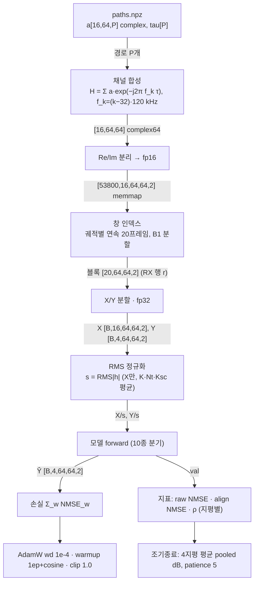

### 1.5 공용 헤드 `ChannelPredictionHead` (`models/chiron_channel.py`) — LWM·Chiron·DelayTCN·Mamba·Chiron-V2가 공유

P=4개의 학습 질의가 백본 토큰 전체에 cross-attention → 지평별 벡터 → 공유 MLP → 프레임 복원. `delta_skip=True`이면 마지막 입력 프레임을 더한다(잔차 = copy-last + Δ; 최종 Linear zero-init → 학습 전 출력 = copy-last. 프로브에서 DelayTCN·Mamba·Chiron-V2의 미학습 NMSE가 정확히 copy-last 값(−9.6 dB)으로 나옴).

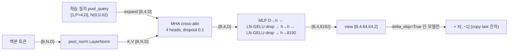

| 사용 모델 | D | h(hidden) | N(토큰 수) | delta_skip | 헤드 파라미터 |
|---|---|---|---|---|---|
| Chiron | 256 | 1024 | 512 | False | 9,978,368 |
| NOVA(별도 `RefinedPredictionHead`, §2.8) | 256 | 1024→512 | 2048 | False | 5,786,112 |
| DelayTCN | 256 | 1024 | 16 | True | 9,978,368 |
| Mamba | 128 | 512 | 16 | True | 4,600,064 |
| LWM | 256 | 512 | 16 | False(`last_frame`는 전달되나 무시) | 4,863,488 |
| Chiron-V2 | 256 | 1024 | 16 | True | 9,978,368 |

**수식(forward)** — [코드 기반]

백본 토큰 $Z\in\mathbb{R}^{N\times D}$(배치 축 생략), 학습 질의 $q\in\mathbb{R}^{P\times D}$($P=H_{pred}=4$, trunc-N(0,0.02) 초기화), 선택 입력 $X_K$(마지막 입력 프레임).

1. 문맥 정규화(키·값 쪽만; 질의에는 LN 없음):
$$C=\operatorname{LN}_{pool}(Z)\in\mathbb{R}^{N\times D}$$
2. 질의 cross-attention(`nn.MultiheadAttention`, 4 heads, $d_h=D/4$, 어텐션 가중치 dropout 0.1) [코드 기반 추정: MHA 내부 q/k/v 투영]:
$$U=\mathrm{MHA}_4(q;\,C)=\big[\mathrm{head}_1;\dots;\mathrm{head}_4\big]W^O+b^O,\qquad \mathrm{head}_i=\mathrm{softmax}\!\Big(\tfrac{(qW_i^Q)(CW_i^K)^{\top}}{\sqrt{d_h}}\Big)\,CW_i^V\in\mathbb{R}^{P\times d_h}$$
(질의 잔차 없음: $U$는 어텐션 출력 그 자체)
3. 지평별 독립·가중치 공유 MLP($D\to h\to h\to 8192$), $p=1..P$:
$$m_p=W_3\,\mathrm{Drop}\big(\mathrm{GELU}(\operatorname{LN}_2(W_2\,\mathrm{Drop}(\mathrm{GELU}(\operatorname{LN}_1(W_1U_p+b_1)))+b_2))\big)+b_3\in\mathbb{R}^{8192}$$
4. 복원과 delta_skip 잔차:
$$\hat Y_p=\operatorname{unvec}(m_p)+\mathbf{1}[\text{delta\_skip}\wedge X_K\text{ 전달}]\cdot X_K$$
5. zero-init(`zero_init_output`, delta_skip 모델만): $W_3=0,\ b_3=0$ → 학습 전 $\hat Y_p=X_K$(copy-last). LWM(§2.5)은 `last_frame`이 전달되지만 delta_skip=False라 항 (4)의 지시함수가 0.

근거: `models/chiron_channel.py::ChannelPredictionHead.forward` L345–360(질의 expand L353, pool_norm L354, pool_attn L355, mlp L356, view L357, 잔차 L358–359), `__init__` L311–332(pool_query·pool_norm·pool_attn·mlp), `zero_init_output` L334–343.

---

## 2. 모델별 상세

공통: 입력 X [B,16,64,64,2] fp32(§1.2 정규화 후), 출력 Ŷ [B,4,64,64,2], 손실·옵티마이저·스케줄·평가 = §1.3~1.4. 아래 8번 항목은 **공통과 다른 점만** 적는다.

각 절 끝의 **수식(forward)** 블록(2026-09-07 추가)은 배치 축을 생략하고 프레임 첨자를 1-based로 쓴다: $X_t\in\mathbb R^{64\times64\times2}$, $t=1..K$($K=16$), $x_t=\operatorname{vec}(X_t)\in\mathbb R^{8192}$, 마지막 입력 프레임 $X_K$ = §1.0의 $\tilde X_b[K_{hist}-1]$, 지평 $p=1..4$, $\operatorname{unvec}$ = $\mathbb R^{8192}\to\mathbb R^{64\times64\times2}$ reshape. $\mathrm{LN}$=LayerNorm, $\mathrm{Drop}$=dropout(0.1, 학습 시만), $\sigma$=sigmoid, $\odot$=원소곱, $*$=합성곱, $\mathrm{MHA}_h(Q;C)$=h-헤드 어텐션(질의 $Q$, 키·값 $C$; $\mathrm{head}_i=\mathrm{softmax}((QW_i^Q)(CW_i^K)^{\top}/\sqrt{d_h})\,CW_i^V$, 출력 $[\mathrm{head}_1;\dots;\mathrm{head}_h]W^O+b^O$), 자기어텐션 $\mathrm{MHA}_h(U):=\mathrm{MHA}_h(U;U)$. 표시 없음 = 코드로 확인, **[코드 기반 추정]** = nn.Module 밖(reshape/permute/fft) 또는 라이브러리·커널 내부. 생략 규약(2026-09-07 검수 반영): (i) `nn.MultiheadAttention`·`nn.TransformerEncoderLayer`는 q/k/v 투영 bias가 있고(torch 기본 bias=True) 어텐션 확률에도 dropout 0.1이 적용되지만, 수식에서는 $QW_i^Q$ 형태로 bias와 어텐션 dropout을 생략했다(§2.5·§2.11만 $+b_i^Q$ 명시). (ii) 프레임 평탄화·패치 reshape/stack/einsum과 `nn.MultiheadAttention`·`nn.LSTM` 내부는 모든 블록에서 [코드 기반 추정]에 해당하며 블록마다 반복 표기하지 않았다. (iii) $[\mathrm{Re},\mathrm{Im}]$ 병기는 실제로는 최내측 축 인터리브 `(…,2)`이며 뒤따르는 Linear 때문에 수학적으로 동일하다. (iv) conv 식의 bias(`nn.Conv2d` 기본 bias=True)는 생략했고, 1-D 커널 첨자 $\sum_i w_i x_{t-i}$는 PyTorch 상호상관 규약의 역순 재라벨링이다(인과성·수용 영역 결론 불변).

### 2.1 Transformer (제안, C1) — `cp/cp_models.py::TransformerPredictor`

1. **요약/계열**: 프레임 1개(8,192차원)를 토큰 1개로 선형 임베딩한 시간 토큰 16개를 pre-norm Transformer 인코더로 부호화하고, 마지막 토큰에서 지평별 선형 헤드 4개로 4프레임을 한 번에 낸다. **parallel(one-shot, 지평별 직접 다중출력) · sequence-based(프레임=토큰, 공간 토큰화 없음)**. 설계 근거: `EXPERIMENT_PLAN_C1_TRANSFORMER.md` §3.1(P10 CPPN 골격, P03 S=512·6층). 자체 설계, 논문 코드 아님.
2. **입력**: §1.2. X [B,16,64,64,2].
3. **전처리**: 창별 RMS(§1.2) 외 없음. 복소→Re/Im. 패치화 없음(프레임 전체 평탄화 `reshape(B,K,−1)` → [B,16,8192], [코드 기반: reshape]). 마스킹 없음(양방향 attention, `attn_mask` 미사용).
4. **임베딩**: `FrameTokenizer` Linear 8192→512 → [B,16,512]. 학습 위치임베딩 `pos` [1,16,512](N(0,0.02) 초기화) 가산. CLS·특수 토큰 없음. (`--no_pos_emb`로 제거 가능, S1 미사용.)
5. **백본**: `nn.TransformerEncoder` × 6층, `nn.TransformerEncoderLayer(d_model 512, nhead 8, dim_feedforward 2048, dropout 0.1, activation gelu, batch_first, norm_first=True)`. 블록 순서(실측 hook 순서): norm1 → self_attn(8 heads, d_head 64) → dropout1 → 잔차 → norm2 → linear1 512→2048 → GELU → dropout → linear2 2048→512 → dropout2 → 잔차. 시간 처리 = 16 토큰 간 full self-attention; 공간(안테나·부반송파) 처리 = 임베딩 Linear 안에서만(명시적 공간 모듈 없음).
6. **헤드**: 인코더 출력 [B,16,512]의 마지막 토큰 `[:, −1]` → LayerNorm(512) → `MultiHorizonHead`: 지평별 독립 Linear 512→8192 × 4 → stack → [B,4,8192] → view [B,4,64,64,2]. one-shot. `--residual`(s1b run)이면 + X[:, −1:] (copy-last + Δ).
7. **출력/후처리**: [B,4,64,64,2] 정규화 공간. 역정규화 없음(§1.4).
8. **학습**: lr 1e-4(s1) / 3e-4(s1, 진행 중), batch 128, dropout 0.1, 40 epoch. s1b = residual 변형 lr 1e-4.
9. **파라미터**: **39,928,320** = tok 4,194,816 + pos 8,192 + enc 18,914,304(6 × 3,152,384; 층당 self_attn 1,050,624 + linear1 1,050,624 + linear2 1,049,088 + LN 2×1,024) + norm 1,024 + head 16,809,984(4 × 4,202,496).

```mermaid
flowchart LR
  X["X 정규화 입력"] -->|"[B,16,64,64,2]"| F["평탄화 reshape"]
  F -->|"[B,16,8192]"| T["FrameTokenizer<br/>Linear 8192→512"]
  T -->|"[B,16,512]"| P["+ 학습 위치임베딩<br/>pos [1,16,512]"]
  P -->|"[B,16,512]"| E["TransformerEncoder ×6<br/>pre-norm · 8 heads · FFN 2048 GELU · drop 0.1"]
  E -->|"[B,16,512]"| L["마지막 토큰 [:,−1] → LayerNorm"]
  L -->|"[B,512]"| H["MultiHorizonHead<br/>Linear 512→8192 ×4 (지평별)"]
  H -->|"stack [B,4,8192] → view"| O["Ŷ [B,4,64,64,2]<br/>(s1b residual: + X[:,−1])"]
```

백본 블록 내부(`nn.TransformerEncoderLayer`, norm_first=True; hook 순서 그대로):

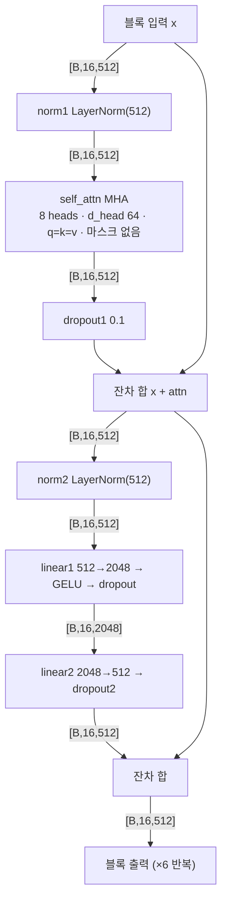

| 단계 | 연산 | 입력 shape | 출력 shape | 주요 하이퍼파라미터 |
|---|---|---|---|---|
| 1 | reshape(평탄화) [코드 기반] | [B,16,64,64,2] | [B,16,8192] | — |
| 2 | tok.proj Linear | [B,16,8192] | [B,16,512] | D=512, bias |
| 3 | + pos (학습) | [B,16,512] | [B,16,512] | [1,16,512] |
| 4 | enc.layers.0~5 (pre-norm) | [B,16,512] | [B,16,512] | 8 heads, FFN 2048, GELU, dropout 0.1 |
| 4a | norm1 → self_attn | [B,16,512] ×3(q,k,v) | [B,16,512] (attn 가중치 미반환) | — |
| 4b | norm2 → linear1 | [B,16,512] | [B,16,2048] | GELU |
| 4c | linear2 | [B,16,2048] | [B,16,512] | — |
| 5 | 마지막 토큰 → norm LayerNorm | [B,512] | [B,512] | — |
| 6 | head.heads.0~3 Linear | [B,512] | [B,8192] ×4 | 지평별 독립 가중치 |
| 7 | stack → view | [B,4,8192] | [B,4,64,64,2] | residual 옵션 시 + X[:,−1:] |

```yaml
model: transformer_c1
file: cp/cp_models.py::TransformerPredictor
family: {prediction: parallel_one_shot, tokenization: sequence_frame_token, attention: bidirectional_full}
params_total: 39928320
config: {D: 512, L: 6, heads: 8, ffn: 2048, dropout: 0.1, pos_emb: learned, residual: false}
stages:
  - {name: flatten, type: reshape, in_shape: "[B,16,64,64,2]", out_shape: "[B,16,8192]", params: 0}
  - {name: tok.proj, type: linear, in_shape: "[B,16,8192]", out_shape: "[B,16,512]", params: 4194816}
  - {name: pos_add, type: learned_pos_emb, in_shape: "[B,16,512]", out_shape: "[B,16,512]", params: 8192}
  - {name: enc, type: transformer_encoder_prenorm, in_shape: "[B,16,512]", out_shape: "[B,16,512]", params: 18914304, repeat: 6, sub: [norm1, self_attn_8h, dropout, add, norm2, linear1_2048, gelu, dropout, linear2, dropout, add]}
  - {name: last_token_norm, type: index_layernorm, in_shape: "[B,16,512]", out_shape: "[B,512]", params: 1024}
  - {name: head, type: per_horizon_linear_x4, in_shape: "[B,512]", out_shape: "[B,4,8192]", params: 16809984}
  - {name: unflatten, type: reshape, in_shape: "[B,4,8192]", out_shape: "[B,4,64,64,2]", params: 0}
```

**수식(forward)** — [코드 기반]

배치 축 생략, $x_t=\operatorname{vec}(X_t)\in\mathbb{R}^{8192}$, $t=1..K$($K=16$), $D=512$.

1. 프레임 토큰화 + 학습 위치임베딩($p_t$, $p\in\mathbb{R}^{K\times D}$, N(0,0.02) 초기화) [평탄화 reshape: 코드 기반 추정]:
$$u^{(0)}_t=W_e\,x_t+b_e+p_t,\qquad W_e\in\mathbb{R}^{D\times 8192}$$
2. pre-norm 인코더 층 $\ell=1..6$(`nn.TransformerEncoderLayer`, norm_first=True; 마스크 없음, 8 heads, $d_h=64$) [코드 기반 추정: torch 라이브러리 내부]:
$$u'=u^{(\ell-1)}+\mathrm{Drop}_1\!\big(\mathrm{MHA}_8(\operatorname{LN}_1(u^{(\ell-1)}))\big)$$
$$u^{(\ell)}=u'+\mathrm{Drop}_2\!\big(W_2\,\mathrm{Drop}(\mathrm{GELU}(W_1\operatorname{LN}_2(u')+b_1))+b_2\big),\qquad W_1\in\mathbb{R}^{2048\times 512}$$
$$\mathrm{MHA}_8(\tilde U)=[\mathrm{head}_1;\dots;\mathrm{head}_8]W^O+b^O,\quad \mathrm{head}_i=\mathrm{softmax}\!\Big(\tfrac{(\tilde UW_i^Q)(\tilde UW_i^K)^{\top}}{\sqrt{64}}\Big)\tilde UW_i^V$$
3. 마지막 토큰 선택 + LayerNorm(인코더 자체에는 final norm 없음):
$$z=\operatorname{LN}\!\big(u^{(6)}_K\big)\in\mathbb{R}^{512}$$
4. 지평별 독립 선형 헤드(`MultiHorizonHead`), $p=1..4$:
$$\hat Y_p=\operatorname{unvec}(W_p\,z+b_p),\qquad W_p\in\mathbb{R}^{8192\times 512}$$
5. `--residual`(s1b run만): $\hat Y_p\leftarrow \hat Y_p+X_K$. S1 기본은 잔차 없음.

근거: `cp/cp_models.py::TransformerPredictor.forward` L31–34(임베딩+pos L32, enc→[:,−1]→norm→head L33, residual L34), `__init__` L26–30(레이어 정의 L28, pos 초기화 L30), `FrameTokenizer.forward` L14–15, `MultiHorizonHead.forward` L21–22.

### 2.2 LSTM — `cp/cp_models.py::LSTMPredictor`

1. **요약/계열**: Transformer와 동일한 프레임 토크나이저·헤드를 쓰되 백본만 2층 LSTM. **parallel(one-shot 헤드) · sequence-based(재귀, 프레임=스텝)**. 설계 근거: P03 RCDNet 2층 LSTM S=512, P11 LSTM 기준선(`EXPERIMENT_PLAN_C1_TRANSFORMER.md` §3.2).
2. **입력**: §1.2.
3. **전처리**: 평탄화 [B,16,8192] 외 없음. 마스킹 없음.
4. **임베딩**: Linear 8192→512. **위치임베딩 없음**(재귀가 순서를 부여).
5. **백본**: `nn.LSTM(512, 512, num_layers=2, batch_first, dropout=0.1)`(층 사이 dropout). 출력 (out [B,16,512], (h_n [2,B,512], c_n [2,B,512])) [실측]. 게이트 식 i,f,g,o = σ/tanh(W_x x + W_h h + b), c' = f⊙c + i⊙g, h' = o⊙tanh(c') [코드 기반: nn.LSTM 내부]. 시간 = 단방향 재귀(과거→현재), 공간 = 임베딩 Linear 안에서만.
6. **헤드**: out[:, −1] [B,512] → (LayerNorm 없음) → 지평별 Linear 512→8192 × 4 → [B,4,64,64,2]. residual 옵션 동일.
7. **출력/후처리**: 공통.
8. **학습**: lr 3e-4(완료) / 1e-3(큐), batch 128. s1b residual lr 3e-4.
9. **파라미터**: **25,207,296** = tok 4,194,816 + lstm 4,202,496(2 × 2,101,248) + head 16,809,984. (계획의 "40 M ±10 % 정합"은 미적용 — 실제 25.2 M.)

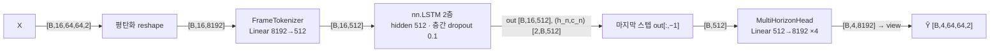

| 단계 | 연산 | 입력 shape | 출력 shape | 주요 하이퍼파라미터 |
|---|---|---|---|---|
| 1 | reshape [코드 기반] | [B,16,64,64,2] | [B,16,8192] | — |
| 2 | tok.proj Linear | [B,16,8192] | [B,16,512] | D 512 |
| 3 | nn.LSTM | [B,16,512] | out [B,16,512]; h_n,c_n [2,B,512] | 2층, hidden 512, dropout 0.1 |
| 4 | 마지막 스텝 선택 [코드 기반] | [B,16,512] | [B,512] | — |
| 5 | head Linear ×4 | [B,512] | [B,8192] ×4 | 지평별 |
| 6 | stack → view | [B,4,8192] | [B,4,64,64,2] | — |

```yaml
model: lstm
file: cp/cp_models.py::LSTMPredictor
family: {prediction: parallel_one_shot, tokenization: sequence_frame_token, recurrence: unidirectional}
params_total: 25207296
config: {D: 512, layers: 2, dropout: 0.1, pos_emb: none, residual: false}
stages:
  - {name: flatten, type: reshape, in_shape: "[B,16,64,64,2]", out_shape: "[B,16,8192]", params: 0}
  - {name: tok.proj, type: linear, in_shape: "[B,16,8192]", out_shape: "[B,16,512]", params: 4194816}
  - {name: lstm, type: lstm_2layer, in_shape: "[B,16,512]", out_shape: "[B,16,512]", params: 4202496}
  - {name: last_step, type: index, in_shape: "[B,16,512]", out_shape: "[B,512]", params: 0}
  - {name: head, type: per_horizon_linear_x4, in_shape: "[B,512]", out_shape: "[B,4,8192]", params: 16809984}
  - {name: unflatten, type: reshape, in_shape: "[B,4,8192]", out_shape: "[B,4,64,64,2]", params: 0}
```

**수식(forward)** — [코드 기반]

배치 축 생략, $x_t=\operatorname{vec}(X_t)$, $D=512$.

1. 프레임 토큰화(위치임베딩 없음):
$$u_t=W_e\,x_t+b_e\in\mathbb{R}^{512}$$
2. 2층 `nn.LSTM`(층 $l=1,2$, $t=1..16$, $h^{(l)}_0=c^{(l)}_0=0$; 층 입력 $v^{(1)}_t=u_t$, $v^{(2)}_t=\mathrm{Drop}(h^{(1)}_t)$ — 층 사이 dropout은 학습 시만) [코드 기반 추정: nn.LSTM 내부]:
$$i_t=\sigma(W_{ii}v_t+W_{hi}h_{t-1}+b_i),\quad f_t=\sigma(W_{if}v_t+W_{hf}h_{t-1}+b_f),\quad g_t=\tanh(W_{ig}v_t+W_{hg}h_{t-1}+b_g),\quad o_t=\sigma(W_{io}v_t+W_{ho}h_{t-1}+b_o)$$
$$c_t=f_t\odot c_{t-1}+i_t\odot g_t,\qquad h_t=o_t\odot\tanh(c_t)$$
3. 마지막 스텝 은닉(LayerNorm 없음):
$$z=h^{(2)}_{16}\in\mathbb{R}^{512}$$
4. 지평별 선형 헤드: $\hat Y_p=\operatorname{unvec}(W_p z+b_p)$, $p=1..4$.
5. `--residual`(s1b): $\hat Y_p\leftarrow\hat Y_p+X_K$.

근거: `cp/cp_models.py::LSTMPredictor.forward` L41–43(lstm→out[:,−1]→head L42, residual L43), `__init__` L38–40(nn.LSTM 정의 L39), `FrameTokenizer.forward` L14–15, `MultiHorizonHead.forward` L21–22.

### 2.3 ConvLSTM-AE — `cp/cp_models.py::ConvLSTMAE`

1. **요약/계열**: 프레임을 2채널(Re/Im) 64×64 영상으로 보고 Conv2D 공간 인코더 → 2층 ConvLSTM 인코더 → 인코더 상태로 초기화한 2층 ConvLSTM 디코더가 4스텝 **자기회귀**로 프레임을 생성 → TransConv 공간 디코더. **autoregressive(step-by-step, 학습 시 teacher forcing) · sequence-based(영상 프레임)**. 설계 근거: P04 ConvLSTM Autoencoder(IEEE IoT-J, DOI 10.1109/JIOT.2025.3639084, Sec. IV-B·V-B: 2층·128ch·3×3). 논문 코드 아닌 자체 구현(arXiv ID는 노트에 미기재).
2. **입력**: §1.2.
3. **전처리**: 프레임별 permute [B,64,64,2] → [B,2,64,64] [코드 기반]. 패치화·마스킹 없음.
4. **임베딩(공간 인코더 `enc_sp`, 모든 프레임 공유)**: Conv2d(2→32, 3×3, pad 1) → BN → ReLU → Conv2d(32→32, 3×3, **stride 2**, pad 1) → BN → ReLU → [B,32,32,32]. 위치임베딩 없음. 프로브에서 21회 호출(인코더 16 + 디코더 초기 입력 1 + 되먹임 4).
5. **백본**: `enc_t` = ConvLSTMCell × 2(hidden 128, kernel 3, 상태 [B,128,32,32] 영초기화). 셀: conv(cat[x,h]) → 4×128 채널 → chunk(i,f,o,g) → σ,σ,σ,tanh → c' = f⊙c + i⊙g, h' = o⊙tanh(c'). 셀0 입력 32+128=160ch → 512ch, 셀1 128+128=256ch → 512ch [실측 conv 입력]. 시간 = 재귀(16스텝), 공간 = 3×3 conv(32×32 격자).
6. **디코더/헤드**: `dec_t` 별도 가중치 2셀, 상태는 인코더 최종 (h,c) 복사. 스텝 h=1..4: 입력 = enc_sp(직전 프레임) → 셀0 → 셀1 → `dec_sp`: ConvTranspose2d(128→32, 4×4, stride 2, pad 1) → BN → ReLU → Conv2d(32→2, 3×3) → [B,2,64,64] → permute [B,64,64,2]. 다음 스텝 입력: **학습(`model.train()` & Y 전달) = 정답 Y[:,h]**(teacher forcing), **평가 = ŷ_h.detach()**. 첫 스텝 입력 = X[:,−1]. 결과 stack → [B,4,64,64,2]. 잔차(copy-last) 없음.
7. **출력/후처리**: 공통. BN은 평가 시 running stats 사용.
8. **학습**: lr 3e-4(진행) / 1e-3(큐), batch 64(32는 중단), **최대 20 epoch**(epoch당 ~80분), `train_cp.py`가 이 모델에만 `model(X, Y)`로 Y를 넘김.
9. **파라미터**: **3,912,098** = enc_sp 9,984 + enc_t 1,917,952(셀0 737,792 + 셀1 1,180,160) + dec_t 1,917,952 + dec_sp 66,210. (계획의 40 M 정합판은 미실행.)

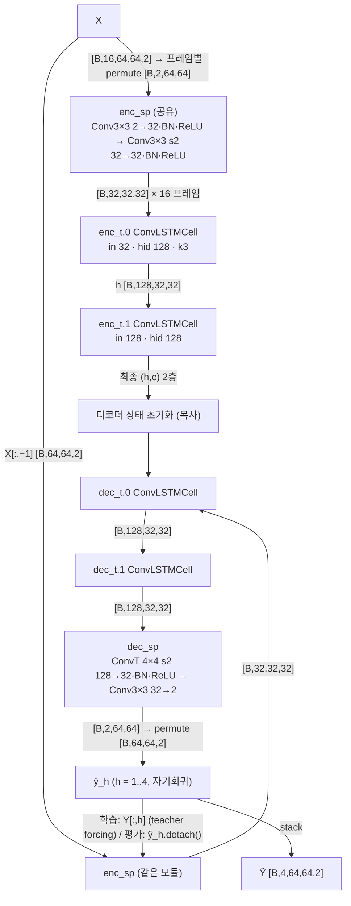

ConvLSTM 셀 내부(`ConvLSTMCell`):


| 단계 | 연산 | 입력 shape | 출력 shape | 주요 하이퍼파라미터 |
|---|---|---|---|---|
| 1 | permute [코드 기반] | [B,64,64,2] | [B,2,64,64] | 프레임별 |
| 2 | enc_sp.0 Conv2d | [B,2,64,64] | [B,32,64,64] | 3×3, pad 1 |
| 3 | enc_sp.3 Conv2d | [B,32,64,64] | [B,32,32,32] | 3×3, stride 2 |
| 4 | enc_t.0 cell(conv) | cat [B,160,32,32] | gates [B,512,32,32] → h,c [B,128,32,32] | k3, hid 128 |
| 5 | enc_t.1 cell(conv) | cat [B,256,32,32] | [B,512,32,32] → h,c [B,128,32,32] | ×16 스텝 |
| 6 | dec_t.0/1 cell | 위와 동일 shape | h [B,128,32,32] | ×4 스텝, 상태 = 인코더 최종 |
| 7 | dec_sp.0 ConvTranspose2d | [B,128,32,32] | [B,32,64,64] | 4×4, stride 2 |
| 8 | dec_sp.3 Conv2d | [B,32,64,64] | [B,2,64,64] | 3×3 |
| 9 | permute → stack | [B,2,64,64] ×4 | [B,4,64,64,2] | — |

```yaml
model: convlstm_ae
file: cp/cp_models.py::ConvLSTMAE
family: {prediction: autoregressive_4step_teacher_forcing, tokenization: image_frame_2ch}
params_total: 3912098
config: {c_enc: 32, c_hid: 128, layers: 2, kernel: 3, teacher_forcing: true}
stages:
  - {name: permute, type: reshape, in_shape: "[B,64,64,2]", out_shape: "[B,2,64,64]", params: 0}
  - {name: enc_sp, type: conv2d_bn_relu_x2_stride2, in_shape: "[B,2,64,64]", out_shape: "[B,32,32,32]", params: 9984}
  - {name: enc_t, type: convlstm_2layer, in_shape: "[B,32,32,32] x16", out_shape: "h,c [B,128,32,32] x2", params: 1917952}
  - {name: dec_t, type: convlstm_2layer_autoregressive, in_shape: "[B,32,32,32] x4", out_shape: "[B,128,32,32] x4", params: 1917952}
  - {name: dec_sp, type: convtranspose_bn_relu_conv, in_shape: "[B,128,32,32]", out_shape: "[B,2,64,64]", params: 66210}
  - {name: stack, type: reshape, in_shape: "[B,2,64,64] x4", out_shape: "[B,4,64,64,2]", params: 0}
```

**수식(forward)** — [코드 기반]

배치 축 생략. 프레임 영상 $I_t=\mathrm{permute}(X_t)\in\mathbb{R}^{2\times 64\times 64}$ [코드 기반 추정: permute]. $*$ = 2D 합성곱.

1. 공간 인코더(모든 프레임·디코더 입력이 공유):
$$E(I)=\mathrm{ReLU}\big(\mathrm{BN}(W^{s2}_{3\times3}*\mathrm{ReLU}(\mathrm{BN}(W_{3\times3}*I)))\big)\in\mathbb{R}^{32\times 32\times 32}\quad(\text{2번째 conv stride 2})$$
2. ConvLSTM 셀(층 $l$, 입력 $a_t$, 상태 $h_{t-1},c_{t-1}\in\mathbb{R}^{128\times 32\times 32}$; 하나의 3×3 conv가 4·128 채널을 내고 chunk 순서 $i,f,o,g$):
$$[\,i_t;\,f_t;\,o_t;\,g_t\,]=W_l*[\,a_t;\,h_{t-1}\,]+b_l,\qquad i_t,f_t,o_t\leftarrow\sigma(\cdot),\ g_t\leftarrow\tanh(\cdot)$$
$$c_t=f_t\odot c_{t-1}+i_t\odot g_t,\qquad h_t=o_t\odot\tanh(c_t)$$
3. 인코더(16 스텝, $h^{(l)}_0=c^{(l)}_0=0$):
$$a^{(1)}_t=E(I_t),\quad (h^{(l)}_t,c^{(l)}_t)=\mathrm{Cell}^{enc}_l(a^{(l)}_t,\,h^{(l)}_{t-1},c^{(l)}_{t-1}),\quad a^{(2)}_t=h^{(1)}_t,\qquad t=1..16$$
4. 디코더 초기화·자기회귀(별도 가중치 $\mathrm{Cell}^{dec}_l$, 상태는 인코더 최종 상태로 시작, 첫 입력 = 마지막 입력 프레임):
$$(\tilde h^{(l)}_0,\tilde c^{(l)}_0)=(h^{(l)}_{16},c^{(l)}_{16}),\qquad I^{in}_1=I_{16}$$
$$\tilde a^{(1)}_p=E(I^{in}_p),\quad(\tilde h^{(l)}_p,\tilde c^{(l)}_p)=\mathrm{Cell}^{dec}_l(\tilde a^{(l)}_p,\tilde h^{(l)}_{p-1},\tilde c^{(l)}_{p-1}),\quad \tilde a^{(2)}_p=\tilde h^{(1)}_p,\qquad p=1..4$$
5. 공간 디코더:
$$\hat Y_p=\mathrm{permute}\Big(W_{3\times3}*\mathrm{ReLU}\big(\mathrm{BN}(W^{\top,s2}_{4\times4}\star\tilde h^{(2)}_p)\big)\Big)\in\mathbb{R}^{64\times 64\times 2}\quad(\star=\text{ConvTranspose2d, stride 2})$$
6. 다음 스텝 입력(학습/추론 분기; $\mathrm{sg}$ = detach):
$$I^{in}_{p+1}=\begin{cases}Y_p & \text{학습(model.train() \& Y 전달): teacher forcing}\\ \mathrm{sg}(\hat Y_p) & \text{평가: 자기 출력 되먹임}\end{cases}\qquad p=1..3$$
7. $\hat Y=\mathrm{stack}(\hat Y_1,\dots,\hat Y_4)$. copy-last 잔차 없음. (학습 시 디코더 입력열 = $X_{16},Y_1,Y_2,Y_3$; $Y_4$는 입력으로 쓰이지 않음.)

근거: `cp/cp_models.py::ConvLSTMCell.forward` L49–52(chunk 순서 i,f,o,g L50, 게이트 L51–52), `ConvLSTMAE.forward` L67–81(인코더 루프 L70–72, 디코더 상태 복사·첫 입력 L73, 디코더 루프 L74–80, teacher forcing 분기 L79), `_sp` L65–66, `enc_sp` L61, `dec_sp` L64; `cp/train_cp.py` L95(학습 `model(X, Y)`), L75(평가 `model(X)`).

### 2.4 AR/선형 (K_h차 최소제곱) — `cp/baselines_g0.py`

1. **요약/계열**: ĥ_{t+w} = Σ_{m<K_h} c_{w,m}·h_{t−m}. 계수 c는 **실수 스칼라**로 안테나·부반송파 8,192원소 전체가 공유하며 학습 분할에서 정규방정식(최소제곱, ridge 1e-6)으로 한 번에 풀린다. **parallel(지평별 독립 계수) · sequence-based(최근 K_h 프레임)**. 학습(SGD) 없음, 내부 진단용(발표·게이트 미사용, 사용자 규칙). 설계 근거: STEP2 §2.3(b) K1 정의, P08 AR 계열·P10 Kalman 기준선.
2. **입력**: §1.2와 동일 로더·정규화(CPU).
3. **전처리**: X를 복소 [B,16,64,64]로 바꿔 최신 K_h 프레임을 stack [B,K_h,64,64] → 원소 평탄화 [B,K_h,4096](계수 추정 시). 예측 시에는 Re/Im 텐서에 einsum `hk,bk...->bh...`(계수가 실수라 복소 연산과 동일).
4. **임베딩**: 없음.
5. **백본**: 없음(선형 결합). 계수 추정: G_w = Σ P^H P [K_h,K_h], r_w = Σ P^H y [K_h], c_w = (G_w + 1e-6 I)^{-1} r_w, 학습 표본 64,000개(689,936 중 무작위, seed 0).
6. **헤드**: 없음.
7. **출력**: [B,4,64,64,2]. 역정규화 없음.
8. **학습 세팅**: 없음. copy-last(c=[1]), zero도 같은 스크립트로 평가.
9. **파라미터**: H × K_h = **4 / 8 / 16**(K_h = 1/2/4). 실제 계수(`g0_baselines_B1.json`): K_1: [0.832, 0.685, 0.601, 0.550]; K_2: w1 [0.853, −0.025], w2 [0.604, 0.098], w3 [0.468, 0.162], w4 [0.404, 0.177]; K_4: w1 [0.846, −0.115, 0.054, 0.078] … w4 [0.386, 0.048, 0.023, 0.189].

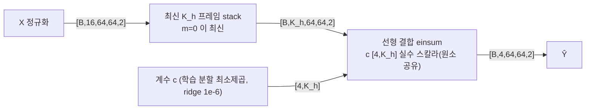

| 단계 | 연산 | 입력 shape | 출력 shape | 주요 하이퍼파라미터 |
|---|---|---|---|---|
| 1 | 최신 K_h 프레임 stack | [B,16,64,64,2] | [B,K_h,64,64,2] | K_h ∈ {1,2,4} |
| 2 | einsum(hk, bk… → bh…) | [B,K_h,64,64,2], c [4,K_h] | [B,4,64,64,2] | 계수 실수, 지평별 |
| (추정) | 정규방정식 G,r 누적 → solve | P [B,K_h,4096] complex | c [4,K_h] | 64,000 표본, ridge 1e-6 |

```yaml
model: linear_ar
file: cp/baselines_g0.py
family: {prediction: parallel_per_horizon, tokenization: none_raw_frames, learning: least_squares_closed_form}
params_total: {K1: 4, K2: 8, K4: 16}
stages:
  - {name: stack_recent, type: index_stack, in_shape: "[B,16,64,64,2]", out_shape: "[B,Kh,64,64,2]", params: 0}
  - {name: linear_combine, type: einsum_scalar_coef, in_shape: "[B,Kh,64,64,2]", out_shape: "[B,4,64,64,2]", params: "4*Kh"}
```

**수식(forward)** — [코드 기반]

1. 예측식(실수 스칼라 계수 $c\in\mathbb{R}^{4\times K_h}$가 안테나·부반송파·Re/Im 전 원소에 공유; $m=0$이 최신 프레임 $X_K$):
$$\hat Y_p=\sum_{m=0}^{K_h-1}c_{p,m}\,X_{K-m},\qquad p=1..4,\ K_h\in\{1,2,4\}$$
2. 계수 $c_{p,\cdot}$는 학습 분할에서 지평별 정규방정식(ridge $10^{-6}$)으로 한 번에 구한다 — 유도·값은 §1.0 참조. copy-last는 $c=[1]$ 특수형.

근거: `cp/baselines_g0.py::lin` L41–43(최신 $K_h$ 프레임 stack L42, `einsum("hk,bk...->bh...")` L43), 계수 추정 L21–25(정규방정식 누적 L24, `solve` L25).

### 2.5 LWM — `models/lwm_multimodal.py::LWMMultiModalPredictor(mode="channel_only")`

1. **요약/계열**: 프레임 전체(8,192)를 d=128 토큰 1개로 임베딩한 시간 토큰 16개를 **post-norm** Transformer 인코더 12층(LWM 원 구현 `lwm_model.py`의 층 구조: 잔차 → LayerNorm, ReLU FFN, `nn.Embedding` 위치)으로 부호화 → 128→256 어댑터 → 공용 헤드(P 질의). **parallel(P 질의 one-shot) · token-based(프레임 1토큰 "wideband time token")**. 참고 논문: LWM 원 논문 arXiv:2411.08872 "Large Wireless Model (LWM): A Foundation Model for Wireless Channels"(Alikhani·Charan·Alkhateeb, v1 2024-11-13; 2026-09-05 arXiv abs 페이지로 확인, 저장소 코드에는 ID 미기재). **사전학습 가중치 미사용(scratch)**, 토큰 정의(패치 대신 프레임 전체)·헤드는 저장소 자체 변형.
2. **입력**: §1.2.
3. **전처리**: 평탄화 [B,16,8192]. 마스킹 없음.
4. **임베딩(`_Embedding`)**: Linear 8192→128 + `nn.Embedding(64,128)`(위치 0..15 조회) → 자체 `_LayerNorm`(std 기반, eps 1e-6) → [B,16,128]. CLS 없음.
5. **백본**: `_EncoderLayer` × 12, d_model 128, 8 heads(d_k 16), d_ff 512, dropout 0.1. 층 순서(실측): attn(wq,wk,wv → SDPA → out Linear → dropout → **+ 입력 잔차**) → `_LayerNorm` → FFN(fc1 128→512 → ReLU → drop → fc2 512→128 → drop → **+ 잔차 → _LayerNorm**). 즉 post-norm. 시간 = 16 토큰 full attention(마스크 없음), 공간 = 임베딩 Linear 안.
6. **헤드**: `proj_adapter` Linear 128→256 + LayerNorm → [B,16,256] → `ChannelPredictionHead`(§1.5; D 256, hidden 512, 4 heads, delta_skip **False**; `last_frame`은 전달되지만 무시됨) → [B,4,64,64,2].
7. **출력/후처리**: 공통.
8. **학습**: lr 3e-4, batch 64, 12층 D128(`--D 128 --L 12`), delta_t=0.01은 센서 정렬용이라 channel_only에서 미사용.
9. **파라미터**: **8,333,440** = embedding 1,057,152(proj 1,048,704 + pos 8,192 + norm 256) + layers 2,379,264(12 × 198,272; 층당 attn 66,048 + norm 256 + ffn 131,968) + proj_adapter 33,536 + head 4,863,488.

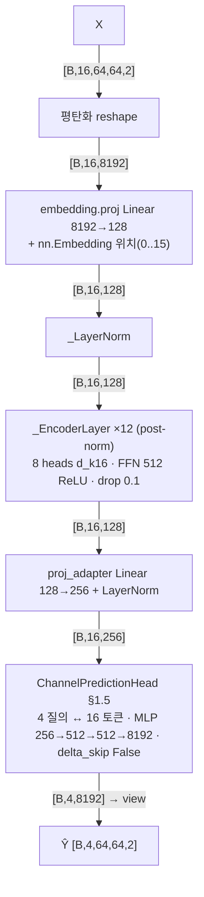

인코더 층 내부(`_EncoderLayer`, post-norm):

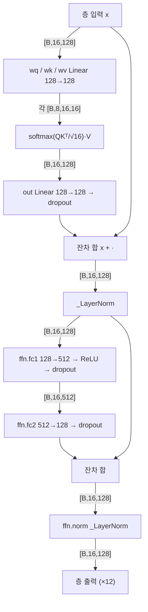

| 단계 | 연산 | 입력 shape | 출력 shape | 주요 하이퍼파라미터 |
|---|---|---|---|---|
| 1 | reshape [코드 기반] | [B,16,64,64,2] | [B,16,8192] | — |
| 2 | embedding.proj Linear | [B,16,8192] | [B,16,128] | d_model 128 |
| 3 | embedding.pos_embed Embedding | 위치 [B,16] | [B,16,128] | max_len 64 |
| 4 | embedding.norm _LayerNorm | [B,16,128] | [B,16,128] | eps 1e-6 |
| 5 | layers.0~11 attn (wq/wk/wv/out) | [B,16,128] | [B,16,128] | 8 heads, d_k 16, post-norm |
| 6 | layers.i ffn fc1 / fc2 | [B,16,128] / [B,16,512] | [B,16,512] / [B,16,128] | ReLU, dropout 0.1 |
| 7 | proj_adapter | [B,16,128] | [B,16,256] | Linear + LN |
| 8 | head.pool_attn (4 질의) | q [B,4,256], kv [B,16,256] | [B,4,256] | 4 heads |
| 9 | head.mlp | [B,4,256] | [B,4,8192] | 256→512→512→8192 |
| 10 | view | [B,4,8192] | [B,4,64,64,2] | delta_skip False |

```yaml
model: lwm_channel_only
file: multimodal_code_index/models/lwm_multimodal.py::LWMMultiModalPredictor
family: {prediction: parallel_query_head, tokenization: wideband_frame_token, norm: post_norm, pretrained: false}
params_total: 8333440
config: {d_model: 128, n_layers: 12, n_heads: 8, d_ff: 512, dropout: 0.1, embed_dim_adapter: 256, delta_skip: false}
stages:
  - {name: flatten, type: reshape, in_shape: "[B,16,64,64,2]", out_shape: "[B,16,8192]", params: 0}
  - {name: embedding, type: linear_plus_learned_pos_layernorm, in_shape: "[B,16,8192]", out_shape: "[B,16,128]", params: 1057152}
  - {name: layers, type: transformer_encoder_postnorm, in_shape: "[B,16,128]", out_shape: "[B,16,128]", params: 2379264, repeat: 12, sub: [qkv_8h, sdpa, out, dropout, add, layernorm, fc1_512, relu, dropout, fc2, dropout, add, layernorm]}
  - {name: proj_adapter, type: linear_layernorm, in_shape: "[B,16,128]", out_shape: "[B,16,256]", params: 33536}
  - {name: head, type: query_cross_attn_mlp, in_shape: "[B,16,256]", out_shape: "[B,4,64,64,2]", params: 4863488}
```

**수식(forward)** — [코드 기반]

배치 축 생략, $x_t=\operatorname{vec}(X_t)$, $d=128$, 층 12, 8 heads($d_k=16$). $\operatorname{LN}_s$ = 저장소 `_LayerNorm`(std 기반, $\operatorname{LN}_s(v)=a\odot\frac{v-\bar v}{\mathrm{std}(v)+10^{-6}}+b$, std는 torch 기본 불편추정).

1. 임베딩(위치는 `nn.Embedding` 행 조회 $E_{pos}[t-1]$):
$$u^{(0)}_t=\operatorname{LN}_s\!\big(W_e x_t+b_e+E_{pos}[t-1]\big)\in\mathbb{R}^{128}$$
2. post-norm 층 $\ell=1..12$ — 어텐션 가지(잔차는 `_MultiHeadAttention.forward` 안에서 한 번):
$$a=u+\mathrm{Drop}\!\big(W^O[\mathrm{head}_1;\dots;\mathrm{head}_8]+b^O\big),\qquad \mathrm{head}_i=\mathrm{softmax}\!\Big(\tfrac{(uW_i^Q+b_i^Q)(uW_i^K+b_i^K)^{\top}}{\sqrt{16}}\Big)(uW_i^V+b_i^V),\quad u:=u^{(\ell-1)}$$
$$u'=\operatorname{LN}_s^{(\ell,1)}(a)$$
3. FFN 가지(ReLU, dropout 2회) 후 post-norm:
$$u^{(\ell)}=\operatorname{LN}_s^{(\ell,2)}\!\Big(u'+\mathrm{Drop}\big(W_2\,\mathrm{Drop}(\mathrm{ReLU}(W_1u'+b_1))+b_2\big)\Big),\qquad W_1\in\mathbb{R}^{512\times128}$$
4. 어댑터($128\to256$):
$$z_t=\operatorname{LN}\!\big(W_a u^{(12)}_t+b_a\big)\in\mathbb{R}^{256}$$
5. 공용 헤드 §1.5($Z=[z_1;\dots;z_{16}]$, $N=16$, hidden 512, delta_skip=False — `last_frame=X_K`는 전달되나 무시):
$$\hat Y_p=\operatorname{unvec}\big(\mathrm{MLP}(\mathrm{MHA}_4(q;\operatorname{LN}_{pool}(Z))_p)\big),\qquad p=1..4$$
사전학습 가중치 없음(전 파라미터 scratch 학습).

근거: `models/lwm_multimodal.py::_Embedding.forward` L81–83, `_LayerNorm.forward` L70–71, `_MultiHeadAttention.forward` L98–106(softmax(QKᵀ/√d_k)V L103–105, 잔차 L106), `_FFN.forward` L117–118, `_EncoderLayer.forward` L128–129(`ffn(norm(attn(x,x,x)))`), `LWMMultiModalPredictor._encode_channel` L261–272, `forward` L403–410(adapter L406, channel_only 헤드 L409–410), `proj_adapter` L196–199, head 정의 L248–259; `models/chiron_channel.py::ChannelPredictionHead.forward` L345–360.

### 2.6 LWM-Temporal — `models/lwm_temporal_multimodal.py::LWMTemporalMultiModalPredictor(mode="channel_only")` + `models/lwm_temporal.py`

1. **요약/계열**: 이력 16프레임 + **빈(0) 미래 4프레임**을 이어 20프레임 복소 시퀀스를 만들고, 프레임마다 8×32 패치 16개로 토큰화(총 320 토큰) + CLS 1개, 미래 64토큰을 마스크한 뒤 **희소 시공간 attention**(같은 프레임 전체 + 시간 오프셋 −4..+3 이웃 + CLS, top-k 라우팅) 6층으로 마스크 토큰을 복원한다. **parallel(마스크 복원 one-shot, 4프레임 동시) · token-based(2D 패치 × 시간 토큰 320)**. 참고 논문: LWM-Temporal arXiv:2603.10024(P12 노트; Table I는 D 32·12층). 우리 구성(D 128·6층·패치 8×32)은 논문과 다르며 **사전학습 가중치 미확보(scratch)**. 코드는 저장소 재구현(`lwm_temporal.py`).
2. **입력**: §1.2.
3. **전처리(모델 내부)**: X → `torch.complex(Re, Im)` [B,16,64,64] → 0 프레임 4개 concat → seq [B,20,64,64] complex [실측: tokenizer 입력]. 마스크 [B,320] bool, **마지막 64토큰(=4프레임×16) True**. 토크나이저 `ComplexPatchTokenizer(phase_mode="real_imag")`: Re/Im 분리 → view [B,20,8,8,2,32,2] → permute → **[B,320,512]**(patch_dim = 8·32·2) [실측]. 마스크 토큰은 위치임베딩 가산 **뒤에** `masked_fill(0)`되므로 입력 시점의 미래 토큰은 위치 정보까지 0 벡터다(코드 관찰).
4. **임베딩**: patch_embed Linear 512→128 → [B,320,128]; CLS 토큰 [1,1,128] 끝에 append → [B,321,128]; 학습 위치임베딩 `pos_embed` [1,321,128](max_seq_len 320 + CLS). posenc="learned"(RoPE 미사용).
5. **백본**: `LWMEncoderLayer` × 6(pre-norm): x + attn(norm1 x); x + mlp(norm2 x), mlp 128→512 GELU→128. `SparseSpatioTemporalAttention`: qkv Linear 128→384(bias 없음) → q,k,v [B,8,321,16]; `NeighborIndexer`가 이웃표 **[321,320]**(−1 패딩) 생성: 같은 프레임 16토큰 전부(same_frame_window=−1) + 시간 오프셋 {−4,−3,−2,−1,+1,+2,+3} 프레임의 공간 창(±min(2,|dt|), 격자 밖 클램프) + CLS; 유효 이웃 수 최소 33 / 평균 64.8 / 최대 320(CLS는 전 토큰) [실측]. k,v를 이웃표로 gather → [B,8,321,320,16] [코드 기반: einsum 내부] → 점수 [B,8,321,320], 무효(−1) −inf, **top-k 라우팅 keep = min(48, max(8, 0.3×320)) = 48/헤드** → softmax → 문맥 → proj 128→128. 시간·공간이 하나의 희소 attention 안에서 동시에 처리된다(분해 없음). 인코더 끝 LayerNorm.
6. **헤드**: `head` Linear 128→512(patch_dim)를 CLS 제외 320토큰에 적용 → [B,320,512] → 마지막 64토큰 → view [B,4,8,2,8,32,2] → permute → **[B,4,64,64,2]**. 잔차 없음.
7. **출력/후처리**: 공통. 손실은 `train_cp.py`가 미래 4프레임 전체에 NMSE로 계산(마스크 토큰 복원 손실과 동치).
8. **학습**: lr 5e-4, batch 16, **warmup 4 epoch, 최대 10 epoch**(2026-09-05 사용자 지시, epoch당 약 5.7 h), heads 8(래퍼 고정), `--patch_h 8 --patch_w 32`. 기본 패치 4×16(64토큰/프레임, 1,281토큰)은 B=2에서 피크 3.66 GB(프로브)라 B=16에서 OOM으로 실패(`_failed_oom_*`).
9. **파라미터**: **1,360,512** = patch_embed 65,664 + pos_embed 41,088 + cls 128 + encoder 1,187,584(6 × 197,888 + norm 256; 층당 qkv 49,152 + proj 16,512 + mlp 131,712 + LN 512) + head 66,048. (패치 4×16 구성 1,384,704.)

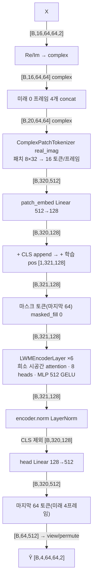

인코더 층 내부(`LWMEncoderLayer` + `SparseSpatioTemporalAttention`):

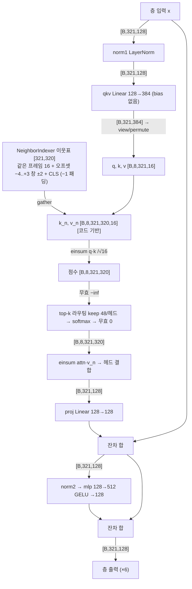

| 단계 | 연산 | 입력 shape | 출력 shape | 주요 하이퍼파라미터 |
|---|---|---|---|---|
| 1 | complex 변환 + 0 프레임 concat [코드 기반] | [B,16,64,64,2] | [B,20,64,64] complex | P=4 빈 프레임 |
| 2 | 마스크 생성 [코드 기반] | — | [B,320] bool | 마지막 64 True |
| 3 | tokenizer(real_imag, 8×32) | [B,20,64,64] complex | [B,320,512] | H=8, W=2, 16 토큰/프레임 |
| 4 | patch_embed Linear | [B,320,512] | [B,320,128] | D 128 |
| 5 | CLS append + pos + masked_fill | [B,320,128] | [B,321,128] | pos [1,321,128] 학습 |
| 6 | layers.0~5 attn.qkv | [B,321,128] | [B,321,384] | 8 heads, d_head 16 |
| 7 | 이웃 gather · 점수 · top-k · softmax | q,k,v [B,8,321,16], 이웃표 [321,320] | [B,8,321,16] | 유효 이웃 33~320, keep 48 |
| 8 | attn.proj | [B,321,128] | [B,321,128] | — |
| 9 | mlp | [B,321,128] | [B,321,512] → [B,321,128] | GELU |
| 10 | encoder.norm | [B,321,128] | [B,321,128] | — |
| 11 | head Linear(CLS 제외) | [B,320,128] | [B,320,512] | patch_dim 512 |
| 12 | 마지막 64 토큰 → un-patchify [코드 기반] | [B,64,512] | [B,4,64,64,2] | — |

```yaml
model: lwm_temporal_channel_only
file: multimodal_code_index/models/lwm_temporal_multimodal.py + lwm_temporal.py
family: {prediction: parallel_masked_reconstruction, tokenization: patch2d_x_time_tokens, attention: sparse_spatiotemporal_topk, pretrained: false}
params_total: 1360512
config: {embed_dim: 128, depth: 6, num_heads: 8, mlp_ratio: 4, patch: [8, 32], tokens_per_frame: 16, seq_len: 321, same_frame_window: -1, temporal_offsets: [-4,-3,-2,-1,1,2,3], temporal_spatial_window: 2, drift: [1,1], routing_topk: {fraction: 0.3, min: 8, max: 48, per_head: true}, posenc: learned, global_cls: true, phase_mode: real_imag}
stages:
  - {name: to_complex_append_future, type: complex_concat, in_shape: "[B,16,64,64,2]", out_shape: "[B,20,64,64]c", params: 0}
  - {name: tokenizer, type: patchify_real_imag, in_shape: "[B,20,64,64]c", out_shape: "[B,320,512]", params: 0}
  - {name: patch_embed, type: linear, in_shape: "[B,320,512]", out_shape: "[B,320,128]", params: 65664}
  - {name: cls_pos_mask, type: cls_append_learned_pos_maskfill, in_shape: "[B,320,128]", out_shape: "[B,321,128]", params: 41216}
  - {name: encoder, type: sparse_st_attention_prenorm, in_shape: "[B,321,128]", out_shape: "[B,321,128]", params: 1187584, repeat: 6, sub: [norm1, qkv, neighbor_gather_320, topk48, softmax, proj, add, norm2, mlp_512_gelu, add]}
  - {name: head, type: linear_patch_reconstruct, in_shape: "[B,320,128]", out_shape: "[B,320,512]", params: 66048}
  - {name: select_unpatchify, type: index_reshape, in_shape: "[B,64,512]", out_shape: "[B,4,64,64,2]", params: 0}
```

**수식(forward)** — [코드 기반]

배치 축 생략. $T=K+P=20$, 패치 $8\times32$ → 프레임당 $H_g\times W_g=8\times2=16$ 토큰, $N=320$, $d=128$, 8 heads($d_h=16$).

1. 복소 변환 + 빈 미래 프레임 + 마스크 [코드 기반 추정: torch.complex/cat]:
$$\mathsf H_t=X_t[:,:,0]+j\,X_t[:,:,1]\in\mathbb{C}^{64\times64}\ (t\le16),\qquad \mathsf H_t=0\ (t=17..20),\qquad m_n=\mathbf{1}[n>256]$$
2. 토크나이즈(`ComplexPatchTokenizer`, real_imag; 토큰 $n=16(t-1)+2i+j+1$ (1-based, $n=1..320$), $i\in0..7$ 안테나 블록, $j\in0..1$ 부반송파 블록) [코드 기반 추정: view/permute]:
$$s_n=\operatorname{vec}\Big(\big[\mathrm{Re}\,\mathsf H_t,\ \mathrm{Im}\,\mathsf H_t\big]_{8i:8i+8,\ 32j:32j+32}\Big)\in\mathbb{R}^{512}$$
3. 임베딩 → CLS 끝에 append → 학습 위치임베딩 → 마스크 토큰 0화(위치임베딩 가산 **뒤**):
$$e_n=W_ps_n+b_p\ (n\le320),\quad e_{321}=c_{cls},\qquad e_n\leftarrow(1-m_n)\,(e_n+P_n),\ P\in\mathbb{R}^{321\times128},\ m_{321}=0$$
4. 희소 시공간 어텐션 층 $\ell=1..6$(pre-norm). 이웃집합 $\mathcal N(n)$ = 같은 프레임 16토큰 ∪ {프레임 $t+\delta$, $\delta\in\{-4,-3,-2,-1,1,2,3\}$의 공간 창 $\pm\min(2,|\delta|)$(격자 밖 클램프)} ∪ {CLS}; $\mathcal N(\mathrm{CLS})$ = 320토큰 전부:
$$\tilde u=\operatorname{LN}_1(u),\quad [q_n;k_n;v_n]=W^{qkv}\tilde u_n\ (\text{bias 없음}),\qquad s_{n,m}=\begin{cases}q_n^{\top}k_m/\sqrt{16} & m\in\mathcal N(n)\\ -\infty & \text{else}\end{cases}$$
$$\mathcal T(n)=\text{top-}48\text{ of }\{s_{n,m}\}_m\ (\text{헤드별}),\qquad \alpha_{n,m}=\frac{\exp(s_{n,m})\,\mathbf{1}[m\in\mathcal T(n)\cap\mathcal N(n)]}{\sum_{m'}\exp(s_{n,m'})\,\mathbf{1}[m'\in\mathcal T(n)\cap\mathcal N(n)]}$$
$$u'=u+W^{O}\Big[\textstyle\sum_m\alpha_{n,m}v_m\Big]_{\text{heads}}+b^O,\qquad u^{(\ell)}=u'+W_2\,\mathrm{GELU}(W_1\operatorname{LN}_2(u')+b_1)+b_2\quad(\text{dropout 없음})$$
5. 인코더 끝 LayerNorm + 패치 복원 헤드(CLS 제외):
$$r_n=W_h\operatorname{LN}_f(u^{(6)})_n+b_h\in\mathbb{R}^{512},\qquad n=1..320$$
6. 미래 4프레임 토큰(마지막 64개)만 역패치 [코드 기반 추정: view/permute]:
$$\hat Y_p=\operatorname{unpatch}_{8\times32}\big(\{r_n\}_{n\in\text{frame }16+p}\big)\in\mathbb{R}^{64\times64\times2},\qquad p=1..4$$
잔차 없음. 사전학습 가중치 없음(scratch). 학습 손실은 `train_cp.py`가 $\hat Y$ 전체에 NMSE로 계산.

근거: `models/lwm_temporal_multimodal.py::LWMTemporalMultiModalPredictor.forward` L364–397(complex L370, 0 프레임 L373–374, 마스크 L378–379, 추출·역패치 L393–397), `__init__` L191–212(LWMConfig: same_frame_window −1, offsets, top-k 0.3/8/48, global_cls, learned pos); `_LWMModelCLSInject.forward_tokens` L83–106(patch_embed L83, CLS append L86–89, pos L95, masked_fill L96, head(CLS 제외) L100); `models/lwm_temporal.py::ComplexPatchTokenizer.__call__` L34–48, `NeighborIndexer._build_indices` L121–166(같은 프레임 L135–136, 시간 창 L145–158, CLS L159–165), `SparseSpatioTemporalAttention.forward` L197–246(scale L178, gather L209–212, 점수·−inf L213–214, top-k L216–228, softmax·무효 0 L242–243, proj L246), `LWMEncoderLayer.forward` L262–265, `LWMEncoder.forward` L274–277.

### 2.7 Chiron — `models/chiron_channel.py::ChironChannelPredictor`

1. **요약/계열**: 프레임을 4×32 패치 32개로 토큰화(16프레임 × 32 = 512 토큰), 블록마다 **시간(게이트 대칭 dw-conv + 양방향 attention) → 공간(패치 간 attention) → SwiGLU FFN**을 분해 처리하고, P=4 학습 질의가 512 토큰에 cross-attention해 한 번에 4프레임을 낸다. **parallel(P 질의 one-shot) · token-based(2D 패치 × 시간)**. 저장소 자체 설계(논문 없음; 파일 docstring "LWM-Temporal 능가 목적").
2. **입력**: §1.2.
3. **전처리**: X reshape [B·16,64,64,2] → `PatchEmbed2D`: view [B·K,16,4,2,32,2] → permute → [B·K,32,256](patch_dim 4·32·2) [실측 proj 입력]. 마스킹 없음.
4. **임베딩**: Linear 256→256 → LayerNorm → GELU → [B·K,32,256] → view [B,16,32,256] + `temporal_pos` [1,16,1,256] + `spatial_pos` [1,1,32,256](둘 다 학습, trunc N(0,0.02)) → flatten **[B,512,256]**. CLS 없음.
5. **백본**: `ChironBlock` × 6, D 256, heads 4, conv_kernel 7, mlp_ratio 4, dropout 0.1.
   - `TemporalBlock`: [B,512,256] → view/permute **[B·S=64, 16, 256]** [실측 conv_norm 입력]. (a) conv 가지: LayerNorm → conv_gate Linear 256→512 → chunk(x_g, gate) → x_g 전치 [64,256,16] → depthwise Conv1d k7 대칭 패딩(양방향) → 전치 → ⊙σ(gate) → conv_proj Linear → dropout → + 잔차. (b) attention 가지: LayerNorm → MHA 4 heads(마스크 없음, 양방향) → dropout → + 잔차. → permute back [B,512,256].
   - `SpatialBlock`: view **[B·K=32, 32, 256]** → LayerNorm → MHA 4 heads → dropout → view back → + 잔차.
   - `GatedFFN`: LayerNorm → w3( SiLU(w1 x) ⊙ w2 x ), hidden 1024 → dropout → + 잔차.
   - 뒤에 `final_norm` LayerNorm.
6. **헤드**: `ChannelPredictionHead`(§1.5; N=512 토큰, hidden 1024, delta_skip **False**) → [B,4,64,64,2].
7. **출력/후처리**: 공통.
8. **학습**: lr 3e-4, batch 64, `--D 256 --L 6`(heads 4는 래퍼 고정, patch 4×32 고정).
9. **파라미터**: **19,156,736** = patch_embed 66,304 + temporal_pos 4,096 + spatial_pos 8,192 + blocks 9,099,264(6 × 1,516,544 = temporal 463,616 + spatial 263,680 + ffn 789,248) + final_norm 512 + head 9,978,368.

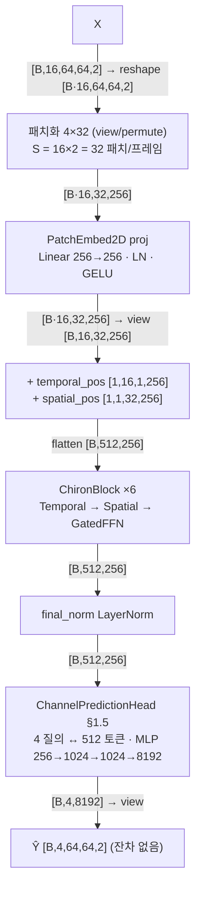

블록 내부 (a) `TemporalBlock` — 각 공간 패치 위치별 시간축 처리:

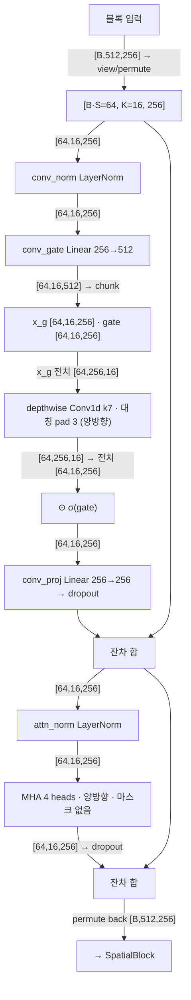

블록 내부 (b) `SpatialBlock` + (c) `GatedFFN`:

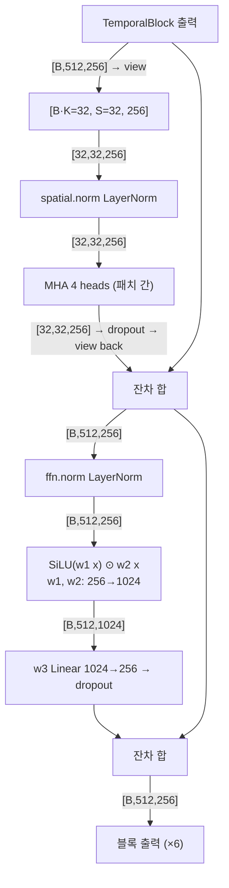

| 단계 | 연산 | 입력 shape | 출력 shape | 주요 하이퍼파라미터 |
|---|---|---|---|---|
| 1 | reshape + 패치화 [코드 기반] | [B,16,64,64,2] | [B·16,32,256] | patch 4×32, S 32 |
| 2 | patch_embed.proj (Linear·LN·GELU) | [B·16,32,256] | [B·16,32,256] | D 256 |
| 3 | + temporal_pos + spatial_pos → flatten | [B,16,32,256] | [B,512,256] | 학습 임베딩 |
| 4a | temporal.conv_gate | [64,16,256] | [64,16,512] | B·S 배치 |
| 4b | temporal.conv (dw Conv1d) | [64,256,16] | [64,256,16] | k7, groups 256 |
| 4c | temporal.conv_proj | [64,16,256] | [64,16,256] | — |
| 4d | temporal.attn MHA | [64,16,256] ×3 | [64,16,256], attn [64,16,16] | 4 heads |
| 4e | spatial.attn MHA | [32,32,256] ×3 | [32,32,256], attn [32,32,32] | 4 heads |
| 4f | ffn.w1 / w2 → w3 | [B,512,256] | [B,512,1024] → [B,512,256] | SwiGLU |
| 5 | final_norm | [B,512,256] | [B,512,256] | — |
| 6 | head.pool_attn | q [B,4,256], kv [B,512,256] | [B,4,256], attn [B,4,512] | 4 heads |
| 7 | head.mlp | [B,4,256] | [B,4,8192] | 256→1024→1024→8192 |
| 8 | view | [B,4,8192] | [B,4,64,64,2] | delta_skip False |

```yaml
model: chiron
file: multimodal_code_index/models/chiron_channel.py::ChironChannelPredictor
family: {prediction: parallel_query_head, tokenization: patch2d_4x32_x_time, attention: factorized_temporal_spatial_bidirectional}
params_total: 19156736
config: {embed_dim: 256, depth: 6, num_heads: 4, patch: [4, 32], S: 32, tokens: 512, conv_kernel: 7, mlp_ratio: 4, dropout: 0.1, head_hidden: 1024, delta_skip: false}
stages:
  - {name: patchify, type: reshape, in_shape: "[B,16,64,64,2]", out_shape: "[B*16,32,256]", params: 0}
  - {name: patch_embed, type: linear_ln_gelu, in_shape: "[B*16,32,256]", out_shape: "[B*16,32,256]", params: 66304}
  - {name: pos_add_flatten, type: learned_pos_2d, in_shape: "[B,16,32,256]", out_shape: "[B,512,256]", params: 12288}
  - {name: blocks, type: chiron_block, in_shape: "[B,512,256]", out_shape: "[B,512,256]", params: 9099264, repeat: 6, sub: [temporal_gated_dwconv7, temporal_mha4, spatial_mha4, swiglu_ffn_1024]}
  - {name: final_norm, type: layernorm, in_shape: "[B,512,256]", out_shape: "[B,512,256]", params: 512}
  - {name: head, type: query_cross_attn_mlp, in_shape: "[B,512,256]", out_shape: "[B,4,64,64,2]", params: 9978368}
```

**수식(forward)** — [코드 기반]

배치 축 생략. 패치 $4\times32$ → 프레임당 $S=16\times2=32$, 토큰 $N=K\cdot S=512$, $D=256$, 4 heads($d_h=64$). 토큰 $(t,s)$, $s=2i+j$($i\in0..15$ 안테나 블록, $j\in0..1$).

1. 패치화·임베딩·위치(학습 $\tau\in\mathbb{R}^{16\times256}$, $\pi\in\mathbb{R}^{32\times256}$) [패치 view/permute: 코드 기반 추정]:
$$s_{t,s}=\operatorname{vec}\big(X_t[4i:4i+4,\,32j:32j+32,\,:]\big)\in\mathbb{R}^{256},\qquad u^{(0)}_{t,s}=\mathrm{GELU}\big(\operatorname{LN}(W_ps_{t,s}+b_p)\big)+\tau_t+\pi_s$$
2. `ChironBlock` $\ell=1..6$ — (a) TemporalBlock 게이트 대칭 depthwise conv(공간 위치 $s$마다 길이 16 시계열; $k=7$, 양쪽 zero-pad 3, 비인과):
$$[a;\,g]=W_g\operatorname{LN}_c(u_{\cdot,s})+b_g,\qquad \hat c_{t,d}=\sum_{\kappa=-3}^{3}w_{d,\kappa}\,a_{t+\kappa,d}+b_d\ (\text{채널 }d\text{별}),\qquad u\leftarrow u+\mathrm{Drop}\big(W_c(\hat c\odot\sigma(g))+b_c\big)$$
3. (a′) TemporalBlock 양방향 어텐션(16 프레임 간, 마스크 없음) [MHA 내부: 코드 기반 추정]:
$$u_{\cdot,s}\leftarrow u_{\cdot,s}+\mathrm{Drop}\big(\mathrm{MHA}_4(\operatorname{LN}_a(u_{\cdot,s}))\big)$$
4. (b) SpatialBlock(프레임 $t$마다 32 패치 간 어텐션):
$$u_{t,\cdot}\leftarrow u_{t,\cdot}+\mathrm{Drop}\big(\mathrm{MHA}_4(\operatorname{LN}_s(u_{t,\cdot}))\big)$$
5. (c) GatedFFN(SwiGLU, hidden 1024):
$$u\leftarrow u+\mathrm{Drop}\Big(W_3\big(\mathrm{SiLU}(W_1\operatorname{LN}_f(u)+b_1)\odot(W_2\operatorname{LN}_f(u)+b_2)\big)+b_3\Big)$$
6. 최종 정규화 + 공용 헤드 §1.5($N=512$, hidden 1024, delta_skip=False, `last_frame` 미전달):
$$Z=\operatorname{LN}_{final}(u^{(6)})\in\mathbb{R}^{512\times256},\qquad \hat Y_p=\operatorname{unvec}\big(\mathrm{MLP}(\mathrm{MHA}_4(q;\operatorname{LN}_{pool}(Z))_p)\big)$$
잔차 없음.

근거: `models/chiron_channel.py::PatchEmbed2D.forward` L79–86, `TemporalBlock._conv` L136–151(gate chunk L141–143, dw conv L145–147, 게이트·proj·잔차 L149–151), `TemporalBlock._attention` L153–158, `TemporalBlock.forward` L160–172(reshape [B·S,K,D] L164), `SpatialBlock.forward` L201–214, `GatedFFN.forward` L233–236, `ChironBlock.forward` L274–278, `ChironChannelPredictor.encode_tokens` L479–501(pos L492, final_norm L501), `forward` L473–477(head 호출에 last_frame 없음 L477).

### 2.8 NOVA — `models/nova_channel.py::NOVAChannelPredictor`

1. **요약/계열**: Chiron과 같은 분해 시공간 골격이되 (i) 더 작은 4×8 패치(128 패치/프레임, 2,048 토큰), (ii) 시간 conv를 k3·k7 **다중 스케일 게이트 conv**로, (iii) 헤드를 **2회 cross-attention + 질의 간 self-attention**으로 바꾼 것. **parallel(비자기회귀 one-shot) · token-based(2D 패치 × 시간)**. 저장소 자체 설계(docstring이 CPMamba arXiv:2407.14440을 참고문헌으로 언급하나 구조 차용은 아님).
2. **입력**: §1.2.
3. **전처리**: reshape [B·16,64,64,2] → 패치화 4×8 → [B·16,128,64](patch_dim 4·8·2=64). 마스킹 없음.
4. **임베딩**: Linear 64→256 → LN → GELU → view [B,16,128,256] + temporal_pos [1,16,1,256] + spatial_pos [1,1,128,256] → flatten **[B,2048,256]**.
5. **백본**: `NOVABlock` × 6, D 256, heads 4.
   - `NOVATemporalBlock`: permute **[B·S=256, 16, 256]** → `MultiScaleGatedTemporalConv`: LayerNorm → gate_proj Linear 256→1024 → chunk(v_s, v_l, g_s, g_l) → dw Conv1d k3(v_s), k7(v_l) 대칭 패딩 → c_s⊙σ(g_s) + c_l⊙σ(g_l) → out_proj Linear → dropout → + 잔차; 이어 attn_norm → MHA 4 heads(양방향) → dropout → + 잔차 → permute back.
   - `SpatialBlock`: view **[B·K=32, 128, 256]** → LN → MHA 4 heads → dropout → + 잔차.
   - `GatedFFN`: SwiGLU hidden 1024(Chiron과 동일).
   - `final_norm`.
6. **헤드(`RefinedPredictionHead`)**: 질의 [1,4,256] → cross_attn1(ctx_norm1(tokens), 2,048 토큰) + 잔차 → self_attn(4 질의 간, self_norm) + 잔차 → cross_attn2(ctx_norm2(tokens)) + 잔차 → MLP: LN → 256→1024 → LN·GELU·drop → 1024→512 → LN·GELU·drop → 512→8192 → view [B,4,64,64,2]. delta_skip 없음.
7. **출력/후처리**: 공통.
8. **학습**: lr 3e-4, **batch 16**(토큰 2,048/표본), **최대 10 epoch**(2026-09-05 사용자 지시, epoch당 약 3.5 h), `--D 256 --L 6`. 큐 대기 중(S1 미완).
9. **파라미터**: **15,735,552** = patch_embed 17,152 + temporal_pos 4,096 + spatial_pos 32,768 + blocks 9,894,912(6 × 1,649,152 = temporal 596,224 + spatial 263,680 + ffn 789,248) + final_norm 512 + head 5,786,112(cross_attn1/self_attn/cross_attn2 각 263,168 + norm + mlp 4,994,048).

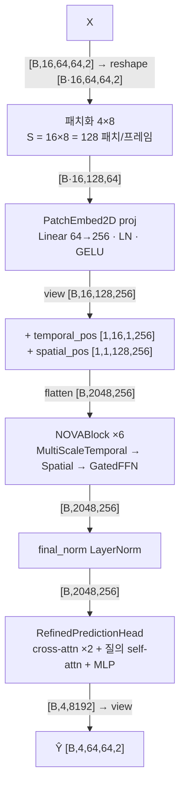

`NOVATemporalBlock` 내부:

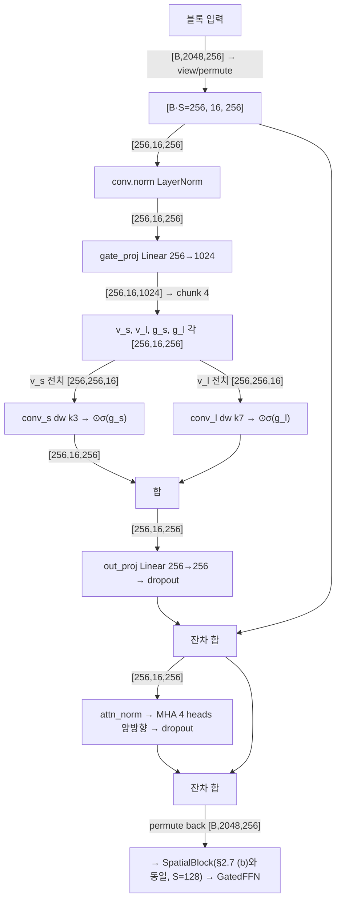

`RefinedPredictionHead` 내부:

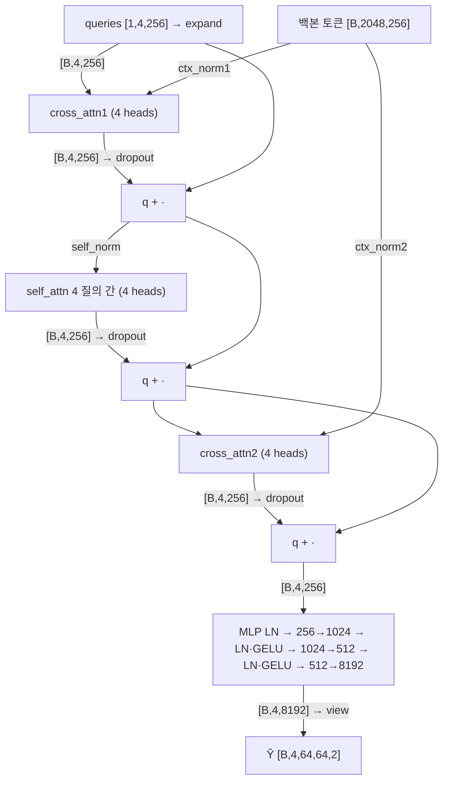

| 단계 | 연산 | 입력 shape | 출력 shape | 주요 하이퍼파라미터 |
|---|---|---|---|---|
| 1 | reshape + 패치화 [코드 기반] | [B,16,64,64,2] | [B·16,128,64] | patch 4×8, S 128 |
| 2 | patch_embed.proj | [B·16,128,64] | [B·16,128,256] | Linear·LN·GELU |
| 3 | + pos → flatten | [B,16,128,256] | [B,2048,256] | 학습 임베딩 |
| 4a | temporal.conv.gate_proj | [256,16,256] | [256,16,1024] | B·S 배치 |
| 4b | temporal.conv.conv_s / conv_l | [256,256,16] | [256,256,16] | dw k3 / k7 |
| 4c | temporal.conv.out_proj | [256,16,256] | [256,16,256] | — |
| 4d | temporal.attn MHA | [256,16,256] ×3 | [256,16,256], attn [256,16,16] | 4 heads |
| 4e | spatial.attn MHA | [32,128,256] ×3 | [32,128,256], attn [32,128,128] | 4 heads |
| 4f | ffn SwiGLU | [B,2048,256] | [B,2048,1024] → [B,2048,256] | hidden 1024 |
| 5 | final_norm | [B,2048,256] | [B,2048,256] | — |
| 6 | head.cross_attn1 / self_attn / cross_attn2 | q [B,4,256], kv [B,2048,256] / [B,4,256] | [B,4,256] (attn [B,4,2048] / [B,4,4]) | 4 heads |
| 7 | head.mlp | [B,4,256] | [B,4,1024] → [B,4,512] → [B,4,8192] | LN·GELU·drop |
| 8 | view | [B,4,8192] | [B,4,64,64,2] | — |

```yaml
model: nova
file: multimodal_code_index/models/nova_channel.py::NOVAChannelPredictor
family: {prediction: parallel_refined_query_head, tokenization: patch2d_4x8_x_time, attention: factorized_multiscale_conv_plus_bidirectional}
params_total: 15735552
config: {embed_dim: 256, depth: 6, num_heads: 4, patch: [4, 8], S: 128, tokens: 2048, k_small: 3, k_large: 7, mlp_ratio: 4, dropout: 0.1, head_hidden: 1024}
stages:
  - {name: patchify, type: reshape, in_shape: "[B,16,64,64,2]", out_shape: "[B*16,128,64]", params: 0}
  - {name: patch_embed, type: linear_ln_gelu, in_shape: "[B*16,128,64]", out_shape: "[B*16,128,256]", params: 17152}
  - {name: pos_add_flatten, type: learned_pos_2d, in_shape: "[B,16,128,256]", out_shape: "[B,2048,256]", params: 36864}
  - {name: blocks, type: nova_block, in_shape: "[B,2048,256]", out_shape: "[B,2048,256]", params: 9894912, repeat: 6, sub: [multiscale_gated_dwconv_k3_k7, temporal_mha4, spatial_mha4, swiglu_ffn_1024]}
  - {name: final_norm, type: layernorm, in_shape: "[B,2048,256]", out_shape: "[B,2048,256]", params: 512}
  - {name: head, type: two_round_cross_attn_query_self_attn_mlp, in_shape: "[B,2048,256]", out_shape: "[B,4,64,64,2]", params: 5786112}
```

**수식(forward)** — [코드 기반]

배치 축 생략. 패치 $4\times8$ → $S=16\times8=128$, $N=2048$, $D=256$, 4 heads. 토큰 $(t,s)$, $s=8i+j$($i\in0..15$, $j\in0..7$).

1. 패치화·임베딩·위치 [view/permute: 코드 기반 추정]:
$$s_{t,s}=\operatorname{vec}\big(X_t[4i:4i+4,\,8j:8j+8,\,:]\big)\in\mathbb{R}^{64},\qquad u^{(0)}_{t,s}=\mathrm{GELU}\big(\operatorname{LN}(W_ps_{t,s}+b_p)\big)+\tau_t+\pi_s$$
2. `NOVABlock` $\ell=1..6$ — 다중 스케일 게이트 conv(공간 위치 $s$별 시계열; depthwise, 대칭 pad, 비인과; $k_s=3$, $k_l=7$):
$$[v_s;\,v_l;\,g_s;\,g_l]=W_g\operatorname{LN}_c(u_{\cdot,s})+b_g,\qquad c_s=\mathrm{DWConv}_3(v_s),\ c_l=\mathrm{DWConv}_7(v_l)$$
$$u\leftarrow u+\mathrm{Drop}\big(W_o(c_s\odot\sigma(g_s)+c_l\odot\sigma(g_l))+b_o\big)$$
3. 시간 양방향 어텐션 → 공간 어텐션 → SwiGLU FFN(§2.7 식 (3)–(5)와 동일 형태, 공간 어텐션은 프레임당 128 패치 간):
$$u_{\cdot,s}\leftarrow u_{\cdot,s}+\mathrm{Drop}(\mathrm{MHA}_4(\operatorname{LN}_a(u_{\cdot,s}))),\quad u_{t,\cdot}\leftarrow u_{t,\cdot}+\mathrm{Drop}(\mathrm{MHA}_4(\operatorname{LN}_s(u_{t,\cdot}))),\quad u\leftarrow u+\mathrm{Drop}(W_3(\mathrm{SiLU}(W_1\operatorname{LN}_f u+b_1)\odot(W_2\operatorname{LN}_f u+b_2))+b_3)$$
4. $Z=\operatorname{LN}_{final}(u^{(6)})\in\mathbb{R}^{2048\times256}$.
5. `RefinedPredictionHead`(학습 질의 $q^{(0)}\in\mathbb{R}^{4\times256}$; 잔차형 2회 cross-attention + 질의 간 self-attention):
$$q^{(1)}=q^{(0)}+\mathrm{Drop}\big(\mathrm{MHA}_4(q^{(0)};\operatorname{LN}_{c1}(Z))\big),\qquad q^{(2)}=q^{(1)}+\mathrm{Drop}\big(\mathrm{MHA}_4(\operatorname{LN}_{s}(q^{(1)}))\big)$$
$$q^{(3)}=q^{(2)}+\mathrm{Drop}\big(\mathrm{MHA}_4(q^{(2)};\operatorname{LN}_{c2}(Z))\big)$$
6. 공유 MLP($256\to1024\to512\to8192$) + 복원, 잔차 없음:
$$\hat Y_p=\operatorname{unvec}\Big(W_3\,\mathrm{Drop}\big(\mathrm{GELU}(\operatorname{LN}_2(W_2\,\mathrm{Drop}(\mathrm{GELU}(\operatorname{LN}_1(W_1\operatorname{LN}_0(q^{(3)}_p)+b_1)))+b_2))\big)+b_3\Big)$$

근거: `models/nova_channel.py::PatchEmbed2D.forward` L92–98, `MultiScaleGatedTemporalConv.forward` L146–165(chunk 4 L152–153, conv L156–157, 게이트 L160–161, 합·proj L164–165), `NOVATemporalBlock.forward` L210–224(attn 잔차 L217–220), `SpatialBlock.forward` L248–257, `GatedFFN.forward` L276–279, `RefinedPredictionHead.forward` L399–420(cross1 L405–407, self L410–411, cross2 L414–416, mlp L419–420), `NOVAChannelPredictor.forward` L539–560.

### 2.9 DelayTCN — `models/delay_tcn.py::DelayTCN`

1. **요약/계열**: 프레임을 (a) 주파수응답 원본, (b) 부반송파축 IFFT로 얻은 **지연탭** 두 가지로 각각 선형 임베딩해 융합한 시간 토큰 16개를 **인과 팽창 conv(TCN)** 6블록으로 처리하고 공용 헤드로 4프레임을 낸다(copy-last 잔차). **parallel(P 질의 one-shot) · sequence-based(프레임 토큰, 인과 conv)**. 저장소 자체 설계("SSM·attention과 다른 제3계열").
2. **입력**: §1.2.
3. **전처리(모델 내부)**: raw 가지: reshape [B,16,8192]. delay 가지: `torch.complex` [B,16,64,64] → `torch.fft.ifft(dim=−1)`(부반송파→지연) [B,16,64,64] complex [코드 기반] → Re/Im stack → reshape [B,16,8192] [실측 embed_delay 입력]. `use_doppler=False`(지연-도플러 전역 토큰 비활성). 마스킹 없음.
4. **임베딩**: embed_raw Linear 8192→256, embed_delay Linear 8192→256 → concat [B,16,512] → fuse Linear 512→256 → in_norm LayerNorm → + `tpos` [1,16,256](학습). CLS 없음.
5. **백본**: `CausalConvBlock` × 6, dilation (1,2,4,8,1,2), kernel 3, pre-norm 잔차: LayerNorm → 전치 [B,256,16] → **왼쪽 패딩 (k−1)·d**(인과) → Conv1d 256→512(k3, dilation d) → [B,512,16] → 전치 → chunk(a,g) → a⊙σ(g)(GLU) → proj Linear 256→256 → dropout → + 잔차. 수용 영역 1 + Σ(k−1)d = 37 > 16(전 이력 커버). 시간 = 인과 conv, 공간 = 임베딩 Linear·IFFT 안.
6. **헤드**: `final_norm` → `ChannelPredictionHead`(§1.5; N=16, hidden 1024, **delta_skip True, zero-init**) → + X[:,−1] → [B,4,64,64,2]. 학습 전 출력 = copy-last(프로브 −9.6 dB = copy-last 값).
7. **출력/후처리**: 공통.
8. **학습**: lr 3e-4(LESSONS: 1e-3 금지), batch 64, `--D 256`(`--L`은 무시됨 — 블록 수는 dilations 튜플 길이 6으로 고정).
9. **파라미터**: **17,069,824** = embed_raw 2,097,408 + embed_delay 2,097,408 + fuse 131,328 + in_norm 512 + tpos 4,096 + blocks 2,760,192(6 × 460,032 = norm 512 + conv 393,728 + proj 65,792) + final_norm 512 + head 9,978,368.

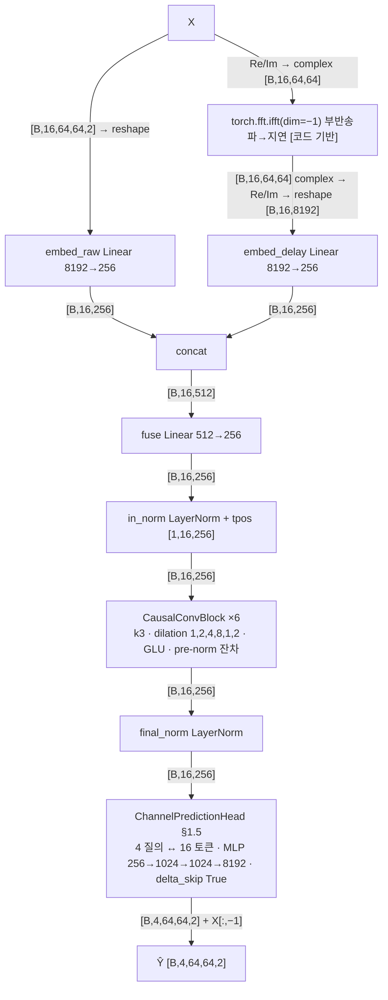

`CausalConvBlock` 내부(dilation d):

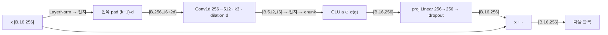

| 단계 | 연산 | 입력 shape | 출력 shape | 주요 하이퍼파라미터 |
|---|---|---|---|---|
| 1 | reshape → embed_raw | [B,16,8192] | [B,16,256] | — |
| 2 | complex → ifft(dim −1) → Re/Im → reshape [코드 기반] | [B,16,64,64] complex | [B,16,8192] | 부반송파 64 → 지연탭 64 |
| 3 | embed_delay | [B,16,8192] | [B,16,256] | — |
| 4 | concat → fuse | [B,16,512] | [B,16,256] | — |
| 5 | in_norm + tpos | [B,16,256] | [B,16,256] | 학습 위치 |
| 6 | blocks.0 conv(pad 2, d=1) | [B,256,18] | [B,512,16] | k3; d=2 → pad 4, d=4 → 8, d=8 → 16 |
| 7 | blocks.i GLU → proj | [B,16,512] → [B,16,256] | [B,16,256] | dropout 0.1 |
| 8 | final_norm | [B,16,256] | [B,16,256] | — |
| 9 | head.pool_attn | q [B,4,256], kv [B,16,256] | [B,4,256], attn [B,4,16] | 4 heads |
| 10 | head.mlp → view → + X[:,−1] | [B,4,256] | [B,4,64,64,2] | zero-init 마지막 Linear |

```yaml
model: delay_tcn
file: multimodal_code_index/models/delay_tcn.py::DelayTCN
family: {prediction: parallel_query_head_residual_copylast, tokenization: frame_token_dual_branch_freq_delay, temporal: causal_dilated_conv}
params_total: 17069824
config: {embed_dim: 256, kernel: 3, dilations: [1,2,4,8,1,2], receptive_field: 37, head_hidden: 1024, dropout: 0.1, use_delay: true, use_doppler: false, delta_skip: true}
stages:
  - {name: embed_raw, type: linear, in_shape: "[B,16,8192]", out_shape: "[B,16,256]", params: 2097408}
  - {name: ifft_delay, type: fft_ifft_subcarrier, in_shape: "[B,16,64,64]c", out_shape: "[B,16,8192]", params: 0}
  - {name: embed_delay, type: linear, in_shape: "[B,16,8192]", out_shape: "[B,16,256]", params: 2097408}
  - {name: fuse_norm_pos, type: concat_linear_layernorm_pos, in_shape: "[B,16,512]", out_shape: "[B,16,256]", params: 135936}
  - {name: blocks, type: causal_dilated_conv_glu, in_shape: "[B,16,256]", out_shape: "[B,16,256]", params: 2760192, repeat: 6}
  - {name: final_norm, type: layernorm, in_shape: "[B,16,256]", out_shape: "[B,16,256]", params: 512}
  - {name: head, type: query_cross_attn_mlp_delta_skip, in_shape: "[B,16,256]", out_shape: "[B,4,64,64,2]", params: 9978368}
```

**수식(forward)** — [코드 기반]

배치 축 생략, $x_t=\operatorname{vec}(X_t)$, $D=256$.

1. raw(주파수) 가지:
$$r_t=W_r x_t+b_r\in\mathbb{R}^{256}$$
2. delay 가지 — 부반송파축 IFFT(`torch.fft.ifft(dim=-1)`, norm="backward" → $1/K_{sc}$ 계수) [코드 기반 추정: torch.fft]:
$$\mathsf H_t=X_t[:,:,0]+jX_t[:,:,1],\qquad \mathsf h_t[n,\tau]=\frac{1}{64}\sum_{k=0}^{63}\mathsf H_t[n,k]\,e^{+j2\pi k\tau/64},\qquad d_t=\operatorname{vec}\big([\mathrm{Re}\,\mathsf h_t,\mathrm{Im}\,\mathsf h_t]\big)\in\mathbb{R}^{8192},\quad \delta_t=W_dd_t+b_d$$
3. 융합 + LayerNorm + 학습 시간 위치($p_t$):
$$u^{(0)}_t=\operatorname{LN}_{in}\big(W_f[r_t;\delta_t]+b_f\big)+p_t$$
4. `CausalConvBlock` $b=1..6$(dilation $d_b\in(1,2,4,8,1,2)$, $k=3$, 왼쪽 zero-pad $(k-1)d_b$ → 인과; pre-norm 잔차, GLU):
$$\tilde u=\operatorname{LN}_b(u),\qquad [a_t;\,g_t]=\sum_{i=0}^{2}W_{b,i}\,\tilde u_{t-i\,d_b}+b_b\in\mathbb{R}^{512}\ \ (\tilde u_{t'}=0\ \text{for}\ t'\le0)$$
$$u\leftarrow u+\mathrm{Drop}\big(W_p(a\odot\sigma(g))+b_p\big)$$
(수용 영역 $1+\sum_b(k-1)d_b=37\ge16$: 마지막 토큰이 전 이력을 본다.)
5. $Z=\operatorname{LN}_{final}(u^{(6)})\in\mathbb{R}^{16\times256}$.
6. 공용 헤드 §1.5($N=16$, hidden 1024, delta_skip=True, 최종 Linear zero-init):
$$\hat Y_p=\operatorname{unvec}\big(\mathrm{MLP}(\mathrm{MHA}_4(q;\operatorname{LN}_{pool}(Z))_p)\big)+X_K\qquad(\text{학습 전 }\hat Y_p=X_K)$$
`use_doppler=False`라 지연-도플러 전역 토큰 항은 없음.

근거: `models/delay_tcn.py::DelayTCN.encode_tokens` L95–114(embed_raw L99, complex L102, ifft L104, Re/Im·embed_delay·fuse L105–106, in_norm+tpos L107, blocks L112–113, final_norm L114), `CausalConvBlock.forward` L39–45(왼쪽 pad L41, conv L42, GLU L43–44, 잔차 L45), `__init__` L34–36(pad 길이·conv dim→2dim), `forward` L116–118(head `last_frame=channel_history[:, -1]`), zero-init L92–93.

### 2.10 Mamba — `models/mamba_channel.py::MambaChannelPredictor` (+ `mamba_ssm` 2.2.4 `Mamba`)

1. **요약/계열**: 프레임 토큰 16개(d=128)를 **선택적 상태공간(Mamba-1) 블록 4개**(pre-norm 잔차)로 처리하고 공용 헤드(copy-last 잔차)로 4프레임을 낸다. **parallel(P 질의 one-shot) · sequence-based(프레임 토큰, 인과 SSM)**. 참고: Mamba 블록 = arXiv:2312.00752(Gu & Dao, `mamba_ssm` 공식 구현), 설계 동기 = MambaCSP arXiv:2604.21957(docstring; 구조는 "본 데이터 규모에 맞춘 소형 구성"으로 논문 구성과 다름).
2. **입력**: §1.2.
3. **전처리**: reshape [B,16,8192]. 마스킹 없음(인과성은 SSM·conv 자체).
4. **임베딩**: embed Linear 8192→128 → LayerNorm → + `time_pos` [1,16,128](학습). CLS 없음.
5. **백본**: 4 × ( LayerNorm → `Mamba(d_model 128, d_state 16, d_conv 4, expand 2)` → dropout 0.1 → + 잔차 ) → `final_norm`. Mamba 블록 내부(d_inner 256, dt_rank 8 [실측 속성]; 학습 시 `mamba_inner_fn` fused 커널 → 서브모듈 hook 미발화, 프로브는 slow path로 x_proj/out_proj만 실측, 나머지 [코드 기반]): in_proj Linear 128→512(bias 없음) → x, z 각 [B,16,256] → x: depthwise **인과** Conv1d k4(bias) → SiLU → x_proj Linear 256→40 [실측 [B·16,256]→[B·16,40]] → (Δ 8, B 16, C 16) 분할 → dt_proj 8→256(bias) → softplus → A = −exp(A_log) [256,16], D [256] → 선택적 스캔 h_t = exp(ΔA)h_{t−1} + ΔB x_t, y_t = C h_t + D x_t → y ⊙ SiLU(z) → out_proj Linear 256→128(bias 없음) [실측 [B,16,256]→[B,16,128]]. 시간 = 인과 재귀(스캔), 공간 = 임베딩 Linear 안.
6. **헤드**: `ChannelPredictionHead`(§1.5; D 128, N 16, hidden 512, **delta_skip True, zero-init**) → + X[:,−1].
7. **출력/후처리**: 공통.
8. **학습**: lr 1e-3(완료) / 3e-4(큐), batch 64, `--D 128 --L 4`. LESSONS 메모: lr 1e-3 붕괴 함정 주의(이번 run은 완료됨).
9. **파라미터**: **6,118,272** = embed 1,048,960 + time_pos 2,048 + norms 1,024 + blocks 465,920(4 × 116,480 = in_proj 65,536 + conv1d 1,280 + x_proj 10,240 + dt_proj 2,304 + A_log 4,096 + D 256 + out_proj 32,768) + final_norm 256 + head 4,600,064.

```mermaid
flowchart LR
  X["X"] -->|"[B,16,64,64,2] → reshape [B,16,8192]"| E["embed Linear 8192→128 + LayerNorm"]
  E -->|"[B,16,128]"| P["+ time_pos [1,16,128]"]
  P -->|"[B,16,128]"| M["×4: LayerNorm → Mamba → dropout → 잔차"]
  M -->|"[B,16,128]"| F["final_norm"]
  F -->|"[B,16,128]"| H["ChannelPredictionHead §1.5<br/>4 질의 ↔ 16 토큰 · MLP 128→512→512→8192 · delta_skip"]
  H -->|"[B,4,64,64,2] + X[:,−1]"| O["Ŷ [B,4,64,64,2]"]
```

Mamba 블록 내부(`mamba_simple.py`; fused 커널 경로, 표시 없는 shape는 [코드 기반]):

```mermaid
flowchart TD
  I["norm(x) [B,16,128]"] -->|"in_proj 128→512 (bias 없음)"| SP["split → x [B,16,256], z [B,16,256]"]
  SP -->|"x 전치 [B,256,16]"| CV["depthwise 인과 Conv1d k4 → SiLU"]
  CV -->|"[B,16,256]"| XP["x_proj 256→40 [실측 [B·16,256]→[B·16,40]]"]
  XP -->|"Δ [B,16,8] · B [B,16,16] · C [B,16,16]"| DT["dt_proj 8→256 → softplus"]
  DT -->|"Δ [B,16,256]"| SS["선택적 스캔<br/>A=−exp(A_log) [256,16], D [256]<br/>h_t = exp(ΔA)·h_(t−1) + ΔB·x_t · y_t = C·h_t + D·x_t"]
  CV --> SS
  SS -->|"y [B,16,256]"| G["⊙ SiLU(z)"]
  SP --> G
  G -->|"[B,16,256]"| OP["out_proj 256→128 (bias 없음) [실측]"]
  OP -->|"[B,16,128] → dropout → + 잔차"| O["다음 블록"]
```

| 단계 | 연산 | 입력 shape | 출력 shape | 주요 하이퍼파라미터 |
|---|---|---|---|---|
| 1 | reshape → embed.0 Linear | [B,16,8192] | [B,16,128] | — |
| 2 | embed.1 LayerNorm + time_pos | [B,16,128] | [B,16,128] | 학습 위치 |
| 3 | norms.i LayerNorm | [B,16,128] | [B,16,128] | pre-norm |
| 4 | blocks.i Mamba | [B,16,128] | [B,16,128] | d_state 16, d_conv 4, expand 2, dt_rank 8 |
| 4a | in_proj [코드 기반] | [B,16,128] | [B,16,512] → x,z | bias 없음 |
| 4b | conv1d 인과 dw [코드 기반] | [B,256,16] | [B,256,16] | k4, groups 256 |
| 4c | x_proj | [B·16,256] | [B·16,40] | Δ8+B16+C16 |
| 4d | dt_proj → 스캔 [코드 기반] | Δ [B,16,8] | y [B,16,256] | A_log [256,16] |
| 4e | out_proj | [B,16,256] | [B,16,128] | bias 없음 |
| 5 | final_norm | [B,16,128] | [B,16,128] | — |
| 6 | head.pool_attn | q [B,4,128], kv [B,16,128] | [B,4,128], attn [B,4,16] | 4 heads |
| 7 | head.mlp → view → + X[:,−1] | [B,4,128] | [B,4,64,64,2] | 128→512→512→8192 |

```yaml
model: mamba
file: multimodal_code_index/models/mamba_channel.py::MambaChannelPredictor
family: {prediction: parallel_query_head_residual_copylast, tokenization: frame_token, temporal: causal_selective_ssm}
params_total: 6118272
config: {d_model: 128, depth: 4, d_state: 16, d_conv: 4, expand: 2, d_inner: 256, dt_rank: 8, dropout: 0.1, head_hidden: 512, delta_skip: true}
stages:
  - {name: embed, type: linear_layernorm_pos, in_shape: "[B,16,8192]", out_shape: "[B,16,128]", params: 1051008}
  - {name: blocks, type: prenorm_mamba_residual, in_shape: "[B,16,128]", out_shape: "[B,16,128]", params: 466944, repeat: 4, sub: [layernorm, in_proj_512, causal_dwconv4_silu, x_proj_40, dt_proj_softplus, selective_scan, gate_silu_z, out_proj, dropout, add]}
  - {name: final_norm, type: layernorm, in_shape: "[B,16,128]", out_shape: "[B,16,128]", params: 256}
  - {name: head, type: query_cross_attn_mlp_delta_skip, in_shape: "[B,16,128]", out_shape: "[B,4,64,64,2]", params: 4600064}
```

**수식(forward)** — [코드 기반]

배치 축 생략, $x_t=\operatorname{vec}(X_t)$, $D=128$, Mamba 내부 $d_{in}=256$, 상태 $N=16$, $R=\mathrm{dt\_rank}=8$, conv $k=4$.

1. 임베딩 + LayerNorm + 학습 시간 위치:
$$u^{(0)}_t=\operatorname{LN}_e(W_ex_t+b_e)+p_t\in\mathbb{R}^{128}$$
2. 블록 $\ell=1..4$(pre-norm 잔차, dropout 0.1):
$$u^{(\ell)}=u^{(\ell-1)}+\mathrm{Drop}\big(\mathrm{Mamba}_\ell(\operatorname{LN}_\ell(u^{(\ell-1)}))\big)$$
3. $\mathrm{Mamba}(\tilde u)$, $\tilde u\in\mathbb{R}^{16\times128}$ — 입력 투영(bias 없음)과 인과 depthwise conv($k=4$, 왼쪽 zero-pad; $x_{t'}=0$ for $t'\le0$) [학습 시 `mamba_inner_fn` fused 커널: 코드 기반 추정, slow path와 동일 연산]:
$$[x_t;\,z_t]=W_{in}\tilde u_t\in\mathbb{R}^{512},\qquad \bar x_{t,d}=\mathrm{SiLU}\Big(\sum_{i=0}^{3}w^c_{d,i}\,x_{t-i,d}+b^c_d\Big),\quad d=1..256$$
4. 입력 의존 파라미터(선택성; `x_proj` 256→8+16+16 bias 없음, `dt_proj` 8→256 bias, softplus):
$$[\tilde\Delta_t;\,B_t;\,C_t]=W_x\bar x_t,\qquad \Delta_t=\mathrm{softplus}(W_\Delta\tilde\Delta_t+b_\Delta)\in\mathbb{R}^{256}_{>0},\quad B_t,C_t\in\mathbb{R}^{16}$$
5. ZOH 이산화와 선택적 스캔($A=-\exp(A_{\log})\in\mathbb{R}^{256\times16}$, 초기 $A_{d,n}=-n$; $D\in\mathbb{R}^{256}$ skip; 채널 $d$·상태 $n$별 스칼라 재귀, $h_0=0$) [선택적 스캔 CUDA 커널: 코드 기반 추정, `selective_scan_ref`와 동일 식]:
$$\bar A_{t,d,n}=\exp(\Delta_{t,d}A_{d,n}),\qquad \bar B_{t,d,n}=\Delta_{t,d}\,B_{t,n}$$
$$h_{t,d,n}=\bar A_{t,d,n}\,h_{t-1,d,n}+\bar B_{t,d,n}\,\bar x_{t,d},\qquad y_{t,d}=\sum_{n=1}^{16}C_{t,n}\,h_{t,d,n}+D_d\,\bar x_{t,d}$$
6. 게이트와 출력 투영(bias 없음):
$$\mathrm{Mamba}(\tilde u)_t=W_{out}\big(y_t\odot\mathrm{SiLU}(z_t)\big)\in\mathbb{R}^{128}$$
7. $Z=\operatorname{LN}_{final}(u^{(4)})\in\mathbb{R}^{16\times128}$ → 공용 헤드 §1.5($D=128$, hidden 512, delta_skip=True, zero-init):
$$\hat Y_p=\operatorname{unvec}\big(\mathrm{MLP}(\mathrm{MHA}_4(q;\operatorname{LN}_{pool}(Z))_p)\big)+X_K$$

근거: `models/mamba_channel.py::MambaChannelPredictor.encode_tokens` L84–91(embed+time_pos L88, pre-norm 잔차 L90, final_norm L91), `forward` L93–96(`last_frame` L96), zero-init L81–82; `mamba_ssm/modules/mamba_simple.py::Mamba.__init__` L62(in_proj bias=False), L64–72(conv1d padding d_conv−1), L77–80(x_proj·dt_proj), L104–110(A_log=log(1..N)), L114(D=1), L117(out_proj); `Mamba.forward` L135–141(xz), L143(A=−exp), L145–160(fast path `mamba_inner_fn`, delta_softplus=True), L162–205(slow path: conv·[:seqlen] L169, x_proj 분할 L182–183, dt_proj L184, `selective_scan_fn` L189–200); `Mamba.step` L238–246(이산화 dA=exp(Δ·A), dB=Δ·B, y=C·h+D·x, ·SiLU(z)); `mamba_ssm/ops/selective_scan_interface.py::selective_scan_ref` L131–134(Δ+bias→softplus), L148(ΔA), L153(ΔB·u), L160–168(재귀), L175(D skip), L177(SiLU(z) 게이트).

### 2.11 LWM v1.1 (사전학습 가중치) — `cp/cp_lwm11.py::LWM11Predictor` + `cp/third_party/lwm_v1_1/lwm_model.py::lwm` — [추가 2026-09-07]

1. **요약/계열**: 프레임 16개 각각을 **LWM v1.1 공식 규약**(4×4 antenna×subcarrier 패치, re/im 인터리브 32값, 앞에 [CLS]=0.2·ones(32))으로 토큰화해 **사전학습된 LWM v1.1 인코더**(d 128, 12층 post-norm, 8 heads, FFN 512; HF `wi-lab/lwm-v1.1`, arXiv:2411.08872, 2.47 M)에 **프레임 단위로** 통과시키고, 패치 토큰 256개의 임베딩을 **패치 위치별 시간 Transformer**(우리가 붙인 부분, pre-norm 2층)로 16프레임에 걸쳐 섞은 뒤 선형 헤드로 지평 4개 × 패치 32값을 예측하고 역패치한다. LWM 자체에는 시간 축이 없으므로 시간 모델링은 전부 추가 모듈이 담당한다. 변형 3종: ① `--lwm11_init pretrained --lwm11_freeze none`(전체 미세조정) ② `scratch`(같은 구조 무작위 초기화, 대조군) ③ `pretrained --lwm11_freeze all`(백본 동결, 시간 Transformer+헤드 0.42 M만 학습; 동결 시 LWM은 항상 eval 모드).
2. **입력**: §1.2. (64, 64)는 LWM v1.1 사전학습 (N, SC) 20쌍에 포함되어 있어 크기 변환 없이 그대로 들어간다(N·SC = 4,096 ≤ 8,196, 토큰 257 ≤ 최대 513).
3. **전처리(`patchify`, [코드 기반] reshape/permute)**: `X·in_scale`(in_scale 1.0) → [B·K, Nt/4, 4, Ksc/4, 4, 2] → permute → [B·K, 256, 32]. 패치 내부 순서 = 행(antenna 4) 우선, 열(subcarrier 4)마다 (re, im) 인터리브 → 원본 `input_preprocess.py::patch_maker`와 max|diff| 0으로 일치(smoke 검증). 패치 순서 = antenna 블록 16 × subcarrier 블록 16(행-우선). [CLS] 토큰 0.2 상수 32값을 앞에 붙여 [B·K, 257, 32]. 마스킹 없음(MCM 디코더 미사용).
4. **임베딩(`lwm.embedding`, 원본 `Embedding`)**: `proj` Linear 32→128 + `pos_embed` nn.Embedding(513,128)(위치 0..256 조회) → 원본 `LayerNormalization`(std 기반, eps 1e-6) → [B·K, 257, 128]. 프로브(B=2)에서 B·K = 32.
5. **백본(`lwm.layers`, 원본 `EncoderLayer` × 12, post-norm)**: W_Q/W_K/W_V Linear 128→128 → 8 heads(d_k 16) → **`_SDPA`**(원본 `ScaledDotProductAttention`의 softmax(QKᵀ/√16)·V와 같은 수식을 `F.scaled_dot_product_attention`으로 계산; 어텐션 dropout은 원본에도 없음; 교체 전후 인코더 출력 max|diff| 1.2e-6) → `linear` 128→128 → dropout → **+ 입력 잔차(`MultiHeadAttention.forward`가 `residual + dropout(output)` 반환) → 층에서 입력을 한 번 더 가산(`norm1(enc_inputs + attn_outputs)`, 즉 이중 잔차 = norm1(2·입력 + attn); HF 원본 무수정, 사전학습 가중치도 이 forward로 학습됨 — 2026-09-07 정정, 수식 블록 (3) 참조)** → `norm1` → `pos_ffn`(fc1 128→512 → ReLU → dropout → fc2 512→128) → + 잔차 → `norm2`. 출력 [B·K, 257, 128]에서 [CLS](0번)를 버리고 패치 토큰 256개만 사용 → [B, K, 256, 128]. 원본의 MCM 헤드(`linear`·`norm`·`decoder`, 20,896)는 파라미터로는 존재하나 forward에서 호출되지 않는다(`masked_pos=None`).
6. **시간 모델(`time_emb` + `temporal`, 추가 모듈)**: 학습 시간임베딩 [1, 16, 128](std 0.02 초기화)을 프레임 축에 더한 뒤 [B, K, 256, 128] → permute → **[B·256, 16, 128]**(패치 위치마다 독립된 길이 16 시계열; 프로브 512 = 2×256) → `nn.TransformerEncoder`(pre-norm, 8 heads, FFN 512, GELU, dropout 0.1) × `t_layers`=2 → 마지막 시점 [:, −1] → `norm` LayerNorm → [B, 256, 128]. 패치 간(공간) 상호작용은 시간 모듈에는 없고 LWM 인코더 안(프레임 내 257토큰 self-attention)에서만 일어난다.
7. **헤드/출력(`head` + `unpatchify`)**: Linear 128 → H·32 = 128 → [B, 256, 4, 32] → 역패치 [코드 기반] → [B, 4, 64, 64, 2](역패치 왕복 오차 0). `--residual` 시 X[:, −1] 가산(S1 run은 False).
8. **학습**: batch 32(64는 OOM; 활성화가 B·K = 512 시퀀스 × 257 토큰 × 12층), epoch 상한 10, patience 5, ① ② lr 1e-4, ③ lr 3e-4. 실측 ① 0.47 s/step → epoch 약 3 h, 메모리 21.6 GB; ③ 0.17 s/step → epoch 약 1.1 h, 3.9 GB. 프레임당 257토큰 × 16 = 4,112토큰이라 chiron(512)의 8배 비용.
9. **파라미터**: **2,885,664** = lwm 2,470,304(embedding 70,144 = proj 4,224 + pos 65,664 + norm 256; layers 2,379,264 = 12 × 198,272[attn 66,048 + ffn 131,712 + norm 512]; 미사용 MCM 헤드 20,896) + time_emb 2,048 + temporal 396,544(2 × 198,272) + norm 256 + head 16,512. 동결(③) 학습 파라미터 415,360; `first8` 동결 시 1,229,344.
10. **사전학습 출처·규약(확인 사실)**: HF `wi-lab/lwm-v1.1`(2025-04-09 갱신), `huggingface_hub.snapshot_download`로 2026-09-05 내려받아 `cp/third_party/lwm_v1_1/`에 보관(`SOURCE.md`). 사전학습 = DeepMIMO 도시 시나리오 140개, 1.05 M 샘플, (N, SC) 20쌍, 입력 = 채널 × 1e6(per-sample 정규화 없음), SCS 30 kHz, BS ULA [N,1], 20 paths, MCM 마스킹 40 %. **반송파 주파수는 코드·모델 카드에 없음(확인 불가)**. 우리 입력은 창별 RMS 정규화(§1.2)라 절대 스케일이 다르며 보정하지 않았다(in_scale 1.0; 임베딩 직후 LayerNorm이 있어 영향 제한적이라는 가정). `state_dict` strict 로드 성공(203 텐서).
11. **S1 결과 요약(2026-09-07 기준, 상세는 `EXPERIMENT_LOG_CHANNEL_PRED.md`)**: ① best ep9 median −17.06/−15.28/−13.87/−12.89 dB(10/20/30/40 ms; 10·20 ms 전 모델 최고, pooled 평균은 −9.99로 chiron −10.20·NOVA −10.19에 0.2 dB 열세); ② scratch는 ep7 −17.18/−15.43/−13.82/−12.82로 ①과 동급 이상(진행 중) → 사전학습 가중치의 최종 기여 ≈ 0, 성능은 구조에서 발생; ③ 동결은 ep6 −14.52/−13.52/−11.97/−10.41로 2.5 dB 열세(진행 중). 정직성 검사(이력 뒤섞기 +2.9 dB) 통과.

```mermaid
flowchart TD
  X["X"] -->|"[B,16,64,64,2]"| P["patchify (reshape·permute)<br/>4×4 패치 · re/im 인터리브 · [CLS]=0.2"]
  P -->|"[B·16,257,32]"| E["lwm.embedding: proj Linear 32→128<br/>+ pos_embed Embedding(513) · LayerNormalization"]
  E -->|"[B·16,257,128]"| L["lwm.layers ×12 (post-norm, 사전학습)<br/>8 heads d_k16 · SDPA · FFN 512 ReLU · drop 0.1"]
  L -->|"[B·16,257,128] → CLS 제외"| T0["[B,16,256,128] + time_emb[16,128]"]
  T0 -->|"permute → [B·256,16,128]"| T["temporal: TransformerEncoder ×2 (pre-norm)<br/>패치 위치별 16프레임 시계열 · 8 heads · FFN 512 GELU"]
  T -->|"[:, −1] → [B·256,128]"| N["norm LayerNorm"]
  N -->|"[B,256,128]"| H["head Linear 128→4·32"]
  H -->|"[B,256,4,32] → unpatchify"| O["Ŷ [B,4,64,64,2]"]
```

LWM 인코더 층 내부(`EncoderLayer`, 원본 post-norm; 어텐션만 `_SDPA`로 교체):

```mermaid
flowchart TD
  I["층 입력 x"] -->|"[B·16,257,128]"| QKV["W_Q / W_K / W_V Linear 128→128"]
  QKV -->|"각 [B·16,8,257,16]"| SD["_SDPA: softmax(QKᵀ/√16)·V"]
  SD -->|"[B·16,257,128]"| OUT["linear 128→128 → dropout"]
  OUT --> A1["잔차 합 2회: MHA 내부 x + · , 층에서 다시 + x (이중 잔차)"]
  I --> A1
  A1 -->|"[B·16,257,128]"| N1["norm1 LayerNormalization"]
  N1 -->|"[B·16,257,128]"| FC1["pos_ffn.fc1 128→512 → ReLU → dropout"]
  FC1 -->|"[B·16,257,512]"| FC2["pos_ffn.fc2 512→128"]
  FC2 --> A2["잔차 합"]
  N1 --> A2
  A2 -->|"[B·16,257,128]"| N2["norm2 LayerNormalization"]
  N2 -->|"[B·16,257,128]"| O["층 출력 (×12)"]
```

| 단계 | 연산 | 입력 shape | 출력 shape | 주요 하이퍼파라미터 |
|---|---|---|---|---|
| 1 | patchify reshape/permute + [CLS] [코드 기반] | [B,16,64,64,2] | [B·16,257,32] | 패치 4×4, CLS 0.2 |
| 2 | lwm.embedding.proj Linear | [B·16,257,32] | [B·16,257,128] | d_model 128 |
| 3 | lwm.embedding.pos_embed Embedding | 위치 [257] | [257,128] | max_len 513 |
| 4 | lwm.embedding.norm LayerNormalization | [B·16,257,128] | [B·16,257,128] | eps 1e-6 |
| 5 | lwm.layers.0~11 enc_self_attn (W_Q/W_K/W_V → _SDPA → linear) | [B·16,257,128] | [B·16,257,128] | 8 heads, d_k 16, post-norm |
| 6 | lwm.layers.i pos_ffn fc1 / fc2 | [B·16,257,128] / [B·16,257,512] | [B·16,257,512] / [B·16,257,128] | ReLU, dropout 0.1 |
| 7 | CLS 제외 + time_emb 가산 + permute [코드 기반] | [B·16,257,128] | [B·256,16,128] | time_emb [1,16,128] |
| 8 | temporal.layers.0~1 (self_attn / linear1 / linear2) | [B·256,16,128] | [B·256,16,128] | pre-norm, 8 heads, FFN 512, GELU |
| 9 | 마지막 시점 + norm LayerNorm | [B·256,16,128] → [B·256,128] | [B·256,128] | — |
| 10 | head Linear | [B,256,128] | [B,256,128] (= 4·32) | H 4 × 패치 32값 |
| 11 | unpatchify [코드 기반] | [B,256,4,32] | [B,4,64,64,2] | residual False |

```yaml
model: lwm11
file: cp/cp_lwm11.py::LWM11Predictor (+ cp/third_party/lwm_v1_1/lwm_model.py::lwm, models/model.pth)
family: {prediction: per_patch_linear_head, tokenization: lwm_v1_1_4x4_patch_per_frame, norm: post_norm_backbone_prenorm_temporal, pretrained: true_wi-lab/lwm-v1.1}
params_total: 2885664
params_trainable: {full: 2885664, freeze_all: 415360, freeze_first8: 1229344}
config: {d_model: 128, lwm_layers: 12, n_heads: 8, d_ff: 512, dropout: 0.1, patch: [4, 4], tokens_per_frame: 257, t_layers: 2, in_scale: 1.0, residual: false}
variants: {pre: "init pretrained, freeze none, lr 1e-4", scratch: "init scratch, freeze none, lr 1e-4", frozen: "init pretrained, freeze all, lr 3e-4"}
stages:
  - {name: patchify, type: reshape_permute_cls, in_shape: "[B,16,64,64,2]", out_shape: "[B*16,257,32]", params: 0}
  - {name: lwm.embedding, type: linear_plus_learned_pos_layernorm, in_shape: "[B*16,257,32]", out_shape: "[B*16,257,128]", params: 70144}
  - {name: lwm.layers, type: transformer_encoder_postnorm_pretrained, in_shape: "[B*16,257,128]", out_shape: "[B*16,257,128]", params: 2379264, repeat: 12, sub: [qkv_8h, sdpa, linear, dropout, add, add, layernorm, fc1_512, relu, dropout, fc2, add, layernorm]  # add 2회 = 이중 잔차(2026-09-07 정정)}
  - {name: lwm.mcm_head_unused, type: linear_layernorm_decoder, params: 20896, note: "forward 미호출"}
  - {name: time_emb_permute, type: add_learned_time_embedding, in_shape: "[B,16,256,128]", out_shape: "[B*256,16,128]", params: 2048}
  - {name: temporal, type: transformer_encoder_prenorm, in_shape: "[B*256,16,128]", out_shape: "[B*256,16,128]", params: 396544, repeat: 2}
  - {name: last_norm, type: select_last_layernorm, in_shape: "[B*256,16,128]", out_shape: "[B,256,128]", params: 256}
  - {name: head_unpatchify, type: linear_reshape, in_shape: "[B,256,128]", out_shape: "[B,4,64,64,2]", params: 16512}
```

**수식(forward)** — [코드 기반]

배치 축 생략, $d=128$. $\theta_{LWM}$ = HF `wi-lab/lwm-v1.1` 가중치(embedding + 12층); 변형 ① pretrained·전체 학습, ② scratch·전체 학습, ③ pretrained·**$\theta_{LWM}$ 동결**(requires_grad=False, LWM 항상 eval → dropout 비활성). 시간 임베딩·시간 Transformer·norm·head는 세 변형 모두 학습.

1. 프레임별 패치화(LWM v1.1 규약, $4\times4$; 패치 $n=16i+j+1$ (1-based, $n=1..256$; $n=0$은 [CLS]), $i,j\in0..15$; 패치 내 원소 순서 $8a+2c+q$, $a$=안테나 행, $c$=부반송파 열, $q$=Re/Im 인터리브) + [CLS] 상수 토큰, in_scale $=1$ [코드 기반 추정: reshape/permute/cat]:
$$s_{t,n}=\mathrm{interleave}_{Re,Im}\big(X_t[4i:4i+4,\,4j:4j+4,\,:]\big)\in\mathbb{R}^{32},\qquad s_{t,0}=0.2\cdot\mathbf 1_{32},\qquad S_t\in\mathbb{R}^{257\times32}$$
2. LWM 임베딩($\theta_{LWM}$; ③ 동결). $\operatorname{LN}_s$ = 원본 `LayerNormalization`(std 기반, eps $10^{-6}$), $E_{pos}$ = `nn.Embedding(513,128)` 행 $0..256$:
$$e_{t,n}=\operatorname{LN}_s\big(W_es_{t,n}+b_e+E_{pos}[n]\big),\qquad n=0..256$$
3. LWM `EncoderLayer` $\ell=1..12$(post-norm, $\theta_{LWM}$; ③ 동결; 프레임 $t$마다 257토큰 self-attention, 8 heads $d_k=16$, 어텐션 dropout 없음). 어텐션은 `_SDPA`(=`F.scaled_dot_product_attention`, 원본 $\mathrm{softmax}(QK^{\top}/\sqrt{16})V$와 동일 식):
$$a=W_{lin}\big[\mathrm{head}_1;\dots;\mathrm{head}_8\big]+b_{lin},\qquad \mathrm{head}_i=\mathrm{softmax}\!\Big(\tfrac{(uW_i^Q+b_i^Q)(uW_i^K+b_i^K)^{\top}}{\sqrt{16}}\Big)(uW_i^V+b_i^V)$$
$$u'=\operatorname{LN}_s^{(\ell,1)}\big(u+[\,u+\mathrm{Drop}(a)\,]\big)=\operatorname{LN}_s^{(\ell,1)}\big(2u+\mathrm{Drop}(a)\big)$$
(원본 코드의 **이중 잔차**: `MultiHeadAttention.forward`가 $u+\mathrm{Drop}(a)$를 반환하고, `EncoderLayer.forward`가 그 위에 다시 $u$를 더한 뒤 norm1 — 사전학습 가중치도 이 forward로 학습된 것이므로 그대로 둔다.)
$$u^{(\ell)}=\operatorname{LN}_s^{(\ell,2)}\Big(u'+W_2\,\mathrm{Drop}(\mathrm{ReLU}(W_1u'+b_1))+b_2\Big),\qquad W_1\in\mathbb{R}^{512\times128}$$
4. [CLS] 제거 + 학습 시간 임베딩($\tau\in\mathbb{R}^{16\times128}$, 학습; N(0,0.02)) → 패치 위치 $n$마다 길이 16 시계열 [permute: 코드 기반 추정]:
$$g_{t,n}=u^{(12)}_{t,n}+\tau_t,\qquad n=1..256,\ t=1..16\qquad(\text{원본 MCM 헤드 linear·norm·decoder는 호출되지 않음})$$
5. 패치별 시간 Transformer(`nn.TransformerEncoder`, pre-norm, 2층, 8 heads $d_h=16$, FFN 512 GELU, dropout 0.1; 학습; 256개 시계열에 독립 적용 — §2.1 식 (2)와 같은 형태) [코드 기반 추정: torch 라이브러리 내부]:
$$\tilde g_{\cdot,n}=\mathrm{Enc}^{(2)}_{pre}(g_{1,n},\dots,g_{16,n})$$
6. 마지막 시점 + LayerNorm + 선형 헤드($128\to H\cdot32=128$; 학습) + 역패치 [코드 기반 추정: reshape/permute]:
$$z_n=\operatorname{LN}(\tilde g_{16,n}),\qquad o_n=W_hz_n+b_h\in\mathbb{R}^{4\times32},\qquad \hat Y_p=\operatorname{unpatch}_{4\times4}\big(\{o_n[p,:]\}_{n=1}^{256}\big)$$
`--residual` 미사용(S1): copy-last 가산 없음. 패치 간(공간) 상호작용은 (3)의 프레임 내 어텐션에서만, 시간 상호작용은 (5)에서만 일어난다.

근거: `cp/cp_lwm11.py::patchify` L17–21, `unpatchify` L23–24, `_SDPA.forward` L13–15, `LWM11Predictor.__init__` L27–47(가중치 strict 로드 L32–34, SDPA 교체 L36–37, freeze L38–43, time_emb L45, temporal·norm·head L46–47), `train` L48–51(③ LWM eval 고정), `encode` L52–56(CLS 제거 L56), `forward` L57–63(time_emb L59, permute L60, [:,−1]→norm L61, head→unpatchify L62, residual L63); `cp/third_party/lwm_v1_1/lwm_model.py::LayerNormalization.forward` L22–25, `Embedding.forward` L37–43, `MultiHeadAttention.forward` L71–80(잔차 `residual + dropout(output)` L80), `PoswiseFeedForwardNet.forward` L90–91, `EncoderLayer.forward` L102–111(`norm1(enc_inputs + attn_outputs)` L105 — 두 번째 잔차, `norm2(attn_outputs + ff_outputs)` L109), `lwm.forward` L136–154(masked_pos=None 분기 L153–154).

### 부록 A. Chiron-V2 — `models/chiron_v2.py::ChironV2` (S1의 11번째 run, 사용자 목록 외)

공간 패치를 없애 프레임 1토큰(embed Linear 8192→256 + LN + tpos)으로 만들고, 6블록 중 2·5번을 `Mamba`(pre-norm 잔차)로, 나머지 4개를 `ChironBlock(S=1)`로 구성. S=1이라 SpatialBlock의 attention은 토큰 1개 자기 자신에 대한 것(실측 [32,1,256], attn [32,1,1])이라 softmax 가중치 1 → 어텐션이 토큰 자신의 값 투영 $W^O(W^V\,\mathrm{LN}(u)+b^V)+b^O$로 축퇴(항등이 아니라 학습되는 affine 잔차 가지; 2026-09-07 정정, 수식 블록 (3)·검수 수치 대조 max diff 0). 헤드 = `ChannelPredictionHead` delta_skip True. 파라미터 **19,023,616** = embed 2,097,920 + tpos 4,096 + blocks 6,941,696(ChironBlock 4 × 1,516,544 + Mamba 2 × 437,760) + ssm_norms 1,024 + final_norm 512 + head 9,978,368. lr 3e-4, batch 64.

**수식(forward)** — [코드 기반]

배치 축 생략, $x_t=\operatorname{vec}(X_t)$, $D=256$, 프레임 = 토큰 1개($S=1$, $N=16$).

1. 임베딩 + LayerNorm + 학습 시간 위치:
$$u^{(0)}_t=\operatorname{LN}_e(W_ex_t+b_e)+p_t\in\mathbb{R}^{256}$$
2. 블록 $i=0..5$ 중 $i\in\{2,5\}$ = Mamba(pre-norm 잔차, **dropout 없음**; $d_{model}=256$, $d_{in}=512$, $N=16$, $R=16$, 식은 §2.10 (3)–(6)과 동일):
$$u\leftarrow u+\mathrm{Mamba}_i(\operatorname{LN}_i(u))$$
3. $i\in\{0,1,3,4\}$ = `ChironBlock(S=1)`: TemporalBlock은 §2.7 (2)–(3)을 16프레임 열에 그대로 적용(배치 $B\cdot1$). SpatialBlock은 프레임당 토큰이 1개라 키가 1개 → softmax 가중치 $=1$ → 어텐션이 토큰 자신의 값 투영으로 축퇴(항등이 아니라 학습되는 affine 잔차 가지):
$$u_t\leftarrow u_t+\mathrm{Drop}\big(W^O(W^V\operatorname{LN}_s(u_t)+b^V)+b^O\big)$$
이어 GatedFFN §2.7 (5).
4. $Z=\operatorname{LN}_{final}(u^{(6)})\in\mathbb{R}^{16\times256}$ → 공용 헤드 §1.5($N=16$, hidden 1024, delta_skip=True, zero-init):
$$\hat Y_p=\operatorname{unvec}\big(\mathrm{MLP}(\mathrm{MHA}_4(q;\operatorname{LN}_{pool}(Z))_p)\big)+X_K\qquad(\text{학습 전 }\hat Y_p=X_K)$$

근거: `models/chiron_v2.py::ChironV2.__init__` L47–48(embed·tpos), L55–66(블록 구성: ssm_positions (2,5) → Mamba+LayerNorm, 나머지 ChironBlock use_temporal_attention=True), L69–75(head delta_skip·zero-init); `forward` L77–87(embed+tpos L80, Mamba 잔차 `x + blk(norm(x))` L83, `blk(x, K, 1)` L85, final_norm L86, head `last_frame` L87); `models/chiron_channel.py::ChironBlock.forward` L274–278, `SpatialBlock.forward` L201–214(S=1 축퇴), `TemporalBlock.forward` L160–172; Mamba 식은 `mamba_simple.py` §2.10 근거와 동일.

---

## 3. 전체 모델 비교표

> **수식** (2026-09-08 추가, 코드 정의 그대로; 전체 모음 `FORMULAS.md` §7)

**§7 토큰화 — `MODEL_ARCHITECTURES.md` §3, `cp/cp_lwm11.py::patchify`**

패치 $p_h\times p_w$ (안테나 × 부반송파)일 때 프레임당 토큰 수 $n_{tok}=\dfrac{N_t}{p_h}\cdot\dfrac{K}{p_w}$, 표본당 $K_h\,n_{tok}$:
chiron $4\times32\to32$ (512/표본), NOVA $4\times8\to128$ (2,048), LWM v1.1 $4\times4\to256(+\text{CLS})$ (4,112), 프레임 통째(Transformer·LSTM·Mamba·LWM 구조) $\to1$ (16). LWM v1.1 패치 벡터(32값) = 행(안테나 4)마다 열(부반송파 4)의 $(\Re,\Im)$ 인터리브, [CLS] $=0.2\cdot\mathbf 1_{32}$.


| 모델 | 입력 표현(토큰) | 시간 모델링 | 공간(안테나·부반송파) 모델링 | 예측 방식 | 파라미터 | 멀티모달 지원 | 학습 lr / batch |
|---|---|---|---|---|---|---|---|
| Transformer(제안) | 프레임 평탄화 8,192 → 선형 512, 시간 토큰 16, 학습 pos | 양방향 full self-attention 6층(pre-norm) | 없음(임베딩 Linear 안) | one-shot, 마지막 토큰 → 지평별 Linear ×4 | 39,928,320 | 없음 | 1e-4·3e-4 / 128 |
| LSTM | 동일 토크나이저, pos 없음 | 단방향 재귀 2층 | 없음 | one-shot, 마지막 스텝 → 지평별 Linear ×4 | 25,207,296 | 없음 | 3e-4·1e-3 / 128 |
| ConvLSTM-AE | 2채널 64×64 영상 → Conv 32ch 32×32 | ConvLSTM 재귀(인코더 16스텝, 디코더 4스텝) | 3×3 conv(격자 유지) | 자기회귀 4스텝, teacher forcing, TransConv 복원 | 3,912,098 | 없음 | 3e-4·1e-3 / 64 |
| AR/선형 | 원 프레임(정규화만) | 최근 K_h 프레임 선형 결합 | 없음(스칼라 계수 공유) | 지평별 폐형 계수 | 4 / 8 / 16 | 없음 | 학습 없음 |
| LWM | 프레임 평탄화 → 선형 128, nn.Embedding pos | full self-attention 12층(post-norm, ReLU FFN) | 없음 | one-shot, P=4 질의 cross-attn + MLP | 8,333,440 | 코드상 있음(이미지·LiDAR late fusion) — channel_only로 비활성 | 3e-4 / 64 |
| LWM-Temporal | 20프레임(16+빈 4) × 8×32 패치 16 = 320 토큰 + CLS, 학습 pos | 희소 시공간 attention(오프셋 −4..+3, top-k 48) 6층 | 같은 attention 안에서(같은 프레임 전체 + 이웃 창) | one-shot, 마스크 토큰 복원(BERT형) | 1,360,512 | 코드상 있음(CLS 주입) — 비활성 | 5e-4 / 16 |
| Chiron | 16프레임 × 4×32 패치 32 = 512 토큰, 시간+공간 pos | 게이트 대칭 dw-conv k7 + 양방향 attention(패치별) 6층 | 프레임별 32 패치 간 attention | one-shot, P=4 질의 cross-attn + MLP | 19,156,736 | 없음(별도 `chiron_multimodal.py` 존재, 미사용) | 3e-4 / 64 |
| NOVA | 16 × 4×8 패치 128 = 2,048 토큰 | 다중스케일 게이트 dw-conv k3·k7 + 양방향 attention 6층 | 프레임별 128 패치 간 attention | one-shot, 2회 cross-attn + 질의 self-attn + MLP | 15,735,552 | 없음 | 3e-4 / 16 |
| DelayTCN | 프레임 평탄화(주파수) + IFFT 지연탭, 각 선형 256 → 융합 | 인과 팽창 conv k3 (1,2,4,8,1,2) GLU 6블록 | IFFT(부반송파→지연) + 임베딩 Linear | one-shot, P 질의 + MLP, copy-last 잔차 | 17,069,824 | 없음 | 3e-4 / 64 |
| Mamba | 프레임 평탄화 → 선형 128, 학습 pos | 인과 선택적 SSM 4블록 | 없음 | one-shot, P 질의 + MLP, copy-last 잔차 | 6,118,272 | 없음 | 3e-4·1e-3 / 64 |
| LWM v1.1(§2.11) | 프레임별 4×4 패치 256 + CLS = 257 토큰 × 16프레임(프레임 단위 독립), nn.Embedding pos(513) | 패치 위치별 pre-norm Transformer 2층(16프레임, 학습 시간임베딩) | 프레임 내 257토큰 self-attention 12층(사전학습 LWM) | one-shot, 패치별 Linear 128→4·32 → 역패치 | 2,885,664 (동결 시 학습 415,360) | 없음 | 1e-4(①②)·3e-4(③) / 32 |

- "멀티모달 지원"은 코드에 센서 경로가 있는지 여부다. S1은 전부 채널 only이며 `cp_repo_models.py`가 `use_image=False, use_lidar=False`로 고정한다.
- 토큰 수·shape는 전부 프로브 실측(§0.2). 파라미터 수는 `count_params`(requires_grad) 값.
- LWM v1.1은 표 중 **유일하게 사전학습 가중치를 쓰는 모델**이다(나머지 LWM·LWM-Temporal은 scratch).

## 4. 개요 다이어그램 (공통 전처리 → 모델별 분기 → 공통 평가)

```mermaid
flowchart TD
  PRE1["H memmap 합성<br/>[53800,16,64,64,2] fp16"] -->|"창 20프레임 × RX 행"| PRE2["X [B,16,64,64,2] · Y [B,4,64,64,2]<br/>창별 RMS 정규화(X 기준)"]
  PRE2 --> TF["Transformer(제안)<br/>프레임 토큰 → pre-norm enc ×6 → 지평별 Linear"]
  PRE2 --> LS["LSTM<br/>프레임 토큰 → LSTM ×2 → 지평별 Linear"]
  PRE2 --> CL["ConvLSTM-AE<br/>Conv → ConvLSTM enc/dec 자기회귀 4스텝"]
  PRE2 --> AR["AR/선형 K_h<br/>최소제곱 계수"]
  PRE2 --> LW["LWM<br/>프레임 토큰 → post-norm enc ×12 → P 질의 헤드"]
  PRE2 --> LT["LWM-Temporal<br/>패치 8×32 × 20프레임 → 희소 ST attn ×6 → 마스크 복원"]
  PRE2 --> CH["Chiron<br/>패치 4×32 → 시간/공간 분해 attn ×6 → P 질의 헤드"]
  PRE2 --> NV["NOVA<br/>패치 4×8 → 다중스케일 conv+attn ×6 → 2회 cross-attn 헤드"]
  PRE2 --> DT["DelayTCN<br/>주파수+지연 임베딩 → 인과 팽창 conv ×6 → P 질의 헤드(+copy-last)"]
  PRE2 --> MB["Mamba<br/>프레임 토큰 → 선택적 SSM ×4 → P 질의 헤드(+copy-last)"]
  PRE2 --> L11["LWM v1.1(사전학습)<br/>프레임별 4×4 패치 257토큰 → LWM enc ×12 → 패치별 시간 enc ×2 → 패치별 Linear"]
  TF & LS & CL & AR & LW & LT & CH & NV & DT & MB & L11 -->|"Ŷ [B,4,64,64,2]"| EV["공통 평가<br/>raw/align NMSE · ρ (10/20/30/40 ms) · 장면·속도별"]
  EV --> LOG["원장 EXPERIMENT_LOG_CHANNEL_PRED.md<br/>조기종료: 4지평 평균 pooled dB"]
```

## 5. 미확인·주의 사항

1. **프레임 간격**: 사용자 조건의 0.5 ms는 이 데이터에 없다. 코드·데이터 모두 10 ms이며 모든 지평 표기는 10/20/30/40 ms다(§0.3).
2. **텐서 규약**: Nr=16은 표본 축이다. 모델은 RX 행 1개짜리 [Nt=64, K_sc=64] 프레임만 본다. Chiron·NOVA docstring의 "16-ant ULA, 512 subcarriers"는 구 데이터셋 설명이며 실제 인자는 Nt 64·K_sc 64로 넘어간다.
3. **[코드 기반 추정]으로 남은 항목**: reshape/permute/view, `torch.fft.ifft`(DelayTCN), Mamba fused 커널 내부(in_proj·conv1d·dt_proj·스캔; x_proj·out_proj는 slow path로 실측), LWM-Temporal의 k/v gather 텐서 [B,8,321,320,16](이웃표 [321,320]는 실측), `nn.LSTM`·`nn.MultiheadAttention` 내부 q/k/v 투영.
4. **논문 대비 차이**: LWM·LWM-Temporal은 사전학습 가중치 없이 scratch이고(LWM v1.1 §2.11만 공개 사전학습 가중치 사용; 단 시간 모듈·헤드는 자체 추가, 반송파 주파수 불일치 가능) 구성(D·층·패치)이 논문과 다르다. ConvLSTM-AE는 P04 구조를 따르되 파라미터 정합판(40 M)은 미실행. LWM 원 논문 arXiv ID 2411.08872는 저장소에 기재가 없었으나 arXiv abs 페이지로 확인했다(2026-09-05).
5. **PDF 변환**: `scripts/md_to_pdf.py`는 `markdown` 모듈(tables·fenced_code)만 쓰므로 Mermaid 블록이 그림으로 렌더링되지 않는다. Mermaid 렌더러(mermaid-cli 등)를 거치거나 HTML에 mermaid.js를 넣어야 한다. 다이어그램은 노드 ≤ 15, 단계 ≤ 8이면 LR, 초과면 TD 규칙을 지켰다.
6. **재현**: `CUDA_VISIBLE_DEVICES=0 /home/dlghdbs200/anaconda3/envs/hoyun_312/bin/python scripts/09_probe_model_shapes.py --device cuda:0` (약 30 s, 피크 3.7 GB — 패치 4×16 LWM-Temporal 포함; 2026-09-07부터 lwm11 2종 포함, 총 14 run).
