# MULTIMODAL_ARCHITECTURES.md — 멀티모달(채널+센서) 모델 7종 전체 파이프라인과 이 데이터셋 적용 가능성

- 작성 2026-09-07. 짝 문서 = `MODEL_ARCHITECTURES.md`(채널 전용 10종+2, 같은 형식·같은 근거 규칙). 대상 = 저장소에 **센서 입력 경로가 있는 모델 전부**: [B] 논문 재현 모델(`mmw_repro/models_faithful.py`) 1종 + `multimodal_code_index/models/`의 멀티모달 예측기 6종(`lwm_multimodal`, `lwm_temporal_multimodal`, `chiron_multimodal`, `mscp_multimodal`, `lstm_multimodal`, `multi_modal_predictator`) + 이들이 공유하는 센서 인코더·융합 블록.
- 모든 텐서 shape는 **채널 = 실제 로더(`cp/cp_data.py`)로 뽑은 B1 train 창 1개 × RX 행 2개(B=2), 센서 = 각 모델이 기대하는 shape의 합성 텐서(`torch.randn`/`ones`; 값 무의미)** 를 모델에 통과시키며 forward hook으로 기록한 값이다(`scripts/10_probe_multimodal_shapes.py` → `10_probe_multimodal_shapes.json`(611 KB)/`.log`, 2026-09-07 GPU 0(`CUDA_VISIBLE_DEVICES=0`), torch 2.6.0+cu124, 전체 피크 메모리 **4,314 MB**). 예외: §2.1 [B] 재현 모델은 빔 라벨·ViT patch·PointPillars 캐시가 디스크에 있어 **실제 캐시 값**(읽기 전용 memmap)을 넣었다. 문서에서는 배치 축을 `B`로 일반화해 적는다.
- 표기 규칙(문장·항목마다): **[실측 hook]** = 프로브가 기록한 shape/파라미터/호출 횟수. **[코드 기반]** = nn.Module 경계 밖(reshape·cat·where·gather 등)이거나 실행하지 않은 코드를 읽어 적은 것. **[제안]** = 설계 제안(실행·검증 안 됨). **[추측]** = 제안 안의 정량 추정(근사식). **[문서 인용]** = 다른 문서의 수치를 파일·절 표기와 함께 옮긴 것. **확인 불가 – 이유** = 열어보지 못했거나 실행하지 못한 것.
- 기존 코드는 무수정(읽기 전용). 새로 만든 파일은 `scripts/10_probe_multimodal_shapes.py`(+ `.json`/`.log`)와 이 문서, `README.md` 색인 1줄뿐.

---

## 0. 근거·범위

### 0.1 코드 위치(실제 파일명·클래스·mode 옵션)

| # | 모델 | 클래스 | 파일 | mode 옵션(`VALID_MODES`) | 센서 플래그 | 비고 |
|---|---|---|---|---|---|---|
| 2.1 | [B] 논문 재현(빔 예측) | `FaithfulBeamPredictor` | `mmw_reproduction/mmw_repro/models_faithful.py`(+ `bgam_paper.py::PaperBGAM`, `dataset_faithful.py::_window_align`) | mode 없음. `use_rgb/use_lidar/use_bgam` 조합 = `train_faithful_rsu_v2.py::VARIANTS` {index_only, full, lidar_only, rgb_only, no_bgam} | `lidar_backend='pointpillars'`, `lidar_summary='xattn'`, 논문 플래그 11개(§2.1-8) | 구판 `models_multimodal.py::MultimodalBeamPredictor`(GPT-2 small·CLS 캐시·voxel BEV·CE)는 §2.1 끝에 차이만 기술 [코드 기반] |
| 2.2 | LWM 멀티모달 | `LWMMultiModalPredictor` | `multimodal_code_index/models/lwm_multimodal.py` | `multimodal`, `channel_only` | `use_image`, `use_lidar`, `delta_t` | S1 `repo:lwm`은 `channel_only`(`cp/cp_repo_models.py:44`) |
| 2.3 | LWM-Temporal 멀티모달 | `LWMTemporalMultiModalPredictor` → `_LWMModelCLSInject` | `models/lwm_temporal_multimodal.py`(+ `lwm_temporal.py`) | `multimodal`, `channel_only` | `use_image`, `use_lidar` | S1 `repo:lwm_temporal`은 `channel_only` |
| 2.4 | Chiron 멀티모달 | `ChironMultiModalPredictor` | `models/chiron_multimodal.py`(백본은 `chiron_channel.py`) | `multimodal`, `channel_only`, `image_only` | `use_image`, `use_lidar`, `use_ego_state` | S1 `repo:chiron`은 **다른 클래스** `ChironChannelPredictor`(센서 경로 없음) |
| 2.5 | MSCP 멀티모달 | `MSCPMultiModalPredictor`(+ `MSCPSceneEncoder`) | `models/mscp_multimodal.py`(부품은 `multi_modal_predictator.py`) | `multimodal`, `rf_scene`, `channel_only`, `image_only`, `scene_only` | `use_scene`, `image_encoder_type ∈ {resnet, depth}` | 논문 MSCP의 비트 정확 재구현 아님(docstring) |
| 2.6 | LSTM 멀티모달 | `LSTMMultiModalPredictor` | `models/lstm_multimodal.py` | `multimodal`, `channel_only` | `use_image`, `use_lidar`, `delta_t` | S1의 `lstm`(`cp/cp_models.py`)과 **다른 클래스** |
| 2.7 | MultiModalPredictator | `MultiModalPredictator` | `models/multi_modal_predictator.py` | `multimodal`, `channel_only`, `image_only` | `image_encoder_type ∈ {resnet, depth}`, `use_time_since_image` | LiDAR 경로 없음 |
| §1 | 공통 부품 | `ImageTokenEncoder`·`PointNetEncoder`·`GatedCrossModalFusion`·`SensorFrameSummarizer`·`PerTimeModalityFusion` | `models/image_encoders.py`, `lidar_encoders.py`, `fusion_blocks.py`(re-export `sensor_encoders.py`) | — | — | `DepthEncoderSimple`(`depth_encoder.py`)은 MiDaS 허브 다운로드가 필요해 **미실행**(§6) |
| §1 | 구세대 부품 | `ImageEncoder`·`ChannelEncoder`·`CrossAttentionFusion`·`PredictionHead` | `models/components.py` | — | — | `PredictionHead`만 2.5·2.7이 사용, 나머지 3개는 `channel_predictor.py`(legacy, 본 문서 범위 외) 전용 [코드 기반] |

- 프로브 입력 채널: `X [2,16,64,64,2]` fp32(창별 RMS 정규화 후 RMS 1.000), `Y [2,4,64,64,2]`, 창 = B1 train 첫 창(Town03_5wayroad/cav_1, start 0), scale 8.10e-5/8.09e-5 — 09 프로브와 동일 값 [실측 hook: `DATA` 행].
- 프로브 입력 센서(합성, 값 무의미) [실측 hook: `SYNTHETIC_SENSOR_INPUTS`]: `image_seq [2,4,3,224,224]` fp32 randn · `image_time_offsets [2,4,1]` = [0.03,0.02,0.01,0.0] s · `image_valid_mask [2,4]` bool · `lidar_points [2,64,4]` randn · `lidar_mask [2,64]` · `ego_state [2,6]` · `ue_position/ue_velocity [2,3]` · `vehicles_all [2,8,4]` · `object_valid_mask [2,8]`.
- ResNet18 가중치는 `~/.cache/torch/hub/checkpoints/resnet18-f37072fd.pth`에 이미 캐시되어 있어 **`pretrained=True`로 다운로드 없이** 생성했다(파라미터 수는 pretrained 여부와 무관) [실측: 로그 `resnet18 pretrained weights cached: True`]. GPT-2 large는 HF 캐시(`models--gpt2-large`)에서 `HF_HUB_OFFLINE=1`로 로드(32층 절단) [실측].

### 0.2 프로브 실행 결과 요약(B=2, eval 모드, GPU 0) [실측 hook]

| run | 모델(구성) | 학습 파라미터 | 전체 파라미터 | 출력 shape | hook 모듈 수 | fwd(s) | 피크 메모리(MB) |
|---|---|---|---|---|---|---|---|
| faithful_full | [B] 재현, 빔+RGB+LiDAR, d_m 256, GPT-2 large 32층 동결, 실제 캐시 입력 | 58,193,778 | 753,514,098 | [2,10] (미래 10스텝 빔 회귀) | 30 | 0.59 | **4,314** |
| faithful_index_only | 빔만 | 57,470,322 | 752,790,642 | [2,10] | 25 | 0.07 | 3,568 |
| faithful_lidar_only | 빔+LiDAR | 57,733,490 | 753,053,810 | [2,10] | 28 | 0.10 | 4,251 |
| faithful_rgb_only | 빔+RGB | 57,930,610 | 753,250,930 | [2,10] | 27 | 0.25 | 3,632 |
| lwm_multimodal | §2.2, D128 L12 + 이미지+LiDAR | 23,704,832 | 23,704,832 | [2,4,64,64,2] | 249 | 0.02 | 198 |
| lwm_channel_only | 대조(= S1 `repo:lwm`) | 8,333,440 | 8,333,440 | [2,4,64,64,2] | 177 | 0.01 | 90 |
| lwm_temporal_multimodal | §2.3, patch 8×32 D128 L6 + CLS 주입 | 12,836,608 | 12,836,608 | [2,4,64,64,2] | 101 | 0.13 | 344 |
| lwm_temporal_channel_only | 대조(= S1 `repo:lwm_temporal`) | 1,360,512 | 1,360,512 | [2,4,64,64,2] | 66 | 0.12 | 298 |
| chiron_mm_multimodal | §2.4, D256 L6 patch 4×32 + 이미지+LiDAR+ego | 35,995,520 | 35,995,520 | [2,4,64,64,2] | 227 | 0.23 | 245 |
| chiron_mm_channel_only | 대조(같은 클래스) | 20,279,552 | 20,279,552 | [2,4,64,64,2] | 147 | 0.01 | 150 |
| chiron_mm_image_only | 이미지만(+ego) | 22,688,064 | 22,688,064 | [2,4,64,64,2] | 54 | 0.01 | 194 |
| mscp_multimodal | §2.5, 채널+이미지+장면 토큰 | 28,820,800 | 28,820,800 | **[2,64,64,2] (1프레임)** | 134 | 0.02 | 217 |
| mscp_rf_scene | 채널+장면 토큰 | 16,708,096 | 16,708,096 | [2,64,64,2] | 100 | 0.01 | 122 |
| mscp_channel_only | 대조 | 14,989,312 | 14,989,312 | [2,64,64,2] | 58 | 0.00 | 116 |
| lstm_mm_multimodal | §2.6, hidden 256 3층 + 이미지+LiDAR | 29,940,352 | 29,940,352 | [2,4,64,64,2] | 88 | 0.01 | 222 |
| lstm_mm_channel_only | 대조 | 14,568,960 | 14,568,960 | [2,4,64,64,2] | 16 | 0.00 | 153 |
| mmp_multimodal | §2.7, 채널 Transformer 3층 + 이미지 | 28,682,560 | 28,682,560 | **[2,64,64,2] (1프레임)** | 118 | 0.01 | 216 |
| mmp_channel_only | 대조 | 14,989,312 | 14,989,312 | [2,64,64,2] | 58 | 0.00 | 116 |

- 실패한 모델: 없음(18 run 전부 forward 성공). 첫 실행에서 `faithful_full`·`faithful_rgb_only`가 `mat1 and mat2 must have the same dtype (Half/Float)`로 실패했는데, 이는 ViT patch 캐시가 fp16이고 트레이너(`train_faithful_rsu_v2.py`)가 GPU에서 `.float()`로 바꾸는 것을 프로브가 빠뜨린 **프로브 입력 문제**였다(모델 무결). `rgb.float()`로 수정 후 성공 [실측: 로그].
- 미실행 부품: `DepthEncoderSimple`(§1.1-4) — 생성자가 `torch.hub.load("intel-isl/MiDaS", "MiDaS_small")`로 GitHub 코드·가중치 다운로드를 요구하고 `~/.cache/torch/hub`에 캐시가 없어 의도적으로 건너뜀. **확인 불가 – 다운로드 미수행**. [코드 기반]으로만 기술.
- 학습 파라미터 = `requires_grad` 합, 전체 = 모든 파라미터. [B] 재현 모델만 둘이 다르다(GPT-2 695,320,320 동결). fwd 시간은 첫 호출(커널 준비 포함)이라 참고값.

### 0.3 이 데이터셋의 센서 인벤토리 요약 — `REPORT_STEP3_MULTIMODAL.md` §3-0 인용 [문서 인용] + 실제 1프레임 실측

프레임 = 10 ms, 채널과 센서가 같은 6자리 프레임 번호를 공유(50/50 궤적 완전 일치, `02_dt_and_alignment.log`). 논문 [B]는 LiDAR를 100 ms로 언더샘플하지만 배포본에는 100 Hz 전 프레임이 있다(연속 프레임 md5 상이 = 매 10 ms 실제 캡처).

| 위치 | 파일(프레임당) | 포맷(STEP3 §3-0 실측) | 프로브가 연 실제 1프레임(Town03_5wayroad_seed28, 326234) [실측] |
|---|---|---|---|
| RSU `rsu_1/` (5개) | `NNNNNN_camera0.png` | RGBA uint8 640×480, FOV 110°, z 3.9 m | shape (480,640,4) uint8 → RGB·224×224 리사이즈 → `[1,3,224,224]` → `ImageTokenEncoder` → `[1,49,256]` |
| | `NNNNNN_depth_camera0.png` | uint8 단일채널 640×480(8비트 양자화 깊이) | shape (480,640) uint8, 고유값 191. **저장소 어느 모델도 이 깊이 PNG를 직접 받는 인코더가 없음**(`DepthEncoderSimple`은 RGB→MiDaS 추정 깊이) [코드 기반] |
| | `NNNNNN.pcd` | PCD v0.7 ascii `x y z rgb`, 약 28.2~28.3k점, 센서 로컬 좌표 | 28,265점, xyz 범위 [−89,−109,−4.9]~[119,100,4.2] m → 64점 무작위 부표본 `[1,64,4]` → `PointNetEncoder` → `[1,16,256]`(4번째 필드는 intensity가 아니라 packed rgb). [B] 경로는 `precompute_pointpillar_rsu.py`가 (x, −y, z+z_shift, intensity)로 바꿔 동결 PointPillars → `X_L [384,100,176]` fp16 캐시(`derived/feat_pp_rsu/*/meta.json`: every 1, z_shift −2.1, lidar_range [−70.4,−40,−3,70.4,40,1], voxel 0.4 m) |
| | `NNNNNN.json` | 레이더 검출 리스트 `{velocity, azimuth, altitude, depth}` 1,387~1,708점 | 1,367 검출, 키 velocity/azimuth/altitude/depth. **저장소 멀티모달 모델 7종 중 레이더 입력을 받는 모듈 없음** [코드 기반] |
| | `NNNNNN.yaml` | `rsu_pose`(전 프레임 동일), 카메라/깊이/LiDAR/레이더 포즈 | `sensors` 키 = cameras, depth_cameras, rsu_pose, lidar_pose, radar_pose; rsu_pose = (−68.4, −8.0, 0.0), yaw −135° |
| CAV `cav_N/` (6개) | `NNNNNN_camera0~3.png` | RGB 640×480 ×4(전/후/좌/우, z 2.4 m) | 파일 존재 확인(`326234_camera0~3.png`) — 프로브 미로딩 |
| | `NNNNNN.pcd` | 위와 동일, 차량 로컬 좌표 | 프로브 미로딩(STEP3 §3-0: 28.4~28.9k점) |
| | `NNNNNN.yaml` | `vehicle_pose`(=`true_ego_pos`), `vehicle_speed`, `GPS`(잡음, xy 오차 중앙값 1.27 m), `predicted_ego_pos`(0.39~0.41 m), `imu_measurement`, `vehicles/<id>` | `sensors` 키 9개(cameras, vehicle_speed, vehicle_pose, lidar_pose, imu_pose, imu_measurement, GPS, predicted_ego_pos, true_ego_pos). **ego_state[6] = sensors.vehicle_pose.location{x,y,z} + sensors.vehicle_speed.speed{x,y,z}** 로 구성 가능 — 실측 값 [−84.96, −23.18, −0.12, 0.004, 0.744, 0.055]; predicted_ego_pos (−85.30, −22.34) [실측]. `vehicles` 17개 항목, 키 = bp_id, color, location, center, angle, extent, speed → `vehicles_all [B,N,4]`(§2.5)에 (x,y,z,speed) 등으로 대응 가능 [코드 기반: 대응 로직은 저장소에 없음] |
| `scenes/` (1개) | `NNNNNN.yaml` | 전 차량 리스트 | 프로브 미로딩 |

- 좌표계: 위치 GT는 CARLA 월드(왼손), 채널 각도·빔은 RSU 로컬(Sionna, 오른손). CARLA→Sionna는 y 부호반전, Tx 배열 방위 = −(RSU LiDAR yaw) [문서 인용: `REPRO_V2_PREREQUISITES.md` §5.3]. STEP3 §3-2는 "이번 세션 재검증 안 함"으로 남겼고 본 문서도 재검증하지 않았다.
- RSU 센서는 **시나리오당 1벌**이며 같은 시나리오의 CAV 3~4대가 공유한다(`dataset_faithful.py:50` `rsu_bev, rsu_patch, pp_cache = {}, {}, {}  # 시나리오당 1벌, cav 간 공유`) [코드 기반]. 채널 예측 표본은 (궤적=CAV, 창, RX 행)이므로 **같은 프레임의 RSU 센서 입력이 서로 다른 타깃(CAV) 3~4개에 동일하게 들어간다** — §5의 구조적 제약.

---

## 1. 공통 요소

프로브(`components` 절)는 각 부품을 단독 생성해 파라미터·shape를 쟀고, 아래 shape는 그 실측이다. 파라미터 분해는 `breakdown`(최상위 자식 모듈별 합) [실측 hook].

### 1.1 센서 인코더

| # | 클래스(파일) | 입력 → 출력 [실측 hook] | 파라미터 [실측] | 구조·역할 [코드 기반] |
|---|---|---|---|---|
| 1 | `ImageTokenEncoder` (`image_encoders.py`) | `[B,3,224,224]` → stem `[B,64,56,56]` → stages `[B,512,7,7]`(layer1 56², layer2 128ch 28², layer3 256ch 14², layer4 512ch 7²) → pool(7×7) → proj Conv1×1 `[B,256,7,7]` → flatten·transpose → + spatial_pos → LayerNorm → **`[B,49,256]`** | **11,320,896** = stem 9,536 + stages 11,166,976 + proj 131,328 + spatial_pos 12,544 + norm 512 | torchvision ResNet18(fc 제거) 특징도 7×7을 토큰 49개로. `sensor_encoders.py` docstring은 "ResNet18 frozen backbone"이라 쓰지만 **코드에 동결(`requires_grad_(False)`)이 없어 전부 학습 파라미터**(실측 trainable = total). ImageNet 정규화(mean/std) 없음. `grid_size` 인자로 토큰 수 변경 가능(7²=49 기본). |
| 2 | `ResNetImageTokenEncoder` (`multi_modal_predictator.py`) | 동일 `[B,3,224,224]` → `[B,49,256]` | 11,320,896(동일 구조, `pos_embed` 이름만 다름) | 1과 중복 구현. 2.5·2.7이 사용. |
| 3 | `PointNetEncoder` (`lidar_encoders.py`) | `points [B,64,4]`, `mask [B,64]` → point_mlp(4→64→128→256, LN·GELU) `[B,64,256]` → attn_norm → self_attn(4 heads, key_padding_mask) + 잔차 → pool_queries `[1,16,256]`(N(0,0.02)) → pool_norm(q)·attn_norm(kv) → pool_attn(q `[B,16,256]`, kv `[B,64,256]`) → q + pooled → output_norm → **`[B,16,256]`** (두 번째 반환값 None) | **574,528** = point_mlp 42,560 + self_attn 263,168 + pool_attn 263,168 + pool_queries 4,096 + norms 1,536 | 점 집합 → 학습 질의 16개로 요약. **기본 `max_points=64`**: 이 데이터셋 pcd는 28k점이라 로더가 64점으로 부표본해야 하며 저장소에 그 로더 코드는 없음(모든 모델이 `lidar_max_points=64` 기본값 사용). 점 특징 4번째 차원은 docstring상 intensity. |
| 4 | `DepthEncoderSimple` (`depth_encoder.py`) — **미실행(확인 불가 – MiDaS 허브 다운로드 필요)** | 코드상 `[B,3,224,224]` → MiDaS_small(동결, no_grad) 깊이맵 → min-max 정규화 → `[B,1,h,w]` → depth_cnn(Conv 1→32 k7 s4 → 32→64 k5 s2 → 64→128 k3 s2 → AdaptiveAvgPool(4)) → flatten 2048 → Linear 2048→256 → LN → GELU → `[B,256]` | 확인 불가(MiDaS 미로드). depth_cnn+proj만 수식 계산 [코드 기반]: conv 1,600 + 51,264 + 73,856 + Linear 524,544 + LN 512 ≈ **651,776** | RGB에서 깊이를 **추정**하는 경로. 이 데이터셋의 실제 8비트 깊이 PNG를 받는 경로는 아님. 2.5·2.7의 `image_encoder_type="depth"`가 `DepthImageTokenEncoder`(토큰 1개)로 감싼다. |
| 5 | `components.ImageEncoder` | `[B,3,224,224]` → ResNet18(avgpool까지) `[B,512]` → Linear·LN·GELU → **`[B,256]`** | 11,308,352 = features 11,176,512 + proj 131,840 | 벡터 1개 출력(공간 토큰 없음). 본 문서 7종 중 사용처 없음(legacy `channel_predictor.py`용) [코드 기반]. |
| 6 | `components.ChannelEncoder` (transformer, 2층) | `[B,16,64,64,2]` → permute·reshape `[B·16,2,64,64]` → Conv2d(2→64, k(4,16), s(2,8)) `[32,64,32,8]` → Conv2d(64→128, k(4,8), s(2,4)) `[32,128,16,2]` → AdaptiveAvgPool(1) → Linear 128→256 → `[B,16,256]` → 사인 위치 → TransformerEncoder(pre-norm, 4 heads, FFN 1024) ×2 → mean(dim=1) → pool Linear → **`[B,256]`** | 1,949,376 = spatial_encoder 304,064 + encoder 1,579,520 + pool 65,792 | 채널 이력 → 벡터 1개. 본 문서 7종 중 사용처 없음(legacy) [코드 기반]. |
| 7 | `EgoStateEncoder` (`chiron_multimodal.py`) | `[B,6]` → Linear 6→256 → LN → GELU → Linear 256→256 → LN → **`[B,256]`** | 68,608 | [x,y,z,vx,vy,vz] 조건 벡터. §2.4 참조(multimodal 모드에서는 계산만 되고 **사용되지 않음**). |
| 8 | `ImageSequenceEncoder` (`chiron_multimodal.py`) | (`ImageTokenEncoder`를 인자로 받음) `image_seq [B,4,3,224,224]` → 인코더 `[B·4,49,256]` → view `[B,4,49,256]` + frame_norm(frame_pos `[1,4,256]`) → 프레임 요약 mean(dim=2) `[B,4,256]` → temporal_norm → temporal_attn(4 heads, key_padding_mask `[B,4]`) + 잔차 → 토큰에 다시 더함 → reshape **`[B,196,256]`** + token_padding_mask `[B,196]` | 265,728(인코더 제외) = temporal_attn 263,168 + frame_pos 1,024 + norms 1,536 | 프레임 4장 × 49 토큰을 시간 문맥 주입 후 평탄화. 프레임 수 상한 `max_image_frames`(frame_pos 길이). |
| 9 | `ChannelTokenEncoder` (`multi_modal_predictator.py`) | `[B,16,8192]` → Linear 8192→256·LN·GELU → + pos_embed `[1,64,256]` → `nn.TransformerEncoder`(pre-norm, 4 heads, FFN 1024, GELU) ×3 → output_norm → **`[B,16,256]`** | 4,484,096 = input_proj 2,097,920 + encoder 2,369,280(3 × 789,760) + pos 16,384 + norm 512 | 프레임 1토큰 채널 인코더(§2.1 Transformer(제안)와 같은 계열, D 256). **입력이 3D 평탄화 텐서**여야 한다(`MSCPMultiModalPredictor`는 5D도 받아 내부에서 reshape, `MultiModalPredictator`는 3D만). |
| 10 | `MSCPSceneEncoder` (`mscp_multimodal.py`) | `ego_state [B,6]` → MLP(6→256→256, LN·GELU·Dropout) + ego_type → `[B,1,256]`; `object_features [B,8,4]`(+`object_valid_mask [B,8]`) → MLP(4→256→256) + object_type `[B,8,256]`, 유효 가중 평균 요약 + object_summary_type `[B,1,256]`; (`scene_features` dim 0 → 없음) → cat → output_norm → **`[B,10,256]`** + key_padding_mask `[B,10]` | 138,240 = ego_encoder 68,608 + object_encoder 68,096 + type 임베딩 4×256 + norm 512 | 명시적 장면 토큰(자차 1 + 객체 요약 1 + 객체 N). `vehicles_all [B,N,4]`를 object_features로 그대로 받음. |

### 1.2 융합 블록

| # | 클래스(파일) | 입력 → 출력 [실측 hook] | 파라미터 [실측] | 방식 [코드 기반] |
|---|---|---|---|---|
| 1 | `GatedCrossModalFusion` (`fusion_blocks.py`) | `channel_tokens [B,512,256]`, `sensor_tokens [B,212,256]`(+ key_padding_mask) → q_norm/kv_norm → cross_attn(4 heads, q=채널, kv=센서) `[B,512,256]`(가중치 `[B,512,212]`) → attn_drop → gate = σ(Linear(cat[residual, attn] `[B,512,512]`)) `[B,512,256]` → residual + g⊙attn → `GatedFFN`(SwiGLU 256→1024→256, `chiron_channel.py`) → **`[B,512,256]`** | **1,184,768** = cross_attn 263,168 + gate 131,328 + ffn 789,248 + norms 1,024 | **토큰 수준 cross-attention + 시그모이드 게이트 잔차**. 채널 토큰이 질의, 센서 토큰이 키/값. 게이트가 0이면 채널 토큰 그대로(잔차) + FFN. §2.4가 3층 사용. |
| 2 | `SensorFrameSummarizer` (`fusion_blocks.py`) | `frame_tokens [B,4,49,256]`, `time_offsets [B,4,1]` → reshape `[B·4,49,256]` → 학습 질의 1개 `[B·4,1,256]` cross-attn → `[B,4,256]` + time_proj(Linear 1→256·LN·GELU)(offsets) → out_norm → **`[B,4,256]`** | 265,984 = attn 263,168 + time_proj 1,024 + query 256 + norms 1,536 | 프레임당 공간 토큰 49 → 1토큰. 시간 오프셋(초)을 벡터로 더함. §2.2·2.6 사용. |
| 3 | `PerTimeModalityFusion` (`fusion_blocks.py`) | `channel_tokens [B,16,256]`, `sensor_tokens [B,16,2,256]`, `sensor_valid_mask [B,16,2]` → cat(채널 unsqueeze, 센서) `[B,16,3,256]` → reshape `[B·16,3,256]`; 학습 질의 `query [1,64,1,256]`의 앞 K=16개 → `[B·16,1,256]` → attn(4 heads, key_padding_mask `[B·16,3]`: 무효 센서 제외) → `[B,16,256]` → GatedFFN → **`[B,16,256]`** | 1,069,824 = attn 263,168 + ffn 789,248 + query 16,384(64×256) + norms 1,024 | **시각별 모달리티 어텐션**: 같은 시각 k의 (채널, 이미지, LiDAR) 3토큰을 시각별 학습 질의 1개가 요약. [B] 논문 식(21)의 "스텝별 질의 R"과 같은 발상. **채널 토큰이 잔차로 남지 않는다**(출력 = 어텐션 출력의 FFN; §2.2·2.6에서 채널 이력 정보는 어텐션 가중치를 통해서만 전달). |
| 4 | `CrossModalFusionBlock` (`multi_modal_predictator.py`) | `channel_tokens [B,16,256]`, `image_tokens [B,196,256]` → query_norm/context_norm → attn(4 heads) → + dropout 잔차 → + FFN(pre-norm, 256→1024→256 GELU) → **`[B,16,256]`** | 790,272 = attn 263,168 + ffn 525,568 + norms 1,536 | 게이트 없는 표준 cross-attention 잔차 블록. §2.5·2.7이 2층 사용. |
| 5 | `chiron_multimodal.FutureQueryDecoder` | `context_tokens [B,708,256]`, `condition [B,256]` → 학습 질의 1개 + condition → q_norm/kv_norm → attn(key_padding_mask) → + 잔차 → GatedFFN → **`[B,256]`** | 1,054,208 = attn 263,168 + ffn 789,248 + query 256 + norms 1,536 | 단일 미래 질의가 문맥 전체를 읽음. §2.4에서는 **image_only 모드에서만 호출**. |
| 6 | `multi_modal_predictator.FutureQueryDecoder` | `context [B,212,256]`(+condition) → **`[B,256]`** | 790,528 = attn 263,168 + ffn 525,568 + query 256 + norms 1,536 | 5와 같은 역할, FFN이 일반 MLP. §2.5·2.7 사용(모든 모드). |
| 7 | `components.CrossAttentionFusion` | `img_feat [B,256]`, `ch_feat [B,256]` → 각각 Linear 256→1024 → reshape `[B,4,256]` → cross_attn(q=이미지, kv=채널) → norm1(q+attn) → FFN → norm2 → mean → output_proj → **`[B,256]`** | 1,382,400 | 벡터 2개를 길이 4 시퀀스로 늘려 attention. **이미지가 질의, 채널이 키/값**(다른 블록과 반대). 본 문서 7종 중 사용처 없음(legacy) [코드 기반]. |
| 8 | [B] 식(21) 융합 어텐션 (`models_faithful.py:197 fuse_attn`) | `mods [B·P,M,256]`(M = 존재 모달 수, full 3), 스텝별 질의 `fuse_q [1,40,1,256]` → `[B·P,1,256]` → MHA(8 heads) → **`[B·P,1,256]`** | 263,168 + fuse_q 10,240 | §2.1 참조. 시각별 질의 1개가 모달 M개를 요약(3과 같은 발상, 잔차·LN 없음). |
| 9 | [B] 식(22) 재프로그래밍 (`to_D`, `proto_map`, `reprog`) | `[B,40,256]` → to_D `[B,40,1280]`; 프로토타입 = proto_map(GPT-2 wte `[50257,1280]`ᵀ)ᵀ `[1000,1280]` → reprog MHA(8 heads, q=특징, kv=프로토타입 1000개) → **`[B,40,1280]`** | to_D 328,960 + proto_map 50,257,000 + reprog 6,558,720 | 무선 특징을 GPT-2 어휘 공간으로 번역. 학습부의 87%가 proto_map. |

### 1.3 시간 정렬 로직 — `lwm_multimodal.py::_align_sensor_to_history`(`lstm_multimodal.py`에 동일 코드) [실측 호출 + 코드 기반]

```
channel_offsets[k] = (K−1−k)·delta_t  (k=0 가장 오래된 이력, k=K−1 최신 = 0 s)
available[b,k,t]   = valid[b,t] ∧ (image_offset[b,t] ≥ channel_offsets[k])   # 채널 스텝 k 이전(또는 같은 시각)에 찍힌 이미지만
gather_idx[b,k]    = argmin_t (image_offset[b,t] masked by available)         # 그중 가장 최근 이미지
selected           = frame_tokens.gather(t=gather_idx);  has_sensor = available.any(t)
출력               = where(has_sensor, selected, no_token)                    # 없으면 학습 상수 no_image_token
time_offsets=None  → 마지막 유효 프레임 1장을 K스텝 전부에 복제
```

프로브가 프레임 t의 토큰값을 t+1로 채운 더미로 실제 함수를 호출해 스텝별 선택 프레임을 읽었다(`alignment` 절) [실측]:

| 케이스 | T | 이미지 오프셋(s) | delta_t | 스텝별 선택 프레임(1-based, 0=no_token) | 의미 |
|---|---|---|---|---|---|
| 프로브 합성 입력 | 4 | 0.03, 0.02, 0.01, 0.0 | 0.01 | [0×12, 1, 2, 3, 4] (has_sensor: 앞 12 False) | 이미지 4장이 최근 4스텝만 덮음 → 앞 12스텝은 no_image_token |
| **이 데이터셋(10 ms 1:1)** | 16 | 0.15 … 0.0 (10 ms 격자) | 0.01 | [1,2,…,16] 전부 True | **항등 사상** — 매 스텝 자기 프레임. 정렬 로직이 사실상 불필요(delta_t=0.01만 맞추면 됨) |
| [B] 논문식 100 ms 센서 | 4 | 0.3, 0.2, 0.1, 0.0 | 0.01 | [2×5, 3×10, 4] | forward-fill(과거 측정을 앞으로 채움). [B] 식(20)은 반대로 **소급 복제**(backward replication: 구간 끝 측정을 앞 9스텝에)이므로 **방향이 다름** — `dataset_faithful.py::_window_align`가 [B]식(§2.1-4) |
| 코드 기본값 delta_t=0.0005 | 4 | 0.03, 0.02, 0.01, 0.0 | 0.0005 | [3×15, 4] | 채널 오프셋이 0~7.5 ms로 오그라들어 이미지 3·4만 쓰임. **기본값 0.5 ms는 구 sc08 격자용**; 이 데이터에서는 반드시 `delta_t=0.01`(cp 래퍼는 이미 0.01) |

- LiDAR는 정렬 없이 **1프레임을 K스텝 전부에 복제**한다(`_encode_aligned_lidar`: `lidar_tokens.mean(dim=1).unsqueeze(1).expand(B,K,D)` — 16토큰을 평균해 1벡터로 만든 뒤 복제) [코드 기반]. 즉 §2.2·2.6의 LiDAR 입력은 "창당 점구름 1개"다.
- §2.3·2.4·2.5·2.7은 시간 정렬 로직이 없다: 2.3은 센서 전체를 CLS 1토큰으로 압축, 2.4·2.7은 이미지 T장을 토큰으로 펼쳐 채널 토큰이 자유롭게 attend(시간 대응 없음), 2.5·2.7은 `image_time_offsets`의 최소값을 디코더 조건 벡터로만 사용 [코드 기반].
- [B] 식(20) `_window_align(s,h,j)` = `t_end − j·((t_end − t)//j)`: 창 끝에 앵커된 j스텝 구간마다 구간 끝 프레임을 사용. 프로브(h=40, j=10): 스텝 0..9→9, 10..19→19, 20..29→29, 30..39→39 → 고유 프레임 4개(`bev_idx` [0×10,1×10,2×10,3×10]) [실측 `FAITHFUL_INPUTS`].

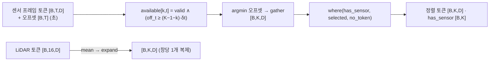

---

## 2. 모델별 상세

각 모델: 1 요약/계열 · 2 입력(센서 종류·shape) · 3 전처리·시간 정렬 · 4 임베딩/센서 인코더 · 5 백본 · 6 융합(위치·방식) · 7 헤드/출력 · 8 학습·모드 · 9 파라미터(channel_only 대비 증분) + 이 데이터셋 대응(RSU/CAV) 항목. 채널 입력은 §2.2~2.7 전부 `X [B,16,64,64,2]`(`MODEL_ARCHITECTURES.md` §1.2 정규화 후), §2.1만 빔 인덱스.

### 2.1 [B] 논문 재현 모델 — `mmw_repro/models_faithful.py::FaithfulBeamPredictor` (빔 예측, GPT-2 large 동결)

1. **요약/계열** [코드 기반 + 문서 인용 `MODEL_STRUCTURE_EXPLAINED.md` §0~1]: 과거 40스텝(400 ms) 빔 인덱스 + RSU LiDAR(동결 PointPillars BEV, BGAM 마스킹) + RSU RGB(동결 ViT-B/16 패치 196개)를 각각 d_m=256 토큰열로 만들고, 스텝별 학습 질의로 3모달을 융합(식 21) → GPT-2 어휘 프로토타입으로 재프로그래밍(식 22) → 프롬프트(식 23) 뒤에 붙여 **동결 GPT-2 large 32층**에 통과 → 마지막 40토큰의 앞 128차원을 평탄화해 단일 Linear로 미래 10스텝 빔(연속값, ×64 반올림) 회귀(식 24). **parallel(one-shot 10스텝) · 시간 토큰(스텝=토큰) · 예측 타깃 = 빔 인덱스(채널 아님)**. 논문 arXiv:2603.15093. 프로브 구성 = 게이트 통과 run `abl15_ctrl_rsu`·RevIN 계열과 같은 논문 플래그(`train_faithful_rsu_v2.py::mk`): paper_bgam, bs_prompt, paper_head, learnable_protos, paper_beam_norm, paper_prompt, d_ff 128, proto_vocab 전체(50,257), llm_layers 32, paper_fuse_query, paper_concat + lidar_backend pointpillars, lidar_summary xattn, d_m 256 [실측: 프로브 `PAPER_FLAGS`].
2. **입력** [실측 `FAITHFUL_INPUTS`, 실제 캐시]: `beam_hist [B,40]` int64(`derived/beam_labels_paper/.../Town03_5wayroad/cav_1.npz`의 `beam`; 예시 앞 10값 전부 1) · `rgb [B,40,1,196,768]` fp16(`derived/feat_patch_rsu224/.../rsu.npy` memmap `[1100,1,196,768]`; 100 Hz 그대로, 스텝당 1장) → GPU에서 float32 · `bev [B,U=5,384,100,176]` fp16(`derived/feat_pp_rsu/.../rsu.npy` `[1100,384,100,176]`; 창 안 고유 프레임 4개 + 패딩 1) · `bev_idx [B,40]`(스텝→고유 프레임). 출력 `[B,10]`.
3. **전처리·시간 정렬** [코드 기반, 실측 값]: 빔 q/Q ∈ [0,1] 스칼라열(`paper_beam_norm`). LiDAR = 식(20) `_window_align(s,40,j=10)` → 스텝 0..9→프레임 9, 10..19→19, 20..29→29, 30..39→39(**소급 복제**; 캐시 every=1이라 정확) → `bev_idx` [0×10,1×10,2×10,3×10]. RGB는 프로브·`rv15*` run에서 `rgb_every=None`(100 Hz 그대로, 스텝당 1장). 프롬프트 = 식(23) 텍스트(데이터셋 설명 원문 + 태스크 + 통계 min/max/median/추세/top-5 lags) → GPT-2 토크나이저 → **115 토큰** [실측: `gpt2.wte` 입력 `[2,115]`] → wte 임베딩 `[B,115,1280]`(동결).
4. **임베딩/센서 인코더** [실측 hook]:
   - 빔: `beam_conv` Conv1d(1→256, k3, pad 1) `[B,1,40]` → `[B,256,40]` → 전치 `[B,40,256]`(식 8). 1,024 파라미터.
   - RGB(식 18~19): `rgb_proj` Linear 768→256 `[B·40·1=80,196,768]` → `[80,196,256]`; `cam_attn` MHA(8 heads) 질의 `cam_q [1,1,256]` → `[80,1,256]`, kv 196 패치 → `[80,1,256]`(가중치 `[80,1,196]`) → 카메라 C=1 평균 → `[B,40,256]` [코드 기반 reshape]. ViT-B/16(86 M)은 📦 캐시(모델 밖).
   - LiDAR(식 9~17): PointPillars X_L(📦 6.58 M 동결, `pointpillar_naive_late/net_epoch30.pth`)을 `feat [B,U,384,17600]`로 → `lidar_k/lidar_v` Linear 384→256 `[B,5,17600,384]` → `[B,5,17600,256]`(8 heads × 32) → 학습 질의 `lidar_q [256]`과 점수 `[B,U,8,17600]` → 스텝별 프레임 선택 `[B,40,8,17600]` → **BGAM 이진 마스크**(식 12, `PaperBGAM.mask_bin [64,17600]`, 빔당 셀 수 min 205 / max 361 / mean 266.8 [실측 buffer]) 밖 셀 −inf → softmax → V 가중합 → `lidar_o` Linear 256→256 `[B,40,256]`.
5. **백본**: 동결 GPT-2 large 앞 32층(`gpt2.h[:32]`), D=1280, 20 heads × 64 [실측: `h.0.attn` 출력 `[2,20,155,64]`], FFN 5120(`c_fc [2,155,1280]→[2,155,5120]`, NewGELU), `ln_f`. 입력 = cat(프롬프트 115, Z 40) = `[B,155,1280]` + attention_mask `[B,155]`(프롬프트 패딩 마스크 + 1) [실측 `gpt2` kwargs]. 파라미터 695,320,320(전부 `requires_grad=False`) [실측].
6. **융합(위치·방식)** [실측 hook + 코드 기반]: **early(백본 앞) · 시각별 모달 어텐션**. `paper_concat`: 존재 모달만 스택 `[B,40,M,256]` → `[B·40, M, 256]`(full M=3 [실측 `fuse_attn` kv `[80,3,256]`], index_only M=1, lidar/rgb_only M=2) → `fuse_attn` MHA(8 heads) 질의 = 스텝별 `fuse_q [1,40,1,256]` → `[80,1,256]` → `[B,40,256]`. **잔차·LayerNorm 없음**(논문도 미기재; 편차 변형 `models_faithful_fuseln.py`는 `--fuse_ln/--fuse_residual`) → `to_D` Linear 256→1280 → 프로토타입 `proto_map(wte[:50257].T).T` `[1000,1280]` → `reprog` MHA(8 heads, q `[B,40,1280]`, kv `[B,1000,1280]`) → Z `[B,40,1280]`(가중치 `[2,40,1000]`).
7. **헤드/출력** [실측]: GPT-2 `last_hidden_state [B,155,1280]` → 뒤 40토큰 → 앞 `d_ff=128` 절단 `[B,40,128]` → `head_flat`: Flatten `[B,5120]` → Linear 5120→10 → `[B,10]`(무제한 실수). 평가 시 ×Q 반올림 = 빔 인덱스(트레이너). 손실 = 정규화 빔의 MSE(식 25).
8. **학습·모드** [문서 인용 `REPRO_V2_EXPERIMENTS_SINCE_20260829.md` §6.3]: 논문에 학습 조건 미기재 → [5] 코드 골격(Adam·OneCycle·batch 16·D_ff 128) + 우리 조정(lr 5e-5, 15 ep, clip 1.0). 변형 = VARIANTS 5종(§0.1). RevIN 계열(`models_faithful_revin.py`, 학습 파라미터 증가 0)이 최신 결과 세트.
9. **파라미터** [실측]: full **753,514,098**(학습 58,193,778) = gpt2 695,320,320(동결) + proto_map 50,257,000 + reprog 6,558,720 + to_D 328,960 + fuse_attn 263,168 + fuse_q 10,240 + beam_conv 1,024 + head_flat 51,210 + **RGB 브랜치 460,288**(rgb_proj 196,864 + cam_q 256 + cam_attn 263,168) + **LiDAR 브랜치 263,168**(lidar_q 256 + lidar_k 98,560 + lidar_v 98,560 + lidar_o 65,792). index_only 752,790,642(학습 57,470,322). **센서 증분(full − index) = 723,456 = 0.72 M** — 논문 Table III의 22.9 M(777.0 − 754.1)과 30배 차이(`MODEL_STRUCTURE_EXPLAINED.md` §2.2 "② 미해소", d_m≈1,536 가설 §2.3) [문서 인용].

- **이 데이터셋 대응**: RSU 카메라0(`rsu_1/*_camera0.png` → 224 리사이즈 → ViT 패치 캐시)과 RSU LiDAR(`rsu_1/*.pcd` → PointPillars 캐시)만 사용 — [B] IV-C1 "BS-side sensing exclusively" [문서 인용 `REPRODUCTION_REPORT.md` §4.4 이하]. CAV 센서·깊이·레이더 미사용. 예측 타깃이 빔 인덱스(64 DFT)라 **채널 예측(K=16→H=4, 64×64 복소)에는 그대로 못 쓴다**: 빔 conv·프롬프트 통계·head_flat(5120→10)이 전부 빔 스칼라열 전제.
- 구판 `models_multimodal.py::MultimodalBeamPredictor` [코드 기반, 미실행]: GPT-2 small(768) + LN만 학습, ViT **CLS** 캐시 `[B,40,C,768]`, voxel BEV `[B,40,3,64,64]` + scratch CNN → 8×8 + 소프트 BGAM(가우시안 σ 0.5), 프로토타입 64개 학습 파라미터, 학습 prefix 8토큰, 헤드 = 마지막 토큰 + 마지막 빔 임베딩 → `[B,10,64]` 로짓(CE) + persistence prior(`persist_scale`). `REPRODUCTION_REPORT.md` §4.2의 "전 variant persistence 70.0% 동률" 모델.

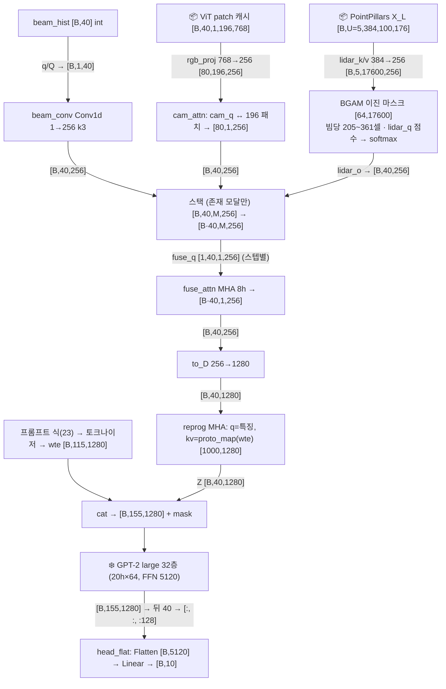

식(21) 융합 + 식(22) 재프로그래밍 내부:

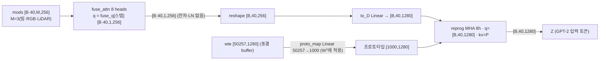

| 단계 | 연산 | 입력 shape | 출력 shape | 주요 하이퍼파라미터 | 근거 |
|---|---|---|---|---|---|
| 1 | beam q/Q → beam_conv | [B,1,40] | [B,256,40] → 전치 [B,40,256] | k3, d_m 256 | 실측 hook |
| 2 | rgb_proj | [B·40·1,196,768] | [80,196,256] | ViT 패치 196 | 실측 hook |
| 3 | cam_attn(cam_q ↔ 패치) | q [80,1,256], kv [80,196,256] | [80,1,256] → [B,40,256] | 8 heads | 실측 hook |
| 4 | lidar_k / lidar_v | [B,5,17600,384] | [B,5,17600,256] | 8 heads × 32 | 실측 hook |
| 5 | BGAM 마스크·softmax·V합 → lidar_o | 점수 [B,40,8,17600], mask_bin [64,17600] | [B,40,256] | δ_q 인접빔 반간격, 빔당 205~361셀 | 코드 기반(einsum) + 실측 buffer |
| 6 | 스택 → fuse_attn | q [80,1,256], kv [80,3,256] | [80,1,256] → [B,40,256] | 스텝별 질의 40개 | 실측 hook |
| 7 | to_D → reprog | [B,40,256] → [B,40,1280]; kv [B,1000,1280] | [B,40,1280] | V′=1000, 전체 어휘 사상 | 실측 hook |
| 8 | 프롬프트 wte → cat | [B,115] → [B,115,1280]; Z [B,40,1280] | [B,155,1280] | 115 토큰(식 23) | 실측 hook |
| 9 | GPT-2 32층(동결) | [B,155,1280] | [B,155,1280] | 20 heads, FFN 5120 | 실측 hook(h.0) |
| 10 | 뒤 40 · D_ff 절단 · head_flat | [B,40,128] → [B,5120] | [B,10] | d_ff 128 | 실측 hook |

```yaml
model: faithful_beam_predictor_paperB
file: mmw_reproduction/mmw_repro/models_faithful.py::FaithfulBeamPredictor (+ bgam_paper.py, dataset_faithful.py)
family: {prediction: parallel_10step_regression, tokenization: time_step_token_x3_modalities, fusion: early_per_step_query_attention_then_frozen_LLM, target: beam_index_64}
params_total: 753514098
params_trainable: {full: 58193778, index_only: 57470322, lidar_only: 57733490, rgb_only: 57930610}
sensor_increment_full_minus_index: 723456
config: {d_m: 256, hist: 40, pred: 10, Q: 64, gpt2: gpt2-large_32layers_frozen, D: 1280, d_ff: 128, n_proto: 1000, proto_vocab: 50257, heads: 8, lidar: pointpillars_xattn_bgam_binary, rgb: vit_b16_patch196_cached, align: window_backward_replication_j10}
inputs: {beam_hist: "[B,40] int", rgb: "[B,40,1,196,768] fp16 cache", bev: "[B,U,384,100,176] fp16 cache", bev_idx: "[B,40]"}
stages:
  - {name: beam_conv, type: conv1d_k3, in_shape: "[B,1,40]", out_shape: "[B,40,256]", params: 1024}
  - {name: rgb_branch, type: linear_plus_query_xattn, in_shape: "[B*40,196,768]", out_shape: "[B,40,256]", params: 460288}
  - {name: lidar_branch, type: bgam_masked_query_xattn_over_17600_cells, in_shape: "[B,5,384,100,176]", out_shape: "[B,40,256]", params: 263168}
  - {name: fuse_attn, type: per_step_query_attention_over_M_modalities, in_shape: "[B*40,3,256]", out_shape: "[B,40,256]", params: 273408}
  - {name: reprogramming, type: to_D_plus_vocab_prototype_xattn, in_shape: "[B,40,256]", out_shape: "[B,40,1280]", params: 57144680}
  - {name: prompt_prefix, type: text_prompt_wte_frozen, in_shape: "[B,115]", out_shape: "[B,115,1280]", params: 0}
  - {name: gpt2, type: frozen_gpt2_large_32L, in_shape: "[B,155,1280]", out_shape: "[B,155,1280]", params: 695320320, trainable: false}
  - {name: head_flat, type: truncate_dff_flatten_linear, in_shape: "[B,40,128]", out_shape: "[B,10]", params: 51210}
```

### 2.2 LWM 멀티모달 — `models/lwm_multimodal.py::LWMMultiModalPredictor(mode="multimodal")` (late fusion + projection adapter)

1. **요약/계열** [코드 기반 + 실측]: `MODEL_ARCHITECTURES.md` §2.5의 LWM(프레임 1토큰 × 16, post-norm 12층, D 128)을 그대로 채널 백본으로 쓰고, 128→256 어댑터 뒤에 **시각별 모달 어텐션(`PerTimeModalityFusion`) 3층**으로 이미지·LiDAR 토큰을 합친 뒤 공용 헤드(P 질의)로 4프레임을 낸다. **late fusion(백본 뒤·헤드 앞) · 시각별 모달 어텐션 · parallel(P 질의 one-shot) · 예측 타깃 = 채널 [B,4,64,64,2]**. 프로브 구성 = S1 `repo:lwm`(D 128, L 12, d_ff 512, heads 8, delta_t 0.01)에 `use_image=use_lidar=True`.
2. **입력**(센서 shape) [실측 hook]: `image_seq [B,T=4,3,224,224]`(또는 `[B,3,H,W]` 1장), `image_time_offsets [B,4,1]`(초), `image_valid_mask [B,4]`, `lidar_points [B,64,4]`, `lidar_mask [B,64]`. 채널 `X [B,16,64,64,2]`.
3. **전처리·시간 정렬**: 채널 평탄화 `[B,16,8192]` [코드 기반]. 이미지: 프레임 4장을 `[B·4,3,224,224]`로 펼쳐 인코딩 → `[B,4,49,256]` → `SensorFrameSummarizer`로 프레임당 1토큰 `[B,4,256]`(+오프셋 벡터) → `_align_sensor_to_history`(§1.3)로 K=16스텝에 배정 `[B,16,256]` + `img_valid [B,16]`(프로브 합성 오프셋에서는 앞 12스텝이 `no_image_token`) [실측 `ALIGN`]. LiDAR: `PointNetEncoder` `[B,16,256]` → 평균 1벡터 → 16스텝 복제 `[B,16,256]` + `lid_valid`(마스크에 유효점 있으면 True) [코드 기반]. 스택 → `sensor_tokens [B,16,2,256]`, `sensor_valid [B,16,2]` [실측 fusion 입력].
4. **임베딩/센서 인코더** [실측]: 채널 `embedding.proj` 8192→128 + `pos_embed` Embedding(64) → `_LayerNorm` `[B,16,128]`. 이미지 `ImageTokenEncoder`(11.32 M) `[8,3,224,224]` → `[8,49,256]`; `image_frame_summarizer`(0.27 M) `[2,4,49,256]`+`[2,4,1]` → `[2,4,256]`. LiDAR `PointNetEncoder`(0.57 M) `[2,64,4]` → `[2,16,256]`. `no_image_token`/`no_lidar_token` `[1,1,256]` 학습 상수.
5. **백본**: `_EncoderLayer` ×12(post-norm, 8 heads d_k 16, FFN 512 ReLU) `[B,16,128]` → `proj_adapter` Linear 128→256 + LN `[B,16,256]` — §2.5(채널 전용)와 동일 [실측].
6. **융합** [실측 hook]: `fusion_blocks.0~2` = `PerTimeModalityFusion`: 입력 ch `[2,16,256]`, sensor `[2,16,2,256]`, valid `[2,16,2]` → cat `[B,16,3,256]` → `[B·16=32,3,256]`; 질의 `query[:, :16]` → `[32,1,256]`; attn(4 heads, key_padding_mask `[32,3]` = 무효 센서 True) → `[32,1,256]` → `[2,16,256]` → GatedFFN(w1/w2 256→1024, w3 1024→256) → `[2,16,256]`. 3층 반복(각 층의 질의·FFN 독립, 센서 토큰은 매 층 동일). **채널 토큰 잔차 없음**(§1.2-3).
7. **헤드/출력**: `ChannelPredictionHead`(§1.5 of MODEL_ARCHITECTURES; D 256, N 16, hidden 512, delta_skip False) `[B,16,256]` → pool_attn(q `[B,4,256]`) → MLP 256→512→512→8192 → `[B,4,64,64,2]` [실측].
8. **학습·모드**: 이 구성으로 학습된 run 없음(S1은 channel_only). `delta_t` 기본 0.0005 → 이 데이터에서는 0.01 필수(§1.3). `mode="channel_only"`면 센서 모듈이 생성되지 않음(`_need_sensor=False`) [코드 기반].
9. **파라미터** [실측]: multimodal **23,704,832** = channel_only 8,333,440(embedding 1,057,152 + layers 2,379,264 + proj_adapter 33,536 + head 4,863,488) + **증분 15,371,392**(image_encoder 11,320,896 + image_frame_summarizer 265,984 + lidar_encoder 574,528 + fusion_blocks 3,209,472 = 3 × 1,069,824 + no_*_token 512). 증분의 74%가 ResNet18.

- **이 데이터셋 대응** [코드 기반 + STEP3 §3-1 조건표]: `image_seq` ← RSU `camera0.png`(640×480→224 리사이즈; 코드에 리사이즈·정규화 없음, 로더 몫) 또는 CAV camera0~3 중 1대(4대 동시 입력 경로 없음 — T축은 시간용). `lidar_points` ← RSU 또는 CAV `.pcd` 28k점 → **64점 부표본 필요**(로더 없음). 오프셋 ← 프레임 번호 차 × 0.01. 빠진 것: 깊이 PNG·레이더·CAV 위치(yaml) 입력 경로 없음; LiDAR는 창당 1프레임만(16프레임 1:1 정렬 불가).

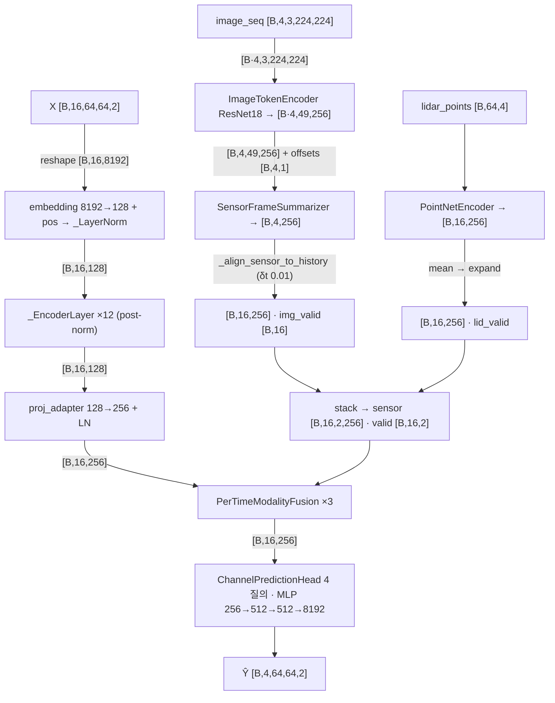

`PerTimeModalityFusion` 내부(실측 shape, B=2·K=16):

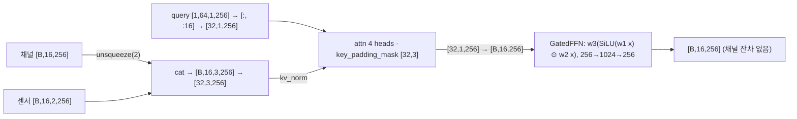

| 단계 | 연산 | 입력 shape | 출력 shape | 주요 하이퍼파라미터 | 근거 |
|---|---|---|---|---|---|
| 1 | 채널 embedding → layers ×12 → proj_adapter | [B,16,8192] | [B,16,256] | D 128, 8 heads, FFN 512 | 실측 hook |
| 2 | image_encoder (B·T 프레임) | [8,3,224,224] | [8,49,256] | ResNet18, grid 7 | 실측 hook |
| 3 | image_frame_summarizer | [2,4,49,256] + [2,4,1] | [2,4,256] | 질의 1개, time_proj | 실측 hook |
| 4 | _align_sensor_to_history | [B,4,256], 오프셋 | [B,16,256], valid [B,16] | delta_t 0.01 | 실측 호출(§1.3) |
| 5 | lidar_encoder → mean → expand | [2,64,4] | [2,16,256] → [B,16,256] | max_points 64, 16 질의 | 실측 hook + 코드 기반 |
| 6 | stack | 2 × [B,16,256] | [B,16,2,256], valid [B,16,2] | — | 실측(fusion 입력) |
| 7 | fusion_blocks.0~2 attn | q [32,1,256], kv [32,3,256] | [32,1,256] | 4 heads, mask [32,3] | 실측 hook |
| 8 | fusion_blocks.i ffn | [2,16,256] | [2,16,1024] → [2,16,256] | SwiGLU | 실측 hook |
| 9 | head.pool_attn → mlp → view | q [2,4,256], kv [2,16,256] | [2,4,64,64,2] | hidden 512 | 실측 hook |

```yaml
model: lwm_multimodal
file: multimodal_code_index/models/lwm_multimodal.py::LWMMultiModalPredictor
family: {prediction: parallel_query_head, tokenization: wideband_frame_token, fusion: late_per_time_modality_attention_x3, target: channel_4frames}
params_total: 23704832
params_channel_only: 8333440
sensor_increment: 15371392
config: {d_model: 128, n_layers: 12, n_heads: 8, d_ff: 512, embed_dim: 256, fusion_layers: 3, fusion_heads: 4, delta_t: 0.01, image_frames: 4, lidar_max_points: 64, lidar_num_tokens: 16, pretrained_image: true_cached}
sensor_inputs: {image_seq: "[B,T,3,224,224]", image_time_offsets: "[B,T,1] s", image_valid_mask: "[B,T]", lidar_points: "[B,64,4]", lidar_mask: "[B,64]"}
stages:
  - {name: channel_backbone, type: lwm_postnorm_x12_plus_adapter, in_shape: "[B,16,8192]", out_shape: "[B,16,256]", params: 3469952}
  - {name: image_encoder, type: resnet18_tokens49, in_shape: "[B*T,3,224,224]", out_shape: "[B*T,49,256]", params: 11320896}
  - {name: image_frame_summarizer, type: query_pool_plus_time_offset, in_shape: "[B,T,49,256]", out_shape: "[B,T,256]", params: 265984}
  - {name: align, type: offset_gather_or_no_token, in_shape: "[B,T,256]", out_shape: "[B,16,256]", params: 256}
  - {name: lidar_encoder, type: pointnet_query_pool16_mean_expand, in_shape: "[B,64,4]", out_shape: "[B,16,256]", params: 574784}
  - {name: fusion_blocks, type: per_time_modality_attention_gatedffn, in_shape: "[B,16,256] + [B,16,2,256]", out_shape: "[B,16,256]", params: 3209472, repeat: 3}
  - {name: head, type: query_cross_attn_mlp, in_shape: "[B,16,256]", out_shape: "[B,4,64,64,2]", params: 4863488}
```

### 2.3 LWM-Temporal 멀티모달 — `models/lwm_temporal_multimodal.py::LWMTemporalMultiModalPredictor(mode="multimodal")` (CLS 주입)

1. **요약/계열** [코드 기반 + 실측]: `MODEL_ARCHITECTURES.md` §2.6의 LWM-Temporal(20프레임 × 8×32 패치 16 = 320 토큰 + CLS, 희소 시공간 attention 6층, 마스크 복원)에서, 이미지 토큰(T×49)과 LiDAR 토큰(16)을 이어 붙인 센서 토큰열을 **학습 질의 1개로 압축한 `scene_ctx [B,1,D]`를 CLS 토큰에 더해(주입)** 넣는다. 모든 채널 토큰이 CLS를 이웃으로 포함하므로 장면 문맥이 attention으로 전파된다는 설계(docstring "보고서 12"). **early(백본 입력 CLS) · 전역 1토큰 주입 · parallel(마스크 복원) · 타깃 = 채널**. 프로브 구성 = S1 `repo:lwm_temporal`(patch 8×32, D 128, L 6, heads 8) + 센서.
2. **입력** [실측]: `image_seq [B,4,3,224,224]`, `image_valid_mask [B,4]`, `lidar_points [B,64,4]`, `lidar_mask [B,64]`. `image_time_offsets`는 **받지 않음**(시간 정렬 없음). 채널 `X`.
3. **전처리·시간 정렬**: 채널은 §2.6과 동일(complex 변환 + 빈 미래 4프레임 → `[B,20,64,64]` complex → 토크나이저 `[B,320,512]`, 마지막 64토큰 마스크) [실측 `lwm` 입력]. 센서에 시간 정렬 없음: 이미지 4장의 토큰 196개와 LiDAR 16개를 **시간 구분 없이** cat → `[B,212,128]` [실측 `scene_attn` kv]. `image_valid_mask`가 False인 프레임 토큰은 `no_image_token`으로 대체(where) [코드 기반].
4. **임베딩/센서 인코더** [실측]: `ImageTokenEncoder(embed_dim=128)` `[8,3,224,224]` → `[8,49,128]`(proj Conv 512→128; 파라미터 11,248,704); `PointNetEncoder(embed_dim=128)` `[2,64,4]` → `[2,16,128]`(160,704). 채널 `patch_embed` Linear 512→128 `[B,320,128]`.
5. **백본**: `_LWMModelCLSInject.forward_tokens`: `cls_token [1,1,128] + cls_inject [B,1,128]` → 끝에 append `[B,321,128]` → 위치임베딩 → masked_fill → `LWMEncoder` ×6(희소 시공간 attention, `qkv [2,321,128]→[2,321,384]`, top-k 48) → `[B,321,128]` [실측]. CLS 자체는 기존과 같이 모든 토큰의 이웃(§2.6 `cls_neighbors`).
6. **융합** [실측 hook]: `scene_attn` MHA(4 heads, dropout 없음): q = `scene_query [1,1,128]` → `[2,1,128]`, kv = 센서 토큰 `[2,212,128]` → `[2,1,128]`(가중치 `[2,1,212]`) → `scene_norm` LayerNorm → `cls_inject`. 융합 = **CLS 토큰 초기값에 가산**(단일 벡터, 128차원) → 이후 채널 토큰과의 상호작용은 백본 attention이 담당(명시적 게이트·잔차 없음).
7. **헤드/출력**: `lwm.head` Linear 128→512 `[B,320,128]`(CLS 제외) → `[B,320,512]` → 마지막 64토큰 → un-patchify → `[B,4,64,64,2]` [실측 + 코드 기반].
8. **학습·모드**: 이 구성으로 학습된 run 없음. `mode="channel_only"`는 `cls_inject=None`(§2.6과 동일 1,360,512).
9. **파라미터** [실측]: multimodal **12,836,608** = channel_only 1,360,512 + **증분 11,476,096**(image_encoder 11,248,704 + lidar_encoder 160,704 + scene_attn 66,048 + scene_norm 256 + scene_query 128 + no_*_token 256). 융합 자체는 66 k, 증분의 98%가 ResNet18.

- **이 데이터셋 대응**: §2.2와 동일(RSU camera0 또는 CAV 카메라 1대, LiDAR 64점 부표본). 시간 정보가 없어 4장을 넣어도 "어느 시각의 이미지인지" 모델이 구분할 수 없다(프레임 위치 임베딩 없음) [코드 기반]. 깊이·레이더·위치 경로 없음.

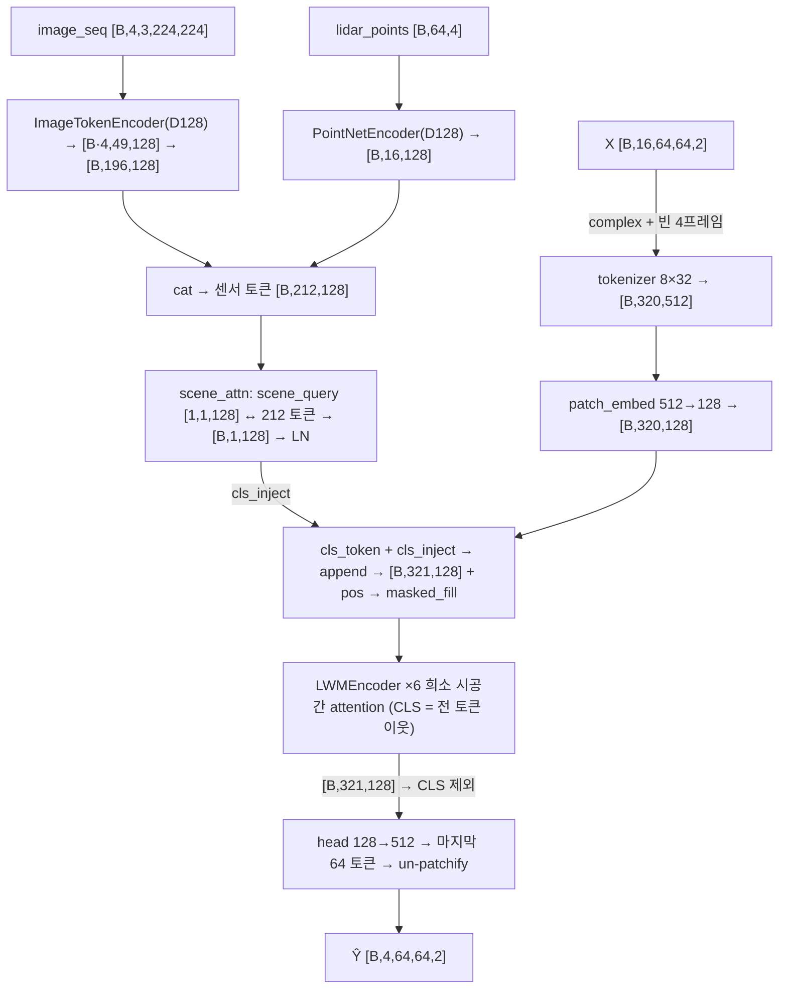

CLS 주입 경로(`_LWMModelCLSInject.forward_tokens`):

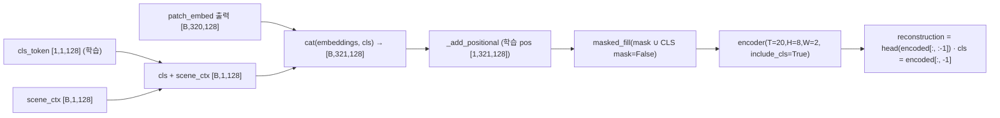

| 단계 | 연산 | 입력 shape | 출력 shape | 주요 하이퍼파라미터 | 근거 |
|---|---|---|---|---|---|
| 1 | complex + concat + tokenizer | [B,16,64,64,2] | [B,320,512], mask [B,320] | patch 8×32 | 실측(lwm 입력) + 코드 기반 |
| 2 | image_encoder | [8,3,224,224] | [8,49,128] → [B,196,128] | ResNet18, D 128 | 실측 hook |
| 3 | lidar_encoder | [2,64,4] | [2,16,128] | 16 질의 | 실측 hook |
| 4 | cat → scene_attn → scene_norm | q [2,1,128], kv [2,212,128] | [2,1,128] | 4 heads | 실측 hook |
| 5 | patch_embed | [2,320,512] | [2,320,128] | — | 실측 hook |
| 6 | CLS + inject, append, pos, mask | [B,320,128] | [B,321,128] | — | 코드 기반 |
| 7 | encoder ×6 | [2,321,128] | [2,321,128] | qkv 384, top-k 48 | 실측 hook |
| 8 | head → 마지막 64 → un-patchify | [2,320,128] | [2,4,64,64,2] | patch_dim 512 | 실측 + 코드 기반 |

```yaml
model: lwm_temporal_multimodal
file: multimodal_code_index/models/lwm_temporal_multimodal.py::LWMTemporalMultiModalPredictor
family: {prediction: parallel_masked_reconstruction, tokenization: patch2d_x_time_tokens_plus_cls, fusion: early_cls_injection_single_vector, target: channel_4frames}
params_total: 12836608
params_channel_only: 1360512
sensor_increment: 11476096
config: {embed_dim: 128, depth: 6, num_heads: 8, patch: [8, 32], tokens: 321, scene_attn_heads: 4, image_frames: 4, lidar_max_points: 64, lidar_num_tokens: 16, time_alignment: none}
sensor_inputs: {image_seq: "[B,T,3,224,224]", image_valid_mask: "[B,T]", lidar_points: "[B,64,4]", lidar_mask: "[B,64]"}
stages:
  - {name: tokenizer_patch_embed, type: complex_patchify_linear, in_shape: "[B,16,64,64,2]", out_shape: "[B,320,128]", params: 65664}
  - {name: image_encoder, type: resnet18_tokens49_D128, in_shape: "[B*T,3,224,224]", out_shape: "[B,T*49,128]", params: 11248704}
  - {name: lidar_encoder, type: pointnet_query_pool16_D128, in_shape: "[B,64,4]", out_shape: "[B,16,128]", params: 160704}
  - {name: scene_ctx, type: single_query_xattn_layernorm, in_shape: "[B,212,128]", out_shape: "[B,1,128]", params: 66432}
  - {name: cls_inject_encoder, type: cls_add_sparse_st_attention_x6, in_shape: "[B,321,128]", out_shape: "[B,321,128]", params: 1228800}
  - {name: head_unpatchify, type: linear_select_last64, in_shape: "[B,320,128]", out_shape: "[B,4,64,64,2]", params: 66048}
```

### 2.4 Chiron 멀티모달 — `models/chiron_multimodal.py::ChironMultiModalPredictor(mode="multimodal")` (이미지 시퀀스·ego state·future query decoder)

1. **요약/계열** [코드 기반 + 실측]: `MODEL_ARCHITECTURES.md` §2.7 Chiron 백본(4×32 패치 32 × 16프레임 = 512 토큰, 시간/공간 분해 attention 6층)의 출력 토큰 512개가 **`GatedCrossModalFusion` 3층**으로 센서 토큰(이미지 4장 × 49 = 196 + LiDAR 16 = 212)에 cross-attention한 뒤 공용 헤드(P 질의)로 4프레임을 낸다. **late(백본 뒤) · 토큰 수준 cross-attention + 시그모이드 게이트 잔차 · parallel(P 질의) · 타깃 = 채널**. 프로브 구성 = S1 `repo:chiron`(D 256, L 6, heads 4, patch 4×32, head hidden 1024) + `use_image=use_lidar=use_ego_state=True`, fusion 3층, `max_image_frames=4`.
2. **입력** [실측]: `channel_history [B,16,64,64,2]`, `image_seq [B,4,3,224,224]`, `image_valid_mask [B,4]`, `lidar_points [B,64,4]`, `lidar_mask [B,64]`, `ego_state [B,6]`. (`image=` 단일 이미지 legacy 인자도 있음.)
3. **전처리·시간 정렬**: 채널 패치화 `[B·16,64,64,2]` → `[B·16,32,256]` [실측 patch_embed]. 이미지: `ImageSequenceEncoder`(§1.1-8) — 프레임 위치 `frame_pos [1,4,256]` 가산 + 프레임 요약 간 temporal_attn → **채널 16스텝과의 시간 대응은 없음**(196 토큰을 한 덩어리로 제공, 프레임 순서만 임베딩). LiDAR: 16토큰 그대로(복제·평균 없음). 무효 프레임/점구름은 `no_image_token`/`no_lidar_token`으로 대체 [코드 기반]. `all_sensor_masks`는 전부 False(패딩 없음) → key_padding_mask가 실제로 아무것도 가리지 않음 [코드 기반: `torch.zeros(..., dtype=bool)`].
4. **임베딩/센서 인코더** [실측]: `ImageTokenEncoder` `[8,3,224,224]` → `[8,49,256]`; `image_seq_encoder` → `[2,196,256]` + mask `[2,196]`(temporal_attn `[2,4,256]`, key_padding_mask `[2,4]`); `PointNetEncoder` `[2,64,4]` → `[2,16,256]`; `EgoStateEncoder` `[2,6]` → `[2,256]`.
5. **백본**: `patch_embed`(Linear·LN·GELU) → + temporal_pos `[1,16,1,256]` + spatial_pos `[1,1,32,256]` → `[B,512,256]` → `ChironBlock` ×6(temporal → spatial → GatedFFN) → `channel_norm` → `[B,512,256]` [실측]. `_init_weights`가 모든 Linear를 trunc N(0,0.02)로 재초기화(ResNet의 Conv/BN은 대상 아님) [코드 기반].
6. **융합** [실측 hook]: `fusion_blocks.0~2` `GatedCrossModalFusion`: q_norm(채널 `[2,512,256]`), kv_norm(센서 `[2,212,256]`) → cross_attn(4 heads) → `[2,512,256]`(가중치 `[2,512,212]`) → gate σ(Linear 512→256 on cat `[2,512,512]`) → 채널 + g⊙attn → GatedFFN → `[2,512,256]`. 3층. **`ego_state`는 인코딩만 되고(hook x1) multimodal 분기에서 사용되지 않는다** — `condition`은 `image_only` 분기의 `decoder`에만 전달됨(`forward` 541~622행) [코드 기반 + 실측: `decoder` hook이 multimodal에서 발화하지 않음].
7. **헤드/출력**: `ChannelPredictionHead`(D 256, hidden 1024, delta_skip False) `[B,512,256]` → `[B,4,64,64,2]` [실측]. `image_only`: `decoder`(FutureQueryDecoder, condition=ego) `[2,196,256]` → `[2,256]` → `head(latent.unsqueeze(1))` = 토큰 1개에 pool_attn `[2,4,1]` → `[2,4,64,64,2]` [실측].
8. **학습·모드**: 이 클래스로 학습된 run 없음(S1은 `ChironChannelPredictor`). `channel_only`는 센서·융합 모듈을 만들지 않지만 **`ego_encoder`·`decoder`는 항상 생성**(미사용 파라미터 1,122,816) [실측: channel_only 20,279,552 = 09의 ChironChannelPredictor 19,156,736 + 68,608 + 1,054,208].
9. **파라미터** [실측]: multimodal **35,995,520** = channel_only 20,279,552 + **증분 15,715,968**(image_encoder 11,320,896 + image_seq_encoder 265,728 + lidar_encoder 574,528 + fusion_blocks 3,554,304 = 3 × 1,184,768 + no_*_token 512). image_only 22,688,064.

- **이 데이터셋 대응**: `image_seq` ← RSU camera0(또는 CAV 카메라 1대) 최근 4프레임(10 ms 간격이면 40 ms 창; 프레임 선택 규칙은 로더 몫), `lidar_points` ← pcd 64점 부표본(로더 없음), `ego_state` ← CAV yaml `sensors.vehicle_pose.location + vehicle_speed.speed`(§0.3 실측) 또는 `predicted_ego_pos` — **단 multimodal 모드에서는 무시됨**. 깊이·레이더 경로 없음. 채널 512토큰 ↔ 센서 212토큰의 시간 대응 없음(센서 4프레임 vs 채널 16프레임).

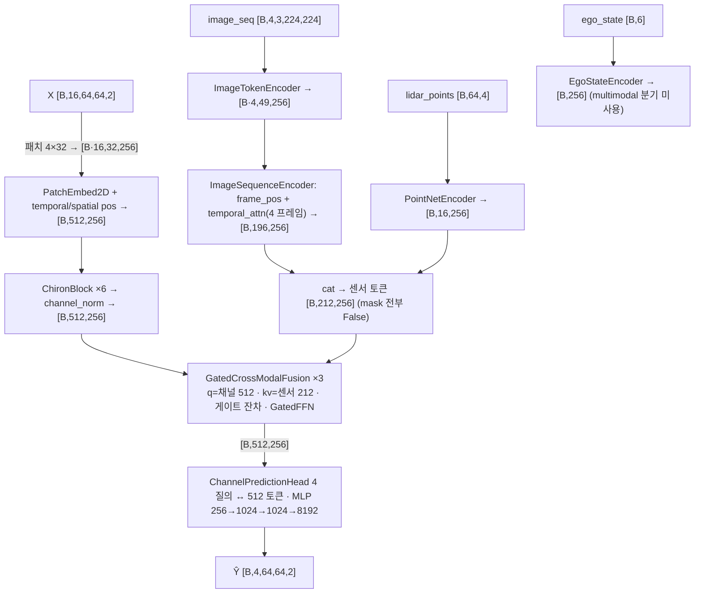

`GatedCrossModalFusion` 내부(실측 shape):

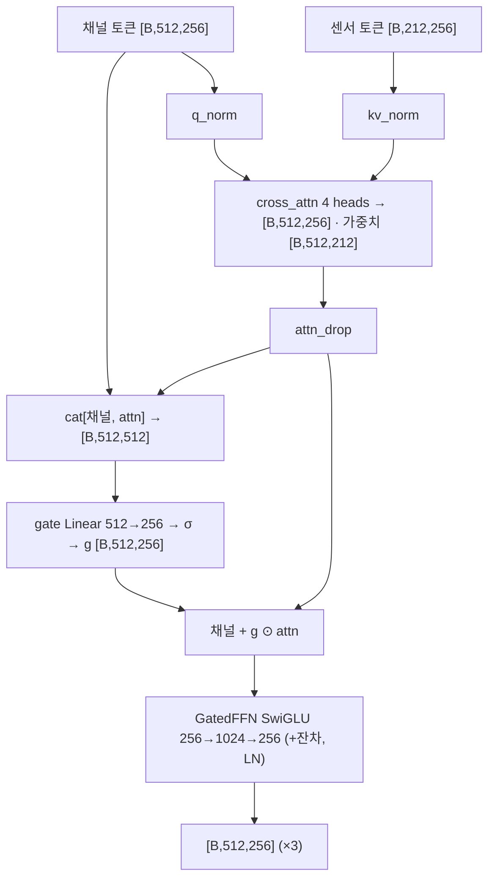

| 단계 | 연산 | 입력 shape | 출력 shape | 주요 하이퍼파라미터 | 근거 |
|---|---|---|---|---|---|
| 1 | patch_embed + pos → blocks ×6 → channel_norm | [B·16,64,64,2] | [B,512,256] | D 256, heads 4, k7 | 실측 hook |
| 2 | image_encoder | [8,3,224,224] | [8,49,256] | ResNet18 | 실측 hook |
| 3 | image_seq_encoder(frame_pos, temporal_attn) | [2,4,49,256] | [2,196,256], mask [2,196] | max_image_frames 4 | 실측 hook |
| 4 | lidar_encoder | [2,64,4] | [2,16,256] | 16 질의 | 실측 hook |
| 5 | ego_encoder (미사용) | [2,6] | [2,256] | — | 실측 hook + 코드 기반 |
| 6 | cat 센서 | [B,196,256], [B,16,256] | [B,212,256] | — | 코드 기반 |
| 7 | fusion_blocks.0~2 cross_attn / gate / ffn | q [2,512,256], kv [2,212,256] | [2,512,256] | 4 heads, σ 게이트 | 실측 hook |
| 8 | head | [2,512,256] | [2,4,64,64,2] | hidden 1024 | 실측 hook |

```yaml
model: chiron_multimodal
file: multimodal_code_index/models/chiron_multimodal.py::ChironMultiModalPredictor
family: {prediction: parallel_query_head, tokenization: patch2d_4x32_x_time, fusion: late_token_cross_attention_sigmoid_gate_x3, target: channel_4frames}
params_total: 35995520
params_channel_only: 20279552
params_image_only: 22688064
sensor_increment: 15715968
config: {embed_dim: 256, depth: 6, num_heads: 4, patch: [4, 32], tokens: 512, fusion_layers: 3, fusion_heads: 4, image_frames: 4, image_grid: 7, lidar_max_points: 64, lidar_num_tokens: 16, ego_state_dim: 6, ego_used_in_multimodal: false, time_alignment: none}
sensor_inputs: {image_seq: "[B,T,3,224,224]", image_valid_mask: "[B,T]", lidar_points: "[B,64,4]", lidar_mask: "[B,64]", ego_state: "[B,6]"}
stages:
  - {name: channel_backbone, type: chiron_blocks_x6, in_shape: "[B*16,64,64,2]", out_shape: "[B,512,256]", params: 9178368}
  - {name: image_encoder, type: resnet18_tokens49, in_shape: "[B*T,3,224,224]", out_shape: "[B*T,49,256]", params: 11320896}
  - {name: image_seq_encoder, type: frame_pos_temporal_attn_flatten, in_shape: "[B,T,49,256]", out_shape: "[B,T*49,256]", params: 265728}
  - {name: lidar_encoder, type: pointnet_query_pool16, in_shape: "[B,64,4]", out_shape: "[B,16,256]", params: 574528}
  - {name: ego_encoder_unused, type: mlp_6_to_256, in_shape: "[B,6]", out_shape: "[B,256]", params: 68608, note: "multimodal 분기 미사용"}
  - {name: fusion_blocks, type: gated_cross_modal_fusion, in_shape: "[B,512,256] x [B,212,256]", out_shape: "[B,512,256]", params: 3554304, repeat: 3}
  - {name: decoder_unused_in_multimodal, type: future_query_decoder, params: 1054208, note: "image_only 전용"}
  - {name: head, type: query_cross_attn_mlp, in_shape: "[B,512,256]", out_shape: "[B,4,64,64,2]", params: 9978368}
```

### 2.5 MSCP 멀티모달 — `models/mscp_multimodal.py::MSCPMultiModalPredictor(mode="multimodal" | "rf_scene")` (장면 토큰)

1. **요약/계열** [코드 기반 + 실측]: 프레임 1토큰 채널 인코더(`ChannelTokenEncoder`, pre-norm Transformer 3층, D 256) 토큰 16개가 **`CrossModalFusionBlock` 2층**으로 "센싱 토큰"(이미지 4장×49 = 196 + **명시적 장면 토큰** 10 = 자차 1 + 객체 요약 1 + 객체 8)에 cross-attention하고, 융합 채널 토큰과 센싱 토큰을 이어 붙인 문맥(222)을 **단일 미래 질의(`FutureQueryDecoder`)** 가 읽어 벡터 1개 → MLP 헤드(`PredictionHead`) → **미래 채널 1프레임 `[B,64,64,2]`**. **late(인코더 뒤) · 토큰 cross-attention(게이트 없음) + 단일 질의 디코더 · 타깃 = 채널 1프레임(P 축 없음)**. docstring: MSCP 논문의 비트 정확 재구현 아님(논문 ID 미기재 → 확인 불가). 모드 `rf_scene` = 채널 + 장면 토큰만(이미지 없음).
2. **입력** [실측]: `channel_history [B,16,64,64,2]`(5D면 내부 reshape), `image_seq [B,4,3,224,224]`, `image_time_offsets [B,4,1]`, `image_valid_mask [B,4]`, `ue_position [B,3]` + `ue_velocity [B,3]`(→ `ego_state [B,6]` 합성) 또는 `ego_state`, `vehicles_all [B,8,4]`(= `object_features`), `object_valid_mask [B,8]`, (`scene_features` dim 0 → 미사용).
3. **전처리·시간 정렬**: 채널 reshape `[B,16,8192]` [코드 기반]. 이미지: 프레임 위치 `image_frame_pos_embed [1,4,256]` + `time_proj(offsets)` `[8,1]→[8,256]`(프레임별 오프셋 벡터) → frame_norm → 토큰에 가산 → 프레임 요약 mean → `image_temporal_encoder`(pre-norm Transformer 1층, `[2,4,256]`, src_key_padding_mask) → 요약을 토큰에 되더함 → `[B,196,256]` + image_token_norm [실측]. **채널 16스텝과의 대응 없음**. 디코더 조건 = `time_proj(min offset)` `[2,1]→[2,256]`(가장 최근 이미지까지의 시간) [실측: time_proj 2회 호출].
4. **임베딩/센서 인코더** [실측]: `ResNetImageTokenEncoder` `[8,3,224,224]` → `[8,49,256]`; `MSCPSceneEncoder` ego `[2,6]` → `[2,1,256]`, objects `[2,8,4]` → `[2,8,256]` + 요약 `[2,1,256]` → `[2,10,256]` + mask `[2,10]`(무효 객체 True); `ChannelTokenEncoder` `[2,16,8192]` → `[2,16,256]`.
5. **백본**: 채널 `input_proj` 8192→256·LN·GELU + pos_embed → `nn.TransformerEncoder` ×3(4 heads, FFN 1024, GELU, pre-norm) → output_norm [실측].
6. **융합** [실측 hook]: 센싱 토큰 = cat(이미지 `[2,196,256]`, 장면 `[2,10,256]`) = `[2,206,256]` + mask `[2,206]`. `fusion.0~1` `CrossModalFusionBlock`: q = 채널 `[2,16,256]`, kv = `[2,206,256]` → attn(4 heads, key_padding_mask) → + 잔차 → + FFN(256→1024→256) → `[2,16,256]`. 그다음 `context = cat(fused [2,16,256], sensing [2,206,256]) = [2,222,256]` → `decoder`(질의 1 + condition `[2,256]`) → `[2,256]`. `rf_scene`: 센싱 `[2,10,256]`, context `[2,26,256]`, condition 없음 [실측].
7. **헤드/출력**: `PredictionHead` MLP 256→1024(LN·GELU·Drop)→1024→8192 → reshape **`[B,64,64,2]`** — `prediction_horizon` 인자 자체가 없어 **4프레임 출력 불가**(H=4에 쓰려면 헤드 교체 필요) [실측 + 코드 기반].
8. **학습·모드**: 학습 run 없음. `channel_only` = 채널 토큰 16개 → decoder → head. `image_only`/`scene_only` 모드도 존재(미프로브).
9. **파라미터** [실측]: multimodal **28,820,800** = channel_only 14,989,312(channel_encoder 4,484,096 + decoder 790,528 + prediction_head 9,713,664 + time_proj 1,024) + **증분 13,831,488**(image_encoder 11,320,896 + image_temporal_encoder 789,760 + scene_encoder 138,240 + fusion 1,580,544 = 2 × 790,272 + 프레임 pos·norm 2,048). rf_scene 16,708,096(증분 1,718,784 = scene 138,240 + fusion 1,580,544).

- **이 데이터셋 대응** [코드 기반 + §0.3 실측]: 장면 토큰이 이 데이터셋과 가장 잘 맞는다 — `ue_position/velocity` ← CAV yaml `sensors.vehicle_pose.location`·`vehicle_speed.speed`(오라클) 또는 `predicted_ego_pos`(0.4 m 오차)·`GPS`(1.3 m); `vehicles_all [B,N,4]` ← cav yaml `vehicles/<id>`(location[3] + speed → 4차원; 프레임당 3~15대라 N 패딩 + `object_valid_mask` 필요) 또는 `scenes/NNNNNN.yaml`(전 차량). 이미지 ← RSU camera0 / CAV 카메라 1대. 빠진 것: LiDAR·깊이·레이더 경로 없음, 출력 1프레임. 좌표는 CARLA 월드 좌표 그대로 들어감(RSU 기준 변환은 로더 몫).

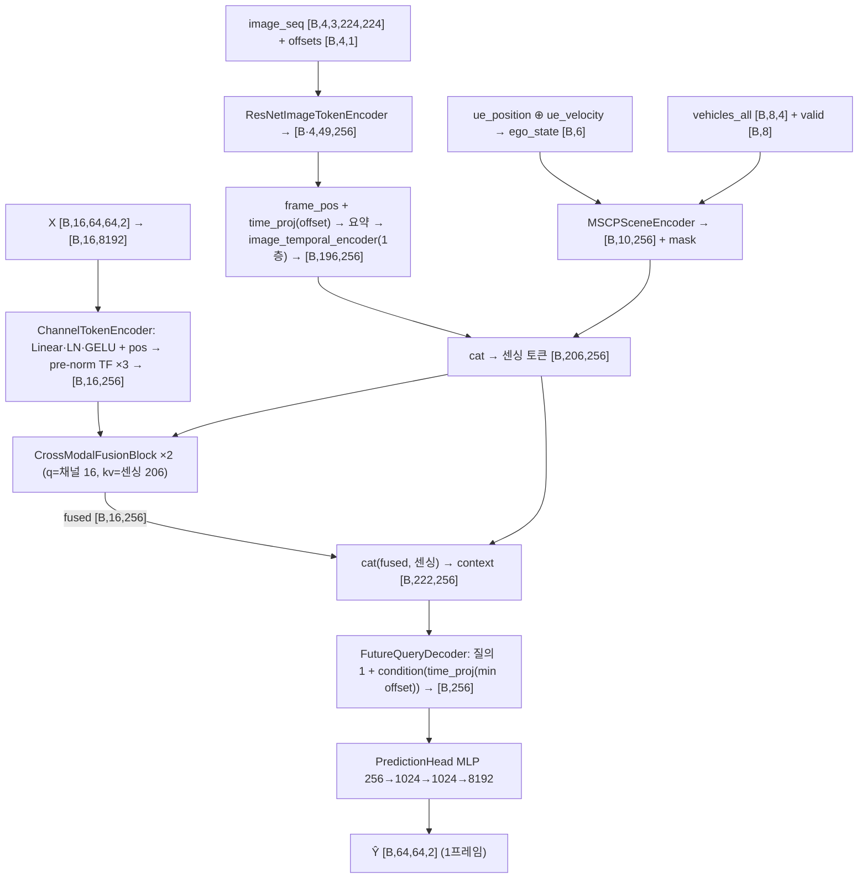

`CrossModalFusionBlock` + `FutureQueryDecoder`(`multi_modal_predictator.py`) 내부:

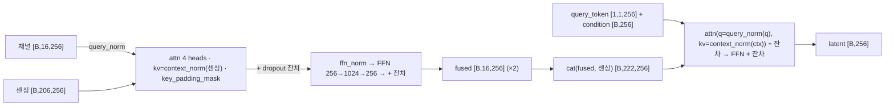

| 단계 | 연산 | 입력 shape | 출력 shape | 주요 하이퍼파라미터 | 근거 |
|---|---|---|---|---|---|
| 1 | channel_encoder | [2,16,8192] | [2,16,256] | 3층, 4 heads, FFN 1024 | 실측 hook |
| 2 | image_encoder | [8,3,224,224] | [8,49,256] | ResNet18 | 실측 hook |
| 3 | time_proj(프레임 오프셋) + frame_pos → image_temporal_encoder | [8,1]→[8,256]; [2,4,256] | [2,4,256] | 1층 | 실측 hook |
| 4 | 이미지 토큰 평탄화 + norm | [2,4,49,256] | [2,196,256] | — | 실측(image_token_norm) |
| 5 | scene_encoder | ego [2,6], obj [2,8,4] | [2,10,256], mask [2,10] | ego 1 + 요약 1 + 객체 8 | 실측 hook |
| 6 | cat 센싱 | [2,196,256] + [2,10,256] | [2,206,256] | — | 코드 기반 |
| 7 | fusion.0~1 | q [2,16,256], kv [2,206,256] | [2,16,256] | 4 heads | 실측 hook |
| 8 | context cat → decoder(+condition) | [2,222,256], cond [2,256] | [2,256] | 질의 1개 | 실측 hook |
| 9 | prediction_head | [2,256] | [2,64,64,2] | 1024, 3층 | 실측 hook |

```yaml
model: mscp_multimodal
file: multimodal_code_index/models/mscp_multimodal.py::MSCPMultiModalPredictor
family: {prediction: single_query_decoder_one_frame, tokenization: frame_token_x16, fusion: late_token_cross_attention_x2_plus_context_concat, target: channel_1frame}
params_total: {multimodal: 28820800, rf_scene: 16708096, channel_only: 14989312}
sensor_increment: {multimodal: 13831488, rf_scene: 1718784}
config: {embed_dim: 256, channel_encoder: transformer_3L_4h, fusion_layers: 2, image_frames: 4, image_temporal_layers: 1, ego_state_dim: 6, object_feature_dim: 4, scene_feature_dim: 0, prediction_horizon: 1_fixed}
sensor_inputs: {image_seq: "[B,T,3,224,224]", image_time_offsets: "[B,T,1]", image_valid_mask: "[B,T]", ego_state_or_ue_position_velocity: "[B,6] / [B,3]+[B,3]", vehicles_all: "[B,N,4]", object_valid_mask: "[B,N]"}
stages:
  - {name: channel_encoder, type: linear_pos_prenorm_tf_x3, in_shape: "[B,16,8192]", out_shape: "[B,16,256]", params: 4484096}
  - {name: image_tokens, type: resnet18_tokens49_frame_pos_time_temporal_tf1, in_shape: "[B,T,3,224,224]", out_shape: "[B,T*49,256]", params: 12112704}
  - {name: scene_encoder, type: ego_mlp_plus_object_mlp_summary, in_shape: "[B,6] + [B,N,4]", out_shape: "[B,N+2,256]", params: 138240}
  - {name: fusion, type: cross_modal_fusion_block, in_shape: "[B,16,256] x [B,206,256]", out_shape: "[B,16,256]", params: 1580544, repeat: 2}
  - {name: decoder, type: single_future_query_conditioned, in_shape: "[B,222,256]", out_shape: "[B,256]", params: 790528}
  - {name: prediction_head, type: mlp_3layer, in_shape: "[B,256]", out_shape: "[B,64,64,2]", params: 9713664}
```

### 2.6 LSTM 멀티모달 — `models/lstm_multimodal.py::LSTMMultiModalPredictor(mode="multimodal")`

1. **요약/계열** [코드 기반 + 실측]: §2.2와 센서 경로·정렬·융합·헤드가 **동일 코드**이고 채널 백본만 wideband `nn.LSTM(8192, 256, 3층)`이다. **late · 시각별 모달 어텐션 ×3 · parallel(P 질의) · 타깃 = 채널 4프레임**. 프로브 구성 = 기본 인자(hidden 256, 3층, dropout 0.1) + `use_image=use_lidar=True`, delta_t 0.01. S1의 `lstm`(`cp/cp_models.py`, 512 hidden 2층 + 지평별 Linear 헤드)과는 다른 클래스.
2. **입력** [실측]: §2.2와 동일(`image_seq`, `image_time_offsets`, `image_valid_mask`, `lidar_points`, `lidar_mask`).
3. **전처리·시간 정렬**: §2.2와 동일(§1.3 `_align_sensor_to_history` 복제 코드) [코드 기반].
4. **임베딩/센서 인코더**: §2.2와 동일 모듈·shape [실측].
5. **백본** [실측]: `lstm` `[2,16,8192]` → out `[2,16,256]`, (h_n, c_n) `[3,2,256]`; `channel_proj` = Identity(hidden 256 = embed 256). 층 0 입력 8192→게이트 4×256, 층 1·2 256→256(층간 dropout 0.1) [코드 기반 nn.LSTM].
6. **융합**: `PerTimeModalityFusion` ×3, 실측 shape §2.2와 동일(q `[32,1,256]`, kv `[32,3,256]`, mask `[32,3]`).
7. **헤드/출력**: `ChannelPredictionHead`(D 256, hidden 512, delta_skip False) → `[B,4,64,64,2]` [실측].
8. **학습·모드**: 학습 run 없음. channel_only = LSTM + head.
9. **파라미터** [실측]: multimodal **29,940,352** = channel_only 14,568,960(lstm 9,705,472 = 8,652,800 + 2 × 526,336; head 4,863,488) + **증분 15,371,392**(§2.2와 동일 구성).

- **이 데이터셋 대응**: §2.2와 동일.

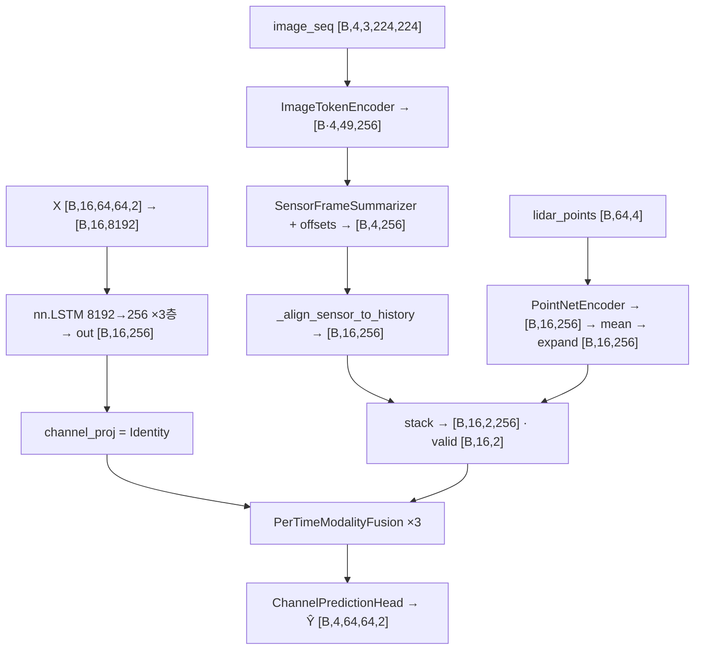

LSTM 셀(코드 기반, `nn.LSTM` 내부; hook은 모듈 단위만 발화):

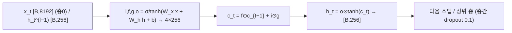

| 단계 | 연산 | 입력 shape | 출력 shape | 주요 하이퍼파라미터 | 근거 |
|---|---|---|---|---|---|
| 1 | reshape → nn.LSTM | [2,16,8192] | out [2,16,256], (h,c) [3,2,256] | hidden 256, 3층 | 실측 hook |
| 2 | channel_proj | [2,16,256] | [2,16,256] | Identity | 실측 hook |
| 3~6 | 이미지·LiDAR·정렬·stack | §2.2 표 2~6 | [B,16,2,256] | — | 실측 hook |
| 7 | fusion_blocks.0~2 | q [32,1,256], kv [32,3,256] | [2,16,256] | 4 heads | 실측 hook |
| 8 | head | [2,16,256] | [2,4,64,64,2] | hidden 512 | 실측 hook |

```yaml
model: lstm_multimodal
file: multimodal_code_index/models/lstm_multimodal.py::LSTMMultiModalPredictor
family: {prediction: parallel_query_head, tokenization: wideband_frame_token, recurrence: lstm_3layer, fusion: late_per_time_modality_attention_x3, target: channel_4frames}
params_total: 29940352
params_channel_only: 14568960
sensor_increment: 15371392
config: {lstm_hidden: 256, lstm_layers: 3, embed_dim: 256, fusion_layers: 3, fusion_heads: 4, delta_t: 0.01, image_frames: 4, lidar_max_points: 64, lidar_num_tokens: 16}
stages:
  - {name: lstm, type: lstm_3layer, in_shape: "[B,16,8192]", out_shape: "[B,16,256]", params: 9705472}
  - {name: sensor_stack, type: same_as_lwm_multimodal, in_shape: "image [B,T,3,224,224], lidar [B,64,4]", out_shape: "[B,16,2,256]", params: 12161920}
  - {name: fusion_blocks, type: per_time_modality_attention_gatedffn, in_shape: "[B,16,256] + [B,16,2,256]", out_shape: "[B,16,256]", params: 3209472, repeat: 3}
  - {name: head, type: query_cross_attn_mlp, in_shape: "[B,16,256]", out_shape: "[B,4,64,64,2]", params: 4863488}
```

### 2.7 MultiModalPredictator — `models/multi_modal_predictator.py::MultiModalPredictator(mode="multimodal")`

1. **요약/계열** [코드 기반 + 실측]: §2.5의 원형(2세대 토큰 융합 기준선, `__init__.py` docstring). 채널 `ChannelTokenEncoder` 16토큰 → `CrossModalFusionBlock` ×2(kv = 이미지 토큰 196) → context = cat(융합 채널 16, 이미지 196) = 212 → `FutureQueryDecoder`(조건 = time_proj(min offset)) → `PredictionHead` → **채널 1프레임**. **late · 토큰 cross-attention(게이트 없음) + 단일 질의 · 타깃 = 채널 1프레임**. LiDAR·장면 토큰 경로 없음. `image_encoder_type="depth"`면 `DepthImageTokenEncoder`(MiDaS 깊이 → 토큰 1개; 미실행).
2. **입력** [실측]: `channel_history [B,16,8192]`(**3D 평탄화 필수** — 5D를 넣으면 `input_proj` Linear가 실패), `image_seq [B,4,3,224,224]`, `image_time_offsets [B,4,1]`, `image_valid_mask [B,4]`(legacy `image`, `time_since_image` 인자도 있음).
3. **전처리·시간 정렬**: §2.5의 이미지 경로와 동일(frame_pos + time_proj(offset) + 1층 temporal encoder). 채널과의 대응 없음. 조건 벡터 = `time_proj(min offset)` [실측 time_proj 2회].
4. **임베딩/센서 인코더** [실측]: `ResNetImageTokenEncoder` `[8,3,224,224]` → `[8,49,256]` → `[2,196,256]`; `ChannelTokenEncoder` `[2,16,8192]` → `[2,16,256]`.
5. **백본**: 채널 pre-norm Transformer 3층(§1.1-9) [실측].
6. **융합** [실측 hook]: `fusion.0~1` q `[2,16,256]`, kv `[2,196,256]`(key_padding_mask `[2,196]`) → `[2,16,256]`; context `[2,212,256]` → `decoder`(+condition `[2,256]`) → `[2,256]`.
7. **헤드/출력**: `PredictionHead` → `[B,64,64,2]`(1프레임) [실측].
8. **학습·모드**: 학습 run 없음. channel_only = 채널 토큰 → decoder → head(14,989,312, §2.5 channel_only와 동일 구조).
9. **파라미터** [실측]: multimodal **28,682,560** = channel_only 14,989,312 + **증분 13,693,248**(image_encoder 11,320,896 + image_temporal_encoder 789,760 + fusion 1,580,544 + frame pos·norm 2,048 → time_proj 1,024는 channel_only에도 존재).

- **이 데이터셋 대응**: 이미지 1종(RSU camera0 또는 CAV 카메라 1대) + 오프셋. LiDAR·깊이·레이더·위치 경로 없음, 출력 1프레임.

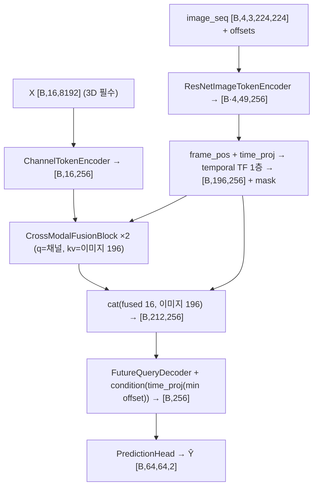

이미지 시퀀스 경로(`_encode_image_sequence`) 내부:

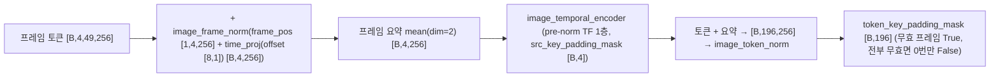

| 단계 | 연산 | 입력 shape | 출력 shape | 주요 하이퍼파라미터 | 근거 |
|---|---|---|---|---|---|
| 1 | channel_encoder | [2,16,8192] | [2,16,256] | 3층 | 실측 hook |
| 2 | image_encoder | [8,3,224,224] | [8,49,256] | ResNet18 | 실측 hook |
| 3 | time_proj / frame_pos / temporal encoder | [8,1]; [2,4,256] | [2,4,256] | 1층 | 실측 hook |
| 4 | image_token_norm | [2,196,256] | [2,196,256] | — | 실측 hook |
| 5 | fusion.0~1 | q [2,16,256], kv [2,196,256] | [2,16,256] | 4 heads | 실측 hook |
| 6 | context cat → decoder | [2,212,256], cond [2,256] | [2,256] | — | 실측 hook |
| 7 | prediction_head | [2,256] | [2,64,64,2] | 1024, 3층 | 실측 hook |

```yaml
model: multi_modal_predictator
file: multimodal_code_index/models/multi_modal_predictator.py::MultiModalPredictator
family: {prediction: single_query_decoder_one_frame, tokenization: frame_token_x16, fusion: late_token_cross_attention_x2_plus_context_concat, target: channel_1frame}
params_total: 28682560
params_channel_only: 14989312
sensor_increment: 13693248
config: {embed_dim: 256, channel_encoder: transformer_3L_4h, fusion_layers: 2, image_frames: 4, image_temporal_layers: 1, image_encoder_type: resnet, use_time_since_image: true, prediction_horizon: 1_fixed}
sensor_inputs: {image_seq: "[B,T,3,224,224]", image_time_offsets: "[B,T,1]", image_valid_mask: "[B,T]"}
stages:
  - {name: channel_encoder, type: linear_pos_prenorm_tf_x3, in_shape: "[B,16,8192]", out_shape: "[B,16,256]", params: 4484096}
  - {name: image_tokens, type: resnet18_tokens49_frame_pos_time_temporal_tf1, in_shape: "[B,T,3,224,224]", out_shape: "[B,T*49,256]", params: 12112704}
  - {name: fusion, type: cross_modal_fusion_block, in_shape: "[B,16,256] x [B,196,256]", out_shape: "[B,16,256]", params: 1580544, repeat: 2}
  - {name: decoder, type: single_future_query_conditioned, in_shape: "[B,212,256]", out_shape: "[B,256]", params: 790528}
  - {name: prediction_head, type: mlp_3layer, in_shape: "[B,256]", out_shape: "[B,64,64,2]", params: 9713664}
```

---

## 3. 전체 비교표

| 모델 | 융합 위치 | 융합 방식 | 센서 종류 · 입력 shape | 시간 정렬 | 예측 타깃 · 출력 | 파라미터(전체 / channel_only / 센서 증분) [실측] | 이 데이터셋 적용 가능성 |
|---|---|---|---|---|---|---|---|
| 2.1 [B] 재현 `FaithfulBeamPredictor` | **early**(동결 GPT-2 앞) | 스텝별 학습 질의가 M개 모달 토큰을 어텐션 요약(식 21, 잔차·LN 없음) → 재프로그래밍 | RSU RGB(ViT 패치 캐시 `[B,40,1,196,768]`), RSU LiDAR(PointPillars 캐시 `[B,U,384,100,176]` + BGAM) | 식(20) 창 끝 앵커 **소급 복제**(j=10 → 창당 4프레임), RGB는 100 Hz 그대로 | **빔 인덱스** 10스텝 `[B,10]`(MSE 회귀) | 753.5 M / 752.8 M / **0.72 M** (학습부 58.2 M) | **불가(그대로는)** — 타깃이 빔이고 입력이 빔 스칼라열. 센서 브랜치(RGB·LiDAR 요약 attn)만 재사용 가능 |
| 2.2 `LWMMultiModalPredictor` | late(백본 뒤·헤드 앞) | 시각별 모달 어텐션 ×3(채널·이미지·LiDAR 3토큰 → 1, 채널 잔차 없음) | 이미지 `[B,T,3,224,224]`(ResNet18 49토큰 → 프레임 1토큰), LiDAR `[B,64,4]`(16토큰 → 평균 1벡터 복제) | `_align_sensor_to_history`(오프셋 기반 forward-fill; 1:1이면 항등) | 채널 4프레임 `[B,4,64,64,2]` | 23.70 M / 8.33 M / 15.37 M | **조건부** — RGB 리사이즈·LiDAR 64점 부표본 로더 필요; 깊이·레이더·위치 경로 없음; LiDAR 창당 1프레임 |
| 2.3 `LWMTemporalMultiModalPredictor` | early(CLS 토큰) | 센서 212토큰 → 질의 1개 → 1벡터를 CLS에 가산 | 이미지 `[B,T,3,224,224]`(49토큰×T), LiDAR `[B,64,4]`(16토큰); D 128 | 없음(시간 임베딩 없이 cat) | 채널 4프레임 | 12.84 M / 1.36 M / 11.48 M(융합 66 k) | **조건부** — 위와 같음 + 프레임 시각 구분 불가 |
| 2.4 `ChironMultiModalPredictor` | late(백본 뒤) | 토큰 cross-attention + σ 게이트 잔차 ×3(채널 512 ↔ 센서 212) | 이미지 4장(196토큰, 프레임 pos·temporal attn), LiDAR 16토큰, ego `[B,6]`(**미사용**) | 없음(센서 4프레임 vs 채널 16프레임 대응 없음) | 채널 4프레임 | 36.00 M / 20.28 M(미사용 1.12 M 포함) / 15.72 M | **조건부** — S1 1위 백본과 같은 구조라 유력 후보; ego 미사용·시간 대응 없음은 수정 필요(§5) |
| 2.5 `MSCPMultiModalPredictor` | late(인코더 뒤) | 토큰 cross-attention ×2(게이트 없음) + 문맥 cat + 단일 질의 디코더 | 이미지 4장(196), **장면 토큰**: ego `[B,6]` + 객체 `[B,N,4]`(+mask) | 없음(오프셋은 프레임 임베딩·조건 벡터로만) | **채널 1프레임** `[B,64,64,2]` | 28.82 M / 14.99 M / 13.83 M (rf_scene 16.71 M, +1.72 M) | **조건부** — 장면 토큰은 CAV yaml(위치·속도·타 차량)과 잘 맞음; **H=4 출력 불가(헤드 교체 필요)**; LiDAR·깊이·레이더 없음 |
| 2.6 `LSTMMultiModalPredictor` | late | 2.2와 동일 | 2.2와 동일 | 2.2와 동일 | 채널 4프레임 | 29.94 M / 14.57 M / 15.37 M | **조건부** — 2.2와 동일. 단 S1에서 LSTM 계열 −4.0~−5.0 dB(chiron −11.6)로 백본 자체가 약함 [문서 인용 `EXPERIMENT_LOG_CHANNEL_PRED.md`] |
| 2.7 `MultiModalPredictator` | late | 토큰 cross-attention ×2 + 문맥 cat + 단일 질의 디코더 | 이미지 4장(196)만 | 없음(조건 벡터만) | **채널 1프레임** | 28.68 M / 14.99 M / 13.69 M | **조건부** — 이미지 1종만, H=4 출력 불가 |

- "센서 증분"은 같은 클래스의 `channel_only` 대비 파라미터 차이. 2.2~2.7 전부 증분의 대부분(11.2~11.3 M)이 **ResNet18(학습 가능 상태)** 이고 융합 블록 자체는 0.07~3.6 M.
- "가능/조건부/불가"의 기준: 코드가 이 데이터셋의 파일을 그대로 받는지(로더 부재 = 조건부), 예측 타깃이 K=16→H=4 채널인지(아니면 불가/헤드 교체), 시간 정렬이 10 ms 1:1을 보존하는지. **7종 중 "그대로 가능"은 없다** — 공통적으로 (i) 이 데이터셋용 센서 로더(RGB 리사이즈, pcd 부표본, yaml→ego, 프레임 선택)가 저장소에 없고 [코드 기반], (ii) 깊이 PNG·레이더 입력 경로가 어느 모델에도 없다 [코드 기반 §0.3].

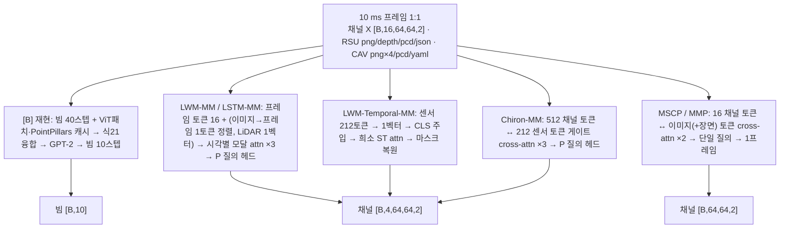

---

## 4. 선행 실험에서 확인된 센서 기여 (읽어서 확인한 것만) [문서 인용]

같은 데이터셋(MMW sunny, RSU 센서, 빔 예측)에서의 결과가 §4.1~4.2, 다른 자체수집 데이터셋(scenario_pilot·cross_modal_flow)의 결과가 §4.3. 채널 예측(K=16→H=4) 태스크에서 센서를 붙인 실험은 **아직 없다**(S1 전부 channel_only, `EXPERIMENT_LOG_CHANNEL_PRED.md`).

### 4.1 [B] 재현(빔 예측, RSU 센서) — `mmw_reproduction/REPRO_V2_EXPERIMENTS_SINCE_20260829.md`

| 근거(절·일시) | 실험 | 수치(test Top-1 / gain) | 결론(원문 취지) |
|---|---|---|---|
| 2026-09-04 02:01 항목 | RevIN 5변형 세트(b8 교차블록, patience 5) | 빔만 **80.7/89.0** · +camera 75.2/84.4 · +LiDAR 77.8/86.4 · full 80.4/88.9 (b16 빔만 78.9/87.4) | "index ≈ full > LiDAR > camera — **센서 증분 전부 ≤0**(full −0.3, LiDAR −2.9, camera −5.5)"; 단 camera·full은 발산으로 초반 ckpt(ep2·ep4) |
| 2026-09-04 06:15 항목, 도구 `tools/eval_sensor_ablation_revin.py`, 결과 `outputs/rv15_rsu_b8_{full,lidar_only,rgb_only}/sensor_ablation.json` | 학습 없는 3조건 재평가 **real / zero(rgb·bev=0) / foreign(다른 무작위 윈도의 센서, 빔 이력은 원래)** | full 80.4/88.9 · 79.8/88.3 · 80.4/88.9 — LiDAR 77.8/86.4 · 77.8/86.3 · 77.8/86.3 — camera 75.2/84.4 · 75.3/84.4 · 75.2/84.4 | "남의 윈도 센서를 넣어도 소수점까지 같음 → **세 센서 변형 ckpt 모두 센서 내용 기여 0 확정**". 기전: `fuse_q` 노름 0.32~0.35 = 초기값(질의 미학습) → softmax 균등 → 노름 큰 빔 토큰(8.8 vs 센서 0.8~2.9)의 복사본 |
| 2026-09-04 21:04 항목(중간 관찰, 확정 아님) | 학습 시 foreign 센서(`--sensor_foreign 1`) run `rv15F_rsu_b8_full` | val ep1~4 72.6/73.5/71.8/72.5 vs real 대조군 43.8/71.7/71.4/74.1 vs 빔만 76.1/73.1/75.2/73.9 | "foreign이 real보다 낮은 에폭 없음 → 학습 과정에서도 센서 내용이 결과를 바꾸지 않는다는 방향과 정합하나 **test 미실시라 확정 보류**"(21:04 외부 종료) |
| §6.4(2026-09-02), 도구 `tools/measure_fusion_attention.py` | q/Q판 `faith5_rsu_b8_full`(42.3)의 식(21) 어텐션 | 빔 토큰 attention 23.8%(rgb 50.0%), 토큰 노름 빔 6.9 vs rgb 12.6, 1스텝 Top-1 역전(lidar_only 33.5 < 10스텝 44.9) | "학습된 질의가 센서 쪽을 향해 **빔 이력 신호 상실**" — 센서가 유해하게 작용한 붕괴 레짐 |
| §5 표·§6.3 | 빔만 게이트 `abl15_ctrl_rsu_index_only` | 71.6/80.8(논문 GPT2-Index 72.8/81.9) | 센서 판정의 전제. 레시피 조정(lr 5e-5·15 ep·clip)으로 도달 |

### 4.2 [B] 재현 이전 시리즈 — `mmw_reproduction/REPRODUCTION_REPORT.md`

| 절 | 시리즈 | 수치(test Top-1) | 결론(원문) |
|---|---|---|---|
| §4.2 | `mm_*`(GPT-2 small, CE, persistence prior) | rgb 70.0 / full 70.0 / lidar 69.6 / index 69.5 / no_bgam 68.2 | "전 variant가 persistence(70.0)와 사실상 동률 = **센서 기여 0**"(후에 결론 사용 안 함) |
| §4.3 | `mml_*`(MM-LSTM, **CAV 센서**) | index 72.6 > lidar 71.1 > rgb 67.0 > full 66.4 > no_bgam 65.1 | "모든 센서 조합이 beam-only 이하" |
| §4.4 이하 RSU 정정 표 | `mml_rsu` / `faith2_rsu`(RSU 센서로 정정) | mml_rsu 72.6 / 69.9 / 67.0 / 66.1 / 65.9 · faith2_rsu 54.9 / 49.0 / 48.9 / 48.5 / 48.2 (index/full/lidar/rgb/no_bgam) | "RSU 정정 후에도 센서 조합 전부가 beam-only 미달"; "CAV 센서 사용은 실제로 해로운 편차였고, 그것을 고쳐도 증분은 여전히 음수" |
| §5 대조 | 논문 센서 증분 +8.0/+7.2%p vs 우리 | mml_rsu −2.7 · faith2_rsu −5.9 · mm +0.5(실질 0) | "어느 시리즈도 유의미한 양의 증분 없음" |

### 4.3 다른 데이터셋(자체수집 CARLA, 채널 값 예측·차폐 예측) — 참고

| 파일 | 실험 | 수치 | 결론(원문) | 주의 |
|---|---|---|---|---|
| `/mnt/ssd_7t_2/carla-wireless-dataset/scenario_pilot/REPORT_BSCAM.md` §1 Track A | BS 센서 차폐 onset 예측(test AUC) | radar 단독 h500 **0.782**(radar shuffle 0.49~0.60); camera 단독 64px 0.36 / 128px 0.57(shuffle 0.52); radar+camera 0.780 → **cam shuffle 0.781 불변**; full 0.809, cam/lidar shuffle 불변·radar shuffle 붕괴 | "**BS 센서 중 실신호는 radar뿐**", "BS 카메라 단독은 test 일반화 실패 — 시점 기하 문제: BS 화면에는 어느 차량이 UE인지 정보가 없음" | 데이터셋·태스크 다름(scenario_pilot, 차폐 라벨). 레이더 인코더 코드는 본 문서 범위 밖(`scenario_pilot/`) |
| 같은 파일 §2 Track B | BS캠 채널 **값** 융합(test NMSE dB) | dtcn/lwm/lstm(암묵 게이트 −0.001~0.001 닫힘)·egrp(명시 게이트 0.678 열림) 전부 cam shuffle / cam zero / radar zero **동일** | "**BS 카메라(및 전 센서)의 채널 '값' 예측 기여 = 0**", 종합표 "센서로 채널 값 예측? 아니오(태스크 무효)", "센서의 역할 = 이벤트 예고 전용" | 채널 예측 관점에서 가장 직접적인 선행 결론. 근거 run은 `scenario_pilot/channel_prediction/outputs_mm_bscam/` |
| `/mnt/ssd_7t_2/carla-wireless-dataset/cross_modal_flow_csi/REPORT_REEVAL.md` §3~5 | pilot-free CSI 추정(하드 split) | full vs image zero / image shuffle / position zero: 지표 변화 −0.026~+0.005(거의 동일) | "이미지 zero/shuffle은 여전히 결과를 거의 바꾸지 않는다" | 데이터셋·태스크 다름 |

**종합**(본 문서의 읽기 범위 안에서): 세 문서 모두에서 "센서(카메라·LiDAR)의 내용은 결과를 바꾸지 않는다"가 zero/shuffle/foreign 대조로 반복 관측됐고, 예외는 scenario_pilot의 **레이더 → 차폐 이벤트 예고**(AUC, shuffle 통과)뿐이다. 이 데이터셋(MMW sunny)의 채널 예측 태스크에 대한 센서 절제 실험은 없다(확인 불가 – 미실행).

---

## 5. [제안] 이 데이터셋에서 채널 예측(K=16→H=4, 10 ms, 64×64, RX 행 표본)에 멀티모달을 붙이는 설계 2안

> 이 절 전체는 **[제안]/[추측]** 이며 실행·검증하지 않았다. 기반 = S1 상위 모델(`EXPERIMENT_LOG_CHANNEL_PRED.md` val pooled NMSE dB 10/20/30/40 ms [문서 인용]): **Chiron** `models/chiron_channel.py` 19,156,736 파라미터, −11.59/−10.50/−9.70/−9.00(median −16.16/−14.96/−13.79/−12.96, best ep8) · **NOVA** `models/nova_channel.py` 15,735,552, −11.62/−10.58/−9.68/−8.87 · **LWM v1.1** `cp/cp_lwm11.py` 2,885,664, pretrained −11.62/−10.43/−9.40/−8.53, scratch −11.66/−10.35/−9.46/−8.60(진행 중). 파라미터 추정은 §1의 실측 부품 값을 더한 것 [코드 기반 계산], 연산량은 근사식(2·파라미터·토큰, ResNet18 224² ≈ 1.8 GFLOPs는 문헌값) [추측].

### 5.0 두 안에 공통인 구조적 사실 [코드 기반 + 문서 인용]

1. **시간 정렬 불필요**: 센서·채널이 10 ms 1:1(STEP3 §3-1)이라 `_align_sensor_to_history`는 항등(§1.3 실측 `T16_1to1`). delta_t·오프셋 텐서 대신 **프레임 인덱스 k(0..15)를 그대로 센서 프레임 인덱스로** 쓰면 된다. [B]식 소급 복제도 불필요.
2. **RSU 센서는 타깃(CAV)을 식별하지 못한다**: 시나리오당 RSU 센서 1벌을 CAV 3~4대가 공유(§0.3). 같은 프레임의 같은 RSU 영상·점구름이 서로 다른 3~4개 채널 타깃에 들어가므로, 센서만으로는 "어느 차가 UE인지" 정보가 없다(REPORT_BSCAM §1 판정 2, REPRO_V2 9/4 06:15 "센서-only 상한 33.8%: 같은 (scen,frame) CAV 3~4대 정답 전부 다름"). 따라서 (a)에서 센서가 줄 수 있는 것은 **장면 수준 정보**(차폐체 접근·LOS 여부·교통 밀도)이고, UE 특정 정보는 (b)의 CAV 위치가 담당한다.
3. **파장 대비 위치 정밀도**: 28 GHz λ ≈ 1.07 cm. `predicted_ego_pos` 오차 중앙값 0.39~0.41 m ≈ 37λ, GPS 1.27 m ≈ 119λ(STEP3 §3-2). 40 ms 지평 × 최대 속도 구간 9 m/s(`cp_data.py::SPEED_BINS` 상한) = 최대 0.36 m 이동. 위치는 부반송파별 위상을 직접 알려줄 수 없고 기하(AoD·거리 추세·LOS)만 준다 [추측].
4. **비용 상한**: 표본당 채널 창 16프레임에 센서 16프레임을 붙이면, 학습 표본 689,936개 × 16프레임의 센서 인코딩이 매 epoch 반복된다. ResNet18을 온라인으로 돌리면 표본당 ≈ 16 × 1.8 = 29 GFLOPs로 Chiron 백본(≈ 2 × 9.1 M × 512 ≈ 9.3 GFLOPs)의 3배 [추측] → **동결 인코더 출력을 프레임 단위로 캐시**(RSU 프레임은 시나리오당 1벌이라 캐시 대상 ≈ 16 시나리오 × 800~1,100 프레임 ≈ 1.6만 프레임 [추측: `meta.json n_frames` 1100/800 기준])하는 [B]의 📦 방식이 전제다. PointPillars 캐시(`derived/feat_pp_rsu`, every=1, `[384,100,176]` fp16 = 13.5 MB/프레임, 총 217 GB [문서 인용 REPRO_V2 2026-09-01 11:0x])는 이미 있으나 프레임당 13.5 MB라 16프레임/표본은 디스크 병목([B] run이 U=4 프레임·batch 8에서도 디스크 병목이었음) → 프레임당 수십 KB로 **풀링된 요약을 다시 캐시**해야 한다.

### 5.1 안 (a) — 센서 직접 입력: 프레임별 센서 토큰 → 기존 인코더 재사용 → 토큰 수준 cross-attention(게이트) [제안]

**텐서 흐름(Chiron 기반, B 표본, 프레임 k = 0..15)**

```
채널   X [B,16,64,64,2] ──PatchEmbed2D + pos──► [B,512,256]  ──ChironBlock×6──► [B,512,256]   (기존 그대로)
RGB    📦 ResNet18 layer4 캐시 [16,512,7,7] fp16 ──1×1 conv 512→256 + spatial_pos──► [B,16,49,256] ──SensorFrameSummarizer──► [B,16,1,256]
깊이   depth png [16,480,640] uint8 ──/255 → 224 리사이즈──► [B·16,1,224,224] ──소형 CNN(§1.1-4 depth_cnn 구조)──► [B,16,1,256]
LiDAR  📦 X_L 캐시 [384,100,176] ──8×8 평균 풀링(사전 캐시, 49 KB/프레임)──► [B,16,64,384] ──Linear 384→256──► [B,16,64,256] ──학습 질의 16개 cross-attn(PointNetEncoder.pool_attn 재사용)──► [B,16,16,256]
레이더 json {velocity, azimuth, altitude, depth}×~1.5k ──(az,depth) 64×64 래스터 2채널(점유·속도)──► [B·16,2,64,64] ──소형 CNN──► [B,16,1,256]   (저장소에 코드 없음, 신규)
센서   cat → [B,16,(1+1+16+1)=19,256] + 프레임 임베딩 [1,16,1,256] + 모달 임베딩 [1,1,19,256] → [B,304,256]
융합   GatedCrossModalFusion ×3: q = 채널 [B,512,256], kv = 센서 [B,304,256], attn_mask [512,304] = "채널 프레임 k ↔ 센서 프레임 ≤ k"(인과) 또는 "= k"(동시각)
헤드   ChannelPredictionHead(기존) → Ŷ [B,4,64,64,2]
```

- 왜 게이트 cross-attention인가: §2.4 `GatedCrossModalFusion`은 게이트 g→0이면 채널 토큰이 그대로 통과(잔차)해 **channel_only와 동일한 함수를 포함**하므로, 센서가 무용해도 성능이 깎일 이유가 구조적으로 없고, 학습된 g의 평균이 곧 진단값이 된다(§5.3). `PerTimeModalityFusion`(§1.2-3)은 채널 잔차가 없어 §4.1의 "질의 미학습 → 균등 → 빔 복사본" 실패 양상과 같은 경로를 밟을 수 있어 1순위에서 제외.
- 시간 마스크: 저장소 블록에는 `attn_mask` 인자가 없고 `key_padding_mask`(배치×키)만 있으므로, 프레임별 마스크를 쓰려면 `nn.MultiheadAttention(attn_mask=...)`를 노출하는 서브클래스가 필요(기존 파일 무수정 원칙 → 새 파일).
- 파라미터 추정 [코드 기반 계산]: RGB 1×1 conv 131,328 + spatial_pos 12,544 + summarizer 265,984 ≈ 0.41 M · 깊이 CNN ≈ 0.65 M(§1.1-4 수식) · LiDAR Linear 98,560 + pool_attn 263,168 + 질의 4,096 ≈ 0.37 M · 레이더 CNN ≈ 0.65 M(깊이와 같은 구조 가정) · 임베딩 16×256 + 19×256 ≈ 0.01 M · 융합 3 × 1,184,768 = 3.55 M → **증분 ≈ 5.6 M(동결·캐시 인코더 기준) → 총 ≈ 24.8 M**. ResNet18을 학습 가능하게 두면 +11.3 M(총 ≈ 36 M, §2.4 실측 35,995,520과 같은 규모).
- 연산 추정 [추측]: 융합 cross-attn 3층 ≈ 3 × 4 × 512 × 304 × 256 ≈ 0.48 GFLOPs + 투영 3 × 2 × (512+304) × 256² ≈ 0.32 GFLOPs ≈ 백본 9.3 GFLOPs의 9%. 온라인 인코더는 깊이·레이더 CNN(입력 224²·64² 소형)만 → 표본당 수백 MFLOPs. 캐시: RGB 7×7×512 fp16 50 KB + LiDAR 8×8×384 fp16 49 KB → 프레임당 ≈ 0.1 MB × 1.6만 프레임 ≈ 1.6 GB.
- NOVA 기반이면 채널 토큰 2,048(융합 비용 4배), LWM v1.1 기반이면 융합 위치는 `cp_lwm11.py`의 시간 Transformer(`[B·256,16,128]`) 앞에서 프레임별 센서 벡터 `[B,16,128]`을 256 패치 위치에 브로드캐스트 가산(추가 파라미터 ≈ Linear 256→128 33 k)하거나 D=128 게이트 융합(≈ 0.30 M/층) [제안].
- 대응이 안 되는 것: CAV 카메라 4대(전후좌우)는 위 흐름에 없음 — 넣으려면 카메라 4대 × 16프레임 = 64장/표본이라 캐시 필수, 그리고 CAV 카메라는 UE 자기 시점이라 5.0-2의 식별 문제는 없지만 BS-측 센서 원칙(메모리 `feedback_bs_side_sensors`: 센서는 BS 탑재 기준)에 어긋난다.

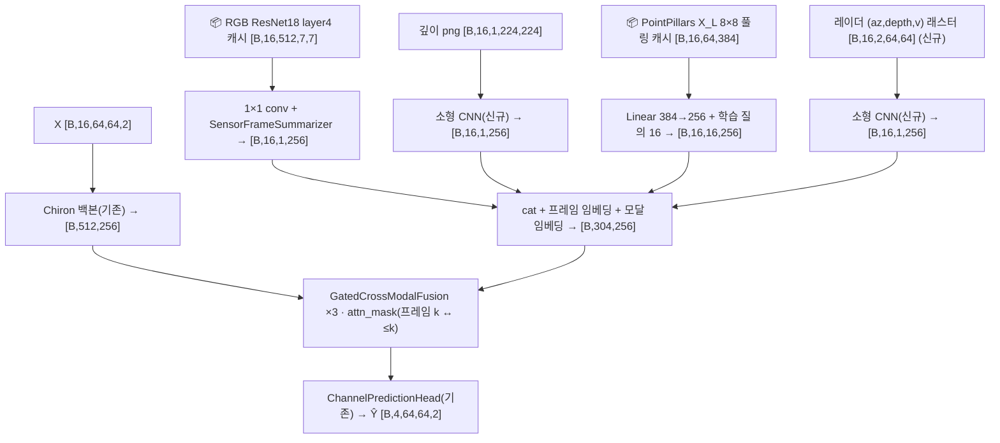

### 5.2 안 (b) — 센서 → 위치 → 입력: 위치·기하 토큰 [제안]

**입력 후보(STEP3 §3-2 표 (A)~(F))와 이 데이터셋의 실제 필드 [문서 인용 + §0.3 실측]**

| 출처 | 필드 | 정밀도 | 비고 |
|---|---|---|---|
| (A) 오라클 상한 | CAV yaml `sensors.true_ego_pos`(= `vehicle_pose`) location·rotation, `vehicle_speed.speed` | 정확값 | 상한 실험 전용(실전 입력 아님) |
| (B) 현실적 입력 | `sensors.predicted_ego_pos`(location·rotation) | xy 0.39~0.41 m, yaw 0.3°(Town05)/3.3°(Town03) | 1순위 |
| (B′) | `sensors.GPS.location` | xy 1.27 m | 대조 |
| (C) | `sensors.imu_measurement`(accel·gyro·compass) | 잡음 명시 | 속도·yaw 보조 |
| (D) RSU 센서 검출 | 레이더 `{velocity, azimuth, depth}` 이동점(\|v\|>0.5 m/s 1.4~5.7%), LiDAR 검출 | 검출기 없음(PointPillars 캐시는 `cls_head/reg_head` 제거된 백본 출력, `meta.json dropped_keys` [실측]) | UE 식별 불가(5.0-2) → CAV 위치와의 연관(association) 단계가 추가로 필요. 저장소에 코드 없음(확인 불가) |
| 타 차량(차폐체) | cav yaml `vehicles/<id>`(3~15대, location·extent·angle·speed) 또는 `scenes/NNNNNN.yaml`(전 차량) | 정확값 | 차폐 기하 |

**텐서 흐름(Chiron 기반)**

```
프레임 k=0..15:  p_k = predicted_ego_pos.location (CARLA 월드) → RSU 로컬: p' = R_z(−yaw_rsu)·(p − p_rsu), (x, −y, z) 부호반전(Sionna/배열 좌표계; REPRO_V2_PREREQUISITES §5.3 — 미재검증)
                 특징 f_k = [dx, dy, dz, r, sinφ, cosφ, vx, vy, vz, |v|]  (10차원; φ = atan2(y', x') = 빔각과 같은 기준)
                 → EgoStateEncoder(state_dim=10 → 256) 재사용 → [B,16,256]
타 차량:         vehicles_all [B,16,N,4] = (dx, dy, extent_x, speed) 등 → MSCPSceneEncoder.object_encoder → 프레임당 [B,16,N+1,256] (+valid mask)
미래 기하:       p_{t+h} ≈ p_t + v_t·(h·10 ms), h=1..4 → 같은 인코더 → [B,4,256] → ChannelPredictionHead.pool_query(4개)에 가산(질의 조건화)
융합(택1):       (i) 프레임 토큰을 temporal_pos처럼 32 패치에 브로드캐스트 가산: tokens[B,16,32,256] += ego[B,16,1,256]  (추가 파라미터 0)
                 (ii) PerTimeModalityFusion(채널 프레임 요약 = 32패치 평균, 센서 = ego(+객체 요약)) → 다시 브로드캐스트  (1.07 M/층)
                 (iii) 위치·객체 토큰 [B,16·(N+2),256]을 (a)의 GatedCrossModalFusion kv에 추가  (1.18 M/층)
```

- 파라미터 추정 [코드 기반 계산]: EgoStateEncoder(10→256) ≈ 69.6 k · object_encoder(4→256) 68.1 k + 타입 임베딩 1 k · 미래 질의 조건 인코더 69.6 k(공유 시 0) → **증분 ≈ 0.14 M((i)) ~ 3.7 M((iii) 3층)**. 연산은 무시 수준(프레임당 벡터 몇 개).
- 대응이 안 되는 것: (D)의 RSU-측 위치 추정은 검출기·연관 코드가 없어 신규 개발이 필요하고, 정밀도도 미측정(확인 불가). (E) 지도 기반 자기위치추정은 Blender Town 메시 부재로 불가(STEP3 §3-2).
- 좌표 변환은 STEP3·PREREQUISITES가 "재검증 안 함"으로 남긴 부분이므로, (b)를 실행하기 전 **빔각 vs atan2(y', x') 상관(PREREQUISITES §5.3: 1.000)을 채널 예측 데이터(`derived_cp` index의 위치)에서 다시 확인**하는 단계가 선행되어야 한다 [제안].

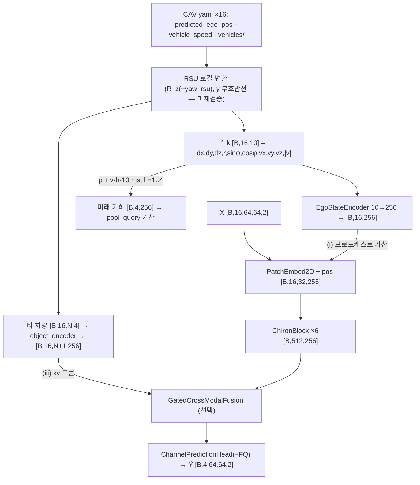

### 5.3 센서 기여 검증 절제 프로토콜 [제안] — 두 안 공통

| # | 조건 | 구현(기존 도구 참조) | 판정 |
|---|---|---|---|
| 0 | **대조군** channel_only | 같은 레시피(`train_cp.py` lr·batch·seed 42·B1)로 센서 없이 학습. Chiron은 S1 `s1_chiron_lr3e-4`(best ep8) 재사용 가능 | 멀티모달 − 대조군 = "센서 증분"(단, S1은 단일 시드라 잡음 폭 미측정 — **시드 반복 없이는 증분 확정 금지**, 사용자 규칙 [문서 인용 REPRO_V2 9/4 06:11 "시드 반복 전 확정 금지"]) |
| 1 | **real** | 학습된 ckpt를 val(B1)에서 정상 평가 | `result.json`과 일치해야 함(sanity) |
| 2 | **zero** | 센서 텐서를 0(또는 `no_*_token`)으로 바꿔 재평가 | real ≈ zero면 센서 내용 무관 |
| 3 | **shuffle(배치 순열)** | 배치 안에서 센서만 `randperm`으로 섞고 채널·타깃은 유지 — `cp/eval_sanity.py`의 `hist_shuffle`(채널 이력 섞기)과 대칭인 "sensor_shuffle" 조건 추가 | real ≈ shuffle이면 무관 |
| 4 | **foreign-frame** | 같은 split의 **다른 시나리오** 창에서 가져온 센서 프레임 16개(seed 고정 순열) — `mmw_reproduction/tools/eval_sensor_ablation_revin.py`의 `foreign` 조건과 동일 발상; 학습판은 `train_faithful_rsu_v2.py --sensor_foreign` | real ≈ foreign이면 무관(장면 수준 정보조차 안 쓰는지 확인) |
| 5 | **sensor-only 상한** | 채널 X를 0으로 두고 센서만으로 평가(+학습) | 센서 단독 정보량(5.0-2 때문에 낮을 것으로 예상 [추측]) |
| 6 | **게이트·어텐션 진단** | `GatedCrossModalFusion.gate` 출력 g의 층별 평균·분위수, 채널 토큰이 센서 토큰에 준 attention 질량(모달별 합) — `tools/measure_fusion_attention.py`(식 21 attention 측정)와 REPORT_BSCAM Track B "암묵 게이트 닫힘(−0.001~0.001)" 관찰의 채널 예측판 | g→0·attention 균등이면 §4.1 기전(질의 미학습) 재현 |
| 7 | **정직성 유지** | `cp/eval_sanity.py`의 hist_shuffle/last_zero/hist_only_last를 멀티모달 ckpt에도 적용 | chiron channel_only 값(hist_shuffle +2.78 dB, `outputs_cp/s1_chiron_lr3e-4/sanity.json` [문서 인용 REPRO_V2 9/5 12:05])과 비교 |
| 8 | **장면·속도별** | `cp_data.py::summarize`의 per_scene·per_speed 지표로 센서 증분이 특정 장면(차폐 많은 crossroad)·속도 구간에 몰리는지 | 증분이 있다면 어디서 나오는지 |
| 9 | **위치 정밀도 sweep**((b) 전용) | true_ego_pos → predicted_ego_pos → GPS → 가우시안 잡음 σ ∈ {0.1, 0.5, 1, 2} m | 증분이 정밀도에 어떻게 의존하는지; true에서도 0이면 기하 정보 자체가 무용 |

- 실행 순서 제안: (b)-(i)(추가 파라미터 0.14 M, 로더만 필요) → 절제 0~4·9 → 증분이 있을 때만 (a)로 확장(캐시 생성 비용이 큼). 모든 launch는 `EXPERIMENT_PLAN` 승인 게이트(메모리 `feedback_experiment_plan_gate`) 뒤에.

---

## 6. 미확인·주의 사항

### 6.1 확인 불가 목록

1. **`DepthEncoderSimple`** — MiDaS 허브(GitHub 코드+가중치) 다운로드가 필요해 미실행. 파라미터·출력 shape는 [코드 기반] 수식값(depth_cnn+proj ≈ 651,776)만.
2. **MSCP 논문 ID·"보고서 12"** — `mscp_multimodal.py`·`lwm_temporal_multimodal.py` docstring이 참조하는 논문/보고서가 저장소에 명시되지 않음.
3. **이 데이터셋용 센서 로더** — RGB 리사이즈·정규화, pcd 28k점 → 64점 부표본, yaml → `ego_state`/`vehicles_all`, 프레임 선택·오프셋 생성 코드가 `multimodal_code_index/`에 없음(있는 것은 [B] 캐시 로더 `dataset_faithful.py`뿐). §0.3의 대응은 키 구조 확인까지만.
4. **좌표계 변환(CARLA↔Sionna/RSU 배열)** — `REPRO_V2_PREREQUISITES.md` §5.3 기록만 인용, 본 문서에서 재검증하지 않음(STEP3와 동일 유보).
5. **멀티모달 6종(2.2~2.7)의 학습 성능** — 어느 구성도 학습 run이 없어 성능·수렴은 알 수 없음. §4의 센서 기여 결론은 전부 다른 모델([B] 재현·BSCAM 등)에서 나온 것.
6. **§5의 FLOPs·캐시 크기·RSU 프레임 수** — 근사식·문헌값·meta.json 두 시나리오(1,100/800) 기준 추정.
7. **프롬프트 토큰 수 115** — 프로브 표본 2개(빔 값 전부 1인 구간 포함) 기준. `padding=True, max_length 160`이라 통계 문자열 길이에 따라 배치별로 달라질 수 있음.
8. **RSU 프레임 공유 구조**가 채널 예측 표본(궤적=CAV)에서 어떻게 배분되는지(같은 프레임의 CAV 3~4 표본이 train/val에 함께 있는지)는 `cp_data.py`가 시나리오 단위로 나누므로 누수는 없지만, 센서 캐시 설계 시 확인 필요.

### 6.2 코드에서 관찰한 주의점 [코드 기반, 일부 실측]

1. `sensor_encoders.py` docstring "ResNet18 **frozen** backbone"과 달리 `ImageTokenEncoder`에 동결 코드가 없어 11.3 M 전부 학습 파라미터(실측 trainable = total). 동결하려면 호출 측에서 `requires_grad_(False)`.
2. ImageNet mean/std 정규화가 어느 인코더에도 없음(사전학습 가중치 사용 시 입력 분포 불일치).
3. `ChironMultiModalPredictor`: multimodal 모드에서 `ego_state`가 인코딩만 되고 미사용; `channel_only`에도 `ego_encoder`·`decoder` 1.12 M이 생성됨; 센서 `key_padding_mask`가 전부 False라 무효 프레임은 `no_image_token`으로만 구분됨; `_init_weights`가 모든 Linear를 재초기화.
4. `MSCPMultiModalPredictor`·`MultiModalPredictator`: 출력이 1프레임 `[B,64,64,2]`(`prediction_horizon` 없음) → H=4에는 헤드 교체 필요. `MultiModalPredictator`는 채널 입력이 3D 평탄화여야 함.
5. `LWMTemporalMultiModalPredictor`: 이미지 프레임 시각 임베딩 없음(4장이 순서 없이 섞임); 이미지 인코더 D가 128로 다른 모델(256)과 다름.
6. `_align_sensor_to_history` 기본 `delta_t=0.0005`(구 sc08 0.5 ms 격자)는 이 데이터(10 ms)에서 오정렬(§1.3 실측 `T4_default_dt0.0005`) → 반드시 0.01. 정렬 방향은 forward-fill이며 [B] 식(20)의 소급 복제와 반대.
7. `PointNetEncoder` 기본 `max_points=64`: 28k점 pcd의 0.23%. LiDAR는 §2.2·2.6에서 창당 1프레임·1벡터로 축약됨.
8. [B] 재현 모델은 rgb 캐시 fp16을 float32로 바꿔 넣어야 함(트레이너가 GPU에서 변환; 프로브 첫 실행 실패 원인).
9. `PerTimeModalityFusion`은 채널 잔차가 없어 융합 출력이 어텐션 결과만으로 구성됨 — §4.1 기전(질의 미학습 시 노름 큰 토큰 복사)과 같은 실패 경로 가능.
10. `README.md`·`MODEL_ARCHITECTURES.md` §3의 "멀티모달 지원" 열과 본 문서 §3이 같은 사실(코드상 경로 존재, S1은 전부 비활성)을 가리킨다.

### 6.3 재현

```bash
cd /mnt/ssd_7t_2/carla-wireless-dataset/mmw_reproduction/channel_pred_feasibility
CUDA_VISIBLE_DEVICES=0 HF_HUB_OFFLINE=1 TRANSFORMERS_OFFLINE=1 \
  /home/dlghdbs200/anaconda3/envs/hoyun_312/bin/python scripts/10_probe_multimodal_shapes.py --device cuda:0
# 약 2분, 피크 GPU 메모리 4,314 MB(faithful_full), B=2. 출력 scripts/10_probe_multimodal_shapes.{json,log}
# --gpt2 gpt2 로 GPT-2 small 폴백 가능(shape 중 D=1280 → 768, 20 heads → 12). ResNet18 가중치는 캐시가 있어야 pretrained=True.
```

- 프로브 실행 중 GPU 0에서 돌던 `train_cp.py`(`s1_lwm11_frozen_lr3e-4`, PID 162013)와 GPU 1의 `s1_lwm11_scratch_lr1e-4`(PID 2628925)는 건드리지 않았고 실행 후에도 살아 있음(`nvidia-smi`·`ps` 확인, 2026-09-07 10:30).
- PDF 변환은 `scripts/md_to_pdf.py`가 Mermaid를 렌더링하지 않으므로(`MODEL_ARCHITECTURES.md` §5-5) 다이어그램은 Mermaid 렌더러가 필요하다.
